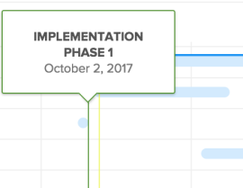
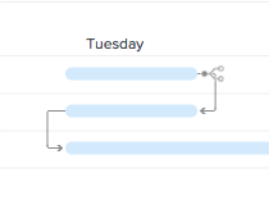
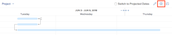

# Configure how information displays on the Gantt Chart  {#configure-how-information-displays-on-the-gantt-chart}

You can configure what information displays&nbsp;in both the Task List Gantt Chart and the Project List Gantt Chart.

## Access requirements {#access-requirements}

You must have the following to follow the steps in this article:

<table style="width: 100%;margin-left: 0;margin-right: auto;mc-table-style: url('../../../Resources/TableStyles/TableStyle-List-options-in-steps.css');" class="TableStyle-TableStyle-List-options-in-steps" cellspacing="0"> 
 <col class="TableStyle-TableStyle-List-options-in-steps-Column-Column1"> 
 <col class="TableStyle-TableStyle-List-options-in-steps-Column-Column2"> 
 <tbody> 
  <tr class="TableStyle-TableStyle-List-options-in-steps-Body-LightGray"> 
   <td class="TableStyle-TableStyle-List-options-in-steps-BodyE-Column1-LightGray" role="rowheader">Adobe Workfront plan*</td> 
   <td class="TableStyle-TableStyle-List-options-in-steps-BodyD-Column2-LightGray"> 
Any 
 </td> 
  </tr> 
  <tr class="TableStyle-TableStyle-List-options-in-steps-Body-MediumGray"> 
   <td class="TableStyle-TableStyle-List-options-in-steps-BodyE-Column1-MediumGray" role="rowheader">Adobe Workfront license*</td> 
   <td class="TableStyle-TableStyle-List-options-in-steps-BodyD-Column2-MediumGray"> 
Review or higher
 </td> 
  </tr> 
  <tr class="TableStyle-TableStyle-List-options-in-steps-Body-LightGray"> 
   <td class="TableStyle-TableStyle-List-options-in-steps-BodyE-Column1-LightGray" role="rowheader">Access level configurations*</td> 
   <td class="TableStyle-TableStyle-List-options-in-steps-BodyD-Column2-LightGray"> 
View or higher access to Projects and Tasks
 
Note: If you still don't have access, ask your Workfront administrator if they set additional restrictions in your access level. For information on how a Workfront administrator can modify your access level, see <a href="create-modify-access-levels.md" class="MCXref xref">Create or modify custom access levels</a>.
 </td> 
  </tr> 
  <tr class="TableStyle-TableStyle-List-options-in-steps-Body-MediumGray"> 
   <td class="TableStyle-TableStyle-List-options-in-steps-BodyB-Column1-MediumGray" role="rowheader">Object permissions</td> 
   <td class="TableStyle-TableStyle-List-options-in-steps-BodyA-Column2-MediumGray"> 
View or higher access to the project
 
For information on requesting additional access, see <a href="request-access.md" class="MCXref xref">Request access to objects in Adobe Workfront</a>.
 </td> 
  </tr> 
 </tbody> 
</table>

&#42;To find out what plan, license type, or access you have, contact your *`Workfront administrator`*.

## Understand Display Options {#understand-display-options}

The following table details the display options for the Gantt chart: 

<table style="height: 2066px;margin-left: 0;margin-right: auto;mc-table-style: url('../../../Resources/TableStyles/TableStyle-List-options-in-steps.css');" class="TableStyle-TableStyle-List-options-in-steps" cellspacing="0"> 
 <col style="width: 218px;" class="TableStyle-TableStyle-List-options-in-steps-Column-Column1"> 
 <col style="width: 418px;" class="TableStyle-TableStyle-List-options-in-steps-Column-Column2"> 
 <col style="width: 402px;" class="TableStyle-TableStyle-List-options-in-steps-Column-Column2"> 
 <tbody> 
  <tr class="TableStyle-TableStyle-List-options-in-steps-Body-LightGray"> 
   <td class="TableStyle-TableStyle-List-options-in-steps-BodyE-Column1-LightGray" role="rowheader">Actual Dates</td> 
   <td class="TableStyle-TableStyle-List-options-in-steps-BodyE-Column2-LightGray">  </td> 
   <td class="TableStyle-TableStyle-List-options-in-steps-BodyD-Column2-LightGray" style="font-weight: normal;"> 
Actual Start Date and Actual Completion Date are displayed with a triangle icon. If the Actual Completion Date is null, only the Actual Start Date is displayed.
 
For more information about start and completion dates, see&nbsp;<a href="project-actual-completion-date.md" class="MCXref xref">Overview of the project Actual Completion Date </a>&nbsp;and&nbsp;<a href="project-actual-start-date.md" class="MCXref xref">Overview of the project Actual Start Date </a>.
 </td> 
  </tr> 
  <tr class="TableStyle-TableStyle-List-options-in-steps-Body-MediumGray"> 
   <td class="TableStyle-TableStyle-List-options-in-steps-BodyE-Column1-MediumGray" role="rowheader">Assignments</td> 
   <td class="TableStyle-TableStyle-List-options-in-steps-BodyE-Column2-MediumGray">  </td> 
   <td class="TableStyle-TableStyle-List-options-in-steps-BodyD-Column2-MediumGray" style="font-weight: normal;"> 
Shows task assignees.&nbsp;Mouse&nbsp;over the&nbsp;Details&nbsp;link next to the name of an assignee to see more detailed information about them, including the percentage of their allocation to the task.
 
Assignees are&nbsp;not displayed on the Gantt chart when the Gantt chart is exported to PDF. When the Gantt chart is exported to PDF, assignees are displayed only in the task list.
 </td> 
  </tr> 
  <tr class="TableStyle-TableStyle-List-options-in-steps-Body-LightGray"> 
   <td class="TableStyle-TableStyle-List-options-in-steps-BodyE-Column1-LightGray" role="rowheader">Baseline</td> 
   <td class="TableStyle-TableStyle-List-options-in-steps-BodyE-Column2-LightGray">  </td> 
   <td class="TableStyle-TableStyle-List-options-in-steps-BodyD-Column2-LightGray" style="font-weight: normal;"> 
A&nbsp;project snapshot that represents key pieces of data about the project included in the initial project plan. Baselines can be taken throughout the life of the project. When you enable to display baselines in the Gantt chart, select which baseline you want to display. You can view only one baseline on the Gantt chart at a time, and it will be shown in the form of a gray bar.
 
For more information about baselines, see&nbsp;<a href="create-baselines.md" class="MCXref xref">Create project baselines</a>.
 </td> 
  </tr> 
  <tr class="TableStyle-TableStyle-List-options-in-steps-Body-MediumGray"> 
   <td class="TableStyle-TableStyle-List-options-in-steps-BodyE-Column1-MediumGray" role="rowheader">Commit Date</td> 
   <td class="TableStyle-TableStyle-List-options-in-steps-BodyE-Column2-MediumGray">  </td> 
   <td class="TableStyle-TableStyle-List-options-in-steps-BodyD-Column2-MediumGray" style="font-weight: normal;"> 
The date an assignee gives as their commitment of when the task will be&nbsp;completed is displayed with&nbsp;a marker in the Gantt chart.&nbsp;
 
For more information about commit dates, see&nbsp;<a href="overview-of-commit-dates.md" class="MCXref xref">Commit Date overview</a>.
 </td> 
  </tr> 
  <tr class="TableStyle-TableStyle-List-options-in-steps-Body-LightGray"> 
   <td class="TableStyle-TableStyle-List-options-in-steps-BodyE-Column1-LightGray" role="rowheader">% Complete</td> 
   <td class="TableStyle-TableStyle-List-options-in-steps-BodyE-Column2-LightGray">  </td> 
   <td class="TableStyle-TableStyle-List-options-in-steps-BodyD-Column2-LightGray" style="font-weight: normal;"> &nbsp;The percentage of the task that is completed displays in the task line.  </td> 
  </tr> 
  <tr class="TableStyle-TableStyle-List-options-in-steps-Body-MediumGray"> 
   <td class="TableStyle-TableStyle-List-options-in-steps-BodyE-Column1-MediumGray" role="rowheader">Critical Path</td> 
   <td class="TableStyle-TableStyle-List-options-in-steps-BodyE-Column2-MediumGray">  </td> 
   <td class="TableStyle-TableStyle-List-options-in-steps-BodyD-Column2-MediumGray" style="font-weight: normal;">The tasks that could affect the timeline of the project are considered part of the Critical Path and are clearly marked in red.&nbsp;</td> 
  </tr> 
  <tr class="TableStyle-TableStyle-List-options-in-steps-Body-LightGray"> 
   <td class="TableStyle-TableStyle-List-options-in-steps-BodyE-Column1-LightGray" role="rowheader">Milestone Diamonds</td> 
   <td class="TableStyle-TableStyle-List-options-in-steps-BodyE-Column2-LightGray">  </td> 
   <td class="TableStyle-TableStyle-List-options-in-steps-BodyD-Column2-LightGray" style="font-weight: normal;"> 
A diamond icon displays after the task that is associated with a milestone. Mouse&nbsp;over a milestone to view the name and date of the milestone. The Workfront administrator determines the color of each milestone diamond.
 
For more information about milestones, see&nbsp;<a href="create-milestone-path.md" class="MCXref xref">Create a milestone path</a>.
 </td> 
  </tr> 
  <tr class="TableStyle-TableStyle-List-options-in-steps-Body-MediumGray"> 
   <td class="TableStyle-TableStyle-List-options-in-steps-BodyE-Column1-MediumGray" role="rowheader">Milestone Lines</td> 
   <td class="TableStyle-TableStyle-List-options-in-steps-BodyE-Column2-MediumGray">  </td> 
   <td class="TableStyle-TableStyle-List-options-in-steps-BodyD-Column2-MediumGray" style="font-weight: normal;"> 
A line displays after the task that is associated with a milestone. Mouse&nbsp;over a milestone to view the name and date of the milestone. The Workfront administrator determines the color of each milestone line.
 
 For more information about milestones, see&nbsp; <a href="create-milestone-path.md" class="MCXref xref">Create a milestone path</a>
 </td> 
  </tr> 
  <tr class="TableStyle-TableStyle-List-options-in-steps-Body-LightGray"> 
   <td class="TableStyle-TableStyle-List-options-in-steps-BodyE-Column1-LightGray" role="rowheader">Predecessors</td> 
   <td class="TableStyle-TableStyle-List-options-in-steps-BodyE-Column2-LightGray">  </td> 
   <td class="TableStyle-TableStyle-List-options-in-steps-BodyD-Column2-LightGray" style="font-weight: normal;"> 
A line from one task to another that shows the predecessor relationship between the two tasks. To highlight an individual predecessor&nbsp;line,&nbsp;mouse over it. Click it to keep it highlighted. You can only highlight one predecessor line at a time.
 
A&nbsp;Predecessor&nbsp;icon is displayed next to any task that has a predecessor relationship that spans multiple pages on the Gantt chart or on any task that has a cross-project predecessor.
 
Click the Predecessor icon to view all predecessor and successor tasks, as well as&nbsp;details about each task, such as task name, type of predecessor relationship, and key dates.
 
Note: The Gantt Chart in a list of projects displays information about cross-project predecessors. For more information about how to create predecessor relationships between different projects see <a href="cross-project-predecessors.md" class="MCXref xref">Create cross-project predecessors</a>
 
For more information about predecessors, see&nbsp;<a href="enforced-predecessors.md" class="MCXref xref">Enforce predecessors</a>.
 </td> 
  </tr> 
  <tr class="TableStyle-TableStyle-List-options-in-steps-Body-MediumGray"> 
   <td class="TableStyle-TableStyle-List-options-in-steps-BodyE-Column1-MediumGray" role="rowheader">Progress Status</td> 
   <td class="TableStyle-TableStyle-List-options-in-steps-BodyE-Column2-MediumGray"> 
On Time&nbsp;
 
Behind&nbsp; &nbsp;&nbsp;
 
At Risk&nbsp; &nbsp;&nbsp;
 
Late&nbsp; &nbsp; &nbsp; &nbsp;&nbsp;
 </td> 
   <td class="TableStyle-TableStyle-List-options-in-steps-BodyD-Column2-MediumGray" style="font-weight: normal;"> 
&nbsp;
 
The status of the current progress on a given task.&nbsp;
 
For more detailed&nbsp;information about each Progress Status type, see&nbsp;<a href="task-progress-status.md" class="MCXref xref">Task Progress Status overview</a>.
 </td> 
  </tr> 
  <tr class="TableStyle-TableStyle-List-options-in-steps-Body-LightGray"> 
   <td class="TableStyle-TableStyle-List-options-in-steps-BodyB-Column1-LightGray" role="rowheader">Projected Dates</td> 
   <td class="TableStyle-TableStyle-List-options-in-steps-BodyB-Column2-LightGray">  </td> 
   <td class="TableStyle-TableStyle-List-options-in-steps-BodyA-Column2-LightGray" style="font-weight: normal;"> 
The expected projected timeline marking the Projected Start and Completion dates based on the current work completed, plus work remaining.&nbsp;
 
For more information on projected completion dates, see&nbsp;<a href="project-projected-completion-date.md" class="MCXref xref">Overview of the Projected Completion Date for projects, tasks, and issues</a>.
 </td> 
  </tr> 
 </tbody> 
</table>

## Configure Display Options {#configure-display-options}

1. Go to the Task List Gantt Chart or the Project List Gantt Chart.  
   For more information on where the either Gantt chart is located, see [Get started with the Gantt Chart](get-started-with-gantt.md).

1. (Optional) Select the  `Switch to Projected Dates`&nbsp;setting to display the tasks by their Projected Dates. By default, tasks are displayed by their Planned Dates in the Gantt chart.
1. Click the options icon to display the  `Options`&nbsp;dialog box.  
   

1. Select the configuration options&nbsp;that you want to display in the Gantt chart.
1. Not all of the configuration options are available in the Project List Gantt Chart.
1. Click anywhere in the Gantt chart to close the  `Options`&nbsp;dialog box.&nbsp;

