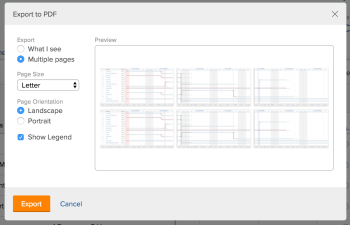
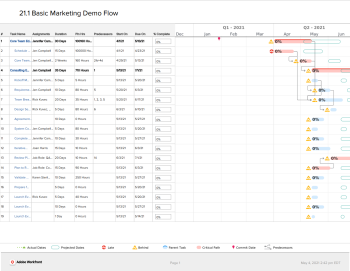

# Export the Gantt Chart to PDF  {#export-the-gantt-chart-to-pdf}

You can export the Gantt chart to PDF.

After exporting the Gantt chart to PDF, you can print or attach it to an email, to share it with other users.&nbsp;

## Access requirements {#access-requirements}

You must have the following to follow the steps in this article:

<table style="width: 100%;margin-left: 0;margin-right: auto;mc-table-style: url('../../../Resources/TableStyles/TableStyle-List-options-in-steps.css');" class="TableStyle-TableStyle-List-options-in-steps" cellspacing="0"> 
 <col class="TableStyle-TableStyle-List-options-in-steps-Column-Column1"> 
 <col class="TableStyle-TableStyle-List-options-in-steps-Column-Column2"> 
 <tbody> 
  <tr class="TableStyle-TableStyle-List-options-in-steps-Body-LightGray"> 
   <td class="TableStyle-TableStyle-List-options-in-steps-BodyE-Column1-LightGray" role="rowheader">Adobe Workfront plan*</td> 
   <td class="TableStyle-TableStyle-List-options-in-steps-BodyD-Column2-LightGray"> 
Any 
 </td> 
  </tr> 
  <tr class="TableStyle-TableStyle-List-options-in-steps-Body-MediumGray"> 
   <td class="TableStyle-TableStyle-List-options-in-steps-BodyE-Column1-MediumGray" role="rowheader">Adobe Workfront license*</td> 
   <td class="TableStyle-TableStyle-List-options-in-steps-BodyD-Column2-MediumGray"> 
Review or higher
 </td> 
  </tr> 
  <tr class="TableStyle-TableStyle-List-options-in-steps-Body-LightGray"> 
   <td class="TableStyle-TableStyle-List-options-in-steps-BodyE-Column1-LightGray" role="rowheader">Access level configurations*</td> 
   <td class="TableStyle-TableStyle-List-options-in-steps-BodyD-Column2-LightGray"> 
View or higher access to Projects and Tasks
 
Note: If you still don't have access, ask your Workfront administrator if they set additional restrictions in your access level. For information on how a Workfront administrator can modify your access level, see <a href="create-modify-access-levels.md" class="MCXref xref">Create or modify custom access levels</a>.
 </td> 
  </tr> 
  <tr class="TableStyle-TableStyle-List-options-in-steps-Body-MediumGray"> 
   <td class="TableStyle-TableStyle-List-options-in-steps-BodyB-Column1-MediumGray" role="rowheader">Object permissions</td> 
   <td class="TableStyle-TableStyle-List-options-in-steps-BodyA-Column2-MediumGray"> 
View or higher access to the project
 
For information on requesting additional access, see <a href="request-access.md" class="MCXref xref">Request access to objects in Adobe Workfront</a>.
 </td> 
  </tr> 
 </tbody> 
</table>

&#42;To find out what plan, license type, or access you have, contact your *`Workfront administrator`*.

## Export the Gantt chart {#export-the-gantt-chart}

1. Access the Gantt chart that you want to export to PDF, as described in [Get started with the Gantt Chart](get-started-with-gantt.md).
1. Ensure that you have configured the Gantt chart to display the appropriate information before you export it. 

   >[!NOTE]
   >
   >If you export the Gantt chart from a list of projects, the PDF file contains just the projects in the list, not the tasks on each project. If you want to export a list of tasks, you can do so from the project they are associated with, or by building a task report and displaying the results of the report in the Gantt View.&nbsp;

   You can configure the following information:

    
    
    * Filters, Views, and Groupings as desired in the list of tasks. Any Filters and Groupings that are selected in the list view are maintained when viewing the Gantt chart. Views are reflected on the exported Gantt chart only within the list that is displayed next to the Gantt chart on the first page. Views are not displayed on the Gantt chart itself.    
    
      >[!TIP] {type="tip"}
      >
      >To allow more room for the Gantt chart itself, apply a view that contains&nbsp;as few columns as possible.
    
    
    * Configuration options on the Gantt chart. For example, you can enable milestones, dates, baselines, or percent complete to appear on the Gantt chart.
    
    
      For more information, see &nbsp; [Configure how information displays on the Gantt Chart](configure-info-on-gantt-chart.md).
    
    
      >[!NOTE]
      >
      >&nbsp;Assignments are&nbsp;not displayed on the Gantt chart when the Gantt chart is exported to PDF. When the Gantt chart is exported to PDF, assignments are displayed only in the list view.
    
    
    
    * The time period that is displayed on the Gantt chart.  
      For more information, see [Viewing Information in the Gantt Chart](view-info-in-gantt.md). 
    
    
      The way the time period is displayed in the export file depends on whether you select `What I see` or `Multiple pages`&nbsp;in a later step.
    
    
    

1.  (Optional) To include&nbsp;only certain tasks&nbsp;in the exported PDF, select the tasks&nbsp;that you want to include.

   If you do not select any tasks, all tasks&nbsp;are included in the exported PDF.

   For example, if you are viewing the Gantt chart for a project that contains 50 tasks, but you want to display only 10 tasks on the exported Gantt chart, select the 10 tasks that you want to display.

1.  Click the printer icon.  
   The `Export to PDF` dialog box is displayed.  
   

1.  Select&nbsp;whether you want to export only what you see or the entire Gantt chart:

    
    
    *  `What I see:` Exports all tasks (including any subtasks) that are displayed on the screen prior to exporting up to 500 items. (This is not what is displayed in the `Preview` section; the Preview section contains only sample data.)
    
    
      Subtasks are included in the exported PDF even if the parent task is collapsed and the subtasks are not visible. To include only parent tasks, select the parent tasks you want to include and leave any subtasks unselected.
    
    
      You can use the `Zoom To` drop-down menu or the slider tool to display only a portion of the Gantt chart, as described in [Viewing Information in the Gantt Chart](view-info-in-gantt.md) .
    
    * `Multiple pages:`&nbsp;Exports the entire Gantt chart, even that which is not visible on the current screen up to 500 items.  
      You can use the `Zoom To` drop-down menu or the slider tool to determine how much information is displayed on each page, as described in [Configure how information displays on the Gantt Chart](configure-info-on-gantt-chart.md).&nbsp;Select a more granular option to display more pages to export, or&nbsp;select a less granular option to display fewer pages to export.  
    
    
      >[!NOTE]
      >
      >If you need to export a Gantt chart that contains more than 500 items, apply a Filter to the list before viewing the Gantt chart so that fewer than 500 items or 250 pages are displayed. For information about how to apply a filter, see&nbsp; [Filters overview in Adobe Workfront](filters-overview.md).
      >
      >
      >You cannot export the entire Gantt chart&nbsp;in the following circumstances:&nbsp;
      >
      >    
      >    
      >    * When it spans more than 250 pages
      >    * When it contains more than 500 items
      >    
      >    

    
    
    
    
    

1.  If the PDF will be printed after it is exported to PDF, in the `Page Size`&nbsp;drop-down menu, select the size of paper you want to print to.   
   You can select `Letter`, `Legal`, `Ledger`, `A1`, `A2`,  `A3` (available only for some languages), or `A4`.
1.  In the  `Page Orientation` section, select whether you want the PDF to be&nbsp;exported in landscape or portrait orientation.
1.  Select `Show Legend` if you want to include the Legend in your exported PDF.&nbsp;
1.  Click `Export`.

   The pdf of the Gantt chart is created and downloaded to your computer.

   Notice the legend&nbsp;at the bottom of the exported file. It explains only&nbsp;the options that you have enabled in your Gantt chart&nbsp;and that are available in your task list. 

   For example, milestones are displayed in the legend&nbsp;only if you have at least one&nbsp;task associated with a milestone.

   &nbsp;

