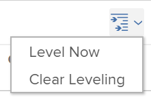

# Level Resources in the Gantt Chart  {#level-resources-in-the-gantt-chart}

Leveling your resources&nbsp;on a project&nbsp;has two purposes:

*  To automatically adjust&nbsp;over-allocation of time for assignees.
*  To automatically create a realistic task schedule for a&nbsp;project.&nbsp;

## Access requirements {#access-requirements}

You must have the following access to perform the steps in this article:

<table style="width: 100%;margin-left: 0;margin-right: auto;mc-table-style: url('../../../Resources/TableStyles/TableStyle-List-options-in-steps.css');" class="TableStyle-TableStyle-List-options-in-steps" cellspacing="0"> 
 <col class="TableStyle-TableStyle-List-options-in-steps-Column-Column1"> 
 <col class="TableStyle-TableStyle-List-options-in-steps-Column-Column2"> 
 <tbody> 
  <tr class="TableStyle-TableStyle-List-options-in-steps-Body-LightGray"> 
   <td class="TableStyle-TableStyle-List-options-in-steps-BodyE-Column1-LightGray" role="rowheader">Adobe Workfront plan*</td> 
   <td class="TableStyle-TableStyle-List-options-in-steps-BodyD-Column2-LightGray"> 
Any 
 </td> 
  </tr> 
  <tr class="TableStyle-TableStyle-List-options-in-steps-Body-MediumGray"> 
   <td class="TableStyle-TableStyle-List-options-in-steps-BodyE-Column1-MediumGray" role="rowheader">Workfront license*</td> 
   <td class="TableStyle-TableStyle-List-options-in-steps-BodyD-Column2-MediumGray"> 
Plan 
 </td> 
  </tr> 
  <tr class="TableStyle-TableStyle-List-options-in-steps-Body-LightGray"> 
   <td class="TableStyle-TableStyle-List-options-in-steps-BodyE-Column1-LightGray" role="rowheader">Access level configurations*</td> 
   <td class="TableStyle-TableStyle-List-options-in-steps-BodyD-Column2-LightGray"> 
Edit access to Projects
 
Note: If you still don't have access, ask your Workfront administrator if they set additional restrictions in your access level. For information on how a Workfront administrator can modify your access level, see <a href="create-modify-access-levels.md" class="MCXref xref">Create or modify custom access levels</a>.
 </td> 
  </tr> 
  <tr class="TableStyle-TableStyle-List-options-in-steps-Body-MediumGray"> 
   <td class="TableStyle-TableStyle-List-options-in-steps-BodyB-Column1-MediumGray" role="rowheader">Object permissions</td> 
   <td class="TableStyle-TableStyle-List-options-in-steps-BodyA-Column2-MediumGray"> 
Manage access to the project
 
For information on requesting additional access, see <a href="request-access.md" class="MCXref xref">Request access to objects in Adobe Workfront</a>.
 </td> 
  </tr> 
 </tbody> 
</table>

&#42;To find out what plan, license type, or access you have, contact your *`Workfront administrator`*.

## Overview of Resource Leveling {#overview-of-resource-leveling}

If the same resource is assigned to two different tasks, you can use resource leveling to adjust the timeline of the tasks so they will not occur at the same time.&nbsp;

Consider the following when leveling resources on a project:

*  Resource leveling only applies to one project, so *`Adobe Workfront`* does not level resources across more than one project at a time.
*  If `Effort Driven` is selected as a `Duration Type`, *`Workfront`* will not level the resources.
*  When multiple users are assigned to the same task, leveling will be canceled.
*  Conditions for the type of `Task Constraint` will take precedence over the leveling of resources. For example, if `Fixed Dates` is selected as the Task Constraint, resource leveling will not change the task dates.
*  Predecessor relationships will take precedence over resource leveling.
*  `Resource Leveling` needs to be set to `Manual` for the project in order to adjust leveling in the Gantt chart. Users can have the system automatically level resources by adjusting this setting on the project and selecting `Automatic` instead of `Manual`.

  

*  As the project owner, or the task assignee, you can introduce a leveling delay for a task to indicate that there is a great chance that the task might need extra time. For information about adding a leveling delay to a task, see [Update task Leveling Delay](task-leveling-delay.md).   

## Apply Resource Leveling in the Gantt Chart {#apply-resource-leveling-in-the-gantt-chart}

1. Navigate to a project.
1. Select the `Tasks` `<MadCap:conditionalText data-mc-conditions="QuicksilverOrClassic.Quicksilver"> area</MadCap:conditionalText>`.

1.  Click the `Gantt` icon.  

1.  Disable the `Autosave` option. 

   >[!TIP] {type="tip"}
   >
   >You cannot level resources in the Gantt chart when the Autosave option is enabled. 

1. Click the `Resource Leveling` drop-down menu and select `Level Now`.  
   

1. (Optional) Select `Clear Leveling`, to remove all resource leveling from the project.  

   >[!NOTE]
   >
   >Your resources might be overallocated if they are assigned to multiple tasks which occur during the same time frame.

1. Click `Save`.&nbsp;

