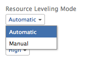

# Level Resources in the Gantt Chart

Leveling your resources&nbsp;on a project&nbsp;has two purposes:

* To automatically adjust&nbsp;over-allocation of time for assignees.
* To automatically create a realistic task schedule for a&nbsp;project.&nbsp;

## Access requirements

You must have the following access to perform the steps in this article:

<table cellspacing="0"> 
 <col> 
 <col> 
 <tbody> 
  <tr> 
   <td role="rowheader"><em>Adobe Workfront</em> plan*</td> 
   <td> 
Any 
 </td> 
  </tr> 
  <tr> 
   <td role="rowheader"><em>Workfront</em> license*</td> 
   <td> 
<em>Plan</em> 
 </td> 
  </tr> 
  <tr> 
   <td role="rowheader">Access level configurations*</td> 
   <td> 
Edit access to Projects
 
Note: If you still don't have access, ask your <em>Workfront administrator</em> if they set additional restrictions in your access level. For information on how a <em>Workfront administrator</em> can modify your access level, see <a href="../../../administration-and-setup/add-users/configure-and-grant-access/create-modify-access-levels.md" class="MCXref xref">Create or modify custom access levels</a>.
 </td> 
  </tr> 
  <tr> 
   <td role="rowheader">Object permissions</td> 
   <td> 
Manage access to the project
 
For information on requesting additional access, see <a href="../../../workfront-basics/grant-and-request-access-to-objects/request-access.md" class="MCXref xref">Request access to objects in Adobe Workfront</a>.
 </td> 
  </tr> 
 </tbody> 
</table>

&#42;To find out what plan, license type, or access you have, contact your *Workfront administrator*.

## Overview of Resource Leveling

If the same resource is assigned to two different tasks, you can use resource leveling to adjust the timeline of the tasks so they will not occur at the same time.&nbsp;

Consider the following when leveling resources on a project:

<ul> 
 <li> 
Resource leveling only applies to one project, so <em>Adobe Workfront</em> does not level resources across more than one project at a time.
 </li> 
 <li> 
If Effort Driven is selected as a Duration Type, <em>Workfront</em> will not level the resources.
 </li> 
 <li> 
When multiple users are assigned to the same task, leveling will be canceled.
 </li> 
 <li> 
Conditions for the type of Task Constraint&nbsp;will take precedence over the leveling of resources. For example,&nbsp;if Fixed Dates is selected as the Task Constraint, resource leveling will not change the task dates.
 </li> 
 <li> 
Predecessor relationships will take precedence over resource leveling.
 </li> 
 <li> 
Resource Leveling needs to be set to Manual for the project in order to adjust leveling in the Gantt chart. Users can have the system automatically level resources by adjusting this setting on the project and selecting Automatic instead of Manual.
 
  
 </li> 
 <li> 
As the project owner, or the task assignee, you can introduce a leveling delay for a task to indicate that there is a great chance that the task might need extra time. For information about adding a leveling delay to a task, see <a href="../../../manage-work/tasks/task-information/task-leveling-delay.md" class="MCXref xref">Update task Leveling Delay</a>.  
 </li> 
</ul>

## Apply Resource Leveling in the Gantt Chart

<ol> 
 <li value="1">Navigate to a project.</li> 
 <li value="2">Select the Tasks <draft-comment>
   <MadCap:conditionalText data-mc-conditions="QuicksilverOrClassic.Quicksilver">
    area
   </MadCap:conditionalText>
  </draft-comment><MadCap:conditionalText data-mc-conditions="QuicksilverOrClassic.Quicksilver">
   area
  </MadCap:conditionalText>.</li> 
 <li value="3"> 
Click the Gantt icon. 
 </li> 
 <li value="4"> 
Disable the Autosave option. 
 <note type="tip">
   You cannot level resources in the Gantt chart when the Autosave option is enabled. 
  </note> </li> 
 <li value="5">Click the Resource Leveling drop-down menu and select Level Now. </li> 
 <li value="6">(Optional) Select Clear Leveling, to remove all resource leveling from the project. <note type="note">
    Your resources might be overallocated if they are assigned to multiple tasks which occur during the same time frame.
  </note></li> 
 <li value="7">Click Save.&nbsp;</li> 
</ol>

<!--

<h2>Overview of Leveling Delay</h2>

At times, there might be conflicts between task schedules on a project. You can level resources or address resource conflicts by rescheduling resources and tasks so that all tasks can be completed within a realistic&nbsp;schedule. 

As the project manager, or the task assignee, you can also add a Leveling Delay on individual tasks to account for any resource or scheduling conflicts. In other words, a task might be scheduled with a delay to ensure that when <em>Adobe Workfront</em> levels&nbsp;the tasks a more realistic schedule overcomes resource conflicts.

To manually add a Leveling Delay to a task:

<ol>
<li value="1">Navigate to a task for which you want to add a Leveling Delay.</li>
<li value="2"> <draft-comment>

 <draft-comment>
<MadCap:conditionalText data-mc-conditions="QuicksilverOrClassic.Quicksilver">
Click the
More icon to the right of the task name, then click
Edit.
</MadCap:conditionalText>
</draft-comment><MadCap:conditionalText data-mc-conditions="QuicksilverOrClassic.Quicksilver">
Click the
More icon to the right of the task name, then click
Edit.
</MadCap:conditionalText> 

</draft-comment>
 <MadCap:conditionalText data-mc-conditions="QuicksilverOrClassic.Quicksilver">
Click the
More icon to the right of the task name, then click
Edit.
</MadCap:conditionalText> 
 
 <draft-comment>

</draft-comment> 
 </li>
<li value="3">Click Settings. </li>
<li value="4">Specify the Leveling Delay, in hours. This is the time that the resource will be delayed starting the task due to resource conflicts.</li>
<li value="5">Click Save Changes.&nbsp;</li>
</ol>

-->

## Overview of Leveling Delay

At times, there might be conflicts between task schedules on a project. You can level resources or address resource conflicts by rescheduling resources and tasks so that all tasks can be completed within a realistic&nbsp;schedule.

As the project manager, or the task assignee, you can also add a Leveling Delay on individual tasks to account for any resource or scheduling conflicts. In other words, a task might be scheduled with a delay to ensure that when *Adobe Workfront* levels&nbsp;the tasks a more realistic schedule overcomes resource conflicts.

To manually add a Leveling Delay to a task:

<ol> 
 <li value="1">Navigate to a task for which you want to add a Leveling Delay.</li> 
 <li value="2"> 
 <MadCap:conditionalText data-mc-conditions="QuicksilverOrClassic.Quicksilver">
    Click the 
    More icon to the right of the task name, then click 
    Edit.
   </MadCap:conditionalText> 
 
  
 </li> 
 <li value="3">Click Settings. </li> 
 <li value="4">Specify the Leveling Delay, in hours. This is the time that the resource will be delayed starting the task due to resource conflicts.</li> 
 <li value="5">Click Save Changes.&nbsp;</li> 
</ol>

