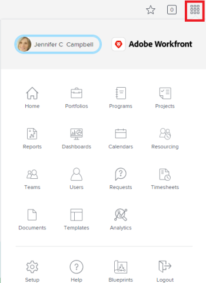

# View information in the Gantt Chart  {#view-information-in-the-gantt-chart}

The task list Gantt Chart and project list Gantt Chart display information about projects and tasks

## Access requirements {#access-requirements}

You must have the following to follow the steps in this article:

<table style="width: 100%;margin-left: 0;margin-right: auto;mc-table-style: url('../../../Resources/TableStyles/TableStyle-List-options-in-steps.css');" class="TableStyle-TableStyle-List-options-in-steps" cellspacing="0"> 
 <col class="TableStyle-TableStyle-List-options-in-steps-Column-Column1"> 
 <col class="TableStyle-TableStyle-List-options-in-steps-Column-Column2"> 
 <tbody> 
  <tr class="TableStyle-TableStyle-List-options-in-steps-Body-LightGray"> 
   <td class="TableStyle-TableStyle-List-options-in-steps-BodyE-Column1-LightGray" role="rowheader">Adobe Workfront plan*</td> 
   <td class="TableStyle-TableStyle-List-options-in-steps-BodyD-Column2-LightGray"> 
Any 
 </td> 
  </tr> 
  <tr class="TableStyle-TableStyle-List-options-in-steps-Body-MediumGray"> 
   <td class="TableStyle-TableStyle-List-options-in-steps-BodyE-Column1-MediumGray" role="rowheader">Adobe Workfront licenses overview*</td> 
   <td class="TableStyle-TableStyle-List-options-in-steps-BodyD-Column2-MediumGray"> 
Review or higher
 </td> 
  </tr> 
  <tr class="TableStyle-TableStyle-List-options-in-steps-Body-LightGray"> 
   <td class="TableStyle-TableStyle-List-options-in-steps-BodyE-Column1-LightGray" role="rowheader">Access level configurations*</td> 
   <td class="TableStyle-TableStyle-List-options-in-steps-BodyD-Column2-LightGray"> 
View or higher access to Projects and Tasks
 
Note: If you still don't have access, ask your Workfront administrator if they set additional restrictions in your access level. For information on how a Workfront administrator can modify your access level, see <a href="create-modify-access-levels.md" class="MCXref xref">Create or modify custom access levels</a>.
 </td> 
  </tr> 
  <tr class="TableStyle-TableStyle-List-options-in-steps-Body-MediumGray"> 
   <td class="TableStyle-TableStyle-List-options-in-steps-BodyB-Column1-MediumGray" role="rowheader">Object permissions</td> 
   <td class="TableStyle-TableStyle-List-options-in-steps-BodyA-Column2-MediumGray"> 
View or higher access to the project
 
For information on requesting additional access, see <a href="request-access.md" class="MCXref xref">Request access to objects in Adobe Workfront</a>.
 </td> 
  </tr> 
 </tbody> 
</table>

&#42;To find out what plan, license type, or access you have, contact your *`Workfront administrator`*.

## Locate the Gantt Chart {#locate-the-gantt-chart}

You can locate both the task list Gantt chart and project list Gantt chart from multiple areas within *`Workfront`*. For more information, see [Get started with the Gantt Chart](get-started-with-gantt.md).

## View tasks on the Critical Path {#view-tasks-on-the-critical-path}

In the Project List Gantt Chart, tasks that are not on the Critical Path display as light blue horizontal lines. Tasks that are on the Critical Path of a project display as red horizontal lines.

For more information about tasks on the Critical Path, see&nbsp; [Overview of the project Critical Path](critical-path.md).

## View task information in the project list Gantt Chart {#view-task-information-in-the-project-list-gantt-chart}

You can view the task information for a project directly from the Project List. Tasks are listed under the name of each project. 

>[!NOTE]
>
>You cannot edit tasks from the Project List Gantt Chart.&nbsp;

You can view the task information for a project directly from a list of projects in the following areas:

*  `<MadCap:conditionalText data-mc-conditions="QuicksilverOrClassic.Quicksilver"> In the Projects area</MadCap:conditionalText>`
* Within a Portfolio
* Within a Program

To view tasks in a project from a list of projects:

1.  Go to one of the areas mentioned above.

   For example, from the main menu, click `Projects`. 

   

   A list of projects displays. 

1. Click the `Gantt chart` icon  in the upper-right corner of the screen.  

1. Click the `Show Task List` icon.  

1. In the project list to the left, click the drop-down arrow next to the name of the project to display any tasks under that project.  
   This displays task information on the Gantt chart.  
   

1. (Optional) Click the `Print` icon in the upper-right corner to export the Gantt chart.  

   >[!NOTE]
   >
   >The Project List Gantt Chart exports only projects. Task information is not included.

## Change the time period for which information displays in the Gantt chart {#change-the-time-period-for-which-information-displays-in-the-gantt-chart}

You can adjust the time period shown on the Gantt chart to display information on a granular level, or you can&nbsp;quickly navigate to&nbsp;a day, week, month, quarter, or year view:&nbsp;

* [Change the time period on a granular level](#changing-the-time-period-on-a-granular-level) 
* [View information by Day, Week, Month, Quarter, or Year](#viewing-information-by-day-week) 

### Change the time period on a granular level {#change-the-time-period-on-a-granular-level}

1. Hover over the timeline of the Gantt chart, then drag the zoom indicator from left to right to expand or contract the timeline.  
   

### View&nbsp;information by Day, Week, Month, Quarter, or Year {#view-information-by-day-week-month-quarter-or-year}

1.  In the Gantt chart, click the time frame drop-down menu.

      

1. Select a time frame from the following available options: 
    
    
    * `Fit All`: This option displays the time line of the entire project.
    * `All Projects`: This option is available only in the Project List Gantt chart.
    * `Year`
    * `Quarter`
    * `Month`
    * `Week`
    * `Day`
    
    
1.  (Optional) Select a more granular time frame, such as Week or Day, and click and drag the horizontal scroll bar at the bottom of the Gantt chart to move left to right on the time line of the project.  
   A timeline snapshot of the Gantt displays to show the entire project.

   >[!TIP] {type="tip"}
   >
   >The timeline snapshot displays only after you click the horizontal scroll bar.

   

1. (Optional) Click anywhere inside the time line snapshot to navigate to a specific point in the life of the project.  
   Or  
   Drag the handles of the snapshot viewer to select a specific time line range to display it in the main Gantt.&nbsp;

## Use filters, views, and groupings {#use-filters-views-and-groupings}

The Gantt chart is a visual representation of the information that is currently displayed in the task list. You can apply filters, views, and groupings to&nbsp;the objects listed in both Gantt charts.&nbsp;

` `**Warning: **``You cannot apply filters, views, and groupings when you select `<MadCap:conditionalText data-mc-conditions="QuicksilverOrClassic.Quicksilver"> Manual save Timeline Planning</MadCap:conditionalText>` to save changes to your task list.&nbsp;For information about saving changes to tasks in a list, see [Edit tasks in a list](edit-tasks-in-a-list.md).

Filters and groupings that you apply to the list are reflected on both the Project List and Task List Gantt charts and are also included when the Gantt charts are exported:

* Filters  
  You can apply a Filter to the list in order to control the information that is displayed in the Gantt chart.  
  For information about applying a Filter, see&nbsp; [Filters overview in Adobe Workfront](filters-overview.md).

* Groupings  
  Groupings that you apply to the list are reflected on the Gantt chart.  
  For information about applying a Grouping, see&nbsp; [Groupings overview in Adobe Workfront](groupings-overview.md).

Views are not reflected on the Gantt chart. However, when you export the Gantt chart (as described in&nbsp; [Export the Gantt Chart to PDF](export-gantt-chart-to-pdf.md)), the task list is exported in addition to the Gantt chart, with the current View applied to the list.

## Configure Display Options {#configure-display-options}

You can choose what type of information displays in both Gantt charts. For more information, see [Configure how information displays on the Gantt Chart](configure-info-on-gantt-chart.md).
