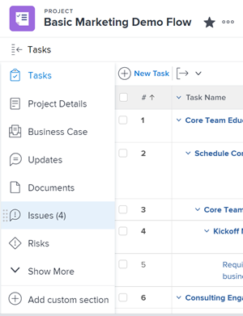
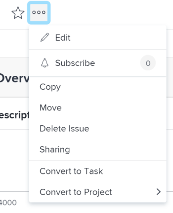

# Convert an issue to a project in *`Adobe Workfront`* {#convert-an-issue-to-a-project-in-adobe-workfront}

The highlighted information on this page refers to functionality not yet generally available. It is available only in the Preview Sandbox environment.

If more work needs to be done to complete an issue after the issue is submitted, you can convert the issue to a project. 

You can convert an issue to a new project or you can convert it to a project using a template.&nbsp;This article describes both ways for converting issues to projects. 

For general information about converting issues, see [Overview of converting issues in Adobe Workfront](convert-issues.md).

## Access requirements {#access-requirements}

You must have the following access to perform the steps in this article:

<table style="width: 100%;margin-left: 0;margin-right: auto;mc-table-style: url('../../../Resources/TableStyles/TableStyle-List-options-in-steps.css');" class="TableStyle-TableStyle-List-options-in-steps" cellspacing="0"> 
 <col class="TableStyle-TableStyle-List-options-in-steps-Column-Column1"> 
 <col class="TableStyle-TableStyle-List-options-in-steps-Column-Column2"> 
 <tbody> 
  <tr class="TableStyle-TableStyle-List-options-in-steps-Body-LightGray"> 
   <td class="TableStyle-TableStyle-List-options-in-steps-BodyE-Column1-LightGray" role="rowheader">Adobe Workfront plan*</td> 
   <td class="TableStyle-TableStyle-List-options-in-steps-BodyD-Column2-LightGray"> 
Any
 </td> 
  </tr> 
  <tr class="TableStyle-TableStyle-List-options-in-steps-Body-MediumGray"> 
   <td class="TableStyle-TableStyle-List-options-in-steps-BodyE-Column1-MediumGray" role="rowheader">Adobe Workfront license*</td> 
   <td class="TableStyle-TableStyle-List-options-in-steps-BodyD-Column2-MediumGray"> 
Plan 
 </td> 
  </tr> 
  <tr class="TableStyle-TableStyle-List-options-in-steps-Body-LightGray"> 
   <td class="TableStyle-TableStyle-List-options-in-steps-BodyE-Column1-LightGray" role="rowheader">Access level configurations*</td> 
   <td class="TableStyle-TableStyle-List-options-in-steps-BodyD-Column2-LightGray"> 
Edit access to Issues, Tasks, and Projects
 
Note: If you still don't have access, ask your Workfront administrator if they set additional restrictions in your access level. For information on how a Workfront administrator can change your access level, see <a href="create-modify-access-levels.md" class="MCXref xref">Create or modify custom access levels</a>.
 </td> 
  </tr> 
  <tr class="TableStyle-TableStyle-List-options-in-steps-Body-MediumGray"> 
   <td class="TableStyle-TableStyle-List-options-in-steps-BodyB-Column1-MediumGray" role="rowheader">Object permissions</td> 
   <td class="TableStyle-TableStyle-List-options-in-steps-BodyA-Column2-MediumGray"> 
View permissions to the issue
 
You obtain&nbsp;Manage permissions to the project after the issue is converted
 
For information on requesting additional access, see <a href="request-access.md" class="MCXref xref">Request access to objects in Adobe Workfront</a>.
 </td> 
  </tr> 
 </tbody> 
</table>

&#42;To find out what plan, license type, or access you have, contact your *`Workfront administrator`*.

## Convert an issue to a project {#convert-an-issue-to-a-project}

You can convert an issue to a blank project or convert an issue to a project using a template.

Converting an issue to a project differs depending on what environment you use. 

*  [Convert an issue to a project in the Production environment](#convert) 
*  [Convert an issue to a project in the Preview environment](#convert2) 

#### Convert an issue to a project in the Production environment {#convert-an-issue-to-a-project-in-the-production-environment}

1.  `<MadCap:conditionalText data-mc-conditions="QuicksilverOrClassic.Quicksilver"> Go to a project and click  Issues in the left panel. </MadCap:conditionalText>`  

1.  Click the issue to be converted to access the issue.
1.   `<MadCap:conditionalText data-mc-conditions="QuicksilverOrClassic.Quicksilver"> Click the  More menu   to the right of the issue name, then hover over  Convert to Project.</MadCap:conditionalText>` 

   

   ` `**Tip: **`` If the issue is associated with an approval process or it is already associated with a resolving object, *`Workfront`* displays a warning at the top of the Convert to Project box to notify you that the approval will be removed or the resolving object will be overwritten during the conversion. For more information, see [Overview of converting issues in Adobe Workfront](convert-issues.md).

1.  In the submenu that displays, do one of the following:

    
    
    *  Click `New Project` to covert the issue to a blank project.
    *  Click the name of a template listed in the `New from Template` section to convert the issue to a project using the template.
    
    
   The Convert to Project box displays. 

1.  Update the name of the project in the `Name` field. 

   By default, the name of the issue becomes the name of the project. 

1. (Optional) Update the available project fields in the Convert to Project box.  
   For more information about editing fields on projects, see [Edit projects](edit-projects.md).

1.  (Optional and conditional) Click `Options`, then select from the options that are available:

    
    
    *  ` `Keep the original issue and tie its resolution to the this project`  
      `When deselected, the original issue is deleted.
    
    
      >[!NOTE]
      >
      >Users without access or permissions to delete issues will not be able to delete the issue as they are converting it, regardless of the status of this setting. For information about access and permissions to issues, see:
      >
      >    
      >    
      >    *  [Grant access to issues](grant-access-issues.md) 
      >    *  [Share an issue in Adobe Workfront](share-an-issue.md) 
      >    
      >    

    
    
    
    * ` `Allow <User Name> to have access to this project`  
      `If unselected, the issue's Primary Contact has no access to the new task.
    
    

   >[!NOTE]
   >
   >
   >The options that are available here depend on how the *`Workfront administrator`* has configured them for everyone in the system or for your group. For more information, see [Configure system-wide task and issue preferences](set-task-issue-preferences.md).
   >
   >
   >Or, if the top-level groups in your organization configured them separately, the options available here depend on which group you selected for the new project in step 6. For more information, see [Configure task and issue preferences for a group](configure-task-issue-preferences-group.md) `.`

1.  (Optional) In the `Custom Forms` section, do one of the following: 

    
    
    *  If you convert the issue to a blank project, expand the `Add Forms` drop-down menu to attach custom forms  
      For more information about transferring information from the custom form of the issue to that of the new project, see [Transfer custom form data to a larger work item](transfer-custom-form-data-larger-item.md).
    *  If you convert the issue to a project using a template, do any of the following:
    
        
        
        *  Review the custom forms attached to the template.&nbsp;They will transfer to the new project.
        *  Update information on the custom forms, and ensure that all required fields have valid values. 
        *  Rearrange the custom forms by clicking `Manage Forms`, then the `grab` handle , and drag and drop them in the correct place. Click `I'm done managing` when you finish rearranging the forms. 
        *  Click the `x icon` to the right of any form that you do not want to transfer to the project to remove it. 
        *  Expand the `Add Custom Forms` menu to add more forms to the project. 
        
        
    
    *  (Optional and conditional) If you want to transfer custom form information from the issue you are converting to the project, add the project custom form that contains the same fields whose information you want to transfer from the issue. For information, see [Transfer custom form data to a larger work item](transfer-custom-form-data-larger-item.md). 
    
    

1.  Click `Save Changes.`

   

   The issue is now a project, if you decided to delete the original issue.  
   Or  
   The issue is now linked to the new project and it will complete when the project completes, if you decided to keep the original issue. 

   Some issue fields transfer to the project. Most fields defined in the template automatically transfer to the newly created project if you didn't change them in previous steps. For information, see [Overview of converting issues in Adobe Workfront](convert-issues.md)

1.  (Optional) Set any further project details ​(project owner, project dates) and tasks as necessary.

#### Convert an issue to a project in the Preview environment {#convert-an-issue-to-a-project-in-the-preview-environment}

1.  Do one of the following:

    
    
    *  Go to a project and click `Issues` in the left panel, click an issue to open it, then click the `More` menu  to the right of the issue name. 
    
    
          
    

    
    *  Go to a list of issues or an issue report, click to select the issue, then click the `More` menu at the top of the list. 
    
    
      >[!TIP] {type="tip"}
      >
      >If you convert the issue from a report on a dashboard, you will be redirected to the project page when you finish converting the issue.&nbsp;This closes the dashboard page. 
    
    
    
    
    

1.  (Conditional)&nbsp;Do one of the following:
1.  `<li> 
If you selected to convert the issue to a project from the issue page, click&nbsp;Convert to a blank project.
 
You must manually add tasks to the project or attach a template to the project after you convert the issue. 
 </li>` `<li> 
To convert the issue to a project using a template, click Convert to project from template and start typing the name of a template in the Search Template box, then click the name of the template when it displays in the list
 
Or
 
Hover over Favorite templates and click the name of a template that you added to your Favorites list. 
 
The New Project from Template box displays
 
  
  
Tip: </b>">  <b>Tip: </b>   
If the issue is associated with an approval process or it is already associated with a resolving object, Workfront displays a warning at the top of the Convert to Project box to notify you that the approval will be removed or the resolving object will be overwritten during the conversion. For more information, see <a href="convert-issues.md" class="MCXref xref">Overview of converting issues in Adobe Workfront</a>.
  
 </li>` 

1.  (Conditional) If you selected to convert the issue to a blank project, continue converting the issue as described in the [Convert an issue to a project in the Production environment](#convert) section in this article, starting with step 6.
1.  (Conditional)&nbsp;If you selected to convert the issue to a project using a template, continue with the following steps: 

    
    
    1.  Review template details on the right. 
    
    
       The template details include the following:
    
        
        
        *  Template duration
        *  Template owner
        *  The number of top-level tasks which includes the names of the top three tasks
        *  The number of all tasks in the template
        *  The names of the template custom forms
        
        
    
    1.  (Optional) Hover over the name of a template and click the `Favorites` `icon`  to mark it as a favorite for future use.
    
    
       >[!TIP] {type="tip"}
       >
       >You can have up to 40 *`Workfront`* items marked as favorites. This includes templates and other items.
    
    
    
    1.  Click `Use template` to select a template.
    
    
       The Convert to Project box opens.
    
    
           
    

    
    1.  If a field is already populated in the template, the field is pre-populated in the `Convert to project`box. You can edit the pre-populated values to better match your project. For more information, see [Edit projects](edit-projects.md).
    
       ` `**Tip: **`` To update fields in the Finance section in the Convert to Project box you must have Edit access to Financial&nbsp;Data in your access level.&nbsp;If you have View access to Financial Data in your access level all financial information from the template transfers to the new project and you cannot edit it while you convert the issue. For information, see [Grant access to financial data](grant-access-financial.md) and [Share a template overview](share-a-template.md). 
    
    1.  (Optional and conditional) Click `Options`, then select from the options that are available:
    
        
        
        *  ` `Keep the original issue and tie its resolution to the this project`  
          `When deselected, the original issue is deleted.
        
        
          >[!NOTE]
          >
          >Users without access or permissions to delete issues will not be able to delete the issue as they are converting it, regardless of the status of this setting. For information about access and permissions to issues, see:
          >
          >    
          >    
          >    *  [Grant access to issues](grant-access-issues.md) 
          >    *  [Share an issue in Adobe Workfront](share-an-issue.md) 
          >    
          >    

        
        
        
        
        
    
        
        
        *  ` `Allow <User Name> to have access to this project`` 
        
        
          If unselected, the issue's Primary Contact has no access to the new task.
        
        
          >[!NOTE]
          >
          >The options that are available here depend on how the *`Workfront administrator`* has configured them for everyone in the system or for your group. For more information, see [Configure system-wide task and issue preferences](set-task-issue-preferences.md).
          >
          >
          >Or, if the top-level groups in your organization configured them separately, the options available here depend on which group you selected for the new project in step 6. For more information, see [Configure task and issue preferences for a group](configure-task-issue-preferences-group.md) `.`

        
        
        
        
        
    
    1.  Click `Custom Forms` and do any of the following:
    
        
        
        *  Review the custom forms attached to the template.&nbsp;They will transfer to the new project.
        *  Ensure all required fields have valid information. 
        *  Rearrange the custom forms by clicking , then dragging and dropping them in the correct place. 
        *  Click the `x icon` to the right of any form that you do not want to transfer to the project. 
        *  (Optional and conditional) If you want to transfer custom form information from the issue you are converting to the project, add the project custom form that contains the same fields whose information you want to transfer from the issue. For information, see [Transfer custom form data to a larger work item](transfer-custom-form-data-larger-item.md).
        
        
    
    1.  Click `Convert to project`.
    
    
       If you decided to delete the original issue, the issue is now a project.   
       Or  
       If you decided to keep the original issue, the issue is now linked to the new project and it will complete when the project completes. 
    
    
       Some issue fields transfer to the project. Most fields defined in the template automatically transfer to the newly created project if you didn't change them in previous steps. For information, see [Overview of converting issues in Adobe Workfront](convert-issues.md). 
    
    
    

1.  (Optional) Set any further project details ​(project owner, project dates) and tasks as necessary.

