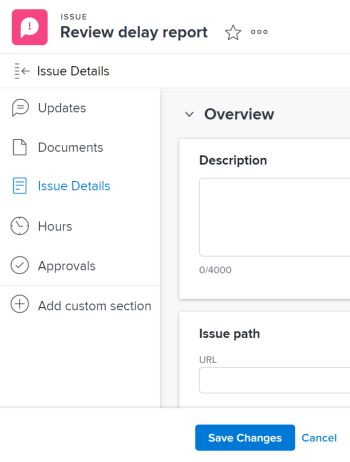

# Manually tie the resolution of an issue to other issues, tasks, or projects

You can manually tie the resolution of an issue to the resolution of a project, task, or issue without converting the issue. The issue becomes one of the Resolvable Objects of the project, task, or issue you select. When you do this, a change in the status of the project, task, or issue triggers a change in the status of the original issue.

>[!TIP]
>
>When you tie the resolution of an issue to the resolution of another object you can no longer manually edit the status of the original issue.

For more information about resolving and resolvable objects, see [Overview of Resolving and Resolvable Objects](../../../manage-work/issues/convert-issues/resolving-and-resolvable-objects.md).

## Access requirements

You must have the following:

<table cellspacing="0"> 
 <col> 
 <col> 
 <tbody> 
  <tr> 
   <td role="rowheader"><em>Adobe Workfront</em> plan*</td> 
   <td> 
Any 
 </td> 
  </tr> 
  <tr> 
   <td role="rowheader"><em>Adobe Workfront</em> license*</td> 
   <td> 
<em>Request</em> or higher
 </td> 
  </tr> 
  <tr> 
   <td role="rowheader">Access level configurations*</td> 
   <td> 
Edit access to Issues,&nbsp;Tasks, Projects
 
Note: If you still don't have access, ask your <em>Workfront administrator</em> if they set additional restrictions in your access level. For information on how a <em>Workfront administrator</em> can modify your access level, see <a href="../../../administration-and-setup/add-users/configure-and-grant-access/create-modify-access-levels.md" class="MCXref xref">Create or modify custom access levels</a>.
 </td> 
  </tr> 
  <tr> 
   <td role="rowheader">Object permissions</td> 
   <td> 
Manage permissions to the issue you link to another issue, task, or project
 
View or higher permissions to the issue, task, or project you add to the existing issue
 
For information on requesting additional access, see <a href="../../../workfront-basics/grant-and-request-access-to-objects/request-access.md" class="MCXref xref">Request access to objects in Adobe Workfront</a>.
 </td> 
  </tr> 
 </tbody> 
</table>

&#42;To find out what plan, license type, or access you have, contact your *Workfront administrator*.

## Prerequisites

Before you begin, you must:

* Have an issue whose resolution you want to tie to the resolution of another issue, task, or project

* Have an additional issue, task, or project

## Tie the resolution of an issue to the resolution of a another issue, task, or project

<ol> 
 <li value="1">Navigate to an issue whose resolution you want to tie to the resolution of another issue or a task or project.</li> 
 <li value="2"> 
 <draft-comment>
    <MadCap:conditionalText data-mc-conditions="QuicksilverOrClassic.Quicksilver">
     Click the 
     Issue Details > 
     Overview area.
    </MadCap:conditionalText>
   </draft-comment><MadCap:conditionalText data-mc-conditions="QuicksilverOrClassic.Quicksilver">
    Click the 
    Issue Details > 
    Overview area.
   </MadCap:conditionalText>
 
 <draft-comment>
    
   </draft-comment> 
 </li> 
 <li value="3"> <draft-comment>
   
Go to the Overview area in the Issue Details section. 

  </draft-comment>
Go to the Overview area in the Issue Details section. 
 </li> 
 <li value="4"> <draft-comment>
   <MadCap:conditionalText data-mc-conditions="QuicksilverOrClassic.Quicksilver">
    Click the 
    Resolved By field,
   </MadCap:conditionalText>
  </draft-comment><MadCap:conditionalText data-mc-conditions="QuicksilverOrClassic.Quicksilver">
   Click the 
   Resolved By field,
  </MadCap:conditionalText> and select from the following types of resolving objects: &nbsp; 
  <ul>
   <li>Project</li>
   <li>Task</li>
   <li>Issue</li>
  </ul></li> 
 <li value="5">The field for the resolving object displays. </li> 
 <li value="6">After selecting the object, start typing the name of a specific project, task, or issue in the available field and select it when it appears in the drop-down list. </li> 
 <li value="7">Click Save&nbsp;<draft-comment>
   Changes
  </draft-comment>Changes. The original issue becomes the Resolvable Object for the project, task, or issue you selected in step 4 and 5. This means that the original issue completes when the resolving object (the project, task, or issue you linked it to) is completed.  <note type="note">
    One project, task, or issue may have multiple issues as Resolvable Objects.
  </note></li> 
</ol>

&nbsp;
