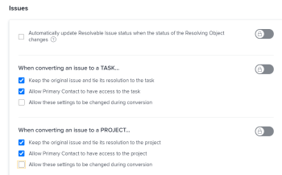
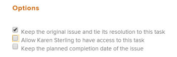

# Overview of Resolving and Resolvable Objects  {#overview-of-resolving-and-resolvable-objects}

A Resolvable Object is an issue whose resolution is tied to a Resolving Object. A Resolving Object is a project, task, or another issue.

When you convert an issue to a task or a project, the issue becomes the Resolvable Object of the task or the project.   
You can also manually link an issue to a Resolving Object, which can be a task, project, or issue.&nbsp;For information, see [Manually tie the resolution of an issue to other issues, tasks, or projects](manually-tie-resolution-of-issue-to-ptis.md).   
The original issue becomes the Resolvable Object of the task, project, or issue, in this scenario. 

## Set up *`Adobe Workfront`* to handle Resolvable Objects {#set-up-adobe-workfront-to-handle-resolvable-objects}

As a *`Workfront administrator`* ` or *`group administrator`*`, you can decide how you want to handle the Resolvable Objects in your system `or for your group.` 

You can select to keep the Resolvable Object as you are converting it to a task or a project, or to delete it once the task or project are created. You can select to allow these settings to be changed in the process of converting issues, which will allow the user converting the issues to select whether to keep or to delete the issue as they are converting it. 

>[!NOTE]
>
>Resolvable Objects are always issues whose resolution and status can depend on the resolution and status of the Resolving Object they are associated with. Resolving Objects can be issues, tasks, or projects. 

For information about setting up preferences for handling Resolvable Objects, see [Configure system-wide task and issue preferences](set-task-issue-preferences.md). 

## Handle the Resolvable Object during the conversion to a project or a task {#handle-the-resolvable-object-during-the-conversion-to-a-project-or-a-task}

Depending on the way the *`Workfront`* or *`group administrator`* configured the system or group level issue preferences, you might be able to handle the resolvable object during the conversion of an issue to a project or a task.   
The following scenarios exist: 

*  If the *`Workfront`* `or *`group administrator`*` has the `Keep the original issue and tie its resolution to the task`and the `Keep the original issue and tie its resolution to the project`selected and the `Allow these settings to be changed during conversion`unselected, you will not be able to change these settings as you are converting issues to tasks or projects.  
    

*  If the *`Workfront`* or *`group administrator`* has the `Keep the original issue and tie its resolution to the task`and the `Keep the original issue and tie its resolution to the project`either selected or unselected and the `Allow these settings to be changed during conversion`selected, you will be able to change these settings as you are converting issues to tasks or projects.  
    

For more information about converting issues to tasks and projects, see [Overview of converting issues in Adobe Workfront](convert-issues.md).

## Synchronize the Status of the Resolvable Object with that of the Resolving Object {#synchronize-the-status-of-the-resolvable-object-with-that-of-the-resolving-object}

* [Synchronize statuses when the Resolving Object is an issue](#syncrhonizing-statuses-for-issues) 
* [Synchronize statuses when the Resolving Object is a task or a project](#synchronizing-statuses-for-projects-and-tasks) 

### Synchronize statuses when the Resolving Object is an issue {#synchronize-statuses-when-the-resolving-object-is-an-issue}

If an issue is manually tied to another issue, the status of the second issue (Resolving Object) triggers a change in the status of the first issue (Resolvable Object). The status of the first issue matches the status that the second issue is changed to. This applies for both default and custom issue statuses. 

### Synchronize statuses when the Resolving Object is a task or a project {#synchronize-statuses-when-the-resolving-object-is-a-task-or-a-project}

When an issue is the Resolvable Object of a task or a project, the changes in the status of the tasks and the projects trigger changes in the status of the issue. Default statuses are triggered differently than Custom statuses, in this case. 

* [Synchronize the Default Status of the Resolving Object with the Default Status of the Resolvable Object](#syncrhonizing-default-statuses) 
* [Synchronize the Custom Status of the Resolving Object with the Custom Status of the Resolvable Object](#syncrhonizing-custom-statuses) 

#### `Synchronize the Default Status of the Resolving Object with the Default Status of the Resolvable Object`  {#synchronize-the-default-status-of-the-resolving-object-with-the-default-status-of-the-resolvable-object}

Regardless of whether the `Automatically set issue statuses to match the resolvable object using the Status keys` ``option is selected or not, every time the default status changes on the Resolving Objects (projects or tasks), the status of the Resolvable Object (issues) changes, accordingly. Only default statuses are already mapped to trigger such a change. 

The following default statuses for tasks trigger the following changes in the default statuses for issues, when the issue is set as the resolving object of a task:

The following default statuses for projects trigger the following changes in the default statuses for issues, when the issue is set as a Resolvable Object of a project. Some project statuses do not trigger changes to the status of the issues. The issues remain in the status they were before the project was turned into one of these statuses:

>[!NOTE]
>
>After the status of the issue becomes Closed (as a result of closing the task or the project), regardless of what status the task or project changes to after closing them, the issue remains Closed.

#### `Synchronize the Custom Status of the Resolving Object with the Custom Status of the Resolvable Object`  {#synchronize-the-custom-status-of-the-resolving-object-with-the-custom-status-of-the-resolvable-object}

When you change the status of the task or project to a custom status, the status of the issue changes to a custom issue status only if the following two conditions are met:

* The `Automatically` `set issue statuses to match the resolvable object using the Status keys` ``option is selected. For more information about how to enable this setting, see [Set up Adobe Workfront to handle Resolvable Objects](#system-setup-to-handle-resolving-objects).

* The custom status of the project or task has the same three letter code as the custom status of the issue.

You can create custom statuses with the same key for both issues and projects or tasks. When the project or task (as a Resolving Object) are changed to the custom status, the change also reflects on the status of the issue. The status key must be the same for the issue and project or task statuses. 

For example, create a project custom status named "Launched" with the three letter code "LCD" which equates with "Current". Also, create an issue custom status named "Project Launched", also with the letter code "LCD" which equates with "In Progress". When you mark the project as "Launched", the issue will automatically change the status to "Project Launched". If the `Automatically` `set issue statuses to match the resolvable object using the Status keys`setting were not enabled, the issue status would change to "In Progress" instead (the default status).  
For more information about creating a custom status, see [Create or edit a status](create-or-edit-a-status.md).

## Synchronize the percent complete of a Resolving Object with that of the Resolvable Object {#synchronize-the-percent-complete-of-a-resolving-object-with-that-of-the-resolvable-object}

If an issue is resolved by a task or a project, the percent complete of the issue updates on the resolvable issue when any of the following things occur:&nbsp;

*  When someone saves a change on the task or project. 
*   The timeline of the project is recalculated. 

If and issue is resolved by another issue, the percent complete updates when either of the issues update. 

## Locate the Resolvable Object on a task or a project {#locate-the-resolvable-object-on-a-task-or-a-project}

Locating the resolving object is identical for tasks and projects. 

1. Navigate to a project or a task which you created by converting an issue to the project or the task.
1.   `<MadCap:conditionalText data-mc-conditions="QuicksilverOrClassic.Quicksilver"> Click the  Project Details or the  Task Details icon and click to expand it. </MadCap:conditionalText>`

   

1.  `<MadCap:conditionalText data-mc-conditions="QuicksilverOrClassic.Quicksilver"> Click  Overview.</MadCap:conditionalText>` 
1. At the bottom of the tab, locate to `This Resolves` field: the issue which is the Resolvable Object of the project or the task is listed in this field.  

   >[!NOTE]
   >
   >Issues cannot be converted to other issues, but they can manually be associated with a Resolving Issue. A project, task, or issue can have multiple issues as Resolvable Objects. When the project, task, or issue resolves, the Resolvable Object (issue) also resolves. The Resolvable Issue remains closed even if the project, task, or issue that resolved it re-opens. 

## Identify an issue with a Resolving Object in a list {#identify-an-issue-with-a-resolving-object-in-a-list}

In a list of issues, you can identify issues that are labeled as resolving objects via status icons by locating this icon in the `Status Icons` or `Flags` columns: 

## View Resolvable and Resolving Object information in a report {#view-resolvable-and-resolving-object-information-in-a-report}

You can display information about the Resolvable or Resolving Objects in the view or report for projects, tasks, or issues.  
The following table shows what fields you can display and in which views you can display them:

<table style="mc-table-style: url('../../../Resources/TableStyles/TableStyle-HeaderRow.css');margin-left: 0;margin-right: auto;width: 100%;" class="TableStyle-TableStyle-HeaderRow" cellspacing="15"> 
 <col class="TableStyle-TableStyle-HeaderRow-Column-Column1"> 
 <col class="TableStyle-TableStyle-HeaderRow-Column-Column1"> 
 <col class="TableStyle-TableStyle-HeaderRow-Column-Column1"> 
 <col class="TableStyle-TableStyle-HeaderRow-Column-Column1"> 
 <thead> 
  <tr class="TableStyle-TableStyle-HeaderRow-Head-Header1"> 
   <th class="TableStyle-TableStyle-HeaderRow-HeadE-Column1-Header1">Field in View </th> 
   <th class="TableStyle-TableStyle-HeaderRow-HeadE-Column1-Header1">Issue View </th> 
   <th class="TableStyle-TableStyle-HeaderRow-HeadE-Column1-Header1">Task View </th> 
   <th class="TableStyle-TableStyle-HeaderRow-HeadD-Column1-Header1">Project View </th> 
  </tr> 
 </thead> 
 <tbody> 
  <tr class="TableStyle-TableStyle-HeaderRow-Body-LightGray"> 
   <td class="TableStyle-TableStyle-HeaderRow-BodyE-Column1-LightGray">Has Resolvables: Displays a True value if the project or task has Resolvable Issues associated with them, and a False value if they do not.</td> 
   <td class="TableStyle-TableStyle-HeaderRow-BodyE-Column1-LightGray">✓</td> 
   <td class="TableStyle-TableStyle-HeaderRow-BodyE-Column1-LightGray">✓</td> 
   <td class="TableStyle-TableStyle-HeaderRow-BodyD-Column1-LightGray">✓</td> 
  </tr> 
  <tr class="TableStyle-TableStyle-HeaderRow-Body-MediumGray"> 
   <td class="TableStyle-TableStyle-HeaderRow-BodyE-Column1-MediumGray">Original Issue Name, Original Issue Entry Date, Originator Name: Displays the name and entry date of the original issue, as well as the name of the user who created the issue in a text-mode customized view. For more information about building a text mode custom view for a project or task report or list to display information about the original issue, see <a href="view-display-original-issue-info-task-project-list.md" class="MCXref xref">View: display original issue information on task and project list</a>. </td> 
   <td class="TableStyle-TableStyle-HeaderRow-BodyE-Column1-MediumGray"> </td> 
   <td class="TableStyle-TableStyle-HeaderRow-BodyE-Column1-MediumGray"> ✓</td> 
   <td class="TableStyle-TableStyle-HeaderRow-BodyD-Column1-MediumGray"> ✓</td> 
  </tr> 
  <tr class="TableStyle-TableStyle-HeaderRow-Body-LightGray"> 
   <td class="TableStyle-TableStyle-HeaderRow-BodyE-Column1-LightGray"> 
Resolvables: Displays a list of all Resolvable Objects in a text mode custom view for a project or task report or list.
 
For more information about building this view, see <a href="view-resolvable-objects-task-project-report.md" class="MCXref xref">View: Resolvable Objects in a task or project report</a>
 </td> 
   <td class="TableStyle-TableStyle-HeaderRow-BodyE-Column1-LightGray"> </td> 
   <td class="TableStyle-TableStyle-HeaderRow-BodyE-Column1-LightGray">✓</td> 
   <td class="TableStyle-TableStyle-HeaderRow-BodyD-Column1-LightGray"> ✓</td> 
  </tr> 
  <tr class="TableStyle-TableStyle-HeaderRow-Body-MediumGray"> 
   <td class="TableStyle-TableStyle-HeaderRow-BodyE-Column1-MediumGray">Converted Issue Originator: Displays information about the user who originally logged the issue which was later converted to the task. </td> 
   <td class="TableStyle-TableStyle-HeaderRow-BodyE-Column1-MediumGray"> </td> 
   <td class="TableStyle-TableStyle-HeaderRow-BodyE-Column1-MediumGray">✓</td> 
   <td class="TableStyle-TableStyle-HeaderRow-BodyD-Column1-MediumGray"> </td> 
  </tr> 
  <tr class="TableStyle-TableStyle-HeaderRow-Body-LightGray"> 
   <td class="TableStyle-TableStyle-HeaderRow-BodyE-Column1-LightGray">Resolve Project: Displays information about the Resolving Project which was either converted from the original issue, or manually designated as the Resolving Object of an issue.</td> 
   <td class="TableStyle-TableStyle-HeaderRow-BodyE-Column1-LightGray">✓</td> 
   <td class="TableStyle-TableStyle-HeaderRow-BodyE-Column1-LightGray"> </td> 
   <td class="TableStyle-TableStyle-HeaderRow-BodyD-Column1-LightGray"> </td> 
  </tr> 
  <tr class="TableStyle-TableStyle-HeaderRow-Body-MediumGray"> 
   <td class="TableStyle-TableStyle-HeaderRow-BodyE-Column1-MediumGray">Resolve Task: Displays information about the Resolving Task which was either converted from the original issue, or manually designated as the Resolving Object of an issue.</td> 
   <td class="TableStyle-TableStyle-HeaderRow-BodyE-Column1-MediumGray">✓ </td> 
   <td class="TableStyle-TableStyle-HeaderRow-BodyE-Column1-MediumGray"> </td> 
   <td class="TableStyle-TableStyle-HeaderRow-BodyD-Column1-MediumGray"> </td> 
  </tr> 
  <tr class="TableStyle-TableStyle-HeaderRow-Body-LightGray"> 
   <td class="TableStyle-TableStyle-HeaderRow-BodyB-Column1-LightGray">Resolve Issue: Displays information about the Resolving Issue which was manually designated as the Resolving Object of an issue.</td> 
   <td class="TableStyle-TableStyle-HeaderRow-BodyB-Column1-LightGray"> ✓</td> 
   <td class="TableStyle-TableStyle-HeaderRow-BodyB-Column1-LightGray"> </td> 
   <td class="TableStyle-TableStyle-HeaderRow-BodyA-Column1-LightGray"> </td> 
  </tr> 
 </tbody> 
</table>

