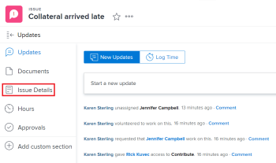

# Update issue Priority

You can define a priority for an issue&nbsp; to indicate how important the issue is.

You must have Manage permissions to the issue to modify the Priority of the issue.&nbsp; [Update the Priority of an issue](#modifying-the-priority-of-an-issue).

## Access requirements

You must have the following access to perform the steps in this article:

<table cellspacing="0"> 
 <col> 
 <col> 
 <tbody> 
  <tr> 
   <td role="rowheader"><em>Adobe Workfront</em> plan*</td> 
   <td> 
Any 
 </td> 
  </tr> 
  <tr> 
   <td role="rowheader"><em>Adobe Workfront</em> license*</td> 
   <td> 
<em>Request</em> or higher
 </td> 
  </tr> 
  <tr> 
   <td role="rowheader">Access level configurations*</td> 
   <td> 
Edit access to Issues
 
Note: If you still don't have access, ask your <em>Workfront administrator</em> if they set additional restrictions in your access level. For information on how a <em>Workfront administrator</em> can modify your access level, see <a href="../../../administration-and-setup/add-users/configure-and-grant-access/create-modify-access-levels.md" class="MCXref xref">Create or modify custom access levels</a>.
 </td> 
  </tr> 
  <tr> 
   <td role="rowheader">Object permissions</td> 
   <td> 
Manage permissions to the issue
 
For information on requesting additional access, see <a href="../../../workfront-basics/grant-and-request-access-to-objects/request-access.md" class="MCXref xref">Request access to objects in Adobe Workfront</a>.
 </td> 
  </tr> 
 </tbody> 
</table>

&#42;To find out what plan, license type, or access you have, contact your *Workfront administrator*.

## Overview of issue Priorities

Each priority label&nbsp;has a number associated with it that can not be modified.

*Adobe Workfront administrators* can&nbsp;modify priority labels within *Workfront* or they can create new priorities. As a result, the options you might have for the Priority field in your *Workfront* instance might&nbsp;differ from those listed below.

You should become familiar with the numbering sequence for priorities used in your&nbsp;organization.   
For example, your organization might&nbsp;use the number 1 to refer to urgent tasks, if the label of the priority has been modified.

For more information about customizing the names of priorities in your instance, see [Create and customize priorities](../../../administration-and-setup/customize-workfront/creating-custom-status-and-priority-labels/create-customize-priorities-.md).

Refer to the following table to understand each&nbsp;default priority label and its corresponding number: 

<table cellspacing="15"> 
 <col> 
 <col> 
 <thead> 
  <tr> 
   <th>Priority Label  (Can be modified) </th> 
   <th>Priority Number  (Cannot be modified) </th> 
  </tr> 
 </thead> 
 <tbody> 
  <tr> 
   <td> None </td> 
   <td> 0 </td> 
  </tr> 
  <tr> 
   <td> Low </td> 
   <td> 1 </td> 
  </tr> 
  <tr> 
   <td> Normal </td> 
   <td> 2 </td> 
  </tr> 
  <tr> 
   <td> High </td> 
   <td> 3 </td> 
  </tr> 
  <tr> 
   <td> Urgent </td> 
   <td> 4 </td> 
  </tr> 
 </tbody> 
</table>

## Update the Priority of an issue

<ol> 
 <li value="1">Go to the issue whose priority you want to modify.</li> 
 <li value="2"> <draft-comment>
   
Click&nbsp;Issue Details in the left panel.

  </draft-comment>
Click&nbsp;Issue Details in the left panel.
 <draft-comment>
   
  

  </draft-comment>
  
 
 <draft-comment>
    <MadCap:conditionalText data-mc-conditions="QuicksilverOrClassic.Quicksilver">
     The 
     Overview section should display by default. 
    </MadCap:conditionalText>
   </draft-comment><MadCap:conditionalText data-mc-conditions="QuicksilverOrClassic.Quicksilver">
    The 
    Overview section should display by default. 
   </MadCap:conditionalText> 
 </li> 
 <li value="3"> 
 
 <draft-comment>
   
Click the Priority field in the Basic information area. 

  </draft-comment>
Click the Priority field in the Basic information area. 
 <draft-comment>
   
  

  </draft-comment>
  
 </li> 
 <li value="4"> 
Select a value for the Priority field.
 
Depending on how your <em>Workfront administrator</em> configured Priorities in your system, the options might vary.
 </li> 
 <li value="5"> <draft-comment>
   
Click&nbsp;Save Changes.

  </draft-comment>
Click&nbsp;Save Changes.
 </li> 
</ol>

