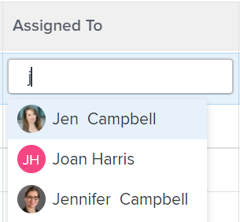
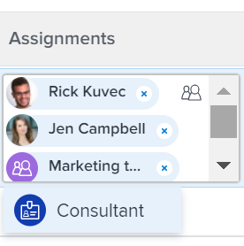

# Assign issues

You can assign issues to users, roles, and teams to indicate who is responsible for completing the issues. For general information about assigning issues, see [Modify issue assignments overview](../../../manage-work/issues/manage-issues/modify-issue-assignments-overview.md).

` `**Tip: **`` You can assign multiple users or job roles, and you can assign only one team. `You can assign only active users, `job roles`, and teams.`

`If a user, `job role`, or a team was assigned before they were deactivated, they remain assigned to the work item. In this case, we recommend the following:`

* `Reassign the work item to active resources.` 
* `Associate the users in a deactivated team with an active team and reassign the work item to the active team.`

In addition to this article, we recommend that you read the following articles for more information about assigning issues:

* [Modify issue assignments overview](../../../manage-work/issues/manage-issues/modify-issue-assignments-overview.md) 
* [Edit issues](../../../manage-work/issues/manage-issues/edit-issues.md) 
* [Edit user assignments for multiple issues](../../../manage-work/issues/manage-issues/edit-assignments-for-multiple-issues.md) 
* [Create advanced assignments](../../../manage-work/tasks/assign-tasks/create-advanced-assignments.md) 
* [Make smart assignments](../../../manage-work/tasks/assign-tasks/make-smart-assignments.md) 
* [Smart assignments overview](../../../manage-work/tasks/assign-tasks/smart-assignments.md) 
* [Overview of assigning work in the Adobe Workfront Workload Balancer](../../../resource-mgmt/workload-balancer/assign-work-in-workload-balancer.md)

You can assign an issue to one or multiple resources at the individual issue level, or you can assign multiple resources to multiple issues at one time.

Assigning issues and tasks is similar in&nbsp;*Adobe Workfront*. For general information about assigning tasks, see [Overview of modifying task assignments](../../../manage-work/tasks/assign-tasks/modify-task-assignments-overview.md).

## Access requirements

You must have the following access to perform the steps in this article:

<table cellspacing="0"> 
 <col> 
 </col> 
 <col> 
 </col> 
 <tbody> 
  <tr> 
   <td role="rowheader"><em>Adobe Workfront</em> plan*</td> 
   <td> 
Any 
 </td> 
  </tr> 
  <tr> 
   <td role="rowheader"><em>Adobe Workfront</em> license*</td> 
   <td> 
<em>Review</em> or higher
 </td> 
  </tr> 
  <tr> 
   <td role="rowheader">Access level*</td> 
   <td> 
Edit access to Issues
 
View or higher access to Projects and Tasks
 
Note: If you still don't have access, ask your <em>Workfront administrator</em> if they set additional restrictions in your access level. For information about access to issues in your Access Level, see <a href="../../../administration-and-setup/add-users/configure-and-grant-access/grant-access-issues.md" class="MCXref xref">Grant access to issues</a>. For information on how a <em>Workfront administrator</em> can change your access level, see <a href="../../../administration-and-setup/add-users/configure-and-grant-access/create-modify-access-levels.md" class="MCXref xref">Create or modify custom access levels</a>. 
 </td> 
  </tr> 
  <tr> 
   <td role="rowheader">Object permissions</td> 
   <td> 
Manage permissions to the issue
 
Contribute permissions to the item where you are copying&nbsp;the issue with the ability to&nbsp;Add Issues.
 
 For information about granting permissions to issues, see <a href="../../../workfront-basics/grant-and-request-access-to-objects/share-an-issue.md" class="MCXref xref">Share an issue in Adobe Workfront</a>
 
For information on requesting additional permissions, see <a href="../../../workfront-basics/grant-and-request-access-to-objects/request-access.md" class="MCXref xref">Request access to objects in Adobe Workfront</a>.
 </td> 
  </tr> 
 </tbody> 
</table>

&#42;To find out what plan, license type, or access you have, contact your *Workfront administrator*.

## Considerations for multiple assignments to job roles, teams, and users

Consider the following when assigning multiple resources to a work item:

* Users can have more than one job role associated with their profile. For information about associating users with job roles, see [Edit a user's profile](../../../administration-and-setup/add-users/create-and-manage-users/edit-a-users-profile.md).

* Tasks or issues are usually first assigned to one or multiple job roles or to a team. When projects are ready to start, they might need to also be assigned to users.   
  If a task or an issue is assigned to one or multiple roles and then you also assign a user, *Adobe Workfront* decides which job role to associate with the additional user (if any)&nbsp;according to the following rules:

  * If there is only one job role assigned and it matches the user's Primary Role, then the task or issue is assigned only to the user fulfilling their&nbsp;Primary Role. 
  * If there are multiple roles assigned and at least one of the roles matches the user's secondary roles, then the task or issue is assigned to the user fulfilling one of their Other Roles — which *Workfront* selects at random if there are multiple matches — as well as any additional roles that are assigned.
  * If there is one or more job roles assigned and there are no matches to the user's roles, then the task or issue is assigned to both&nbsp;the role or roles as well as to the user.

* If a task or an issue is assigned to a team and you also assign a user, the task or issue remains assigned to both the team and the user.

<!--

<h2> </h2>
<h2>Considerations about removing assignments from issues</h2>

You can remove assignments from one issue at a time, or you can remove assignments from multiple issues in bulk.

For more information about removing assignments from issues in bulk, see <a href="../../../manage-work/issues/manage-issues/edit-assignments-for-multiple-issues.md" class="MCXref xref">Edit user assignments for multiple issues</a>. 

Consider the following when removing assignments from issues: 

<ul>
<li>When you unassign a user from an issue, the issue remains assigned to the job role that the user fulfilled on the issue.</li>
<li>When you unassign a job role or a team from an issue, the issue remains unassigned if it is not assigned to any other resources. </li>
</ul>

-->

##

## Considerations about removing assignments from issues

You can remove assignments from one issue at a time, or you can remove assignments from multiple issues in bulk.

For more information about removing assignments from issues in bulk, see [Edit user assignments for multiple issues](../../../manage-work/issues/manage-issues/edit-assignments-for-multiple-issues.md).

Consider the following when removing assignments from issues:

* When you unassign a user from an issue, the issue remains assigned to the job role that the user fulfilled on the issue.
* When you unassign a job role or a team from an issue, the issue remains unassigned if it is not assigned to any other resources.

## Assign a single issue

<ol> 
 <li value="1">Go to an issue that you want to assign.</li> 
 <li value="2"> <draft-comment>
   
Click Assign to in the upper-right corner of the issue header, in the Assignments area

  </draft-comment>
Click Assign to in the upper-right corner of the issue header, in the Assignments area
 <draft-comment>
   
Or

  </draft-comment>
Or
 <draft-comment>
   
Click the name of the current assignments, if the issue is already assigned. 

  </draft-comment>
Click the name of the current assignments, if the issue is already assigned. 
 <draft-comment>
   
  

  </draft-comment>
  
 </li> 
 <li value="3"> 
Do one of the following:
 
  <ul> 
   <li> 
Start typing the name of a user, role, or team that you want to assign, then click it when it appears on the list.
 
 <draft-comment>
      
     </draft-comment> 
 </li> <draft-comment>
    <li data-mc-conditions="QuicksilverOrClassic.Quicksilver">(Conditional) Click one of the names in the Suggested Assignments list </li>
   </draft-comment>
   <li data-mc-conditions="QuicksilverOrClassic.Quicksilver">(Conditional) Click one of the names in the Suggested Assignments list </li> <draft-comment>
    <li data-mc-conditions="QuicksilverOrClassic.Quicksilver">Click&nbsp;Assign to me to assign it to yourself</li>
   </draft-comment>
   <li data-mc-conditions="QuicksilverOrClassic.Quicksilver">Click&nbsp;Assign to me to assign it to yourself</li> <draft-comment>
    <li data-mc-conditions="QuicksilverOrClassic.Quicksilver"> 
Click Advanced 
 
Creating advanced assignments is similar for tasks and issues. For information about how to make advanced assignments, see <a href="../../../manage-work/tasks/assign-tasks/create-advanced-assignments.md" class="MCXref xref">Create advanced assignments</a>.
 </li>
   </draft-comment>
   <li data-mc-conditions="QuicksilverOrClassic.Quicksilver"> 
Click Advanced 
 
Creating advanced assignments is similar for tasks and issues. For information about how to make advanced assignments, see <a href="../../../manage-work/tasks/assign-tasks/create-advanced-assignments.md" class="MCXref xref">Create advanced assignments</a>.
 </li> 
  </ul> </li> 
 <li value="4"> <draft-comment>
   
Click Save to complete assigning the issue. 

  </draft-comment>
Click Save to complete assigning the issue. 
 </li> 
 <li value="5"> <draft-comment>
   
(Optional)&nbsp;Click the X&nbsp;icon next to the name of the assignments in the Assignments area on the header of the issue to remove an assignment.

  </draft-comment>
(Optional)&nbsp;Click the X&nbsp;icon next to the name of the assignments in the Assignments area on the header of the issue to remove an assignment.
 </li> 
</ol>

## Assign an issue in a list

You can assign issues in a list or a report when any of the assignments fields are visible in the list's view. This is faster way to assign issues.

Depending on which field is visible in the view you can assign the following entities to the issue: 

| `Assign To`  |Assign one user  |
|---|---|
| `Assigned`  |Assign one user |
| `Assignments`  |Assign users, job roles, or a team.  |

To assign issues in a list:

<ol> 
 <li value="1"> 
Go to a list of issues that has the Assigned To, Assigned, or Assignments fields in the view.
 </li> 
 <li value="2"> 
To assign issues do one of the following:
 
  <ul> 
   <li> 
Click inside the Assigned To or Assigned fields and start typing the name of an active user that you want to assign to the issue, then click it when it displays in the list.
 <draft-comment>
     
  </img> 

    </draft-comment>
  </img> 
 </li> 
   <li> 
Click inside the Assignments field and start typing the name of an active user, job role, or active team that you want to assign to the issue, then click it when it displays in the list.
 <draft-comment>
     
  </img> 

    </draft-comment>
  </img> 
 </li> 
  </ul> </li> 
 <li value="3"> 
(Conditional) When visible in the Assignments field, click the People icon 
    <draft-comment>
     
    </draft-comment> in the upper-right corner of the assignments box to open the Advanced Assignments box and create advanced assignments. For more information, see <a href="../../../manage-work/tasks/assign-tasks/create-advanced-assignments.md" class="MCXref xref">Create advanced assignments</a>. 
 <note type="tip">
   You cannot make advanced assignments from the Assigned To or Assigned fields.
  </note> </li> 
 <li value="4"> 
After adding your assignees to the issue, press Enter or click anywhere on the page to save your changes. 
 </li> 
</ol>

## Assign issues in bulk

<ol> 
 <li value="1">Go to a list of issues that you want to assign in bulk. </li> 
 <li value="2"> Select several issues in the list. </li> 
 <li value="3"> <draft-comment>
   
Click the Edit icon . 

  </draft-comment>
Click the Edit icon . 
 
The Edit Issues dialog box opens.
 </li> 
 <li value="4"> 
In the Assignments area, select the Assignee box, then start typing the name of a user, job role, or team that you want to assign to all the issues. 
 <note type="important">
   If any of the issues is already assigned, the resources you indicate here are added to the issues instead of replacing the existing resources on the issues. 
  </note> </li> 
 <li value="5">(Optional) Select the radio button in the Issue Owner column to indicate which resource is the primary assignee or the Owner of the issue, when you assign more than one resource to the issue. This is not available for teams. </li> 
 <li value="6">(Optional) Select a role that the user should fulfill on the issue from the Pick a role drop-down menu in the Assignee's Role column when you assign users to issues. If you do not select a role, <em>Workfront</em> automatically selects the user's Primary&nbsp;Role. </li> 
 <li value="7">(Optional) If you want to remove existing assignees from all issues do one of the following:
  <ol>
   <li value="1">Start typing the name of a user, role, or team you want to remove from the issue, then select it when it appears on the list and click Remove Assignee to add additional assignees to remove. </li>
   <li value="2">Click&nbsp;Remove All&nbsp;Existing Assignees to remove all assignees from all selected issues.</li>
  </ol></li> 
 <li value="8">Click&nbsp;Save Changes.</li> 
 <li value="9">(Optional and conditional) When the Assigned to or the Assignments fields display in your list of issues, click inside one of these columns for an issue, then click the X icon next to the name of an assignee to remove it from the issue. </li> 
</ol>

