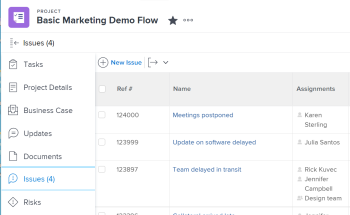
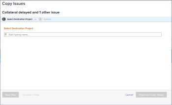
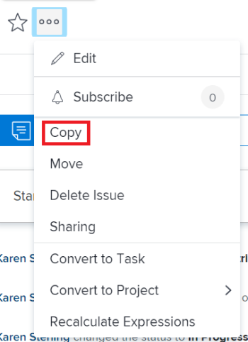

# Copy issues {#copy-issues}

You can copy an issue or a request and save them on the same or another project. You can also copy an issue from a task to another project. 

You can copy issues from the following objects:

* From a project to the same project (duplicate it on the same project)
* From a task to the same task (duplicate if on the same task)
* From a project to another project
* From a task to a project

>[!TIP] {type="tip"}
>
>"Issues" and "requests" are used interchangeably in *`Workfront`*. You can record issues on both projects and tasks to indicate unforeseen work that needs to be addressed. You can also submit requests which are recorded as issues on a project designated as a Request Queue. 

## Access requirements {#access-requirements}

You must have the following access to perform the steps in this article:

<table style="width: 100%;margin-left: 0;margin-right: auto;mc-table-style: url('../../../Resources/TableStyles/TableStyle-List-options-in-steps.css');" class="TableStyle-TableStyle-List-options-in-steps" cellspacing="0"> 
 <col class="TableStyle-TableStyle-List-options-in-steps-Column-Column1"> 
 <col class="TableStyle-TableStyle-List-options-in-steps-Column-Column2"> 
 <tbody> 
  <tr class="TableStyle-TableStyle-List-options-in-steps-Body-LightGray"> 
   <td class="TableStyle-TableStyle-List-options-in-steps-BodyE-Column1-LightGray" role="rowheader">Adobe Workfront plan*</td> 
   <td class="TableStyle-TableStyle-List-options-in-steps-BodyD-Column2-LightGray"> 
Any
 </td> 
  </tr> 
  <tr class="TableStyle-TableStyle-List-options-in-steps-Body-MediumGray"> 
   <td class="TableStyle-TableStyle-List-options-in-steps-BodyE-Column1-MediumGray" role="rowheader">Adobe Workfront license*</td> 
   <td class="TableStyle-TableStyle-List-options-in-steps-BodyD-Column2-MediumGray"> 
Request or higher
 
Review or higher license to copy an issue in the Issues <MadCap:conditionalText data-mc-conditions="QuicksilverOrClassic.Quicksilver">
      section 
     </MadCap:conditionalText>of a project.
 </td> 
  </tr> 
  <tr class="TableStyle-TableStyle-List-options-in-steps-Body-LightGray"> 
   <td class="TableStyle-TableStyle-List-options-in-steps-BodyE-Column1-LightGray" role="rowheader">Access level*</td> 
   <td class="TableStyle-TableStyle-List-options-in-steps-BodyD-Column2-LightGray"> 
Edit access to Issues
 
View or higher access to Projects and Tasks
 
Note: If you still don't have access, ask your Workfront administrator if they set additional restrictions in your access level. For information about access to issues in your Access Level, see <a href="grant-access-issues.md" class="MCXref xref">Grant access to issues</a>. For information on how a Workfront administrator can change your access level, see <a href="create-modify-access-levels.md" class="MCXref xref">Create or modify custom access levels</a>. 
 </td> 
  </tr> 
  <tr class="TableStyle-TableStyle-List-options-in-steps-Body-MediumGray"> 
   <td class="TableStyle-TableStyle-List-options-in-steps-BodyB-Column1-MediumGray" role="rowheader">Object permissions</td> 
   <td class="TableStyle-TableStyle-List-options-in-steps-BodyA-Column2-MediumGray"> 
Manage permissions to the issue
 
Contribute permissions to the item where you are copying&nbsp;the issue to with the ability to&nbsp;Add Issues.
 
 For information about granting permissions to issues, see <a href="share-an-issue.md" class="MCXref xref">Share an issue in Adobe Workfront</a>
 
For information on requesting additional permissions, see <a href="request-access.md" class="MCXref xref">Request access to objects in Adobe Workfront</a>.
 </td> 
  </tr> 
 </tbody> 
</table>

&#42;To find out what plan, license type, or access you have, contact your *`Workfront administrator`*.

## Considerations for issues associated with documents or request queues {#considerations-for-issues-associated-with-documents-or-request-queues}

Consider the following when copying issues that contain documents or are associated with a request queue:

* `When an issue is associated with a requests queue:` When you copy&nbsp;an issue to another object&nbsp;and the issue&nbsp;is associated with a request queue, the copied issue is no longer associated with the original queue&nbsp;the first issue originated from.
* `When a document is attached to the issue:` When you copy an issue to another object and the issue has a document attached to it, the document and its versions also move to the new issue. Any *`proofs`* or approvals associated with the document do&nbsp;not move.

* `When an issue is linked to a document or a folder:`&nbsp;When you copy an issue which has documents or folders linked to a a third party service like Google Drive, the&nbsp;links to the documents transfer over to the copied issue.&nbsp;

## Copy issues in a list {#copy-issues-in-a-list}

You can copy one or multiple issues from a list of issues. 

1. Go to a project whose issues you want to copy. 
1.  Click the `Issues` section, then select the issue or issues you want to copy by selecting the checkbox to the left of the issue. 

   

1. From the header bar, use the `More` drop-down to choose the `Copy to...`option. 

   The `Copy Issues` box displays. 

1. Specify the name of the project where you want to copy the issues in the `Project` field. 

   

1. Select  `Next Step`.
1. (Optional) Select&nbsp;any of the following options to remove&nbsp;the items&nbsp;from&nbsp;the new issue:  

   >[!NOTE]
   >
   >This impacts&nbsp;only the copied issues not the original issues.  

   Unless otherwise specified, the following options cannot be selected by default:  

    
    
    * `Clear Progress`
    * `Clear Documents`:  `Removes everything in the documents tab, including document versions, linked documents, and folders.`  
      By default, document *`proofs`* and approvals cannot be copied to another issue.
    
    * `Clear Assignments`
    * `Clear Updates`: This is checked by default.&nbsp;
    * `Clear Permissions`
    * `Clear Custom Data`:&nbsp;This will remove the information from the custom form on the issue, as well as the information on the custom forms&nbsp;associated&nbsp;with Documents attached to the issue, if those are also copied with the issue. The custom forms will remain attached to the issues&nbsp;and documents, but the information on the forms will not carry over to the new issue.&nbsp;
    
    

1.  Click `Finish and Copy`  `Issue`or `Finish and Copy Issues` depending on how many issues you selected to copy in Step 3. 

   The copied issues have been added to the specified project.&nbsp;

## Copy a single issue {#copy-a-single-issue}

You can copy one issue when viewing it. 

1.  Go to an issue that you want to copy, then click the `More` menu  > `Copy`.

   

   The `Copy Issue` box displays. 

1.  Continue with the steps described in the [Copy issues in a list](#copy) section in this article, starting with Step 5. 

&nbsp;
