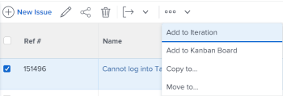

# Copy issues

The highlighted information on this page refers to functionality not yet generally available. It is available only in the Preview Sandbox environment.

You can copy an issue or a request and save them on the same or another project. You can also copy an issue from a task to another project.

You can copy issues from the following objects:

* From a project to the same project (duplicate it on the same project)
* From a task to the same task (duplicate if on the same task)
* From a project to another project
* From a task to a project

>[!TIP]
>
>"Issues" and "requests" are used interchangeably in *Workfront*. You can record issues on both projects and tasks to indicate unforeseen work that needs to be addressed. You can also submit requests which are recorded as issues on a project designated as a Request Queue.

## Access requirements

You must have the following access to perform the steps in this article:

<table cellspacing="0"> 
 <col> 
 <col> 
 <tbody> 
  <tr> 
   <td role="rowheader"><em>Adobe Workfront</em> plan*</td> 
   <td> 
Any
 </td> 
  </tr> 
  <tr> 
   <td role="rowheader"><em>Adobe Workfront</em> license*</td> 
   <td> 
<em>Request</em> or higher
 
<em>Review</em> or higher license to copy an issue in the Issues <draft-comment>
      <MadCap:conditionalText data-mc-conditions="QuicksilverOrClassic.Quicksilver">
       section 
      </MadCap:conditionalText>
     </draft-comment><MadCap:conditionalText data-mc-conditions="QuicksilverOrClassic.Quicksilver">
      section 
     </MadCap:conditionalText>of a project.
 </td> 
  </tr> 
  <tr> 
   <td role="rowheader">Access level*</td> 
   <td> 
Edit access to Issues
 
View or higher access to Projects and Tasks
 
Note: If you still don't have access, ask your <em>Workfront administrator</em> if they set additional restrictions in your access level. For information about access to issues in your Access Level, see <a href="../../../administration-and-setup/add-users/configure-and-grant-access/grant-access-issues.md" class="MCXref xref">Grant access to issues</a>. For information on how a <em>Workfront administrator</em> can change your access level, see <a href="../../../administration-and-setup/add-users/configure-and-grant-access/create-modify-access-levels.md" class="MCXref xref">Create or modify custom access levels</a>. 
 </td> 
  </tr> 
  <tr> 
   <td role="rowheader">Object permissions</td> 
   <td> 
Manage permissions to the issue
 
Contribute permissions to the item where you are copying&nbsp;the issue to with the ability to&nbsp;Add Issues.
 
 For information about granting permissions to issues, see <a href="../../../workfront-basics/grant-and-request-access-to-objects/share-an-issue.md" class="MCXref xref">Share an issue in Adobe Workfront</a>
 
For information on requesting additional permissions, see <a href="../../../workfront-basics/grant-and-request-access-to-objects/request-access.md" class="MCXref xref">Request access to objects in Adobe Workfront</a>.
 </td> 
  </tr> 
 </tbody> 
</table>

&#42;To find out what plan, license type, or access you have, contact your *Workfront administrator*.

## Considerations for issues associated with documents or request queues

Consider the following when copying issues that contain documents or are associated with a request queue:

* `When an issue is associated with a request queue:` When you copy&nbsp;an issue to another object&nbsp;and the issue&nbsp;is associated with a request queue, the copied issue is no longer associated with the original queue&nbsp;the first issue originated from.
* `When a document is attached to the issue:`&nbsp;When you copy&nbsp;an issue to another object&nbsp;and the issue has a document attached to it, the document and its versions also move to the new&nbsp;issue. Any *proofs* or approvals associated with the document do&nbsp;not move.

* `When an issue is linked to a document or a folder:`&nbsp;When you copy an issue which has documents or folders linked to a third party service like Google Drive, the&nbsp;links to the documents transfer to the copied issue.&nbsp;

## Copy issues in a list

You can copy one or multiple issues from a list of issues or from an issue report.

<!--

Copying issues differs depending on what environment you use. 

<ul>
<li> 
<a href="#copy2" class="MCXref xref">Copy issues in a list in the Production&nbsp;environment</a> 
 </li>
<li> 
<a href="#copy3" class="MCXref xref">Copy issues in a list in the Preview environment</a> 
 </li>
</ul>
<h3>Copy issues in a list in the Production&nbsp;environment</h3>

-->

Copying issues differs depending on what environment you use.

* [Copy issues in a list in the Production environment](#copy2) 
* [Copy issues in a list in the Preview environment](#copy3)

### Copy issues in a list in the Production&nbsp;environment

<ol> 
 <li value="1"> 
Go to a project whose issues you want to copy. 
 
Or 
 
Go to an issue report.
 </li> 
 <li value="2"> <draft-comment>
   
If you selected to go to a project, click the Issues section, then select the issue or issues you want to copy. 

  </draft-comment>
If you selected to go to a project, click the Issues section, then select the issue or issues you want to copy. 
 <draft-comment>
   
  

  </draft-comment>
  
 </li> 
 <li value="3">Click the More&nbsp;drop-down menu <draft-comment>
   
  </draft-comment> at the top of the issue list, then click Copy <draft-comment>
   <MadCap:conditionalText data-mc-conditions="QuicksilverOrClassic.Quicksilver">
    to
   </MadCap:conditionalText>
  </draft-comment><MadCap:conditionalText data-mc-conditions="QuicksilverOrClassic.Quicksilver">
   to
  </MadCap:conditionalText>. <draft-comment>
   

  </draft-comment>

The Copy Issue or Copy Issues box displays. 
</li> 
 <li value="4"> 
Specify&nbsp;the name of the project where you want to copy&nbsp;the issues in the Select Destination Project section. 
 <note type="tip">
   Only 50 projects display in the list.
  </note> 
 <draft-comment>
    
   </draft-comment> 
 </li> 
 <li value="5"> 
Continue copying the issue as described in the section <a href="#copy5" class="MCXref xref">Copy a single issue</a> in this article, starting with Step 3. 
 </li> 
</ol>

<!--

<h3>Copy issues in a list in the Preview environment</h3>
<ol>
<li value="1"> 
Go to the project that contains the issue or issues that you want to copy.
 
Or
 
Go to an issue report. 
 </li>
<li value="2"> 
If you selected to go to a project, click Issues in the left panel. 
 </li>
<li value="3"> 
Select the issue or issues that you want to copy and click the More menu  at the top of the issue list, then click Copy to. 
 
  
 </li>
<li value="4"> 
Continue with copying the issue, as described in the section <a href="#copy6" class="MCXref xref">Copy a single issue in the Preview environment</a> starting with Step 4.
 </li>
</ol>

-->

### Copy issues in a list in the Preview environment

<ol> 
 <li value="1"> 
Go to the project that contains the issue or issues that you want to copy.
 
Or
 
Go to an issue report. 
 </li> 
 <li value="2"> 
If you selected to go to a project, click Issues in the left panel. 
 </li> 
 <li value="3"> 
Select the issue or issues that you want to copy and click the More menu  at the top of the issue list, then click Copy to. 
 
  
 </li> 
 <li value="4"> 
Continue with copying the issue, as described in the section <a href="#copy6" class="MCXref xref">Copy a single issue in the Preview environment</a> starting with Step 4.
 </li> 
</ol>

## Copy a single issue

You can copy one issue when viewing it.

<!--

Copying issues differs depending on what environment you use. 

<ul>
<li> 
<a href="#copy4" class="MCXref xref">Copy a single issue in the Production&nbsp;environment</a> 
 </li>
<li> 
<a href="#copy6" class="MCXref xref">Copy a single issue in the Preview environment</a> 
 </li>
</ul>
<h3>Copy a single issue in the Production&nbsp;environment</h3>

-->

Copying issues differs depending on what environment you use.

* [Copy a single issue in the Production environment](#copy4) 
* [Copy a single issue in the Preview environment](#copy6)

### Copy a single issue in the Production&nbsp;environment

<ol> 
 <li value="1"> <draft-comment>
   
Go to an issue that you want to copy, then click the More menu to the right of the issue name, then Copy to.

  </draft-comment>
Go to an issue that you want to copy, then click the More menu to the right of the issue name, then Copy to.
 <draft-comment>
   
  

  </draft-comment>
  
 
The Copy Issue box displays. 
 </li> 
 <li value="2"> 
Specify&nbsp;the name of the project where you want to copy&nbsp;the issues in the Select Destination Project section. The name of the current project displays by default. 
 </li> 
 <li value="3">Click Next Step.</li> 
 <li value="4">(Optional) Select&nbsp;any of the options below to remove&nbsp;the items&nbsp;from&nbsp;the new issue. <note type="note">
    This impacts&nbsp;only the copied issues not the original issues.
  </note> 
  <ul>
   <li>Clear Progress</li>
   <li>Clear Documents:&nbsp;Removes everything in the documents tab, including document versions, linked documents, and folders. By default, document <em>proofs</em> and approvals cannot be copied to another issue.</li>
   <li>Clear Assignments</li>
   <li>Clear Updates: This is checked by default.&nbsp;</li>
   <li>Clear Permissions</li>
   <li>Clear Custom Data:&nbsp;This will remove the information from the custom form on the issue, as well as the information on the custom forms&nbsp;associated&nbsp;with Documents attached to the issue, if those are also copied with the issue. The custom forms will remain attached to the issues&nbsp;and documents, but the information on the forms will not carry over to the new issue.&nbsp;</li>
  </ul></li> 
 <li value="5">(Optional)&nbsp;Click Go back a step to go back to the previous screen in the Copy&nbsp;Issue box. </li> 
 <li value="6"> 
Click Finish&nbsp;and Copy&nbsp;Issue. 
 
Or
 
Click Finish and&nbsp;Copy Issues when you copy multiple issues in a list. 
 
The copied issue is added to the specified project.&nbsp;
 </li> 
</ol>

<!--

<h3>Copy a single issue in the Preview environment</h3>
<ol>
<li value="1"> 
Go to an issue that you want to copy, then click the More menu to the right of the issue name, then Copyto.
 
  
 
The Copy Issue box displays. 
 
  
 </li>
<li value="2"> 
 In the Select Destination Project section, specify&nbsp;the name of the project where you want to copy&nbsp;the issues. The name of the current project displays by default. 
 <note type="tip">
Only 100 projects display in the list.
</note> </li>
<li value="3"> 
(Conditional) Click&nbsp;request access if you do not have access to copy issues to the project. 
 <draft-comment>

Continue to copy the issue on the selected destination project without requesting access if you have access to add issues to one of the tasks on the destination project. 

</draft-comment>
Continue to copy the issue on the selected destination project without requesting access if you have access to add issues to one of the tasks on the destination project. 
 </li>
<li value="4"> 
(Optional) In the Options section, deselect any of the items listed in the table below to remove&nbsp;them&nbsp;from&nbsp;the new issue. All options are selected by default. 
 <note type="note">
This impacts&nbsp;only the copied issues not the original issues.
</note>
<table cellspacing="0">
<col>
<col>
<tbody>
<tr>
<td role="rowheader">Assignments</td>
<td>Removes users, job roles, or teams that are assigned to the issue.</td>
</tr>
<tr>
<td role="rowheader">Progress</td>
<td>Removes the percent complete, if any, of the issue. </td>
</tr>
<tr>
<td role="rowheader">Documents</td>
<td>Removes everything in the documents tab, including document versions, linked documents, and folders.  By default, document <em>proofs</em> and approvals cannot be copied to another issue.</td>
</tr>
<tr>
<td role="rowheader">Permissions</td>
<td>Removes the entities that the issue is shared with. </td>
</tr>
<tr>
<td role="rowheader">Updates</td>
<td>Removes comments from the Updates section of the issue.</td>
</tr>
<tr>
<td role="rowheader">Custom Data</td>
<td>Removes the information from the custom form on the issue, as well as the information on the custom forms&nbsp;associated&nbsp;with Documents attached to the issue, if those are also copied with the issue. The custom forms will remain attached to the issues&nbsp;and documents, but the information on the forms will not carry over to the new issue.&nbsp;</td>
</tr>
</tbody>
</table> 
   
 </li>
<li value="5"> 
(Optional) In the Select Task section, select the task where you want to move the issue. 
 </li>
<li value="6"> 
Click Copy issue or Copy issues if you selected multiple issues in a list.
 
The copied issues are added to the specified project.
 </li>
</ol>

-->

### Copy a single issue in the Preview environment

<ol> 
 <li value="1"> 
Go to an issue that you want to copy, then click the More menu to the right of the issue name, then Copyto.
 
  
 
The Copy Issue box displays. 
 
  
 </li> 
 <li value="2"> 
 In the Select Destination Project section, specify&nbsp;the name of the project where you want to copy&nbsp;the issues. The name of the current project displays by default. 
 <note type="tip">
   Only 100 projects display in the list.
  </note> </li> 
 <li value="3"> 
(Conditional) Click&nbsp;request access if you do not have access to copy issues to the project. 
 
Continue to copy the issue on the selected destination project without requesting access if you have access to add issues to one of the tasks on the destination project. 
 </li> 
 <li value="4"> 
(Optional) In the Options section, deselect any of the items listed in the table below to remove&nbsp;them&nbsp;from&nbsp;the new issue. All options are selected by default. 
 <note type="note">
   This impacts&nbsp;only the copied issues not the original issues.
  </note> 
  <table cellspacing="0"> 
   <col> 
   <col> 
   <tbody> 
    <tr> 
     <td role="rowheader">Assignments</td> 
     <td>Removes users, job roles, or teams that are assigned to the issue.</td> 
    </tr> 
    <tr> 
     <td role="rowheader">Progress</td> 
     <td>Removes the percent complete, if any, of the issue. </td> 
    </tr> 
    <tr> 
     <td role="rowheader">Documents</td> 
     <td>Removes everything in the documents tab, including document versions, linked documents, and folders.  By default, document <em>proofs</em> and approvals cannot be copied to another issue.</td> 
    </tr> 
    <tr> 
     <td role="rowheader">Permissions</td> 
     <td>Removes the entities that the issue is shared with. </td> 
    </tr> 
    <tr> 
     <td role="rowheader">Updates</td> 
     <td>Removes comments from the Updates section of the issue.</td> 
    </tr> 
    <tr> 
     <td role="rowheader">Custom Data</td> 
     <td>Removes the information from the custom form on the issue, as well as the information on the custom forms&nbsp;associated&nbsp;with Documents attached to the issue, if those are also copied with the issue. The custom forms will remain attached to the issues&nbsp;and documents, but the information on the forms will not carry over to the new issue.&nbsp;</td> 
    </tr> 
   </tbody> 
  </table> 
   
 </li> 
 <li value="5"> 
(Optional) In the Select Task section, select the task where you want to move the issue. 
 </li> 
 <li value="6"> 
Click Copy issue or Copy issues if you selected multiple issues in a list.
 
The copied issues are added to the specified project.
 </li> 
</ol>

&nbsp;
