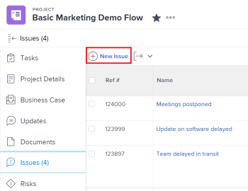

# Create issues {#create-issues}

While working on a project, you might discover that unexpected events arise. You can log those unexpected events as issues for a particular project or of a task. Users with the appropriate access can view and monitor the status of issues as the project or the task progresses to completion, eliminating the need for lengthy email chains or status meetings. Unlike tasks, which are planned events, issues represent unplanned work items in *`Adobe Workfront`*.

You can also add issues to projects as requests.&nbsp;For information, see [Create and submit Adobe Workfront requests](create-submit-requests.md). 

>[!TIP] {type="tip"}
>
>"Issues" and "requests" are used interchangeably in *`Workfront`*. You can record issues on both projects and tasks to indicate unforeseen work that needs to be addressed. You can also submit requests which are recorded as issues on a project designated as a Request Queue. 

## Access requirements {#access-requirements}

You must have the following access to perform the steps in this article:

<table style="width: 100%;margin-left: 0;margin-right: auto;mc-table-style: url('../../../Resources/TableStyles/TableStyle-List-options-in-steps.css');" class="TableStyle-TableStyle-List-options-in-steps" cellspacing="0"> 
 <col class="TableStyle-TableStyle-List-options-in-steps-Column-Column1"> 
 <col class="TableStyle-TableStyle-List-options-in-steps-Column-Column2"> 
 <tbody> 
  <tr class="TableStyle-TableStyle-List-options-in-steps-Body-LightGray"> 
   <td class="TableStyle-TableStyle-List-options-in-steps-BodyE-Column1-LightGray" role="rowheader">Adobe Workfront plan*</td> 
   <td class="TableStyle-TableStyle-List-options-in-steps-BodyD-Column2-LightGray"> 
Any
 </td> 
  </tr> 
  <tr class="TableStyle-TableStyle-List-options-in-steps-Body-MediumGray"> 
   <td class="TableStyle-TableStyle-List-options-in-steps-BodyE-Column1-MediumGray" role="rowheader">Adobe Workfront license*</td> 
   <td class="TableStyle-TableStyle-List-options-in-steps-BodyD-Column2-MediumGray"> 
Review or higher to add issues to a project or task
 
Request or higher to add issues as requests, using a Request Queue. 
 </td> 
  </tr> 
  <tr class="TableStyle-TableStyle-List-options-in-steps-Body-LightGray"> 
   <td class="TableStyle-TableStyle-List-options-in-steps-BodyE-Column1-LightGray" role="rowheader">Access level configurations*</td> 
   <td class="TableStyle-TableStyle-List-options-in-steps-BodyD-Column2-LightGray"> 
Edit access to Issues
 
View or higher access to Projects and Tasks
 
Note: If you still don't have access, ask your Workfront administrator if they set additional restrictions in your access level. For information about access to issues in your Access Level, see <a href="grant-access-issues.md" class="MCXref xref">Grant access to issues</a>. For information on how a Workfront administrator can change your access level, see <a href="create-modify-access-levels.md" class="MCXref xref">Create or modify custom access levels</a>. 
 </td> 
  </tr> 
  <tr class="TableStyle-TableStyle-List-options-in-steps-Body-MediumGray"> 
   <td class="TableStyle-TableStyle-List-options-in-steps-BodyB-Column1-MediumGray" role="rowheader">Object permissions</td> 
   <td class="TableStyle-TableStyle-List-options-in-steps-BodyA-Column2-MediumGray"> 
Contribute or higher permissions with ability to Add Issues to the task or project where you create the issue
 
 For information about granting permissions to issues, see <a href="share-an-issue.md" class="MCXref xref">Share an issue in Adobe Workfront</a>
 
For information on requesting additional permissions, see <a href="request-access.md" class="MCXref xref">Request access to objects in Adobe Workfront</a>.
 </td> 
  </tr> 
 </tbody> 
</table>

&#42;To find out what plan, license type, or access you have, contact your *`Workfront administrator`*.

## Limitations in creating issues {#limitations-in-creating-issues}

When you have the correct access and permissions you can create issues on a project or task. However, the following are cases when you might not be able to create issues: 

* Your *`Workfront administrator`* `or a *`group administrator`*`must enable adding issues to a project that is in a Complete or Dead status in your Project Preferences area. For information about setting project preferences, see [Configure system-wide project preferences](set-project-preferences.md).

* You cannot add issues to a project that is in Pending Approval. 

## Prepare the New Issue form {#prepare-the-new-issue-form}

Your organization should have a well-defined process in place for when and how to record an issue. When you configure this process, the first step is to create the form necessary for submitting an issue. Whether you will allow for issues to be added to tasks and projects directly, or if you have request queues where issues are submitted, you can define what *`Workfront`* fields as well as what custom fields are available for users when they submit new issues and must be completed. The New Issue form can contain important information that will be helpful in resolving the issue quickly. 

The fields for the new issues on a project are defined in the `<MadCap:conditionalText data-mc-conditions="QuicksilverOrClassic.Quicksilver">  Queue Details section</MadCap:conditionalText>` of the project where the issues will be logged. For information about configuring the `<MadCap:conditionalText data-mc-conditions="QuicksilverOrClassic.Quicksilver">  Queue Details section</MadCap:conditionalText>` of the project, see [Create a Request Queue](create-request-queue.md). 

For information about creating issues by submitting them to a request queue, see the [Create issues by entering a new request](#create-issues-as-new-requests) section in this article. 

## Create issues on a task or project using the New Issue button {#create-issues-on-a-task-or-project-using-the-new-issue-button}

After you have defined the fields of a new issue form on your project, you can start creating issues. 

To create an issue on a task or a project:

1. Go to a project where you want to create the issue. 
1. (Optional) If you want to log the issue for a task, go to the `Tasks` `<MadCap:conditionalText data-mc-conditions="QuicksilverOrClassic.Quicksilver"> area</MadCap:conditionalText>`, then click the name of a task. 

1.   `<MadCap:conditionalText data-mc-conditions="QuicksilverOrClassic.Quicksilver"> Click the  Issues section. </MadCap:conditionalText>`

   

1. Click `New Issue`. 

   

1.  (Conditional) If the project creator created Queue Topics or Topic Groups on the project they are added to the new issue form. Specify the `Topic Group` or the `Queue Topic`of your new issue. They should have names customized to your environment.  
   For more information about creating Topic Groups, see [Create Topic Groups](create-topic-groups.md). For more information about creating Queue Topics, see [Create Queue Topics](create-queue-topics.md).  
   

    
    
    * If there is only one Queue Topic set on the project, it is displayed automatically.
    * If the Topic Group does not have any Queue Topics or Topic Groups under it, nothing is available in the Topic Group drop-down.
    
    

1.  (Conditional) If the project creator allowed for the `Issue Type` field to display on the New Issue form, select the type of your issue from the following options:

    
    
    * Bug Report
    * Change Order
    * Issue
    * Request  
      Depending on how your *`Workfront administrator`* has configured your Project Preferences, the names of the issue types might be different for you.
    
    
    

1.  Specify any of the fields available in the `New Issue` form. For more information about defining fields as you enter a new issue, see [Edit issues](edit-issues.md).

   

1. (Conditional) If the Queue Topics are associated with a custom form, that custom form will display in the `New Issue` form.  
   Or  
   If the project is associated with an issue custom form through the Queue Details area, the form displays in the `New Issue` form, under the default *`Workfront`* fields.  

1.  Click `Save New Issue.`

Issues can be assigned to multiple users, job roles or to a team. For more information about assigning and managing requests, see [Manage work and team requests](manage-work-and-team-requests.md).

## Create issues on a task or project inline {#create-issues-on-a-task-or-project-inline}

>[!IMPORTANT] {type="important"}
>
>`The project owner must enable `Allow users to add issues inline` when defining issue settings for the project before you can add issues inline to the project or tasks. For information about configuring issue settings on a project, see` [Edit projects](edit-projects.md). 

When you want to add several issues quickly, you can create issues for a task or a project inline, by adding them to a list of issues.

>[!NOTE]
>
>When you add issues inline, *`Workfront`* does not apply the New Issue form to the new issues. We don't recommend adding issues inline if you want users to provide certain information when entering issues. This can have a negative impact on issue reporting and later on the ability of the user assigned to the issue to have all the information necessary to resolve the issue. 

To create issues inline:

1. Go to a project where you want to create the issue. 
1. (Optional) If you want to log the issue for a task, go to the `Tasks``<MadCap:conditionalText data-mc-conditions="QuicksilverOrClassic.Quicksilver">  section</MadCap:conditionalText>`, then click the name of a task. 

1.   `<MadCap:conditionalText data-mc-conditions="QuicksilverOrClassic.Quicksilver">  Click the  Issues section. </MadCap:conditionalText>` 
1.  Click `Add More Issues`.

   A new line is created in the list of issues on the Issues `<MadCap:conditionalText data-mc-conditions="QuicksilverOrClassic.Quicksilver"> section</MadCap:conditionalText>`. 

   >[!TIP] {type="tip"}
   >
   >`This option is dimmed if the Allow users to add issues inline setting is deselected in the Edit Project box. For information, see` [Edit projects](edit-projects.md). 

   

1.  Start typing the name of the issue in the Name field, then continue adding more information about the issue inline. 

   ` `**Tips: **`` 
    
    
    *  The fields that are available to edit inline are made available by the view you apply to your issue list. 
    *  You might not be able to inline edit the following type of fields: 
    
        
        
        *  Fields that belong to another object
        *  Fields that you don't have access to edit them
        *  Fields that are calculations and which are automatically updated by *`Workfront`*. 
        
        
    
    
    

1.  Click Enter to finish inline editing, and add the issue to the project or task. 

## Create issues by entering a new request {#create-issues-by-entering-a-new-request}

You can designate projects to be receptacles for receiving issues. These type of projects are called Request Queues in *`Workfront`*. `<MadCap:conditionalText data-mc-conditions="QuicksilverOrClassic.Quicksilver"> You can access Request Queues through your Requests area in the Main Menu. </MadCap:conditionalText>`

>[!TIP] {type="tip"}
>
>The terms "issue" and "request" are interchangeable in *`Workfront`*. 

For more information about how to set up projects as Request Queues to receive issues, see [Create a Request Queue](create-request-queue.md). For information about submitting requests, see [Create and submit Adobe Workfront requests](create-submit-requests.md). 
