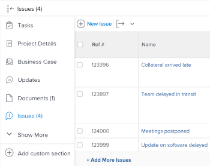

# Delete issues  {#delete-issues}

You can delete issues or requests in  *`Adobe Workfront`* if you have the correct access and permissions to do so. 

>[!TIP] {type="tip"}
>
>"Issues" and "requests" are used interchangeably in *`Workfront`*. You can record issues on both projects and tasks to indicate unforeseen work that needs to be addressed. You can also submit requests which are recorded as issues on a project designated as a Request Queue. 

## Access requirements {#access-requirements}

You must have the following access to perform the steps in this article:

<table style="width: 100%;margin-left: 0;margin-right: auto;mc-table-style: url('../../../Resources/TableStyles/TableStyle-List-options-in-steps.css');" class="TableStyle-TableStyle-List-options-in-steps" cellspacing="0"> 
 <col class="TableStyle-TableStyle-List-options-in-steps-Column-Column1"> 
 <col class="TableStyle-TableStyle-List-options-in-steps-Column-Column2"> 
 <tbody> 
  <tr class="TableStyle-TableStyle-List-options-in-steps-Body-LightGray"> 
   <td class="TableStyle-TableStyle-List-options-in-steps-BodyE-Column1-LightGray" role="rowheader">Adobe Workfront plan*</td> 
   <td class="TableStyle-TableStyle-List-options-in-steps-BodyD-Column2-LightGray"> 
Any
 </td> 
  </tr> 
  <tr class="TableStyle-TableStyle-List-options-in-steps-Body-MediumGray"> 
   <td class="TableStyle-TableStyle-List-options-in-steps-BodyE-Column1-MediumGray" role="rowheader">Adobe Workfront license*</td> 
   <td class="TableStyle-TableStyle-List-options-in-steps-BodyD-Column2-MediumGray"> 
Request or higher
 
Review or higher license to delete issues in the Issues <MadCap:conditionalText data-mc-conditions="QuicksilverOrClassic.Quicksilver">
      section 
     </MadCap:conditionalText>of a project.
 </td> 
  </tr> 
  <tr class="TableStyle-TableStyle-List-options-in-steps-Body-LightGray"> 
   <td class="TableStyle-TableStyle-List-options-in-steps-BodyE-Column1-LightGray" role="rowheader">Access level configuration*</td> 
   <td class="TableStyle-TableStyle-List-options-in-steps-BodyD-Column2-LightGray"> 
Edit access to Issues
 
View or higher access to Projects and Tasks
 
Note: If you still don't have access, ask your Workfront administrator if they set additional restrictions in your access level. For information about access to issues in your Access Level, see <a href="grant-access-issues.md" class="MCXref xref">Grant access to issues</a>. For information on how a Workfront administrator can change your access level, see <a href="create-modify-access-levels.md" class="MCXref xref">Create or modify custom access levels</a>. 
 </td> 
  </tr> 
  <tr class="TableStyle-TableStyle-List-options-in-steps-Body-MediumGray"> 
   <td class="TableStyle-TableStyle-List-options-in-steps-BodyB-Column1-MediumGray" role="rowheader">Object permissions</td> 
   <td class="TableStyle-TableStyle-List-options-in-steps-BodyA-Column2-MediumGray"> 
Manage permissions on the issue
 
Contribute or higher permissions on the project or task
 
 For information about granting permissions to issues, see <a href="share-an-issue.md" class="MCXref xref">Share an issue in Adobe Workfront</a>
 
For information on requesting additional permissions, see <a href="request-access.md" class="MCXref xref">Request access to objects in Adobe Workfront</a>.
 </td> 
  </tr> 
 </tbody> 
</table>

&#42;To find out what plan, license type, or access you have, contact your *`Workfront administrator`*.

## Considerations for deleting issues  
{#considerations-for-deleting-issues}

* Your *`Workfront administrator`* `or a *`group administrator`*`must enable deleting issues in a project that has a status of Complete in your Project Preferences area. For information about setting up project preferences, see [Configure system-wide project preferences](set-project-preferences.md).   

*  If the issue has logged hours, the *`Workfront administrator`* `or a *`group administrator`*`must allow the deletion of these issues by configuring the Task & Issue Preferences in your *`Workfront`* instance. `This also applies when you try to delete projects that have issues with hours logged on them.`

  For more information about enabling the deletion of issues where hours are logged, see the "Deletion" section in [Configure system-wide task and issue preferences](set-task-issue-preferences.md).

## The impact of deleting issues {#the-impact-of-deleting-issues}

When you delete an issue, you impact other objects linked to the issue. 

The following objects attached to an issue are also deleted when you delete an issue:

*  Documents

  You cannot delete an issue that has a document which has been checked out attached to it. For more information about checking out documents, see [Check out documents](check-out-documents.md).  

* Notes
* Approvals

Depending on how your *`Workfront`* or *`group administrator`* configures the Project, Task, or Issue Deletion Preferences in the `Timesheet & Hour Preferences` of your *`Workfront`* instance, hours logged for the issues are handled in one of the following ways when deleting an issue:   

* Move to the project and will not be restored on the issue, if the issue is later restored.
*  Be deleted and will be restored on the issue, if the issue is later restored.

  This also applies when you try to delete projects that have tasks with hours logged on them.

  For more information about configuring the deletion preferences for hours logged on issues, see [Configure timesheet and hour preferences](timesheet-and-hour-preferences.md).

*  The users assigned to the issue or to the issue approval remain on the project team.  
  For more information about project teams, see [Project Team overview](project-team-overview.md).

## Delete issues {#delete-issues-1}

* [Delete multiple issues in a project simultaneously](#delete-tasks-in-a-project-task-list) 
* [Delete a single issue](#delete-a-task) 

### Delete multiple issues in a project simultaneously  {#delete-multiple-issues-in-a-project-simultaneously}

1.  `<MadCap:conditionalText data-mc-conditions="QuicksilverOrClassic.Quicksilver"> Go to the  Main menu. </MadCap:conditionalText>`
1.  `<MadCap:conditionalText data-mc-conditions="QuicksilverOrClassic.Quicksilver"> Click  Projects. </MadCap:conditionalText>` 
1. Click the project name that contains the issues you want to delete.
1.  `<MadCap:conditionalText data-mc-conditions="QuicksilverOrClassic.Quicksilver"> Click  Issues in the left panel.</MadCap:conditionalText>` 
1. Select an issue, then click the `Delete` icon  at the top of the list. 

1. If the deletion is allowed, click `Yes, Delete it`.  
   Your *`Workfront administrator`* might not allow the deletion of issues where hours are logged.  
   For more information about the access and permissions needed to delete an issue, see [Delete issues](#access-and-permissions-needed).

### Delete a single issue {#delete-a-single-issue}

1.  `<MadCap:conditionalText data-mc-conditions="QuicksilverOrClassic.Quicksilver"> Click the  Main menu. </MadCap:conditionalText>`
1.  `<MadCap:conditionalText data-mc-conditions="QuicksilverOrClassic.Quicksilver"> Click  Projects. </MadCap:conditionalText>` 
1. Click the project name that contains the issue you want to delete.
1.   `<MadCap:conditionalText data-mc-conditions="QuicksilverOrClassic.Quicksilver"> Click the  Issues icon. </MadCap:conditionalText>`

   

1. Click the name of the issue you want to delete.
1.   `<MadCap:conditionalText data-mc-conditions="QuicksilverOrClassic.Quicksilver"> Click the  More menu.</MadCap:conditionalText>` 

   

1.  `<MadCap:conditionalText data-mc-conditions="QuicksilverOrClassic.Quicksilver"> Click  Delete.</MadCap:conditionalText>` 
1. If the deletion is allowed, click `Yes, Delete it`.  
   Your *`Workfront administrator`* might not allow the deletion of issues where hours are logged.  
   For more information about the access and permissions needed to delete an issue, see [Delete issues](#access-and-permissions-needed).

## Restore deleted issues {#restore-deleted-issues}

A *`Workfront`* or *`group administrator`* can restore issues within 30 days after they are deleted. For more information about restoring items in *`Workfront`*, see [Restore deleted items](restore-deleted-items.md).
