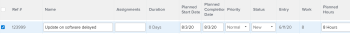

# Edit issues in a list

You can edit an individual issue or you can edit issues in an issue list or report. This article describes how to edit issues in lists.

For information about editing an individual issue, see [Edit issues](../../../manage-work/issues/manage-issues/edit-issues.md).

## Access requirements

You must have the following access to perform the actions in this article:

<table cellspacing="0"> 
 <col> 
 <col> 
 <tbody> 
  <tr> 
   <td role="rowheader">Adobe Workfront plan*</td> 
   <td> 
Any
 </td> 
  </tr> 
  <tr> 
   <td role="rowheader">Adobe Workfront license*</td> 
   <td> 
Request or higher
 
Review or higher license to edit issues in the Issues sectionof a project.
 </td> 
  </tr> 
  <tr> 
   <td role="rowheader">Access level configurations*</td> 
   <td> 
Edit access to Issues
 
Note: If you still don't have access, ask your Workfront administrator if they set additional restrictions in your access level. For information on how a Workfront administrator can modify your access level, see <a href="../../../administration-and-setup/add-users/configure-and-grant-access/create-modify-access-levels.md" class="MCXref xref">Create or modify custom access levels</a>.
 </td> 
  </tr> 
  <tr> 
   <td role="rowheader">Object permissions</td> 
   <td> 
Contribute or higher permissions to the issue
 
 For information about granting permissions to issues, see <a href="../../../workfront-basics/grant-and-request-access-to-objects/share-an-issue.md" class="MCXref xref">Share an issue in Adobe Workfront</a>
 
For information on requesting additional permissions, see <a href="../../../workfront-basics/grant-and-request-access-to-objects/request-access.md" class="MCXref xref">Request access to objects in Adobe Workfront</a>.
 </td> 
  </tr> 
 </tbody> 
</table>

&#42;To find out what plan, license type, or access you have, contact your Workfront administrator.

## Inline edit issues

You can edit issue information in a list of issues, by inline editing fields displayed in the view of the list.

Consider the following when editing issues in a list:

* You can edit any issue field that displays in the list and that you have permissions to update.
* You can edit an issue in the following lists:

  * The Issues section of a project or of a task 
  * An issue report

To inline edit an issue:

<ol> 
 <li value="1">Go to a list of issues in a project or task. </li> 
 <li value="2"> 
Click inside any field that you have permissions to update manually. The field becomes editable and you can make your changes.
 
  </img> 
 </li> 
 <li value="3"> 
Press enter when you want to accept your changes. Changes are saved immediately. 
 
For information about inline editing objects, see <a href="../../../workfront-basics/navigate-workfront/use-lists/inline-edit-objects.md" class="MCXref xref">Inline edit items in a list in&nbsp;Adobe Workfront</a>. 
 </li> 
</ol>

## Edit issues in a list

1. Go to a list of issues in a project or task.

Edit issues using the Summary You can edit an issue in a list using the Summary.

1. Click Issues in the left panel. The list of issues on the project displays. 
1. Click any of the following icons or areas to go to the issue and edit information at the issue level: Documents Click Click here to add to add documents to the issue. Details Click to update information about the issue. Hours Click to log hours. Approvals Click to add issue approvals. 
1. (Optional) Click the `Open Summary` icon again, or the `X icon` in the upper-right of the Summary to close the panel and edit the issue inline.

## Edit issues in bulk

You can edit issues in bulk and update all their information at the same time.

To edit issues in bulk:

<ol> 
 <li value="1"> Go to the Main Menu.</li> 
 <li value="2"> Click Projects. </li> 
 <li value="3">Click a project name to access the project.</li> 
 <li value="4"> Click Issues in the left panel. </li> 
 <li value="5">Select several issues in the list. </li> 
 <li value="6"> 
 Click the Edit icon .
 
The Edit Issues dialog box opens.
 </li> 
 <li value="7"> 
Specify the information on all selected issues.
 
Editing the information on all issues is identical to editing information on one issue when editing the following areas:
 
  <ul> 
   <li>Overview</li> 
   <li>Settings</li> 
   <li>Assignments</li> 
   <li>Comment</li> 
  </ul> 
For more information about editing an issue, see <a href="../../../manage-work/issues/manage-issues/edit-issues.md" class="MCXref xref">Edit issues</a>.
 <note type="note">
   The information you are changing on all the issues selected will override the existing information on individual issues, except for the 
   Assignments field. Adding a new assignee in bulk edit will add that assignee to all the selected issues. If other assignees are assigned to the selected issues, they will remain assigned in addition to the one added through bulk edit.
    
  </note> </li> 
 <li value="8"> 
 Click Custom Forms to edit the custom forms attached to all the issues selected.
 
If the issues selected do not have any common custom forms, no forms are listed in this section.
 
You can edit only the fields on the forms that are attached to all issues selected and which you have permissions to edit. 
 </li> 
 <li value="9"> 
(Optional) In the Custom Forms area, select the Recalculate Custom Expressions option to ensure that all Calculated Custom Fields that are on the Custom Forms attached to the issues selected are up to date. 
 <note type="important">
   We recommend not to select more than 500 issues at a time when you recalculate custom expressions.
  </note> </li> 
 <li value="10"> 
Click Save Changes. 
 
All changes you made are now visible on all the selected issues.
 </li> 
</ol>

