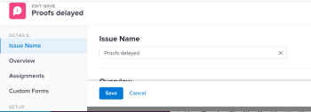
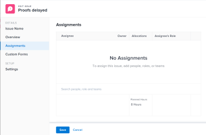

# Edit issues {#edit-issues}

You can edit information on issues that you have created, or that other users have created if they shared the issues with you. 

You can edit a single issue or you can edit issues in a list. For information about editing issues in a list, see [Edit issues in a list](edit-issues-in-a-list.md). 

## Access requirements {#access-requirements}

You must have the following access to perform the steps in this article:

<table style="width: 100%;margin-left: 0;margin-right: auto;mc-table-style: url('../../../Resources/TableStyles/TableStyle-List-options-in-steps.css');" class="TableStyle-TableStyle-List-options-in-steps" cellspacing="0"> 
 <col class="TableStyle-TableStyle-List-options-in-steps-Column-Column1"> 
 <col class="TableStyle-TableStyle-List-options-in-steps-Column-Column2"> 
 <tbody> 
  <tr class="TableStyle-TableStyle-List-options-in-steps-Body-LightGray"> 
   <td class="TableStyle-TableStyle-List-options-in-steps-BodyE-Column1-LightGray" role="rowheader">Adobe Workfront plan*</td> 
   <td class="TableStyle-TableStyle-List-options-in-steps-BodyD-Column2-LightGray"> 
Any 
 </td> 
  </tr> 
  <tr class="TableStyle-TableStyle-List-options-in-steps-Body-MediumGray"> 
   <td class="TableStyle-TableStyle-List-options-in-steps-BodyE-Column1-MediumGray" role="rowheader">Adobe Workfront license*</td> 
   <td class="TableStyle-TableStyle-List-options-in-steps-BodyD-Column2-MediumGray"> 
Request or higher
 
Review or higher license to edit issues in the Issues <MadCap:conditionalText data-mc-conditions="QuicksilverOrClassic.Quicksilver">
      section 
     </MadCap:conditionalText>of a task or a project
 </td> 
  </tr> 
  <tr class="TableStyle-TableStyle-List-options-in-steps-Body-LightGray"> 
   <td class="TableStyle-TableStyle-List-options-in-steps-BodyE-Column1-LightGray" role="rowheader">Access level*</td> 
   <td class="TableStyle-TableStyle-List-options-in-steps-BodyD-Column2-LightGray"> 
Edit access to Issues
 
Note: If you still don't have access, ask your Workfront administrator if they set additional restrictions in your access level. For information about access to issues in your Access Level, see <a href="grant-access-issues.md" class="MCXref xref">Grant access to issues</a>. For information on how a Workfront administrator can change your access level, see <a href="create-modify-access-levels.md" class="MCXref xref">Create or modify custom access levels</a>. 
 </td> 
  </tr> 
  <tr class="TableStyle-TableStyle-List-options-in-steps-Body-MediumGray"> 
   <td class="TableStyle-TableStyle-List-options-in-steps-BodyB-Column1-MediumGray" role="rowheader">Object permissions</td> 
   <td class="TableStyle-TableStyle-List-options-in-steps-BodyA-Column2-MediumGray"> 
Contribute permissions to an issue to edit it in the Issue Details area 
 
Manage permissions to an issue to edit it in the Edit Issue box
 
 For information about granting permissions to issues, see <a href="share-an-issue.md" class="MCXref xref">Share an issue in Adobe Workfront</a>
 
For information on requesting additional permissions, see <a href="request-access.md" class="MCXref xref">Request access to objects in Adobe Workfront</a>.
 </td> 
  </tr> 
 </tbody> 
</table>

&#42;To find out what plan, license type, or access you have, contact your *`Workfront administrator`*.

## Limitations when editing issues {#limitations-when-editing-issues}

There are some limitations that might prevent you from editing issues. 

* You cannot edit issues that are in an Approval Process. You can only log time or update the status on an issue that is in Pending Approval. 
* You can edit and add documents to issues on a project that has a status of Complete, Dead, or is Pending Approval only when your *`Workfront administrator`* or a *`group administrator`* enabled this functionality in the Project Preferences area. For information about setting project preferences, see [Configure system-wide project preferences](set-project-preferences.md). 

## Edit a single issue {#edit-a-single-issue}

You can edit an issue using the Edit Issue or Issue Details areas. The following steps describe editing an issue in the Edit issue box. 

###  

1. Go to the `Main Menu`.
1. Click `Projects`, then click the name of a project to open the project.
1. (Optional) Click `Tasks` , then click the name of a task to open the task. 
1.  Click `Issues` in the left panel.

   

1.  (Optional) To edit limited information about an issue, click `Issue Details` in the left panel. 

   

   >[!NOTE]
   >
   >Depending on how your *`Workfront administrator`* or *`Group administrator`* modified your Layout Template, the fields in the Issue Details area might be rearranged or not display. For information, see [Customize the Details view using a layout template](customize-details-view-layout-template.md).

   To edit information in the Details section, do the following: 

    
    
    1.  (Optional) Click the `Collapse All` icon in the upper-right corner to collapse all areas. 
    1.  (Optional and conditional) When an area is collapsed, click the `right-pointing arrow`  next to each area to expand the area you want to edit. 
    1.  (Optional) To attach a custom form, start typing the name of a form in the `Add custom form` field, then select it when it displays in the list, then click  `Save Changes`. 
    1.  (Optional) Click the `Export` icon  to export the Overview and custom forms information to a PDF file, then click `Export`. Select from the following:
    
        
        
        *  Select all (displays only when there is at least one custom form attached)
        *  Overview
        *  The name of one or multiple custom forms
        
        
       The PDF file downloads to your computer. 
    
    
           
    

    
    
       For more information, see [Export custom forms and object details in Adobe Workfront](export-custom-forms-details.md). 
    
    
    
   For information about the fields visible in the Issue Details section, continue with editing the issue in the Edit issue box as described below. 

1.   To edit all information about an issue, select an issue in a list, then click  `Edit` at the top of the list

   Or

   Click the name of an issue in a list then click the `More` menu next to the issue name, then `Edit.`

   The `Edit Issue` dialog box displays.

   >[!IMPORTANT] {type="important"}
   >
   >You must have Manage permissions to the issue in order to see the Edit link.

   All issue fields are available in the Edit Issue box and are grouped by the areas listed in the left panel. 

1. Consider specifying information in any of the following sections: 
    
    
    * [Issue Name](#issue)
    * [Overview](#overview)
    * [Assignments](#assignme)
    * [Custom Forms](#custom%c2%a0f)
    * [Settings](#settings)
    
    

   >[!NOTE]
   >
   >Depending on how your *`Workfront administrator`* sets up our Layout Template, the fields in the Edit Issue box might be different in your environment. For information, see [Customize the Details view using a layout template](customize-details-view-layout-template.md).

#### Issue Name {#issue-name}

1. Begin editing an issue as described above.
1.  Click `Issue Name`.

   

1.  Update the `Issue Name` field. 
1.  Click `Save`or continue editing the following sections.

#### Overview {#overview}

1. Begin editing an issue as described above.
1.  Click `Overview`.

   

1.   Update or review any of the fields in the following table: 

<table style="width: 100%;mc-table-style: url('../../../Resources/TableStyles/TableStyle-List-options-in-steps.css');" class="TableStyle-TableStyle-List-options-in-steps" cellspacing="0"> 
 <col class="TableStyle-TableStyle-List-options-in-steps-Column-Column1"> 
 <col class="TableStyle-TableStyle-List-options-in-steps-Column-Column2"> 
 <tbody> 
  <tr class="TableStyle-TableStyle-List-options-in-steps-Body-LightGray"> 
   <td class="TableStyle-TableStyle-List-options-in-steps-BodyE-Column1-LightGray" role="rowheader">Description</td> 
   <td class="TableStyle-TableStyle-List-options-in-steps-BodyD-Column2-LightGray"> 
Add additional information about the issue.
 </td> 
  </tr> 
  <tr class="TableStyle-TableStyle-List-options-in-steps-Body-MediumGray"> 
   <td colspan="2" class="TableStyle-TableStyle-List-options-in-steps-BodyD-Column1-MediumGray" role="rowheader">Basic information section</td> 
  </tr> 
  <tr class="TableStyle-TableStyle-List-options-in-steps-Body-LightGray"> 
   <td class="TableStyle-TableStyle-List-options-in-steps-BodyE-Column1-LightGray" role="rowheader">Status</td> 
   <td class="TableStyle-TableStyle-List-options-in-steps-BodyD-Column2-LightGray"> 
Select the status of the issue. For more information about issue statuses, see <a href="issue-statuses.md" class="MCXref xref">Issue statuses</a>. 
 </td> 
  </tr> 
  <tr class="TableStyle-TableStyle-List-options-in-steps-Body-MediumGray"> 
   <td class="TableStyle-TableStyle-List-options-in-steps-BodyE-Column1-MediumGray" role="rowheader">Priority</td> 
   <td class="TableStyle-TableStyle-List-options-in-steps-BodyD-Column2-MediumGray"> 
This is a visual flag for you which allows you to prioritize issues.
 
Select from the following options:
 
    <ul> 
     <li> 
None 
 </li> 
     <li> 
Low 
 </li> 
     <li> 
Normal 
 </li> 
     <li> 
High 
 </li> 
     <li> 
Urgent 
 </li> 
    </ul> 
Depending on the Project Preferences selected by your Workfront administrator, the names of priorities might be different for you. For more information about editing priorities, see <a href="create-customize-priorities .md" class="MCXref xref">Create and customize priorities</a>.
 </td> 
  </tr> 
  <tr class="TableStyle-TableStyle-List-options-in-steps-Body-LightGray"> 
   <td class="TableStyle-TableStyle-List-options-in-steps-BodyE-Column1-LightGray" role="rowheader">Severity</td> 
   <td class="TableStyle-TableStyle-List-options-in-steps-BodyD-Column2-LightGray"> 
This is a visual flag for you which indicates how severe the problem described in the issue is. Severities are specific to issues. Select from the following options:
 
    <ul> 
     <li> 
Cosmetic
 </li> 
     <li> 
Causes Confusion
 </li> 
     <li> 
Bug with workaround
 </li> 
     <li> 
Bug with no workaround
 </li> 
     <li> 
Fatal error
 </li> 
    </ul> 
Depending on the Project Preferences selected by your Workfront administrator, the names of severities might be different for you. For more information about editing severities, see <a href="create-customize-issue-severities.md" class="MCXref xref">Create and customize issue severities</a>.
 </td> 
  </tr> 
  <tr class="TableStyle-TableStyle-List-options-in-steps-Body-MediumGray"> 
   <td class="TableStyle-TableStyle-List-options-in-steps-BodyD-Column1-MediumGray" role="rowheader" colspan="2">Issue path section</td> 
  </tr> 
  <tr class="TableStyle-TableStyle-List-options-in-steps-Body-LightGray"> 
   <td class="TableStyle-TableStyle-List-options-in-steps-BodyE-Column1-LightGray" role="rowheader">URL</td> 
   <td class="TableStyle-TableStyle-List-options-in-steps-BodyD-Column2-LightGray"> 
Type a web link that relates to the information about the issue.
 </td> 
  </tr> 
  <tr class="TableStyle-TableStyle-List-options-in-steps-Body-MediumGray"> 
   <td class="TableStyle-TableStyle-List-options-in-steps-BodyE-Column1-MediumGray" role="rowheader">Type</td> 
   <td class="TableStyle-TableStyle-List-options-in-steps-BodyD-Column2-MediumGray"> 
According to the Queue Properties selected by your project manager in the Queue Details area of the project, you might be able to specify the type of the issue. Select from the following options in the <b>Type</b> drop-down menu: 
 
    <ul> 
     <li> 
Bug Report 
 </li> 
     <li> 
Change Order  
 </li> 
     <li> 
Issue 
 </li> 
     <li> 
Request 
 </li> 
    </ul> 
Depending on the Project Preferences selected by your Workfront administrator, the names of the types of the issues might be different for you.
 </td> 
  </tr> 
  <tr class="TableStyle-TableStyle-List-options-in-steps-Body-LightGray"> 
   <td class="TableStyle-TableStyle-List-options-in-steps-BodyD-Column1-LightGray" role="rowheader" colspan="2">Issue stakeholders section</td> 
  </tr> 
  <tr class="TableStyle-TableStyle-List-options-in-steps-Body-MediumGray"> 
   <td class="TableStyle-TableStyle-List-options-in-steps-BodyE-Column1-MediumGray" role="rowheader">Primary Contact</td> 
   <td class="TableStyle-TableStyle-List-options-in-steps-BodyD-Column2-MediumGray">By default, the Primary Contact is the creator of the issue. To modify this, start typing the name of any active user in Workfront, then select it from the list. An issue can have only one Primary Contact.  If you change the Primary Contact, the user who was the primary contact still has Manage access to the issue. You must manually remove this access under Project Actions &gt; Sharing.</td> 
  </tr> 
  <tr class="TableStyle-TableStyle-List-options-in-steps-Body-LightGray"> 
   <td class="TableStyle-TableStyle-List-options-in-steps-BodyD-Column1-LightGray" role="rowheader" colspan="2">Issue dates section</td> 
  </tr> 
  <tr class="TableStyle-TableStyle-List-options-in-steps-Body-MediumGray"> 
   <td class="TableStyle-TableStyle-List-options-in-steps-BodyE-Column1-MediumGray" role="rowheader">Commit Date and time</td> 
   <td class="TableStyle-TableStyle-List-options-in-steps-BodyD-Column2-MediumGray"> 
This is the date when the assignee of the issue estimates that the issue will be completed. Only assignees can edit this field.
 </td> 
  </tr> 
  <tr class="TableStyle-TableStyle-List-options-in-steps-Body-LightGray"> 
   <td class="TableStyle-TableStyle-List-options-in-steps-BodyE-Column1-LightGray" role="rowheader">Planned Start&nbsp;Date</td> 
   <td class="TableStyle-TableStyle-List-options-in-steps-BodyD-Column2-LightGray">By default, the Planned Start Date is the date and the time when the issue was created. You can update the Planned Start Date of the issue. </td> 
  </tr> 
  <tr class="TableStyle-TableStyle-List-options-in-steps-Body-MediumGray"> 
   <td class="TableStyle-TableStyle-List-options-in-steps-BodyE-Column1-MediumGray" role="rowheader">Planned Completion Date and time</td> 
   <td class="TableStyle-TableStyle-List-options-in-steps-BodyD-Column2-MediumGray"> By default, the Planned Completion Date is 24 hours from the default Planned Start Date. By default, issues have a Duration of 1 day. You can update the Planned Completion Date of the issue.</td> 
  </tr> 
  <tr class="TableStyle-TableStyle-List-options-in-steps-Body-LightGray"> 
   <td class="TableStyle-TableStyle-List-options-in-steps-BodyE-Column1-LightGray" role="rowheader">Actual Start Date and time</td> 
   <td class="TableStyle-TableStyle-List-options-in-steps-BodyD-Column2-LightGray">The Actual Start Date is automatically populated when you change the status of the issue to In Progress. You can update the Actual Start Date of the issue. You can manually update the date, if needed. </td> 
  </tr> 
  <tr class="TableStyle-TableStyle-List-options-in-steps-Body-MediumGray"> 
   <td class="TableStyle-TableStyle-List-options-in-steps-BodyE-Column1-MediumGray" role="rowheader">Actual Completion Date and time</td> 
   <td class="TableStyle-TableStyle-List-options-in-steps-BodyD-Column2-MediumGray">The Actual Completion Date is automatically populated when you change the status of the issue to Closed or Resolved. You can update the Actual Completion Date for the issue. You can manually update the date, if needed.</td> 
  </tr> 
  <tr class="TableStyle-TableStyle-List-options-in-steps-Body-LightGray"> 
   <td class="TableStyle-TableStyle-List-options-in-steps-BodyD-Column1-LightGray" role="rowheader" colspan="2">Issue relationships section</td> 
  </tr> 
  <tr class="TableStyle-TableStyle-List-options-in-steps-Body-MediumGray"> 
   <td class="TableStyle-TableStyle-List-options-in-steps-BodyB-Column1-MediumGray" role="rowheader">Resolved By</td> 
   <td class="TableStyle-TableStyle-List-options-in-steps-BodyA-Column2-MediumGray"> 
This shows whether the issue is resolved by another object. You can select whether this issue is resolved by a task, a project, or another issue from the drop-down menu, then start typing the name of the task, project, or issue that will resolve the issue. Select it when it appears in the list. 
 
Note:  When you select an object to resolve an issue, the issue status is linked to the status of the resolving object and cannot be changed on the issue. For more information about resolving objects, see <a href="resolving-and-resolvable-objects.md" class="MCXref xref">Overview of Resolving and Resolvable Objects </a>.
 </td> 
  </tr> 
 </tbody> 
</table>

1.  Click `Save`or continue editing the following sections.

#### Assignments {#assignments}

1.  Begin editing the issue as described above.
1.  Click  `Assignments` in the left panel. 

   

1.  Click `Search people, role and teams` and start typing the name of a user, role, or team that you want to assign to the task, then click it or press Enter when it displays on the list. You can assign multiple users or job roles to a task. You can assign only one team to a task. 

   ` `**Tip: **`` You can assign multiple users, or job roles, and you can assign only one team. `You can assign only active users, `job roles`, and teams.`

   `If a user, `job role`, or a team was assigned before they were deactivated, they remain assigned to the work item. In this case, we recommend the following:` 

    
    
    *  `Reassign the work item to active resources.` 
    *  `Associate the users in a deactivated team with an active team and reassign the work item to the active team.` 
    
    

1.  (Optional) Indicate whether an assignee is the primary assignee on the issue, by hovering over the name of the assignee and clicking `Make Primary`. A team cannot be the primary assignee of an issue. 
1.  Update the following fields: 

<table style="width: 100%;mc-table-style: url('../../../Resources/TableStyles/TableStyle-List-options-in-steps.css');" class="TableStyle-TableStyle-List-options-in-steps" cellspacing="0"> 
 <col class="TableStyle-TableStyle-List-options-in-steps-Column-Column1"> 
 </col> 
 <col class="TableStyle-TableStyle-List-options-in-steps-Column-Column2"> 
 </col> 
 <tbody> 
  <tr class="TableStyle-TableStyle-List-options-in-steps-Body-LightGray"> 
   <td class="TableStyle-TableStyle-List-options-in-steps-BodyE-Column1-LightGray" role="rowheader">Planned Hours</td> 
   <td class="TableStyle-TableStyle-List-options-in-steps-BodyD-Column2-LightGray"> 
This is the amount of actual time it would take the assignees of the issue to complete it. Type the number of Planned Hours for the issue. 
 
Note:  Changing the Planned Hours of the issue will not change the issue Planned Completion Date. 
 </td> 
  </tr> 
  <tr class="TableStyle-TableStyle-List-options-in-steps-Body-MediumGray" data-mc-conditions=""> 
   <td class="TableStyle-TableStyle-List-options-in-steps-BodyB-Column1-MediumGray" role="rowheader">Assignee's Role</td> 
   <td class="TableStyle-TableStyle-List-options-in-steps-BodyA-Column2-MediumGray"> 
Select a role from the Assignee's Role drop-down menu when you selected a person as an assignee. This is the role that the assignee can fulfill on this issue. 
 
Tip: Only the job roles associated with each assignee in their profile appear in the drop-down menu.
 </td> 
  </tr> 
 </tbody> 
</table>

1.  Click `Save`or continue editing the following sections.

#### Custom&nbsp;Forms {#custom-forms}

1. Begin editing an issue as described above.
1.  Click `Custom Forms`.

   

1. In the `Add custom form` field, select the custom form or forms that you want to associate with the issue. You must build the custom forms before they are available to select in this field. Only active custom forms display in the list. For more information about building custom forms, see [Create or edit a custom form](create-or-edit-a-custom-form.md). You can add up to ten custom forms to an issue. 

1. (Conditional) If you attached a custom form to the issue, edit any fields on the form. You must specify all required fields before you can save the issue.  

   >[!NOTE]
   >
   >Depending on how your *`Workfront`* Administrator set the permissions for the sections in your custom form, not everyone can view or edit the same fields on a given custom form. The permissions to edit fields within a section of a custom form depend on the permissions you have on the issue itself. For information about setting permissions on sections of a custom form, see [Create or edit a custom form](create-or-edit-a-custom-form.md). For information about setting issue permissions, see [Share an issue in Adobe Workfront](share-an-issue.md).

1.  Click `Save`or continue editing the following section.

#### Settings {#settings}

1. Begin editing an issue as described above.
1.  Click `Settings`.

   

   Update the following information:

<table style="width: 100%;mc-table-style: url('../../../Resources/TableStyles/TableStyle-List-options-in-steps.css');" class="TableStyle-TableStyle-List-options-in-steps" cellspacing="0"> 
 <col class="TableStyle-TableStyle-List-options-in-steps-Column-Column1"> 
 </col> 
 <col class="TableStyle-TableStyle-List-options-in-steps-Column-Column2"> 
 </col> 
 <tbody> 
  <tr class="TableStyle-TableStyle-List-options-in-steps-Body-LightGray"> 
   <td class="TableStyle-TableStyle-List-options-in-steps-BodyE-Column1-LightGray" role="rowheader">Approval Process</td> 
   <td class="TableStyle-TableStyle-List-options-in-steps-BodyD-Column2-LightGray"> 
    
 
     
Select an approval process that you want to associate with the issue. Your Workfront administrator must define system-level Approval Processes before you can associate them with issues. Users with administrative access to Approval processes  can also create group-specific approval processes.For more information about creating Approval Processes, see <a href="create-approval-processes.md" class="MCXref xref">Create an approval process</a>. 
 
     
Consider the following when adding approval processes: 
 
     <ul> 
      <li>Only active approval processes display in the list. </li> 
      <li> 
System-wide and group-specific approval processes display in the list. An approval process associated with a group other than that of the project does not display in the list.
 
Important: If the group of the project changes, the group-specific approval process becomes a single-use approval process. For more information about how changes to the group of the project or changes in the approval process affect approval settings, see <a href="how-changes-affect-group-approvals.md" class="MCXref xref">How group and approval process changes affect assigned approval processes</a>. 
 </li> 
      <li> 
You can define default approval processes to be automatically attached to issues when creating request queues or Queue Topics. For information about updating Queue Details, see <a href="create-request-queue.md" class="MCXref xref">Create a Request Queue</a>. For information about creating Queue Topics, see <a href="create-queue-topics.md" class="MCXref xref">Create Queue Topics</a>. 
 </li> 
      <li>When bulk-editing issues, the following scenarios exist:
       <ul>
        <li>
When you select multiple issues from the same group, both system-level and group-specific approval processes display in this field.
</li>
        <li>
When you select multiple issues from different groups, only system-level approval processes display in this field.
</li>
        <li>
When any of the issues have a single-use approval process attached, it is replaced by the system-level or group-level approval process you select. 
</li>
       </ul></li> 
     </ul> 
    
 </td> 
  </tr> 
  <tr class="TableStyle-TableStyle-List-options-in-steps-Body-MediumGray"> 
   <td class="TableStyle-TableStyle-List-options-in-steps-BodyB-Column1-MediumGray" role="rowheader">Reminder Notifications</td> 
   <td class="TableStyle-TableStyle-List-options-in-steps-BodyA-Column2-MediumGray"> 
Select the checkbox for which Reminder Notifications you would like to attach to this issue. All reminder notifications for issues display. Your Workfront administrator must configure Reminder Notifications before you can select them on an issue. For more information about configuring Reminder Notifications, see <a href="set-up-reminder-notifications.md" class="MCXref xref">Set up reminder notifications</a>
 </td> 
  </tr> 
 </tbody> 
</table>

1.  Click `Save.`

## Edit an issue in the issue header (limited) {#edit-an-issue-in-the-issue-header-limited}

You can edit a limited amount of information in the issue header. 

You can edit the following fields in the issue header:

* Issue name
* Percent complete
* Assignments
*  Planned Completion Date `and time` 
* Status
* Make approval decisions if you are set as the approver in a current approval process

