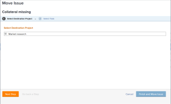
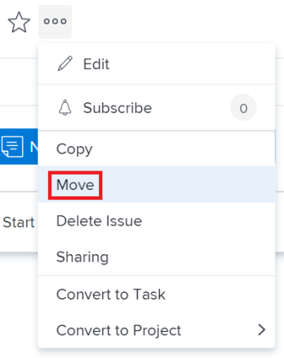

# Move issues {#move-issues}

You can move issues from the following objects:

* From a project to another project
* From a task to another task
* From a task to a project
* From a project to a task

## Access requirements {#access-requirements}

You must have the following access to perform the steps in this article:

<table style="width: 100%;margin-left: 0;margin-right: auto;mc-table-style: url('../../../Resources/TableStyles/TableStyle-List-options-in-steps.css');" class="TableStyle-TableStyle-List-options-in-steps" cellspacing="0"> 
 <col class="TableStyle-TableStyle-List-options-in-steps-Column-Column1"> 
 <col class="TableStyle-TableStyle-List-options-in-steps-Column-Column2"> 
 <tbody> 
  <tr class="TableStyle-TableStyle-List-options-in-steps-Body-LightGray"> 
   <td class="TableStyle-TableStyle-List-options-in-steps-BodyE-Column1-LightGray" role="rowheader">Adobe Workfront plan*</td> 
   <td class="TableStyle-TableStyle-List-options-in-steps-BodyD-Column2-LightGray"> 
Any
 </td> 
  </tr> 
  <tr class="TableStyle-TableStyle-List-options-in-steps-Body-MediumGray"> 
   <td class="TableStyle-TableStyle-List-options-in-steps-BodyE-Column1-MediumGray" role="rowheader">Adobe Workfront license*</td> 
   <td class="TableStyle-TableStyle-List-options-in-steps-BodyD-Column2-MediumGray"> 
Request or higher
 
Review or higher license to move issues in the Issues <MadCap:conditionalText data-mc-conditions="QuicksilverOrClassic.Quicksilver">
      section 
     </MadCap:conditionalText>of a project.
 </td> 
  </tr> 
  <tr class="TableStyle-TableStyle-List-options-in-steps-Body-LightGray"> 
   <td class="TableStyle-TableStyle-List-options-in-steps-BodyE-Column1-LightGray" role="rowheader">Access level configurations*</td> 
   <td class="TableStyle-TableStyle-List-options-in-steps-BodyD-Column2-LightGray"> 
Edit access to Issues
 
View or higher access to Projects and Tasks
 
Note: If you still don't have access, ask your Workfront administrator if they set additional restrictions in your access level. For information about access to issues in your Access Level, see <a href="grant-access-issues.md" class="MCXref xref">Grant access to issues</a>. For information on how a Workfront administrator can change your access level, see <a href="create-modify-access-levels.md" class="MCXref xref">Create or modify custom access levels</a>. 
 </td> 
  </tr> 
  <tr class="TableStyle-TableStyle-List-options-in-steps-Body-MediumGray"> 
   <td class="TableStyle-TableStyle-List-options-in-steps-BodyB-Column1-MediumGray" role="rowheader">Object permissions</td> 
   <td class="TableStyle-TableStyle-List-options-in-steps-BodyA-Column2-MediumGray"> 
Manage permissions to the issue
 
Contribute permissions to the item where you are moving the issue with the ability to&nbsp;Add Issues.
 
 For information about granting permissions to issues, see <a href="share-an-issue.md" class="MCXref xref">Share an issue in Adobe Workfront</a>
 
For information on requesting additional permissions, see <a href="request-access.md" class="MCXref xref">Request access to objects in Adobe Workfront</a>.
 </td> 
  </tr> 
 </tbody> 
</table>

&#42;To find out what plan, license type, or access you have, contact your *`Workfront administrator`*.

## Considerations about moving issues {#considerations-about-moving-issues}

Consider the following when moving&nbsp;issues that contain documents or are associated with a request queue:

* `When an issue is associated with a requests queue:` When you move&nbsp;an issue to another object&nbsp;and the issue&nbsp;is associated with a request queue, the moved&nbsp;issue is no longer associated with the original queue&nbsp;the first issue originated from.
* `When a document is attached to the issue:` When you move an issue to another object and the issue has a document attached to it, the document, its versions and *`proofs`* also move to the new&nbsp;issue. Any approvals associated with the document do&nbsp;not move.

* `When an issue is linked to a document or a folder:`&nbsp;When you move&nbsp;an issue which has documents or folders linked to a a third party service like Google Drive, the&nbsp;links to the documents move with the issue.&nbsp;

## Move issues in a list {#move-issues-in-a-list}

1. Go to the  ` `Project`` that contains the issues that you want to move.&nbsp;
1.   `<MadCap:conditionalText data-mc-conditions="QuicksilverOrClassic.Quicksilver"> Click  Issues in the left panel.</MadCap:conditionalText>` 

   Or

   `<MadCap:conditionalText data-mc-conditions="QuicksilverOrClassic.Quicksilver"> Click  Tasks, then  Issues in the left panel. </MadCap:conditionalText>`

1.  Select the issue or issues that you want to move.

   

1.  Click the `More` icon  at the top of the list, then click  `Move To`. 
1. In the `Move Issue(s)` dialog&nbsp;box, specify&nbsp;the name of the project where you want to move the issues.
1.  (Optional) Click `Next Step.`

   Or

   Select `Task` to select a task to move the issue to. `  
   `

1.  (Optional) Select a task by doing one of the following:

   In the task list, select one of the tasks in the project plan.

   Or

   Using the `Search` field, search for a task by name. The task should appear in the list.  

1. Select the radio button for the task, after you have found it.&nbsp;
1. (Optional) Click `Go back a Step` to move to the previous step.
1.  Click `Finish and Move Issue(s).`

   

   The issue or issues are moved to the specified project or task.

## Move a single issue {#move-a-single-issue}

You can move one issue when viewing it. 

1.  Go to an issue that you want to move, then click the `More` menu  > `Move`.

   

   The `Move Issue` box displays. 

1.  Continue with the steps described in the [Move issues in a list](#move) section in this article, starting with Step 5. 

