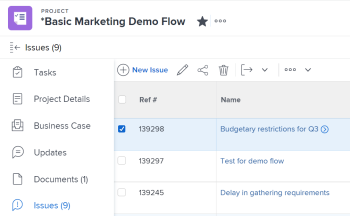

# Move issues

The highlighted information on this page refers to functionality not yet generally available. It is available only in the Preview Sandbox environment.

You can move issues between the following objects:

* From a project to another project
* From a task to another task in the same project or in another project
* From a task to the project or to another project
* From a project to a task in the same project or a task in another project

## Access requirements

You must have the following access to perform the steps in this article:

<table cellspacing="0"> 
 <col> 
 <col> 
 <tbody> 
  <tr> 
   <td role="rowheader"><em>Adobe Workfront</em> plan*</td> 
   <td> 
Any
 </td> 
  </tr> 
  <tr> 
   <td role="rowheader"><em>Adobe Workfront</em> license*</td> 
   <td> 
<em>Request</em> or higher
 
<em>Review</em> or higher license to move issues in the Issues <draft-comment>
      <MadCap:conditionalText data-mc-conditions="QuicksilverOrClassic.Quicksilver">
       section 
      </MadCap:conditionalText>
     </draft-comment><MadCap:conditionalText data-mc-conditions="QuicksilverOrClassic.Quicksilver">
      section 
     </MadCap:conditionalText>of a project.
 </td> 
  </tr> 
  <tr> 
   <td role="rowheader">Access level configurations*</td> 
   <td> 
Edit access to Issues
 
View or higher access to Projects and Tasks
 
Note: If you still don't have access, ask your <em>Workfront administrator</em> if they set additional restrictions in your access level. For information about access to issues in your Access Level, see <a href="../../../administration-and-setup/add-users/configure-and-grant-access/grant-access-issues.md" class="MCXref xref">Grant access to issues</a>. For information on how a <em>Workfront administrator</em> can change your access level, see <a href="../../../administration-and-setup/add-users/configure-and-grant-access/create-modify-access-levels.md" class="MCXref xref">Create or modify custom access levels</a>. 
 </td> 
  </tr> 
  <tr> 
   <td role="rowheader">Object permissions</td> 
   <td> 
Manage permissions to the issue
 
Contribute permissions to the item where you are moving the issue with the ability to&nbsp;Add Issues.
 
 For information about granting permissions to issues, see <a href="../../../workfront-basics/grant-and-request-access-to-objects/share-an-issue.md" class="MCXref xref">Share an issue in Adobe Workfront</a>
 
For information on requesting additional permissions, see <a href="../../../workfront-basics/grant-and-request-access-to-objects/request-access.md" class="MCXref xref">Request access to objects in Adobe Workfront</a>.
 </td> 
  </tr> 
 </tbody> 
</table>

&#42;To find out what plan, license type, or access you have, contact your *Workfront administrator*.

## Considerations about moving issues

Consider the following when moving&nbsp;issues that contain documents or are associated with a request queue:

* `When an issue is associated with a requests queue:` When you move&nbsp;an issue to another object&nbsp;and the issue&nbsp;is associated with a request queue, the moved&nbsp;issue is no longer associated with the original queue&nbsp;the first issue originated from.
* `When a document is attached to the issue:`&nbsp;When you move&nbsp;an issue to another object&nbsp;and the issue has a document attached to it, the document, its versions and *proofs* also move to the new&nbsp;issue. Any approvals associated with the document do&nbsp;not move.

* `When an issue is linked to a document or a folder:`&nbsp;When you move&nbsp;an issue which has documents or folders linked to a a third party service like Google Drive, the&nbsp;links to the documents move with the issue.&nbsp;

##

## Move issues in a list

You can move one or multiple issues from a list of issues or from an issue report.

<!--

Moving issues differs depending on what environment you use. 

<ul>
<li> 
<a href="#copy2" class="MCXref xref">Move issues in a list in the Production&nbsp;environment</a> 
 </li>
<li> 
<a href="#copy3" class="MCXref xref">Move issues in a list in the Preview environment</a> 
 </li>
</ul>
<h3>Move issues in a list in the Production&nbsp;environment</h3>

-->

Moving issues differs depending on what environment you use.

* [Move issues in a list in the Production environment](#copy2) 
* [Move issues in a list in the Preview environment](#copy3)

### Move issues in a list in the Production&nbsp;environment

<ol> 
 <li value="1"> 
Go to a project whose issues you want to move. 
 
Or 
 
Go to an issue report.
 </li> 
 <li value="2"> <draft-comment>
   
If you selected a project, click the Issues section, then select the issue or issues you want to move in the list of issues. 

  </draft-comment>
If you selected a project, click the Issues section, then select the issue or issues you want to move in the list of issues. 
 <draft-comment>
   
  

  </draft-comment>
  
 </li> 
 <li value="3"> 
Click the More&nbsp;drop-down menu <draft-comment>
    <MadCap:conditionalText data-mc-conditions="QuicksilverOrClassic.Quicksilver">
     <draft-comment>
      
     </draft-comment>
     
    </MadCap:conditionalText>
   </draft-comment><MadCap:conditionalText data-mc-conditions="QuicksilverOrClassic.Quicksilver">
    
   </MadCap:conditionalText> at the top of the issue list, then click Move <draft-comment>
    <MadCap:conditionalText data-mc-conditions="QuicksilverOrClassic.Quicksilver">
     to
    </MadCap:conditionalText>
   </draft-comment><MadCap:conditionalText data-mc-conditions="QuicksilverOrClassic.Quicksilver">
    to
   </MadCap:conditionalText>. 
 
 <draft-comment>
    
   </draft-comment> 
 </li> 
 <li value="4">The Move Issue or Move Issues box displays. </li> 
 <li value="5"> 
Specify&nbsp;the name of the project where you want to move the issues in the Select Destination Project section. 
 <note type="tip">
   Only 50 projects display in the list.
  </note> 
  
 </li> 
 <li value="6"> 
Continue moving the issue as described in the section <a href="#copy5" class="MCXref xref">Move a single issue</a> in this article, starting with Step 3. 
 </li> 
</ol>

<!--

<h3>Move issues in a list in the Preview environment</h3>
<ol>
<li value="1"> 
Go to the project that contains the issue or issues that you want to move.
 
Or
 
Go to an issue report. 
 </li>
<li value="2"> 
If you selected to go to a project, click Issues in the left panel. 
 </li>
<li value="3"> 
Select the issue or issues that you want to move and click the More menu  at the top of the issue list, then click Move to. 
 
 <draft-comment>

</draft-comment> 
 </li>
<li value="4"> 
Continue with moving the issue, as described in the section <a href="#copy6" class="MCXref xref">Move a single issue in the Preview environment</a> starting with Step 2.
 </li>
</ol>

-->

### Move issues in a list in the Preview environment

<ol> 
 <li value="1"> 
Go to the project that contains the issue or issues that you want to move.
 
Or
 
Go to an issue report. 
 </li> 
 <li value="2"> 
If you selected to go to a project, click Issues in the left panel. 
 </li> 
 <li value="3"> 
Select the issue or issues that you want to move and click the More menu  at the top of the issue list, then click Move to. 
 
  
 </li> 
 <li value="4"> 
Continue with moving the issue, as described in the section <a href="#copy6" class="MCXref xref">Move a single issue in the Preview environment</a> starting with Step 2.
 </li> 
</ol>

## Move a single issue

You can move one issue when viewing it.

<!--

Moving issues differs depending on what environment you use. 

<ul>
<li> 
<a href="#copy4" class="MCXref xref">Move a single issue in the Production&nbsp;environment</a> 
 </li>
<li> 
<a href="#copy6" class="MCXref xref">Move a single issue in the Preview environment</a> 
 </li>
</ul>
<h3>Move a single issue in the Production&nbsp;environment</h3>

-->

Moving issues differs depending on what environment you use.

* [Move a single issue in the Production environment](#copy4) 
* [Move a single issue in the Preview environment](#copy6)

### Move a single issue in the Production&nbsp;environment

<ol> 
 <li value="1"> <draft-comment>
   
Go to an issue that you want to move, then click the More menu  to the right of the issue name, then Move to.

  </draft-comment>
Go to an issue that you want to move, then click the More menu  to the right of the issue name, then Move to.
 <draft-comment>
   
  

  </draft-comment>
  
 
The Move Issue box displays. 
 </li> 
 <li value="2"> 
Specify&nbsp;the name of the project where you want to move the issues in the Select Destination Project section. The name of the current project displays by default. 
 <note type="tip">
   Only 50 projects display in the list.
  </note> </li> 
 <li value="3"> 
(Optional) Click Next Step.
 
Or
 
Select Task to select a task to move the issue to.
 
  
 </li> 
 <li value="4">(Optional)&nbsp;Click Go back a Step to go back to the previous screen in the Move Issue box. </li> 
 <li value="5"> 
Click Finish and Move Issue.
 
Or
 
Click Finish and&nbsp;Move Issues when you copy multiple issues in a list. 
 
The copied issue is added to the specified project.&nbsp;
 </li> 
</ol>

<!--

<h3>Move a single issue in the Preview environment</h3>
<ol>
<li value="1"> 
Go to an issue that you want to copy, click the More menu to the right of the issue name, then select Move to.
 
  
 
The Move Issue box displays.
 
  
 </li>
<li value="2"> 
 In the Select Destination Project section, specify&nbsp;the name of the project where you want to move the issues. The name of the current project displays by default. 
 <note type="tip">
Only 100 projects display in the list.
</note> </li>
<li value="3"> 
(Conditional) Click&nbsp;request access if you do not have access to move issues to the project. 
 <draft-comment>

Continue to move the issue on the selected destination project without requesting access if you have access to add issues to one of the tasks on the destination project. 

</draft-comment>
Continue to move the issue on the selected destination project without requesting access if you have access to add issues to one of the tasks on the destination project. 
 </li>
<li value="4"> 
(Optional) In the Options section, deselect any of the items listed in the table below to remove&nbsp;them&nbsp;from&nbsp;the moved issue. All options are selected by default. 
 <note type="important">
Deselecting items in the Options list results in loss of data. Information from the existing issue will be removed and cannot be recovered.
</note>
<table cellspacing="0">
<col>
<col>
<tbody>
<tr>
<td role="rowheader">Select all</td>
<td>Deselect this option to remove all information from the issue when moving it to its new location. </td>
</tr>
<tr>
<td role="rowheader">Assignments</td>
<td>Removes users, job roles, or teams that are assigned to the issue.</td>
</tr>
<tr>
<td role="rowheader">Progress</td>
<td>Removes the percent complete, if any, of the issue. </td>
</tr>
<tr>
<td role="rowheader">Documents</td>
<td> 
Removes everything in the documents tab, including document versions, linked documents, and folders.   
 </td>
</tr>
<tr>
<td role="rowheader">Permissions</td>
<td>Removes the entities that the issue is shared with. </td>
</tr>
<tr>
<td role="rowheader">Updates</td>
<td>Removes comments from the Updates section of the issue.</td>
</tr>
</tbody>
</table> </li>
<li value="5"> 
(Optional) In the Select Task section, select the task where you want to move the issue. 
 </li>
<li value="6"> 
Click Move issue or Move issues, if you selected multiple issues in a list. 
 
The moved issues are added to the specified project.&nbsp;
 </li>
</ol>

-->

### Move a single issue in the Preview environment

<ol> 
 <li value="1"> 
Go to an issue that you want to copy, click the More menu to the right of the issue name, then select Move to.
 
  
 
The Move Issue box displays.
 
  
 </li> 
 <li value="2"> 
 In the Select Destination Project section, specify&nbsp;the name of the project where you want to move the issues. The name of the current project displays by default. 
 <note type="tip">
   Only 100 projects display in the list.
  </note> </li> 
 <li value="3"> 
(Conditional) Click&nbsp;request access if you do not have access to move issues to the project. 
 
Continue to move the issue on the selected destination project without requesting access if you have access to add issues to one of the tasks on the destination project. 
 </li> 
 <li value="4"> 
(Optional) In the Options section, deselect any of the items listed in the table below to remove&nbsp;them&nbsp;from&nbsp;the moved issue. All options are selected by default. 
 <note type="important">
   Deselecting items in the Options list results in loss of data. Information from the existing issue will be removed and cannot be recovered. 
  </note> 
  <table cellspacing="0"> 
   <col> 
   <col> 
   <tbody> 
    <tr> 
     <td role="rowheader">Select all</td> 
     <td>Deselect this option to remove all information from the issue when moving it to its new location. </td> 
    </tr> 
    <tr> 
     <td role="rowheader">Assignments</td> 
     <td>Removes users, job roles, or teams that are assigned to the issue.</td> 
    </tr> 
    <tr> 
     <td role="rowheader">Progress</td> 
     <td>Removes the percent complete, if any, of the issue. </td> 
    </tr> 
    <tr> 
     <td role="rowheader">Documents</td> 
     <td> 
Removes everything in the documents tab, including document versions, linked documents, and folders.   
 </td> 
    </tr> 
    <tr> 
     <td role="rowheader">Permissions</td> 
     <td>Removes the entities that the issue is shared with. </td> 
    </tr> 
    <tr> 
     <td role="rowheader">Updates</td> 
     <td>Removes comments from the Updates section of the issue.</td> 
    </tr> 
   </tbody> 
  </table> </li> 
 <li value="5"> 
(Optional) In the Select Task section, select the task where you want to move the issue. 
 </li> 
 <li value="6"> 
Click Move issue or Move issues, if you selected multiple issues in a list. 
 
The moved issues are added to the specified project.&nbsp;
 </li> 
</ol>

