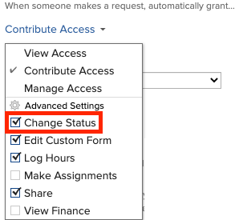

# Automatically update issue statuses from Awaiting Feedback to In Progress

When the Primary Contact of an issue makes an update to the issue by either updating a field (including a custom field) or adding a comment, the issue status updates to In Progress automatically.

In order for this automatic status change to occur, the following is required:

<ul> 
 <li> 
The issue must be entered through a request queue.
 
For information about creating request queues, see the <a href="../../../manage-work/requests/create-and-manage-request-queues/create-manage-request-queues.md" class="MCXref xref" xrefformat="{para}">Create and manage Request Queues</a> section. For information about creating requests, see <a href="../../../manage-work/requests/create-requests/create-submit-requests.md" class="MCXref xref" xrefformat="{para}">Create and submit Adobe Workfront requests</a>.
 </li> 
 <li> 
The Queue Details in the request queue must have these settings: When someone makes a request, automatically grant is set to Contribute Access Change Status is selected under Advanced Settings
 
  
 
For more information about Queue Details, see <a href="../../../manage-work/requests/create-and-manage-request-queues/create-request-queue.md" class="MCXref xref" xrefformat="{para}">Create a Request Queue</a>.
 </li> 
 <li>The issue must be in Awaiting Feedback status.</li> 
 <li> 
There must be an Awaiting Feedback (AWF) status available for issues at the system level. 
 
For more information about system-level statuses, see <a href="../../../administration-and-setup/customize-workfront/creating-custom-status-and-priority-labels/create-or-edit-a-status.md" class="MCXref xref" xrefformat="{para}">Create or edit a status</a>.
 </li> 
</ul>

