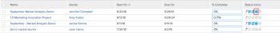

# View issues {#view-issues}

You can view issues that are associated with&nbsp;a project, task, or iteration. 


## Access requirements {#access-requirements}

You must have the following access to perform the steps in this article:

<table style="width: 100%;margin-left: 0;margin-right: auto;mc-table-style: url('../../../Resources/TableStyles/TableStyle-List-options-in-steps.css');" class="TableStyle-TableStyle-List-options-in-steps" cellspacing="0"> 
 <col class="TableStyle-TableStyle-List-options-in-steps-Column-Column1"> 
 <col class="TableStyle-TableStyle-List-options-in-steps-Column-Column2"> 
 <tbody> 
  <tr class="TableStyle-TableStyle-List-options-in-steps-Body-LightGray"> 
   <td class="TableStyle-TableStyle-List-options-in-steps-BodyE-Column1-LightGray" role="rowheader"><span class="mc-variable WFVariables.FullProdNameWF variable varname">Adobe Workfront</span> plan*</td> 
   <td class="TableStyle-TableStyle-List-options-in-steps-BodyD-Column2-LightGray"> <p>Any</p> </td> 
  </tr> 
  <tr class="TableStyle-TableStyle-List-options-in-steps-Body-MediumGray"> 
   <td class="TableStyle-TableStyle-List-options-in-steps-BodyE-Column1-MediumGray" role="rowheader"><span class="mc-variable WFVariables.FullProdNameWF variable varname">Adobe Workfront</span> license*</td> 
   <td class="TableStyle-TableStyle-List-options-in-steps-BodyD-Column2-MediumGray"> <p><span class="mc-variable WFVariables.WFLicense-Request variable varname">Request</span> or higher</p> <p><span class="mc-variable WFVariables.WFLicense-Review variable varname">Review</span> or higher license to view issues in the Issues <MadCap:conditionalText data-mc-conditions="QuicksilverOrClassic.Quicksilver">
      section 
     </MadCap:conditionalText>of a project.</p> </td> 
  </tr> 
  <tr class="TableStyle-TableStyle-List-options-in-steps-Body-LightGray"> 
   <td class="TableStyle-TableStyle-List-options-in-steps-BodyE-Column1-LightGray" role="rowheader">Access level configurations*</td> 
   <td class="TableStyle-TableStyle-List-options-in-steps-BodyD-Column2-LightGray"> <p>View access to Issues</p> <p>View or higher access to Projects and Tasks</p> <p>Note: If you still don't have access, ask your <span class="mc-variable WFVariables.AdminWF variable varname">Workfront administrator</span> if they set additional restrictions in your access level. For information about access to issues in your Access Level, see <a href="grant-access-issues.md" class="MCXref xref">Grant access to issues</a>. For information on how a <span class="mc-variable WFVariables.AdminWF variable varname">Workfront administrator</span> can change your access level, see <a href="create-modify-access-levels.md" class="MCXref xref">Create or modify custom access levels</a>. </p> </td> 
  </tr> 
  <tr class="TableStyle-TableStyle-List-options-in-steps-Body-MediumGray"> 
   <td class="TableStyle-TableStyle-List-options-in-steps-BodyB-Column1-MediumGray" role="rowheader">Object permissions</td> 
   <td class="TableStyle-TableStyle-List-options-in-steps-BodyA-Column2-MediumGray"> <p>View permissions to the issue</p> <p> For information about granting permissions to issues, see <a href="share-an-issue.md" class="MCXref xref">Share an issue in Adobe Workfront</a></p> <p>For information on requesting additional permissions, see <a href="request-access.md" class="MCXref xref">Request access to objects in Adobe Workfront</a>.</p> </td> 
  </tr> 
 </tbody> 
</table>

&#42;To find out what plan, license type, or access you have, contact your *`Workfront administrator`*.


## View issues based on&nbsp;Status {#view-issues-based-on-status}

To view issues on a project, task, or iteration:&nbsp;


1.   `<MadCap:conditionalText data-mc-conditions="QuicksilverOrClassic.Quicksilver"> Open a project, task, or iteration that contains issues, then click  <span class="bold">Issues</span> in the left panel. </MadCap:conditionalText>`  

1.  &nbsp;`<MadCap:conditionalText data-mc-conditions="QuicksilverOrClassic.Quicksilver"> From the  <span class="bold">Filter</span> drop-down menu, click any of the filters listed below:</MadCap:conditionalText>`

    
    
    *   `<MadCap:conditionalText data-mc-conditions="QuicksilverOrClassic.Quicksilver"> <span class="bold">Open:</span> Displays issues that are open. </MadCap:conditionalText>` 
    
    
      `<MadCap:conditionalText data-mc-conditions="QuicksilverOrClassic.Quicksilver"> This includes those associated with a Resolving Object and those in a Closed - Pending Approval status. </MadCap:conditionalText>` 
    
    
      For information about Resolving Objects, see [Overview of Resolving and Resolvable Objects](resolving-and-resolvable-objects.md).
    
    *  `Completed` `:`&nbsp;Displays&nbsp;all issues that have an Actual&nbsp;Completion Date.&nbsp;
    *  `All` `:`&nbsp;Displays&nbsp;all issues.
    
    


## Understand information about issues {#understand-information-about-issues}

You can view information about an issue when you access it.&nbsp;


To access an issue and view information about it:&nbsp;


1.  `<MadCap:conditionalText data-mc-conditions="QuicksilverOrClassic.Quicksilver"> Open a project, task, or iteration that contains issues, then click  <span class="bold">Issues</span> in the left panel. </MadCap:conditionalText>` 
1.   `<MadCap:conditionalText data-mc-conditions="QuicksilverOrClassic.Quicksilver"> From the  <span class="bold">Filter</span> drop-down menu, select the filter to display the issues you are trying to view. </MadCap:conditionalText>`


   Select from the following:

    
    
    *  `<MadCap:conditionalText data-mc-conditions="QuicksilverOrClassic.Quicksilver"> Open</MadCap:conditionalText>`
    *  `<MadCap:conditionalText data-mc-conditions="QuicksilverOrClassic.Quicksilver"> Completed</MadCap:conditionalText>`
    *  `<MadCap:conditionalText data-mc-conditions="QuicksilverOrClassic.Quicksilver"> All</MadCap:conditionalText>`
    
    

1.  Click the name of an issue. 


   When you have manage permissions to the issue you can edit any editable field in the issue and add&nbsp;approvals, hours, or documents to the issue.

1.  &nbsp;`<MadCap:conditionalText data-mc-conditions="QuicksilverOrClassic.Quicksilver"> From the left panel, click any of the following to view more information about the issue:</MadCap:conditionalText>`

    
    
    * `Updates`:&nbsp;You can perform the following actions :     
        
        
        * Comment on the issue, or reply to an existing comment.&nbsp;
        * Log time.
        * Change the status of the issue.  
          For more information about updating work in *`Workfront`*, see [Update work](update-work.md).
        
        
        
    
    * `Documents`: Attach documents to the issue. For more information about adding documents to *`Workfront`*, see [Add documents to Adobe Workfront from your file system](add-documents-from-file-system.md).
    
    * `Issue Details`: `<MadCap:conditionalText data-mc-conditions="QuicksilverOrClassic.Quicksilver">  Expand this link to display the  <span class="bold">Overview</span> and  <span class="bold">Custom&nbsp;Forms</span> areas.</MadCap:conditionalText>`  
      If you have manage permissions to the issue and edit rights on the custom form, you can edit some of the information `<MadCap:conditionalText data-mc-conditions="QuicksilverOrClassic.Quicksilver"> here</MadCap:conditionalText>`.  
      View or edit the following fields `<MadCap:conditionalText data-mc-conditions="QuicksilverOrClassic.Quicksilver"> in the  <span class="bold">Overview</span> area</MadCap:conditionalText>`:     
        
        
        * `Name`
        * `Path`: the path through which the issue was logged to the project.
        
        
          &nbsp;If an issue was submitted as a request in&nbsp;a request queue, the names of the project, the Topic Group, and the Queue Topic are listed here. This field cannot be edited.
        
        
          For more information about submitting requests, see [Create and submit Adobe Workfront requests](create-submit-requests.md).
        
        * `Description`
        * `URL`: any web address related to the issue.
        * `Priority`: a visual flag which allows you to prioritize issues.&nbsp;
        * `Severity`:&nbsp;a visual flag which indicates&nbsp;how severe the problem described in the issue is.
        * `Primary Contact`: the default Primary Contact is the user who created the issue. This field can be edited.
        * `Planned Hours`: displays the amount of time that will take someone to complete the issue. The default is 8 hours. This field can be edited.
        * `Actual Hours`: displays the amount of time that&nbsp;it took to complete the issue. This is the actual time that someone logs for the issue.&nbsp;
        * `Planned Start Date`: the date when the issue is planned to start. The default is the date and the time when the issue was created.&nbsp;
        * `Actual Start Date`: the date and the time when the issue status was changed to In Progress.
        * `Planned Completion Date`: the date when the issue is planned to be completed.&nbsp;
        * `Actual Completion Date`: the date when the issue is actually completed. This field is filled in automatically when the issue status changes to Closed or Resolved, or can be manually edited.&nbsp;
        * `Actual Cost`: the cost based on the Actual Hours logged on the issue. This field is not editable. The Actual Cost of an issue is calculated based on the following formula:&nbsp;  
        
        
          ```        
          Issue Actual Cost = Hours Logged * User Cost Rate
          ```        
        
          , where the User&nbsp;Cost Rate is the cost rate associated with the user logging the time to the issue.&nbsp;
        
        * `Entered By`: this is the user who created the issue. This field is not editable.
        * `Last Updated By`: this is the user who updated any field on the issue last. This field is not editable.&nbsp;
        
        
      In the `Custom Forms` `<MadCap:conditionalText data-mc-conditions="QuicksilverOrClassic.Quicksilver"> area </MadCap:conditionalText>`, view of select one or several custom forms to associate with the issue. 
    
    * `Hours`: Shows a list of hour entries on the issue.
    * `Approvals:` Shows the approval paths associated with the issue.  
      For more information about associating approvals with an issue, see the [Associating an approval process with a work item](create-approval-processes.md#associating-the-approval-process-with-an-object) section in [Create an approval process](create-approval-processes.md).
    
    
    


## View which projects and&nbsp;tasks have issues {#view-which-projects-and-tasks-have-issues}

You can add icons in the view of a project or task report or list to show whether they have issues attached. Adding icons to the view of a report or list is similar for projects and tasks.&nbsp;


To add icons that display whether a project has issues `<MadCap:conditionalText data-mc-conditions="QuicksilverOrClassic.Quicksilver"> in a project report</MadCap:conditionalText>`:


1.  Click the `Main Menu` icon  in the upper-right corner of *`Adobe Workfront`*.
1.   `<MadCap:conditionalText data-mc-conditions="QuicksilverOrClassic.Quicksilver"> Click  <span class="bold">Reporting</span>> <span class="bold">New Report</span>> <span class="bold">Project Report</span>.</MadCap:conditionalText>` 
1. In the `Show in this column` field, start typing `Status Icons`, then select it when it appears in the list.

1.  Click `Save + Close` .


   The issue icons display on the projects that have issues in the `Status Icons` column.


   


