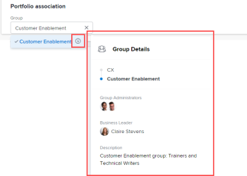

# Create a portfolio

A Portfolio is a collection of projects competing for the same resources, budget, and schedule. The projects in a Portfolio are similar enough that they would use the same Resource Pool and be measured against the same scorecard.

You can use Portfolios to group projects that belong to the same product lines, divisions, departments, companies, or other business units.

## Access requirements

You must have the following access to perform the steps in this article:

<table cellspacing="0"> 
 <col> 
 <col> 
 <tbody> 
  <tr> 
   <td role="rowheader"><em>Adobe Workfront</em> plan*</td> 
   <td> 
<em>Business</em> or higher
 </td> 
  </tr> 
  <tr> 
   <td role="rowheader"><em>Adobe Workfront</em> license*</td> 
   <td> 
<em>Plan</em> 
 </td> 
  </tr> 
  <tr> 
   <td role="rowheader">Access level configurations*</td> 
   <td> 
Edit access to Portfolios
 
Note: If you still don't have access, ask your <em>Workfront administrator</em> if they set additional restrictions in your access level. For information on how a <em>Workfront administrator</em> can change your access level, see <a href="../../../administration-and-setup/add-users/configure-and-grant-access/create-modify-access-levels.md" class="MCXref xref">Create or modify custom access levels</a>.
 </td> 
  </tr> 
  <tr> 
   <td role="rowheader">Object permissions</td> 
   <td> 
After you create a portfolio, you have Manage permissions to it, by default
 
For information on requesting additional access, see <a href="../../../workfront-basics/grant-and-request-access-to-objects/request-access.md" class="MCXref xref">Request access to objects in Adobe Workfront</a>.
 </td> 
  </tr> 
 </tbody> 
</table>

&#42;To find out what plan, license type, or access you have, contact your *Workfront administrator*.

## Create a portfolio

<ol> 
 <li value="1">Click the Main Menu icon  in the upper-right corner of <em>Adobe Workfront</em>.</li> 
 <li value="2"> 
 <draft-comment>
    <MadCap:conditionalText data-mc-conditions="QuicksilverOrClassic.Quicksilver">
     Click 
     Portfolios.
    </MadCap:conditionalText>
   </draft-comment><MadCap:conditionalText data-mc-conditions="QuicksilverOrClassic.Quicksilver">
    Click 
    Portfolios.
   </MadCap:conditionalText> 
 </li> 
 <li value="3"> 
Click New Portfolio.
 </li> 
 <li value="4"> 
Replace Untitled Portfolio with the name you want for the portfolio.
 
The name can contain up to 255 characters.
 </li> <draft-comment>
  <li value="5" data-mc-conditions="QuicksilverOrClassic.Quicksilver"> 
(Optional) Click the name under Portfolio Manager in the header at the top of the page to assign a different manager for the portfolio. 
 
  
 
As the creator of the portfolio, you are assigned as the portfolio manager by default.
 </li>
 </draft-comment>
 <li value="5" data-mc-conditions="QuicksilverOrClassic.Quicksilver"> 
(Optional) Click the name under Portfolio Manager in the header at the top of the page to assign a different manager for the portfolio. 
 
  
 
As the creator of the portfolio, you are assigned as the portfolio manager by default.
 </li> 
 <li value="6"> 
 <draft-comment>
    <MadCap:conditionalText data-mc-conditions="QuicksilverOrClassic.Quicksilver">
     Click 
     Portfolio Details in the left panel
    </MadCap:conditionalText>
   </draft-comment><MadCap:conditionalText data-mc-conditions="QuicksilverOrClassic.Quicksilver">
    Click 
    Portfolio Details in the left panel
   </MadCap:conditionalText>.
 </li> 
 <li value="7"> 
 <draft-comment>
    <MadCap:conditionalText data-mc-conditions="QuicksilverOrClassic.Quicksilver">
     In the 
     Overview area,
    </MadCap:conditionalText>
   </draft-comment><MadCap:conditionalText data-mc-conditions="QuicksilverOrClassic.Quicksilver">
    In the 
    Overview area,
   </MadCap:conditionalText> change any of the following information:
 
  <table cellspacing="0"> 
   <col> 
   <col> 
   <tbody> 
    <tr> 
     <td role="rowheader">Description</td> 
     <td> 
Type a description for the Portfolio to indicate what is unique about it. 
 </td> 
    </tr> 
    <tr> 
     <td role="rowheader">Portfolio Manager</td> 
     <td> 
Start typing the name of a user that you want to indicate as the portfolio manager, then select it when it appears in the list. This is the same as the Portfolio Owner. This is the person who can oversee the work defined in the projects of the portfolio and can approve the Business Case.
 <note type="important">
       When you designate someone as the Portfolio Manager, they automatically gain&nbsp;Manage permissions to the portfolio, the programs and the projects in the portfolio. 
      </note> <note type="tip">
       You can also update the Portfolio Manager in the header at the top of the page.
      </note> </td> 
    </tr> <draft-comment>
     <tr data-mc-conditions=""> 
      <td role="rowheader">Group </td> 
      <td> 
Add the name of a single group if the group owns the portfolio or has responsibility for completing it. 
 
You can make sure you are selecting the right group by hovering over it and clicking the information icon  that displays next to it. This displays a tooltip listing information about the group, such as the hierarchy of groups above it and its administrators.<draft-comment>
         <MadCap:conditionalText data-mc-conditions="SnippetConditions.HIDE">
           Depending on the details configured for the group, you might also see its Business Leader and description.
         </MadCap:conditionalText>
        </draft-comment><MadCap:conditionalText data-mc-conditions="SnippetConditions.HIDE">
          Depending on the details configured for the group, you might also see its Business Leader and description.
        </MadCap:conditionalText>
 <draft-comment>
        
  

       </draft-comment>
  
 </td> 
     </tr>
    </draft-comment>
    <tr data-mc-conditions=""> 
     <td role="rowheader">Group </td> 
     <td> 
Add the name of a single group if the group owns the portfolio or has responsibility for completing it. 
 
You can make sure you are selecting the right group by hovering over it and clicking the information icon  that displays next to it. This displays a tooltip listing information about the group, such as the hierarchy of groups above it and its administrators.<MadCap:conditionalText data-mc-conditions="SnippetConditions.HIDE">
         Depending on the details configured for the group, you might also see its Business Leader and description.
       </MadCap:conditionalText>
 
  
 </td> 
    </tr> 
   </tbody> 
  </table> </li> 
 <li value="8"> 
(Optional) <draft-comment>
    <MadCap:conditionalText data-mc-conditions="QuicksilverOrClassic.Quicksilver">
     Click inside the 
     Add custom form box in the upper-right corner of the Portfolio Details page to select a custom form for the portfolio
    </MadCap:conditionalText>
   </draft-comment><MadCap:conditionalText data-mc-conditions="QuicksilverOrClassic.Quicksilver">
    Click inside the 
    Add custom form box in the upper-right corner of the Portfolio Details page to select a custom form for the portfolio
   </MadCap:conditionalText> and update the custom fields.
 <note type="tip">
   You must have portfolio custom forms already created before you can attach them to portfolios.
  </note> </li> <draft-comment>
  <li value="9" data-mc-conditions="QuicksilverOrClassic.Quicksilver">Click Save Changes.</li>
 </draft-comment>
 <li value="9" data-mc-conditions="QuicksilverOrClassic.Quicksilver">Click Save Changes.</li> 
 <li value="10"> 
(Optional) <draft-comment>
    <MadCap:conditionalText data-mc-conditions="QuicksilverOrClassic.Quicksilver">
     Click 
     Programs in the left panel, then 
     Add Programs to add programs to the portfolio.
    </MadCap:conditionalText>
   </draft-comment><MadCap:conditionalText data-mc-conditions="QuicksilverOrClassic.Quicksilver">
    Click 
    Programs in the left panel, then 
    Add Programs to add programs to the portfolio.
   </MadCap:conditionalText> 
 
For more information about creating Programs, see <a href="../../../manage-work/portfolios/create-and-manage-programs/create-program.md" class="MCXref xref">Create a program</a>.
 </li> 
 <li value="11"> 
(Optional) <draft-comment>
    <MadCap:conditionalText data-mc-conditions="QuicksilverOrClassic.Quicksilver">
     Click 
     Projects in the left panel, then 
     Add Projects to add projects to the portfolio
    </MadCap:conditionalText>
   </draft-comment><MadCap:conditionalText data-mc-conditions="QuicksilverOrClassic.Quicksilver">
    Click 
    Projects in the left panel, then 
    Add Projects to add projects to the portfolio
   </MadCap:conditionalText>.
 
For more information about adding projects to a Portfolio, see <a href="../../../manage-work/portfolios/create-and-manage-portfolios/add-projects-to-portfolios.md" class="MCXref xref">Add projects to a portfolio</a>.
 </li> 
</ol>

<!--

<h2>Deactivate a portfolio</h2>

When you deactivate a portfolio, you can still access it from the Portfolios area, but it no longer displays in the list of portfolios when users try to add it to a project.

<ol>
<li value="1">Click the Main Menu icon  in the upper-right corner of <em>Adobe Workfront</em>.</li>
<li value="2">Click <draft-comment>
<MadCap:conditionalText data-mc-conditions="QuicksilverOrClassic.Quicksilver">
Portfolios
</MadCap:conditionalText>
</draft-comment><MadCap:conditionalText data-mc-conditions="QuicksilverOrClassic.Quicksilver">
Portfolios
</MadCap:conditionalText>.</li>
<li value="3"> 
Click the name of the portfolio.
 </li> <draft-comment>
<li value="4" data-mc-conditions="QuicksilverOrClassic.Quicksilver">Click the More menu  to the right of the portfolio name, then click Deactivate Portfolio.</li>
</draft-comment>
<li value="4" data-mc-conditions="QuicksilverOrClassic.Quicksilver">Click the More menu  to the right of the portfolio name, then click Deactivate Portfolio.</li>
</ol>
<h2>Delete a portfolio</h2>
<ol>
<li value="1">Click the Main Menu icon  in the upper-right corner of <em>Adobe Workfront</em>.</li>
<li value="2"> 
Click <draft-comment>
<MadCap:conditionalText data-mc-conditions="QuicksilverOrClassic.Quicksilver">
Portfolios
</MadCap:conditionalText>
</draft-comment><MadCap:conditionalText data-mc-conditions="QuicksilverOrClassic.Quicksilver">
Portfolios
</MadCap:conditionalText>.
 </li>
<li value="3"> 
Select the portfolio, then click <draft-comment>
<MadCap:conditionalText data-mc-conditions="QuicksilverOrClassic.Quicksilver">
the Delete icon

</MadCap:conditionalText>
</draft-comment><MadCap:conditionalText data-mc-conditions="QuicksilverOrClassic.Quicksilver">
the Delete icon

</MadCap:conditionalText>.
 </li>
<li value="4"> 
In the box that appears, click Yes, Delete It to confirm.
 </li>
</ol>

-->

## Deactivate a portfolio

When you deactivate a portfolio, you can still access it from the Portfolios area, but it no longer displays in the list of portfolios when users try to add it to a project.

<ol> 
 <li value="1">Click the Main Menu icon  in the upper-right corner of <em>Adobe Workfront</em>.</li> 
 <li value="2">Click <MadCap:conditionalText data-mc-conditions="QuicksilverOrClassic.Quicksilver">
   Portfolios 
  </MadCap:conditionalText>.</li> 
 <li value="3"> 
Click the name of the portfolio.
 </li> 
 <li value="4" data-mc-conditions="QuicksilverOrClassic.Quicksilver">Click the More menu  to the right of the portfolio name, then click Deactivate Portfolio.</li> 
</ol>

## Delete a portfolio

<ol> 
 <li value="1">Click the Main Menu icon  in the upper-right corner of <em>Adobe Workfront</em>.</li> 
 <li value="2"> 
Click <MadCap:conditionalText data-mc-conditions="QuicksilverOrClassic.Quicksilver">
    Portfolios 
   </MadCap:conditionalText>.
 </li> 
 <li value="3"> 
Select the portfolio, then click <MadCap:conditionalText data-mc-conditions="QuicksilverOrClassic.Quicksilver">
    the Delete icon 
    
   </MadCap:conditionalText>.
 </li> 
 <li value="4"> 
In the box that appears, click Yes, Delete It to confirm.
 </li> 
</ol>

