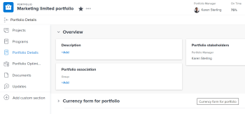
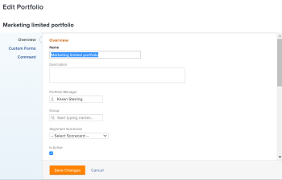
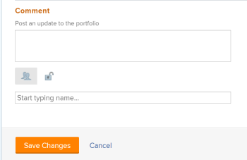

# Edit portfolios

You can edit information on portfolios that you have created, or that other users have created if they shared them with you.

You can edit a portfolio in the portfolio page or you can edit portfolios in a list.

## Access requirements

You must have the following access to perform the steps in this article: 

<table cellspacing="0"> 
 <col> 
 <col> 
 <tbody> 
  <tr> 
   <td role="rowheader"><em>Adobe Workfront</em> plan*</td> 
   <td> 
Any
 </td> 
  </tr> 
  <tr> 
   <td role="rowheader"><em>Adobe Workfront</em> licenses overview*</td> 
   <td> 
<em>Plan</em> 
 </td> 
  </tr> 
  <tr> 
   <td role="rowheader">Access level*</td> 
   <td> 
Edit access to Portfolios
 
Note: If you still don't have access, ask your <em>Workfront administrator</em> if they set additional restrictions in your access level. For information about access to portfolios in your Access Level, see <a href="../../../administration-and-setup/add-users/configure-and-grant-access/grant-access-portfolios.md" class="MCXref xref">Grant access to portfolios</a>. For information on how a <em>Workfront administrator</em> can change your access level, see <a href="../../../administration-and-setup/add-users/configure-and-grant-access/create-modify-access-levels.md" class="MCXref xref">Create or modify custom access levels</a>. 
 </td> 
  </tr> 
  <tr> 
   <td role="rowheader">Object permissions</td> 
   <td> 
Manage permissions to a portfolio
 
 For information about granting permissions to portfolios, see <a href="../../../workfront-basics/grant-and-request-access-to-objects/share-a-portfolio..md" class="MCXref xref">Share a portfolio in Adobe Workfront</a>. 
 
For information on requesting additional permissions, see <a href="../../../workfront-basics/grant-and-request-access-to-objects/request-access.md" class="MCXref xref">Request access to objects in Adobe Workfront</a>.
 </td> 
  </tr> 
 </tbody> 
</table>

&#42;To find out what plan, license type, or access you have, contact your *Workfront administrator*.

<!--

 <draft-comment>
<h3 class="preview" data-mc-conditions="QuicksilverOrClassic.Quicksilver"> </h3>
</draft-comment>
<h3 class="preview" data-mc-conditions="QuicksilverOrClassic.Quicksilver"> </h3>
<h2>Edit portfolios</h2>
<ol>
<li value="1">Go to the Main Menu.</li>
<li value="2">Click Portfolios, then click the name of a portfolio to open it. </li>
<li value="3"> 
(Optional) Edit limited information about the portfolio, click Portfolio Details in the left panel. 
 
  
 <note type="note">
Depending on how your
<em>Workfront administrator</em> or
<em>Group administrator</em> modified your Layout Template, the fields in the Portfolio Details area might be rearranged or not display. For information, see
<a href="../../../administration-and-setup/customize-workfront/use-layout-templates/customize-details-view-layout-template.md" class="MCXref xref">Customize the Details view using a layout template</a>.
</note> 
To edit information in the Details section, do the following: 

<ol>
<li value="1"> 
(Optional) Click the Collapse All icon in the upper-right corner to collapse all areas. 
 </li>
<li value="2"> 
(Optional and conditional) When an area is collapsed, click the right-pointing arrow next to each area to expand the area you want to edit. 
 </li>
<li value="3"> 
For information about the fields visible in the Portfolio Details section, continue with editing the portfolio in the Edit Portfolio box as described below. 
 </li>
<li value="4"> 
(Optional) If there are no custom forms attached to the portfolio, start typing the name of a form in the Add custom form field, select it when it displays in the list, then click&nbsp;Save Changes. 
 </li>
<li value="5"> 
(Optional) Click the Export icon  to export the Overview and custom forms information to a PDF file, then click Export. Select from the following:

<ul>
<li> 
Select all (displays only when there is at least one custom form attached)
 </li>
<li> 
Overview
 </li>
<li> 
The name of one or multiple custom forms
 </li>
</ul> 
The PDF file downloads to your computer. 
 
  
 
For more information, see <a href="../../../workfront-basics/work-with-custom-forms/export-custom-forms-details.md" class="MCXref xref">Export custom forms and object details in Adobe Workfront</a>. 
 </li>
</ol> </li>
<li value="4"> 
 To edit all information about one or more portfolios do one of the following:

<ul>
<li> 
Click the More menu next to the portfolio name, then Edit.
 </li>
<li> 
Go to a list of portfolios and select one or more portfolio that you want to edit, then click the Edit icon  at the top of the list. 
 </li>
</ul> 
The Edit Portfolio dialog box displays.
 
  
 
All portfolio fields are available in the Edit Portfolio box and are grouped by the areas listed in the left panel. 
 </li>
<li value="5">Consider specifying information in any of the following sections:
<ul>
<li><a href="#issue" class="MCXref xref">Overview</a></li>
<li><a href="#custom%c2%a0f" class="MCXref xref">Custom&nbsp;Forms</a></li>
<li><a href="#comment" class="MCXref xref">Comment</a></li>
</ul></li>
</ol>
<h3>Overview</h3>
<ol>
<li value="1">Begin editing a portfolio as described above.</li>
<li value="2"> 
Click Overview and specify the following fields: 
 <note type="note">
Depending on how your
<em>Workfront administrator</em> or
<em>Group administrator</em> sets up our Layout Template, the fields in the Edit Portfolio box might be rearranged or not display. For information, see
<a href="../../../administration-and-setup/customize-workfront/use-layout-templates/customize-details-view-layout-template.md" class="MCXref xref">Customize the Details view using a layout template</a>.
</note>
<table cellspacing="0">
<col>
<col>
<tbody>
<tr>
<td role="rowheader">Name</td>
<td> 
Update the name of the portfolio. 
 <note type="tip">
This is not available when you selected more than one portfolio.
</note> </td>
</tr>
<tr>
<td role="rowheader">Description</td>
<td> 
Type a description for the Portfolio to indicate what is unique about it. 
 </td>
</tr>
<tr>
<td role="rowheader">Portfolio Manager</td>
<td> 
Start typing the name of a user that you want to indicate as the portfolio manager, then select it when it appears in the list. This is the same as the Portfolio Owner. This is the person who can oversee the work defined in the projects of the portfolio and can approve the Business Case.
 <note type="important">
When you designate someone as the Portfolio Manager, they automatically gain&nbsp;Manage permissions to the portfolio, the programs and the projects in the portfolio.
</note> <note type="tip">
You can quickly update the portfolio manager in the portfolio header.
</note> </td>
</tr>
<tr>
<td role="rowheader">Group</td>
<td> 
Add the name of a single group if the group is associated with the portfolio or has responsibility for completing it. 

Tip: </b>">
<b>Tip: </b>

When accessing the Group field from the Portfolio Details page, do the following: 

You can make sure you are selecting the right group by hovering over it and clicking the information icon  that displays next to it. This displays a tooltip listing information about the group, such as the hierarchy of groups above it and its administrators.<draft-comment>
<MadCap:conditionalText data-mc-conditions="SnippetConditions.HIDE">
Depending on the details configured for the group, you might also see its Business Leader and description.
</MadCap:conditionalText>
</draft-comment><MadCap:conditionalText data-mc-conditions="SnippetConditions.HIDE">
Depending on the details configured for the group, you might also see its Business Leader and description.
</MadCap:conditionalText>
 <draft-comment>

  

</draft-comment>

  

This option is not available in the Edit Portfolio box. 

 </td>
</tr>
<tr>
<td role="rowheader"> 
Alignment Scorecard
 </td>
<td> 
Select the alignment scorecard that you want to use from the drop-down list. A scorecard is used to measure how well a project aligns with the established criteria of a Portfolio often reflecting an organization’s mission, values, and strategic goals. For more information, see <a href="../../../manage-work/projects/define-a-business-case/apply-scorecard-to-project-to-generate-alignment-score.md" class="MCXref xref">Apply a scorecard to a project and generate an Alignment Score</a> and <a href="../../../administration-and-setup/set-up-workfront/configure-system-defaults/create-scorecard.md" class="MCXref xref">Create a scorecard</a>.
 </td>
</tr>
<tr>
<td role="rowheader">Is Active</td>
<td> 
 Select this checkbox if you want the portfolio to be active. Other users can find active portfolios and attach them to projects when creating or editing projects. Inactive portfolios cannot be attached to projects. This is enabled by default.
 </td>
</tr>
</tbody>
</table> </li>
<li value="3"> 
Click Save Changes or continue editing the following sections.
 </li>
</ol>
<h3>Custom&nbsp;Forms</h3>
<ol>
<li value="1"> 
Begin editing the portfolio as described above. 
 </li>
<li value="2"> 
Click the Add Forms drop-down menu to select a custom forms and add it to the portfolio. 
 
You must create portfolio custom forms before they are available to add. 
 <note type="note">
Depending on how your
<em>Workfront administrator</em> set the permissions for the sections in your custom form, not everyone can view or edit the same fields on a given custom form. The permissions to edit fields within a section of a custom form depend on the permissions you have on the portfolio itself. For information about setting permissions on sections of a custom form, see
<a href="../../../administration-and-setup/customize-workfront/create-manage-custom-forms/create-or-edit-a-custom-form.md" class="MCXref xref">Create or edit a custom form</a>.
</note> </li>
<li value="3"> 
Update any fields in the custom forms, then click Save Changes or continue with the following section. 
 </li>
</ol>
<h3>Comment</h3>
<ol>
<li value="1"> 
Begin editing a portfolio as described above.
 </li>
<li value="2"> 
Click&nbsp;Comment. 
 
  
 </li>
<li value="3"> 
Add a comment in the Post an update to the portfolio field.
 </li>
<li value="4"> 
(Optional) Click the People icon to add a user or a team to the comment. 
 </li>
<li value="5"> 
(Optional)&nbsp;Click the Lock icon to lock the comment and make it private to only users in your company. 
 </li>
<li value="6"> 
Click&nbsp;Save Changes.
 </li>
</ol>
<h4> </h4>

-->

###

## Edit portfolios

<ol> 
 <li value="1">Go to the Main Menu.</li> 
 <li value="2">Click Portfolios, then click the name of a portfolio to open it. </li> 
 <li value="3"> 
(Optional) Edit limited information about the portfolio, click Portfolio Details in the left panel. 
 
  
 <note type="note">
   Depending on how your 
   <em>Workfront administrator</em> or 
   <em>Group administrator</em> modified your Layout Template, the fields in the Portfolio Details area might be rearranged or not display. For information, see 
   <a href="../../../administration-and-setup/customize-workfront/use-layout-templates/customize-details-view-layout-template.md" class="MCXref xref">Customize the Details view using a layout template</a>.
  </note> 
To edit information in the Details section, do the following: 
 
  <ol> 
   <li value="1"> 
(Optional) Click the Collapse All icon in the upper-right corner to collapse all areas. 
 </li> 
   <li value="2"> 
(Optional and conditional) When an area is collapsed, click the right-pointing arrow next to each area to expand the area you want to edit. 
 </li> 
   <li value="3"> 
For information about the fields visible in the Portfolio Details section, continue with editing the portfolio in the Edit Portfolio box as described below. 
 </li> 
   <li value="4"> 
(Optional) If there are no custom forms attached to the portfolio, start typing the name of a form in the Add custom form field, select it when it displays in the list, then click&nbsp;Save Changes. 
 </li> 
   <li value="5"> 
(Optional) Click the Export icon  to export the Overview and custom forms information to a PDF file, then click Export. Select from the following:
 
    <ul> 
     <li> 
Select all (displays only when there is at least one custom form attached)
 </li> 
     <li> 
Overview
 </li> 
     <li> 
The name of one or multiple custom forms
 </li> 
    </ul> 
The PDF file downloads to your computer. 
 
  
 
For more information, see <a href="../../../workfront-basics/work-with-custom-forms/export-custom-forms-details.md" class="MCXref xref">Export custom forms and object details in Adobe Workfront</a>. 
 </li> 
  </ol> </li> 
 <li value="4"> 
 To edit all information about one or more portfolios do one of the following:
 
  <ul> 
   <li> 
Click the More menu next to the portfolio name, then Edit.
 </li> 
   <li> 
Go to a list of portfolios and select one or more portfolio that you want to edit, then click the Edit icon  at the top of the list. 
 </li> 
  </ul> 
The Edit Portfolio dialog box displays.
 
  
 
All portfolio fields are available in the Edit Portfolio box and are grouped by the areas listed in the left panel. 
 </li> 
 <li value="5">Consider specifying information in any of the following sections: 
  <ul>
   <li><a href="#issue" class="MCXref xref">Overview</a></li>
   <li><a href="#custom%c2%a0f" class="MCXref xref">Custom&nbsp;Forms</a></li>
   <li><a href="#comment" class="MCXref xref">Comment</a></li>
  </ul></li> 
</ol>

### Overview

<ol> 
 <li value="1">Begin editing a portfolio as described above.</li> 
 <li value="2"> 
Click Overview and specify the following fields: 
 <note type="note">
   Depending on how your 
   <em>Workfront administrator</em> or 
   <em>Group administrator</em> sets up our Layout Template, the fields in the Edit Portfolio box might be rearranged or not display. For information, see 
   <a href="../../../administration-and-setup/customize-workfront/use-layout-templates/customize-details-view-layout-template.md" class="MCXref xref">Customize the Details view using a layout template</a>.
  </note> 
  <table cellspacing="0"> 
   <col> 
   <col> 
   <tbody> 
    <tr> 
     <td role="rowheader">Name</td> 
     <td> 
Update the name of the portfolio. 
 <note type="tip">
       This is not available when you selected more than one portfolio. 
      </note> </td> 
    </tr> 
    <tr> 
     <td role="rowheader">Description</td> 
     <td> 
Type a description for the Portfolio to indicate what is unique about it. 
 </td> 
    </tr> 
    <tr> 
     <td role="rowheader">Portfolio Manager</td> 
     <td> 
Start typing the name of a user that you want to indicate as the portfolio manager, then select it when it appears in the list. This is the same as the Portfolio Owner. This is the person who can oversee the work defined in the projects of the portfolio and can approve the Business Case.
 <note type="important">
       When you designate someone as the Portfolio Manager, they automatically gain&nbsp;Manage permissions to the portfolio, the programs and the projects in the portfolio. 
      </note> <note type="tip">
       You can quickly update the portfolio manager in the portfolio header. 
      </note> </td> 
    </tr> 
    <tr> 
     <td role="rowheader">Group</td> 
     <td> 
Add the name of a single group if the group is associated with the portfolio or has responsibility for completing it. 
 
      
Tip: </b>">
       <b>Tip: </b> 
       
When accessing the Group field from the Portfolio Details page, do the following: 
 
       
You can make sure you are selecting the right group by hovering over it and clicking the information icon  that displays next to it. This displays a tooltip listing information about the group, such as the hierarchy of groups above it and its administrators.<MadCap:conditionalText data-mc-conditions="SnippetConditions.HIDE">
          Depending on the details configured for the group, you might also see its Business Leader and description.
        </MadCap:conditionalText>
 
       
  
 
       
This option is not available in the Edit Portfolio box. 
 
      
 </td> 
    </tr> 
    <tr> 
     <td role="rowheader"> 
Alignment Scorecard
 </td> 
     <td> 
Select the alignment scorecard that you want to use from the drop-down list. A scorecard is used to measure how well a project aligns with the established criteria of a Portfolio often reflecting an organization’s mission, values, and strategic goals. For more information, see <a href="../../../manage-work/projects/define-a-business-case/apply-scorecard-to-project-to-generate-alignment-score.md" class="MCXref xref">Apply a scorecard to a project and generate an Alignment Score</a> and <a href="../../../administration-and-setup/set-up-workfront/configure-system-defaults/create-scorecard.md" class="MCXref xref">Create a scorecard</a>.
 </td> 
    </tr> 
    <tr> 
     <td role="rowheader">Is Active</td> 
     <td> 
 Select this checkbox if you want the portfolio to be active. Other users can find active portfolios and attach them to projects when creating or editing projects. Inactive portfolios cannot be attached to projects. This is enabled by default.
 </td> 
    </tr> 
   </tbody> 
  </table> </li> 
 <li value="3"> 
Click Save Changes or continue editing the following sections.
 </li> 
</ol>

### Custom&nbsp;Forms

<ol> 
 <li value="1"> 
Begin editing the portfolio as described above. 
 </li> 
 <li value="2"> 
Click the Add Forms drop-down menu to select a custom forms and add it to the portfolio. 
 
You must create portfolio custom forms before they are available to add. 
 <note type="note">
    Depending on how your 
   <em>Workfront administrator</em> set the permissions for the sections in your custom form, not everyone can view or edit the same fields on a given custom form. The permissions to edit fields within a section of a custom form depend on the permissions you have on the portfolio itself. For information about setting permissions on sections of a custom form, see 
   <a href="../../../administration-and-setup/customize-workfront/create-manage-custom-forms/create-or-edit-a-custom-form.md" class="MCXref xref">Create or edit a custom form</a>. 
  </note> </li> 
 <li value="3"> 
Update any fields in the custom forms, then click Save Changes or continue with the following section. 
 </li> 
</ol>

### Comment

<ol> 
 <li value="1"> 
Begin editing a portfolio as described above.
 </li> 
 <li value="2"> 
Click&nbsp;Comment. 
 
  
 </li> 
 <li value="3"> 
Add a comment in the Post an update to the portfolio field.
 </li> 
 <li value="4"> 
(Optional) Click the People icon to add a user or a team to the comment. 
 </li> 
 <li value="5"> 
(Optional)&nbsp;Click the Lock icon to lock the comment and make it private to only users in your company. 
 </li> 
 <li value="6"> 
Click&nbsp;Save Changes.
 </li> 
</ol>

####  

