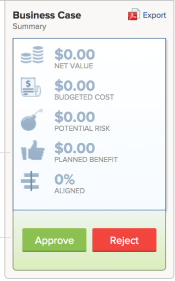

# Review Requested Projects

When multiple project requests are submitted for review, the project management office or portfolio committee can meet to review submitted requests and determine project request approvals. To submit a project request for review, do one of the following:

* Change the project status to `Requested`.
* Complete the Business Case of the project and submit it for approval.   
  For more information about completing a Business Case for a project, see [Create a Business Case for a project in Adobe Workfront](../../../manage-work/projects/define-a-business-case/create-business-case.md).

You can review requested projects in the following areas of *Adobe Workfront*:

* In a project report
* Within a portfolio

## Access requirements

You must have the following access to perform the steps in this article:

<table cellspacing="0"> 
 <col> 
 <col> 
 <tbody> 
  <tr> 
   <td role="rowheader"><em>Adobe Workfront</em> plan*</td> 
   <td> 
<em>Business</em> or higher
 </td> 
  </tr> 
  <tr> 
   <td role="rowheader"><em>Adobe Workfront</em> license*</td> 
   <td> 
<em>Plan</em> 
 </td> 
  </tr> 
  <tr> 
   <td role="rowheader">Access level configurations*</td> 
   <td> 
View access or higher to Portfolios
 
Edit access to Projects
 
Note: If you still don't have access, ask your <em>Workfront administrator</em> if they set additional restrictions in your access level. For information on how a <em>Workfront administrator</em> can change your access level, see <a href="../../../administration-and-setup/add-users/configure-and-grant-access/create-modify-access-levels.md" class="MCXref xref">Create or modify custom access levels</a>.
 </td> 
  </tr> 
  <tr> 
   <td role="rowheader">Object permissions</td> 
   <td> 
View permissions or higher on the portfolio
 
Manage permissions on the projects to update their status
 
For information on requesting additional access, see <a href="../../../workfront-basics/grant-and-request-access-to-objects/request-access.md" class="MCXref xref">Request access to objects in Adobe Workfront</a>.
 </td> 
  </tr> 
 </tbody> 
</table>

&#42;To find out what plan, license type, or access you have, contact your *Workfront administrator*.

## Review Requested Projects in a project report

You can build a report for projects to see what projects have a status of Requested.

For more information about approving project requests by building a project report, see the [Approving the Business Case by Building a Project Report](../../../manage-work/projects/define-a-business-case/approve-business-case.md#build-a-report) section in [Approve a Business Case](../../../manage-work/projects/define-a-business-case/approve-business-case.md).&nbsp;

## Review Requested Projects within a portfolio

<ol> 
 <li value="1">Go to the portfolio whose requested projects you want to review.</li> 
 <li value="2"> <draft-comment>
   <MadCap:conditionalText data-mc-conditions="QuicksilverOrClassic.Quicksilver">
    Click
    Projects in the left panel
   </MadCap:conditionalText>
  </draft-comment><MadCap:conditionalText data-mc-conditions="QuicksilverOrClassic.Quicksilver">
   Click
   Projects in the left panel
  </MadCap:conditionalText></li> 
 <li value="3"> 
 <draft-comment>
    <MadCap:conditionalText data-mc-conditions="QuicksilverOrClassic.Quicksilver">
     From the 
     Filter drop-down menu, select 
     Requested. 
    </MadCap:conditionalText>
   </draft-comment><MadCap:conditionalText data-mc-conditions="QuicksilverOrClassic.Quicksilver">
    From the 
    Filter drop-down menu, select 
    Requested. 
   </MadCap:conditionalText>
 
 <draft-comment>
    <MadCap:conditionalText data-mc-conditions="QuicksilverOrClassic.Quicksilver">
     Only projects with a status of 
     Requested display in the list. 
    </MadCap:conditionalText>
   </draft-comment><MadCap:conditionalText data-mc-conditions="QuicksilverOrClassic.Quicksilver">
    Only projects with a status of 
    Requested display in the list. 
   </MadCap:conditionalText> 
 
&nbsp;In addition to having a Status of Requested, projects must be associated with the selected Portfolio to&nbsp;display in this list.
 </li> 
 <li value="4">Click the name of a project in the list to open it.</li> 
 <li value="5"> <draft-comment>
   <MadCap:conditionalText data-mc-conditions="QuicksilverOrClassic.Quicksilver">
    Click 
    Project&nbsp;Details in the left panel. 
   </MadCap:conditionalText>
  </draft-comment><MadCap:conditionalText data-mc-conditions="QuicksilverOrClassic.Quicksilver">
   Click 
   Project&nbsp;Details in the left panel. 
  </MadCap:conditionalText></li> 
 <li value="6"> 
Do either one of the following: 
 
  <ul> 
   <li> 
 <draft-comment>
      <MadCap:conditionalText data-mc-conditions="QuicksilverOrClassic.Quicksilver">
       Click&nbsp;
       Business Case, then click&nbsp;
       Approve or&nbsp;
       Reject in the Business Case Summary area to approve or reject the Business Case. 
      </MadCap:conditionalText>
     </draft-comment><MadCap:conditionalText data-mc-conditions="QuicksilverOrClassic.Quicksilver">
      Click&nbsp;
      Business Case, then click&nbsp;
      Approve or&nbsp;
      Reject in the Business Case Summary area to approve or reject the Business Case. 
     </MadCap:conditionalText>
 
  
 
The project status is changed to Approved if the Business Case is approved.
 
The project status is changed to Rejected if the Business case is rejected.
 <note type="note">
     There are no notifications that alert the user who submitted the approval of the business case whether their project request was approved or rejected.&nbsp;
    </note> 
Or
 </li> 
   <li> 
Change the status of the project to any other status in the Status drop-down menu.
 </li> 
  </ul> 
&nbsp;
 </li> 
</ol>

&nbsp;
