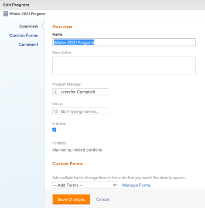

# Edit programs  {#edit-programs}

You can edit information on programs that you have created, or that other users have created if they shared them with you. 

You can edit a program in the program page or you can edit programs in a list. 

## Access requirements {#access-requirements}

You must have the following access to perform the steps in this article:

<table style="width: 100%;margin-left: 0;margin-right: auto;mc-table-style: url('../../../Resources/TableStyles/TableStyle-List-options-in-steps.css');" class="TableStyle-TableStyle-List-options-in-steps" cellspacing="0"> 
 <col class="TableStyle-TableStyle-List-options-in-steps-Column-Column1"> 
 <col class="TableStyle-TableStyle-List-options-in-steps-Column-Column2"> 
 <tbody> 
  <tr class="TableStyle-TableStyle-List-options-in-steps-Body-LightGray"> 
   <td class="TableStyle-TableStyle-List-options-in-steps-BodyE-Column1-LightGray" role="rowheader">Adobe Workfront plan*</td> 
   <td class="TableStyle-TableStyle-List-options-in-steps-BodyD-Column2-LightGray"> 
Any
 </td> 
  </tr> 
  <tr class="TableStyle-TableStyle-List-options-in-steps-Body-MediumGray"> 
   <td class="TableStyle-TableStyle-List-options-in-steps-BodyE-Column1-MediumGray" role="rowheader">Adobe Workfront license*</td> 
   <td class="TableStyle-TableStyle-List-options-in-steps-BodyD-Column2-MediumGray"> 
Plan 
 </td> 
  </tr> 
  <tr class="TableStyle-TableStyle-List-options-in-steps-Body-LightGray"> 
   <td class="TableStyle-TableStyle-List-options-in-steps-BodyE-Column1-LightGray" role="rowheader">Access level*</td> 
   <td class="TableStyle-TableStyle-List-options-in-steps-BodyD-Column2-LightGray"> 
Edit access to Programs
 
Note: If you still don't have access, ask your Workfront administrator if they set additional restrictions in your access level. For information about access to programs in your Access Level, see <a href="grant-access-programs.md" class="MCXref xref">Grant access to programs</a>. For information on how a Workfront administrator can change your access level, see <a href="create-modify-access-levels.md" class="MCXref xref">Create or modify custom access levels</a>. 
 </td> 
  </tr> 
  <tr class="TableStyle-TableStyle-List-options-in-steps-Body-MediumGray"> 
   <td class="TableStyle-TableStyle-List-options-in-steps-BodyB-Column1-MediumGray" role="rowheader">Object permissions</td> 
   <td class="TableStyle-TableStyle-List-options-in-steps-BodyA-Column2-MediumGray"> 
Manage permissions to a program
 
 For information about granting permissions to programs, see <a href="share-a-program.md" class="MCXref xref">Share a program in&nbsp;Adobe Workfront</a>. 
 
For information on requesting additional permissions, see <a href="request-access.md" class="MCXref xref">Request access to objects in Adobe Workfront</a>.
 </td> 
  </tr> 
 </tbody> 
</table>

&#42;To find out what plan, license type, or access you have, contact your *`Workfront administrator`*.

###  

## Edit programs {#edit-programs-1}

1. Go to the `Main Menu`.
1.  Click `Programs`, then click the name of a program to open it. 

   >[!TIP] {type="tip"}
   >
   >You can access a program from the portfolio that it is associated with by going to the portfolio first, then clicking `Programs` in the left panel. For more information, see [Create a program](create-program.md). 

1.  (Optional) To edit limited information about the program, click `Program Details` in the left panel. 

   >[!TIP] {type="tip"}
   >
   >If you want to edit all information about the program, go to step 4. 

   

   >[!NOTE]
   >
   >Depending on how your *`Workfront administrator`* or *`Group administrator`* modified your Layout Template, the fields in the Program Details area might be rearranged or not display. For information, see [Customize the Details view using a layout template](customize-details-view-layout-template.md).

   To edit information in the Details section, do the following: 

    
    
    1.  (Optional) Click the `Collapse All` icon in the upper-right corner to collapse all areas. 
    1.  (Optional and conditional) When an area is collapsed, click the `right-pointing arrow`  next to each area to expand the area you want to edit. 
    1.  `<MadCap:snippetBlock src="assets/edit-fields-in-details-section-all-objects-step.flsnp" />` For information about the fields visible in the Program Details section, continue with editing the program in the Edit Program box as described below.
    
    1.  (Optional) If there are no custom forms attached to the program, start typing the name of a form in the `Add custom form` field, select it when it displays in the list, then click  `Save Changes`. 
    1.  (Optional) Click the `Export` icon  to export the Overview and custom forms information to a PDF file, then click `Export`. Select from the following:
    
        
        
        *  Select all (displays only when there is at least one custom form attached)
        *  Overview
        *  The name of one or multiple custom forms
        
        
       The PDF file downloads to your computer. 
    
    
           
    

    
    
       For more information, see [Export custom forms and object details in Adobe Workfront](export-custom-forms-details.md). 
    
    
    

1.   To edit all information about one or more programs do one of the following:

    
    
    *  Click the `More` menu  next to the program name, then `Edit.`
    *  Go to a list of programs and select one or more program that you want to edit, then click the `Edit` icon  at the top of the list. 
    
    
   The `Edit Program`dialog box displays.

   

   All program fields are available in the Edit Program box and are grouped by the areas listed in the left panel. 

1. Consider specifying information in any of the following sections: 
    
    
    * [Overview](#issue)
    * [Custom Forms](#custom%c2%a0f)
    * [Comment](#comment)
    
    

### Overview {#overview}

1. Begin editing a program as described above.
1.  Click `Overview` and specify the following fields: 

<table style="width: 100%;mc-table-style: url('../../../Resources/TableStyles/TableStyle-List-options-in-steps.css');" class="TableStyle-TableStyle-List-options-in-steps" cellspacing="0"> 
 <col class="TableStyle-TableStyle-List-options-in-steps-Column-Column1"> 
 <col class="TableStyle-TableStyle-List-options-in-steps-Column-Column2"> 
 <tbody> 
  <tr class="TableStyle-TableStyle-List-options-in-steps-Body-LightGray"> 
   <td class="TableStyle-TableStyle-List-options-in-steps-BodyE-Column1-LightGray" role="rowheader">Name</td> 
   <td class="TableStyle-TableStyle-List-options-in-steps-BodyD-Column2-LightGray"> 
Update the name of the program. 
 
Tip: This is not available when you selected more than one program. 
 </td> 
  </tr> 
  <tr class="TableStyle-TableStyle-List-options-in-steps-Body-MediumGray"> 
   <td class="TableStyle-TableStyle-List-options-in-steps-BodyE-Column1-MediumGray" role="rowheader">Description</td> 
   <td class="TableStyle-TableStyle-List-options-in-steps-BodyD-Column2-MediumGray"> 
Type a description for the Portfolio to indicate what is unique about it. 
 </td> 
  </tr> 
  <tr class="TableStyle-TableStyle-List-options-in-steps-Body-LightGray"> 
   <td class="TableStyle-TableStyle-List-options-in-steps-BodyE-Column1-LightGray" role="rowheader">Program Manager</td> 
   <td class="TableStyle-TableStyle-List-options-in-steps-BodyD-Column2-LightGray"> 
Start typing the name of a user that you want to indicate as the program manager, then select it when it appears in the list. This is the person who can oversee the work defined in the projects of the program. 
 
Important: When you designate someone as the Program Manager, they automatically gain&nbsp;Manage permissions to the program and the projects in the program. 
 
Tip: You can quickly update the program manager in the program header. 
 </td> 
  </tr> 
  <tr class="TableStyle-TableStyle-List-options-in-steps-Body-MediumGray"> 
   <td class="TableStyle-TableStyle-List-options-in-steps-BodyE-Column1-MediumGray" role="rowheader">Group</td> 
   <td class="TableStyle-TableStyle-List-options-in-steps-BodyD-Column2-MediumGray"> 
Add the name of a single group if the group is associated with the program or has responsibility for completing it. 
 
    
Tip: </b>">
     <b>Tip: </b> 
     
When accessing the Group field from the Program Details page, do the following: 
 
     
You can make sure you are selecting the right group by hovering over it and clicking the information icon  that displays next to it. This displays a tooltip listing information about the group, such as the hierarchy of groups above it and its administrators.<MadCap:conditionalText data-mc-conditions="SnippetConditions.HIDE">
        Depending on the details configured for the group, you might also see its Business Leader and description.
      </MadCap:conditionalText>
 
     
  
 
     
This option is not available in the Edit Program box. 
 
    
 </td> 
  </tr> 
  <tr class="TableStyle-TableStyle-List-options-in-steps-Body-LightGray"> 
   <td class="TableStyle-TableStyle-List-options-in-steps-BodyB-Column1-LightGray" role="rowheader">Is Active</td> 
   <td class="TableStyle-TableStyle-List-options-in-steps-BodyA-Column2-LightGray"> 
 Select this checkbox if you want the program to be active. Other users can find active programs and attach them to projects or add them to portfolios. Inactive programs cannot be attached to projects or portfolios. This is enabled by default.
 </td> 
  </tr> 
 </tbody> 
</table>

1.  Click `Save Changes`or continue editing the following sections.

### Custom&nbsp;Forms {#custom-forms}

1.  Begin editing the program as described above. 
1.  Click the `Add Forms` drop-down menu to select a custom forms and add it to the program. 

   You must create program custom forms before they are available to add. 

   >[!NOTE]
   >
   >Depending on how your *`Workfront administrator`* set the permissions for the sections in your custom form, not everyone can view or edit the same fields on a given custom form. The permissions to edit fields within a section of a custom form depend on the permissions you have on the program itself. For information about setting permissions on sections of a custom form, see [Create or edit a custom form](create-or-edit-a-custom-form.md). 

1.  Update any fields in the custom forms, then click `Save Changes` or continue with the following section. 

### Comment {#comment}

1.  Begin editing a program as described above.
1.  Click  `Comment`. 

   

1.  Add a comment in the `Post an update to the program` field.
1.  (Optional) Click the `People` icon to add a user or a team to the comment. 
1.  (Optional) Click the `Lock` icon to lock the comment and make it private to only users in your company. 

   After you save your changes, the comment you add displays in the program's Updates tab and sends an email to the users included in it. 

####  

