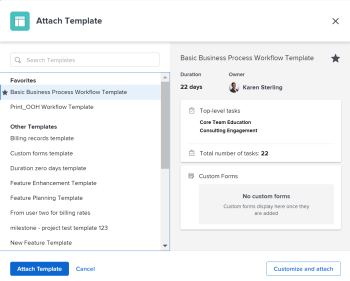
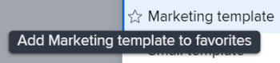
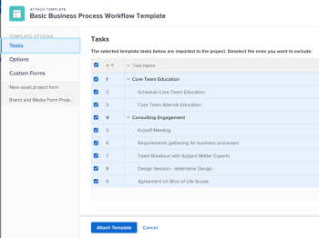
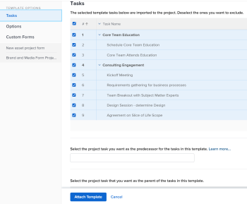
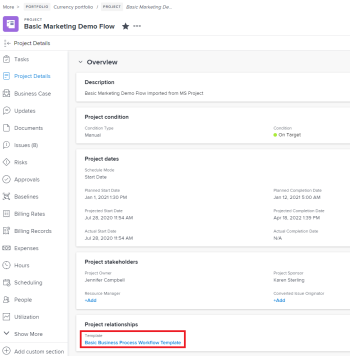

# Attach a template to a project {#attach-a-template-to-a-project}

You can attach a template to a project either during the initial creation phase of the project or after it has been created. 

For more information about creating a project using a template, see [Create a project using a template](create-project-from-template.md).

## Access requirements {#access-requirements}

You must have the following to perform the steps described in this article:

<table style="width: 100%;margin-left: 0;margin-right: auto;mc-table-style: url('../../../Resources/TableStyles/TableStyle-List-options-in-steps.css');" class="TableStyle-TableStyle-List-options-in-steps" cellspacing="0"> 
 <col class="TableStyle-TableStyle-List-options-in-steps-Column-Column1"> 
 <col class="TableStyle-TableStyle-List-options-in-steps-Column-Column2"> 
 <tbody> 
  <tr class="TableStyle-TableStyle-List-options-in-steps-Body-LightGray"> 
   <td class="TableStyle-TableStyle-List-options-in-steps-BodyE-Column1-LightGray" role="rowheader">Adobe Workfront plan*</td> 
   <td class="TableStyle-TableStyle-List-options-in-steps-BodyD-Column2-LightGray"> 
Any 
 </td> 
  </tr> 
  <tr class="TableStyle-TableStyle-List-options-in-steps-Body-MediumGray"> 
   <td class="TableStyle-TableStyle-List-options-in-steps-BodyE-Column1-MediumGray" role="rowheader">Adobe Workfront license*</td> 
   <td class="TableStyle-TableStyle-List-options-in-steps-BodyD-Column2-MediumGray"> 
Plan 
 </td> 
  </tr> 
  <tr class="TableStyle-TableStyle-List-options-in-steps-Body-LightGray"> 
   <td class="TableStyle-TableStyle-List-options-in-steps-BodyE-Column1-LightGray" role="rowheader">Access level configurations*</td> 
   <td class="TableStyle-TableStyle-List-options-in-steps-BodyD-Column2-LightGray"> 
Edit access to Projects 
 
For information about project access, see <a href="grant-access-projects.md" class="MCXref xref">Grant access to projects</a>.
 
View access to&nbsp;Templates
 
For information about template permissions, see <a href="share-a-template.md" class="MCXref xref">Share a template overview</a>. 
 
For information about template access, see <a href="grant-access-templates.md" class="MCXref xref">Grant access to templates</a>.
 
Note: If you still don't have access, ask your Workfront administrator if they set additional restrictions in your access level. For information on how a Workfront administrator can modify your access level, see <a href="create-modify-access-levels.md" class="MCXref xref">Create or modify custom access levels</a>.
 </td> 
  </tr> 
  <tr class="TableStyle-TableStyle-List-options-in-steps-Body-MediumGray"> 
   <td class="TableStyle-TableStyle-List-options-in-steps-BodyB-Column1-MediumGray" role="rowheader">Object permissions</td> 
   <td class="TableStyle-TableStyle-List-options-in-steps-BodyA-Column2-MediumGray"> 
Manage permissions to the project
 
For information about project permissions, see <a href="share-a-project.md" class="MCXref xref">Share a project in Adobe Workfront</a>. 
 
View permissions or higher to the template
 
For information on requesting additional access, see <a href="request-access.md" class="MCXref xref">Request access to objects in Adobe Workfront</a>.
 </td> 
  </tr> 
 </tbody> 
</table>

&#42;To find out what plan, license type, or access you have, contact your *`Workfront administrator`*.

## Attach a template to an existing project {#attach-a-template-to-an-existing-project}

###  

1. Go to the project where you want to attach a template. 
1.  Click the `More` menu , then click `Attach Template`. 

   The Attach Template box displays.   

1.  Begin typing the name of the template that you want to attach in the `Search Templates` field, then click it when it displays.in the list

   Or

   Click the name of a template in the `Other Templates` area. 

   A preview of the template displays to the right that contains the following information about the template:

    
    
    *  Duration
    *  Owner
    *  The number of top-level tasks (includes a list of the first three top-level tasks)
    *  Total number of tasks 
    *  Names of attached custom forms
    
    
   

1.  (Optional) Click the `Favorites` icon  to the left of the template name to mark it as a favorite. This moves the template in the Favorites list. 

   

1.  (Optional) Click the `Favorites` icon  again to remove it from the Favorites list. 
1.  Click `Customize and attach`. 

   

1.  Update information in the following sections before attaching the template (or, click `Attach Template` at any time):

<table style="width: 100%;mc-table-style: url('../../../Resources/TableStyles/TableStyle-List-options-in-steps.css');" class="TableStyle-TableStyle-List-options-in-steps" cellspacing="0"> 
 <col class="TableStyle-TableStyle-List-options-in-steps-Column-Column1" style="width: 158px;"> 
 <col class="TableStyle-TableStyle-List-options-in-steps-Column-Column2"> 
 <tbody> 
  <tr class="TableStyle-TableStyle-List-options-in-steps-Body-LightGray"> 
   <td class="TableStyle-TableStyle-List-options-in-steps-BodyD-Column1-LightGray" role="rowheader" colspan="2"> 
Tasks section
 
  
 </td> 
  </tr> 
  <tr class="TableStyle-TableStyle-List-options-in-steps-Body-MediumGray"> 
   <td class="TableStyle-TableStyle-List-options-in-steps-BodyE-Column1-MediumGray" role="rowheader">The selected template tasks below are imported to the project.&nbsp;Deselect the ones you want to exclude. </td> 
   <td class="TableStyle-TableStyle-List-options-in-steps-BodyD-Column2-MediumGray">Deselect any tasks that you want to exclude from the template before attaching it to the project.</td> 
  </tr> 
  <tr class="TableStyle-TableStyle-List-options-in-steps-Body-LightGray"> 
   <td class="TableStyle-TableStyle-List-options-in-steps-BodyE-Column1-LightGray" role="rowheader">Select the project task you want as the predecessor for the tasks in this template.</td> 
   <td class="TableStyle-TableStyle-List-options-in-steps-BodyD-Column2-LightGray"> 
Click the field to display a list of project tasks. Select which project task you want finished before the template tasks can start. Alternatively, you can skip this step and set up relationships within the project after the template is attached. 
 
 Select the Dependency Type, Lag information, and whether you want the predecessor to be Enforced or not. 
 </td> 
  </tr> 
  <tr class="TableStyle-TableStyle-List-options-in-steps-Body-MediumGray"> 
   <td class="TableStyle-TableStyle-List-options-in-steps-BodyE-Column1-MediumGray" role="rowheader">Select the project task that you want as the parent of the tasks in this template.</td> 
   <td class="TableStyle-TableStyle-List-options-in-steps-BodyD-Column2-MediumGray"> Select which project task you want to designate as the parent task for all of the template tasks. If you do not make a selection, all of the template tasks appear at the end of your current project tasks. You can skip this step and move tasks around in the project after the template is attached.</td> 
  </tr> 
  <tr class="TableStyle-TableStyle-List-options-in-steps-Body-LightGray"> 
   <td class="TableStyle-TableStyle-List-options-in-steps-BodyD-Column1-LightGray" role="rowheader" colspan="2"> 
Options section
 
  
 </td> 
  </tr> 
  <tr class="TableStyle-TableStyle-List-options-in-steps-Body-MediumGray"> 
   <td class="TableStyle-TableStyle-List-options-in-steps-BodyE-Column1-MediumGray" role="rowheader">The selected items below are transferred to the project. Deselect the ones you want to exclude.</td> 
   <td class="TableStyle-TableStyle-List-options-in-steps-BodyD-Column2-MediumGray"> 
Deselect the check-boxes beside any information you want to clear from the template before attaching it to the project. This information is not transferred from the template to the project. For more information on each field, see <a href="attach-template-to-project-overview.md" class="MCXref xref">Overview of attaching a template to a project</a>. 
 
Important: If you check the Queue Properties &amp; Issues Setup box, the Queue Details of the template overwrite those of the project. In this case, the Routing Rules, Queue Topics, and Topic Groups of the template are added to those of the project.  If the project is set up as a request queue and the template you attach to the project is not set up as a request queue, the queue information of the project is removed if you leave the Queue Properties and Issues Setup box checked.  If you deselect the Queue Properties and Issue Setup box, all the Queue Setup settings of the project are preserved and no Queue Setup settings from the template are attached. 
 </td> 
  </tr> 
  <tr class="TableStyle-TableStyle-List-options-in-steps-Body-LightGray"> 
   <td class="TableStyle-TableStyle-List-options-in-steps-BodyD-Column1-LightGray" role="rowheader" colspan="2"> 
Custom Forms section
 
  
 </td> 
  </tr> 
  <tr class="TableStyle-TableStyle-List-options-in-steps-Body-MediumGray"> 
   <td class="TableStyle-TableStyle-List-options-in-steps-BodyB-Column1-MediumGray" role="rowheader">Custom&nbsp;Forms</td> 
   <td class="TableStyle-TableStyle-List-options-in-steps-BodyA-Column2-MediumGray"> 
When custom forms are attached to the template, their names display in the left panel. 
 </td> 
  </tr> 
 </tbody> 
</table>

1.  (Optional) Update information in the custom forms. This information transfers to the project. 

   ` `**Tip: **`` 
    
    
    *  This step is mandatory when the custom forms on the template contain required fields that are empty. 
    *  If the fields from the template custom forms already exist on the project and contain information, they preserve the information already on the project. You cannot edit them during attaching the template. 
    
    

1.  Click `Attach Template.`
1.  Click  `Cancel attachment` to stop attaching the template. 

   Or

   Allow the attachment to finish to add the template to the project. 

   After attaching the template, you can edit the project and adjust any tasks, information, or settings as needed.   

1.  (Optional) Click  `Project Details`, then `Overview` to view the name of the template you attached in the `Project relationships` area. 

   >[!TIP] {type="tip"}
   >
   >If you attach more than one template to the project, only the template you attached first displays in this field. For information, see the [Attach multiple templates to an existing project and view template information](#attaching-multiple-templates-and-viewing-template-information) section in this article. 

1.  (Optional)&nbsp;Remove template information from the project where you attached the template. For information, see [Remove template information from a project](remove-template-from-project.md). 

## Attach multiple templates to an existing project and view template information {#attach-multiple-templates-to-an-existing-project-and-view-template-information}

You can attach multiple templates (one at a time) to the same project, following the steps described in the section [Attach a template to an existing project](#attaching-a-template) in this article. This adds the tasks and other information from each template to the project. 

>[!TIP] {type="tip"}
>
>When you attach several templates to a project, only the one you attached first displays in the Project Details `<MadCap:conditionalText data-mc-conditions="QuicksilverOrClassic.Quicksilver"> area</MadCap:conditionalText>`.

To understand what template is applied to a project:

1. Navigate to a project which has a template attached.
1.  `<MadCap:conditionalText data-mc-conditions="QuicksilverOrClassic.Quicksilver"> Click  Project Details in the left panel</MadCap:conditionalText>`.
1.  Find the name of the template attached to the project in the `Template` field `<MadCap:conditionalText data-mc-conditions="QuicksilverOrClassic.Quicksilver"> at the bottom of the  Overview section under  Project relationships </MadCap:conditionalText>`. 

   

&nbsp;

&nbsp;

##  

