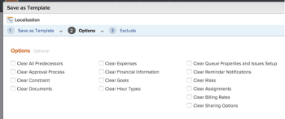

# Create template from project

You can create templates when you save an existing project as a template.

After you save an existing project as a template, you can use the new template to create new projects. This simplifies and expedites the project creation process.

## Access requirements

You must have the following access to perform the steps in this article:

<table cellspacing="0"> 
 <col> 
 <col> 
 <tbody> 
  <tr> 
   <td role="rowheader"><em>Adobe Workfront</em> plan*</td> 
   <td> 
Any 
 </td> 
  </tr> 
  <tr> 
   <td role="rowheader"><em>Adobe Workfront</em> license*</td> 
   <td> 
<em>Plan</em> 
 </td> 
  </tr> 
  <tr> 
   <td role="rowheader">Access level configurations*</td> 
   <td> 
Edit access to Templates
 
Note: If you still don't have access, ask your <em>Workfront administrator</em> if they set additional restrictions in your access level. For information on how a <em>Workfront administrator</em> can modify your access level, see <a href="../../../administration-and-setup/add-users/configure-and-grant-access/create-modify-access-levels.md" class="MCXref xref">Create or modify custom access levels</a>.
 </td> 
  </tr> 
  <tr> 
   <td role="rowheader">Object permissions</td> 
   <td> 
View or higher permissions to a project 
 
You obtain Manage permissions to the template after you create it
 
For information on requesting additional access, see <a href="../../../workfront-basics/grant-and-request-access-to-objects/request-access.md" class="MCXref xref">Request access to objects in Adobe Workfront</a>.
 </td> 
  </tr> 
 </tbody> 
</table>

&#42;To find out what plan, license type, or access you have, contact your *Workfront administrator*.

## Create template from project

<ol> 
 <li value="1">Go to the project that you want to save as a template. </li> 
 <li value="2"> <draft-comment>
   
Click the More menu , then Save as Template. 

  </draft-comment>
Click the More menu , then Save as Template. 
 </li> 
 <li value="3"> 
Specify the following information for the template:
 
  <table cellspacing="0"> 
   <col> 
   <col> 
   <tbody> 
    <tr> 
     <td role="rowheader">Name</td> 
     <td>Specify a name for the template.</td> 
    </tr> 
    <tr> 
     <td role="rowheader">Description</td> 
     <td>Provide a description for the template.</td> 
    </tr> 
    <tr> 
     <td role="rowheader">Is Active</td> 
     <td> 
Select from the following options:
 
      <ul> 
       <li> 
Yes: Other users can find the template and attach it to projects.
 </li> 
       <li>No: Other users cannot find the template and cannot attach it to projects.</li> 
      </ul> </td> 
    </tr> 
    <tr> 
     <td role="rowheader">Custom Forms</td> 
     <td>Use the drop-down list to select any custom forms to attach to the template. If any custom forms have already been associated with the project, all of the data fields from those custom forms are displayed. You can include up to 10 custom forms on a single template.</td> 
    </tr> 
   </tbody> 
  </table> </li> 
 <li value="4">Click Manage Forms to remove or reorder the forms. For information about how to remove and reorder custom forms on the template, see <a href="../../../administration-and-setup/customize-workfront/create-manage-custom-forms/create-and-manage-custom-forms.md" class="MCXref xref">Custom forms</a>.

</li> 
 <li value="5">Click Next Step.</li> 
 <li value="6"> 
In the Options section, select the checkbox beside any information you want to clear from the template. 
 
    
 </li> 
 <li value="7">Click Next Step.</li> 
 <li value="8"> 
In the Exclude section, select any tasks that you want to exclude from the project. 
 
  
 </li> 
 <li value="9"> 
Click Finish and Save Template.
 
Your template now appears in the list of available templates and can either be attached to an existing project or used to create a new one. 
 </li> 
</ol>

&nbsp;
