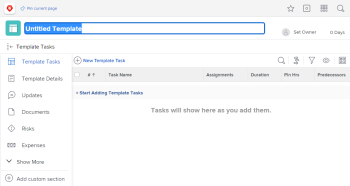

# Create a project template

The highlighted information on this page refers to functionality not yet generally available. It is available only in the Preview Sandbox environment.

You can create and delete templates from the 

<!--
<MadCap:conditionalText data-mc-conditions="QuicksilverOrClassic.Quicksilver">
Templates
</MadCap:conditionalText>
-->

`<MadCap:conditionalText data-mc-conditions="QuicksilverOrClassic.Quicksilver"> Templates </MadCap:conditionalText>`area. When building a new template, you can enter the information for all of the tasks and all information for your future project settings. This information will then transfer to the project, when you create it from the template.

You can create a new template in the following ways:

* From scratch, as described in this article.
* From existing projects, by saving a project as a template.

  For more information about creating templates from existing projects, see [Save a project as a template](../../../manage-work/projects/manage-projects/save-project-as-template.md).

* By copying it from another template.

  For more information about copying an existing template, see [Copy a project template](../../../manage-work/projects/create-and-manage-templates/copy-template.md).

  <!--
  <li data-mc-conditions="QuicksilverOrClassic.Quicksilver"> 
If you are a <em>Workfront administrator</em>, you can create templates by importing Blueprints. For information, see <a href="../../../administration-and-setup/blueprints/configure-template-package.md" class="MCXref xref">Configure a blueprint</a>. 
 </li>
  -->

* If you are a *Workfront administrator*, you can create templates by importing Blueprints. For information, see [Configure a blueprint](../../../administration-and-setup/blueprints/configure-template-package.md).

## Access requirements

You must have the following:

<table cellspacing="0"> 
 <col> 
 <col> 
 <tbody> 
  <tr> 
   <td role="rowheader"><em>Adobe Workfront</em> plan*</td> 
   <td> 
Any
 </td> 
  </tr> 
  <tr> 
   <td role="rowheader"><em>Adobe Workfront</em> license*</td> 
   <td> 
<em>Plan</em> 
 <draft-comment>
     
System administrator for importing templates from Blueprints

    </draft-comment>
System administrator for importing templates from Blueprints
 </td> 
  </tr> 
  <tr> 
   <td role="rowheader">Access level configurations*</td> 
   <td> 
Edit access to Templates
 
Note: If you still don't have access, ask your <em>Workfront administrator</em> if they set additional restrictions in your access level. For information on how a <em>Workfront administrator</em> can modify your access level, see <a href="../../../administration-and-setup/add-users/configure-and-grant-access/create-modify-access-levels.md" class="MCXref xref">Create or modify custom access levels</a>.
 </td> 
  </tr> 
  <tr> 
   <td role="rowheader">Object permissions</td> 
   <td> 
You have Manage permissions to the templates you create, by default
 
For information on requesting additional access, see <a href="../../../workfront-basics/grant-and-request-access-to-objects/request-access.md" class="MCXref xref">Request access to objects in Adobe Workfront</a>.
 </td> 
  </tr> 
 </tbody> 
</table>

&#42;To find out what plan, license type, or access you have, contact your *Workfront administrator*.

## Create a template

<ol> 
 <li value="1"> <draft-comment>
   <MadCap:conditionalText data-mc-conditions="QuicksilverOrClassic.Quicksilver">
    From the 
    Main Menu 
     click 
    Templates. 
   </MadCap:conditionalText>
  </draft-comment><MadCap:conditionalText data-mc-conditions="QuicksilverOrClassic.Quicksilver">
   From the 
   Main Menu 
    click 
   Templates. 
  </MadCap:conditionalText></li> 
 <li value="2"> 
Click New Template.
 
The template is untitled.
 <draft-comment>
   
  

  </draft-comment>
  
 <draft-comment>
   
  

  </draft-comment>
  
 </li> 
 <li value="3"> Specify a name for the new template in the template header, then press Enter.</li> 
 <li value="4"> <draft-comment>
   
Click the Template Tasks section in the left panel. 

  </draft-comment>
Click the Template Tasks section in the left panel. 
 </li> 
 <li value="5"> 
Click Start Adding Template Tasks.
 
Or
 
Click New Template Task to start adding tasks to your template.
 
Adding template tasks to a template is identical to adding tasks to a project.
 
For more information about adding tasks to a project, see <a href="../../../manage-work/tasks/create-tasks/create-tasks-in-project.md" class="MCXref xref">Create tasks in a project</a>.
 <note type="note">
   You cannot add recurring tasks to a template. 
  </note> </li> 
 <li value="6"> 
(Optional) Click the Gantt chart icon in the upper-right corner of the Task List to see a visual representation of the template's task list. 
 <note type="tip">
   You cannot edit tasks directly from this Gantt chart.
  </note> </li> 
 <li value="7"> 
To add information to your new template, click <draft-comment>
    <MadCap:conditionalText data-mc-conditions="QuicksilverOrClassic.Quicksilver">
     the 
     More menu 
     , then click 
     Edit
    </MadCap:conditionalText>
   </draft-comment><MadCap:conditionalText data-mc-conditions="QuicksilverOrClassic.Quicksilver">
    the 
    More menu 
    , then click 
    Edit
   </MadCap:conditionalText>.
 
For information about editing a template, see <a href="../../../manage-work/projects/create-and-manage-templates/edit-templates.md" class="MCXref xref">Edit project templates</a>.
 </li> 
 <li value="8">Click Save Changes.</li> 
 <li value="9">(Optional) If you want to add additional items to the template, see the section <a href="../../../manage-work/projects/create-and-manage-templates/edit-templates.md#adding-items-to-template" class="MCXref xref">Add additional items to a template</a> in the article <a href="../../../manage-work/projects/create-and-manage-templates/edit-templates.md" class="MCXref xref">Edit project templates</a>. </li> 
</ol>

## Template settings determined by group association

A project template's association with a group (or lack thereof) affects how project, task, and issue preferences determine certain settings in the template. For more information, see the section [Create and modify a group’s project templates](../../../administration-and-setup/manage-groups/work-with-group-objects/create-and-modify-a-groups-templates.md#template2) in the article [Create and modify a group’s project templates](../../../administration-and-setup/manage-groups/work-with-group-objects/create-and-modify-a-groups-templates.md).
