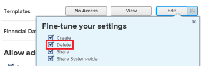
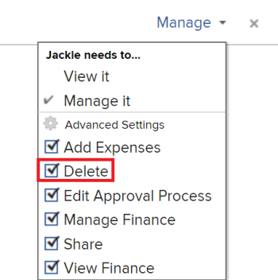

# Delete project templates {#delete-project-templates}

We recommend that you deactivate templates that you are no longer using, instead of deleting them so that you can keep historic information about your projects over time. For information about deactivating a template, see [Edit project templates](edit-templates.md).

>[!IMPORTANT] {type="important"}
>
>When you delete a template, the projects that are using that template are not modified in any way. However, you can no longer see the name of the original template in the Template field on the project. Additionally, you can no longer view the names of the template tasks for the tasks on the project in a task view. The Template field on the project and the Template Task field on the tasks remain blank after the template originally associated with the project is deleted.

##  

## Access requirements {#access-requirements}

You must have the following access to perform the steps in this article:

<table style="width: 100%;margin-left: 0;margin-right: auto;mc-table-style: url('../../../Resources/TableStyles/TableStyle-List-options-in-steps.css');" class="TableStyle-TableStyle-List-options-in-steps" cellspacing="0"> 
 <col class="TableStyle-TableStyle-List-options-in-steps-Column-Column1"> 
 <col class="TableStyle-TableStyle-List-options-in-steps-Column-Column2"> 
 <tbody> 
  <tr class="TableStyle-TableStyle-List-options-in-steps-Body-LightGray"> 
   <td class="TableStyle-TableStyle-List-options-in-steps-BodyE-Column1-LightGray" role="rowheader">Adobe Workfront plan*</td> 
   <td class="TableStyle-TableStyle-List-options-in-steps-BodyD-Column2-LightGray"> 
Any
 </td> 
  </tr> 
  <tr class="TableStyle-TableStyle-List-options-in-steps-Body-MediumGray"> 
   <td class="TableStyle-TableStyle-List-options-in-steps-BodyE-Column1-MediumGray" role="rowheader">Adobe Workfront license*</td> 
   <td class="TableStyle-TableStyle-List-options-in-steps-BodyD-Column2-MediumGray"> 
Plan 
 </td> 
  </tr> 
  <tr class="TableStyle-TableStyle-List-options-in-steps-Body-LightGray"> 
   <td class="TableStyle-TableStyle-List-options-in-steps-BodyE-Column1-LightGray" role="rowheader">Access level configurations*</td> 
   <td class="TableStyle-TableStyle-List-options-in-steps-BodyD-Column2-LightGray"> 
Edit access to&nbsp;Templates that includes access to Delete
 
  
 
Note: If you still don't have access, ask your Workfront administrator if they set additional restrictions in your access level. For information on how a Workfront administrator can modify your access level, see <a href="create-modify-access-levels.md" class="MCXref xref">Create or modify custom access levels</a>.
 </td> 
  </tr> 
  <tr class="TableStyle-TableStyle-List-options-in-steps-Body-MediumGray"> 
   <td class="TableStyle-TableStyle-List-options-in-steps-BodyB-Column1-MediumGray" role="rowheader">Object permissions</td> 
   <td class="TableStyle-TableStyle-List-options-in-steps-BodyA-Column2-MediumGray"> 
Manage permissions to the template that includes permissions to Delete it
 
  
 
For information on requesting additional access, see <a href="request-access.md" class="MCXref xref">Request access to objects in Adobe Workfront</a>.
 </td> 
  </tr> 
 </tbody> 
</table>

&#42;To find out what plan, license type, or access you have, contact your *`Workfront administrator`*.

## Considerations for deleting templates {#considerations-for-deleting-templates}

* The tasks which were added to projects when the template was attached remain on the projects. However, the template task information associated with the tasks is deleted. 
* The name of the template is no longer listed in the `Template` field on the `Overview` sub-tab of the project. 

* You can recover a recently deleted template from the Recycle Bin. For information about recovering items from the Recycle Bin, see [Restore deleted items](restore-deleted-items.md).

## Delete a template {#delete-a-template}

1.  `<MadCap:conditionalText data-mc-conditions="QuicksilverOrClassic.Quicksilver"> From the  Main Menu  click  Templates. This opens a list of templates</MadCap:conditionalText>`
1.  Select the template that you want to delete by clicking the checkbox to the left of the template name, then click `Delete > Yes, Delete It` to confirm the deletion.

   Or

   `<MadCap:conditionalText data-mc-conditions="QuicksilverOrClassic.Quicksilver"> Click the name of a template to access it, then click the  More menu   , then  Delete Template > Yes, Delete it. </MadCap:conditionalText>`

   The template is no longer available to be associated with a project. 

