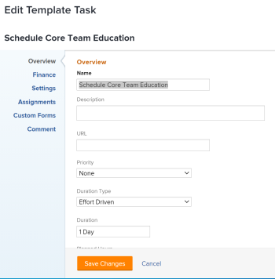
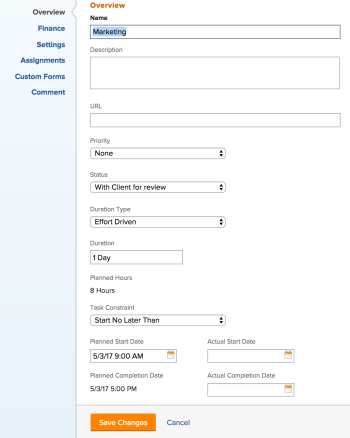
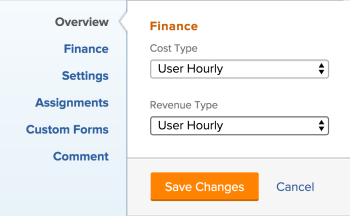
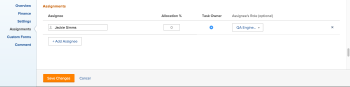
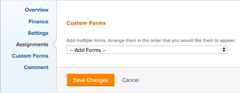

# Edit a template task

After creating a template, you can edit information on the template tasks. The information you update on a template task is associated with project tasks after you use the template to create a project or you attach the template to a project.

For information about creating a template, see [Create a project template](../../../manage-work/projects/create-and-manage-templates/create-template.md).

## Access requirements

You must have the following access to perform the steps in this article:

<table cellspacing="0"> 
 <col> 
 <col> 
 <tbody> 
  <tr> 
   <td role="rowheader"><em>Adobe Workfront</em> plan*</td> 
   <td> 
Any
 </td> 
  </tr> 
  <tr> 
   <td role="rowheader"><em>Adobe Workfront</em>license*</td> 
   <td> 
<em>Plan</em> 
 </td> 
  </tr> 
  <tr> 
   <td role="rowheader">Access level*</td> 
   <td> 
Edit access to Templates
 
Note: If you have the correct access but still can't edit a template task, ask your <em>Workfront administrator</em> if they set additional restrictions in your access level. For information on how a <em>Workfront administrator</em> can change your access level, see <a href="../../../administration-and-setup/add-users/configure-and-grant-access/create-modify-access-levels.md" class="MCXref xref">Create or modify custom access levels</a>.
 </td> 
  </tr> 
  <tr> 
   <td role="rowheader">Object permissions </td> 
   <td> 
Manage permissions for a template. 
 
Contribute or higher permissions for the template task.
 
For information about requesting access to objects, see <a href="../../../workfront-basics/grant-and-request-access-to-objects/request-access.md" class="MCXref xref">Request access to objects in Adobe Workfront</a>.
 </td> 
  </tr> 
 </tbody> 
</table>

&#42;To find out what plan, license type, or access level you have, contact your *Workfront administrator*.

## Prerequisites

Before you begin, you must

* Create a template.

  For information about creating a template, see [Create a project template](../../../manage-work/projects/create-and-manage-templates/create-template.md).

## Edit template task

You can edit a template task using the Edit Template Task or Template Task Details areas. The following steps describe editing a task in the Edit Template Task box.

<ol> 
 <li value="1">Click the Main Menu icon  in the upper-right corner of <em>Adobe Workfront</em>.</li> 
 <li value="2"> <draft-comment>
   <MadCap:conditionalText data-mc-conditions="QuicksilverOrClassic.Quicksilver">
    Click 
    Templates. 
   </MadCap:conditionalText>
  </draft-comment><MadCap:conditionalText data-mc-conditions="QuicksilverOrClassic.Quicksilver">
   Click 
   Templates. 
  </MadCap:conditionalText> </li> 
 <li value="3">Click the name of a template to open it.</li> 
 <li value="4"> <draft-comment>
   <MadCap:conditionalText data-mc-conditions="QuicksilverOrClassic.Quicksilver">
    Click 
    Template Tasks in the left panel.
   </MadCap:conditionalText>
  </draft-comment><MadCap:conditionalText data-mc-conditions="QuicksilverOrClassic.Quicksilver">
   Click 
   Template Tasks in the left panel.
  </MadCap:conditionalText> </li> 
 <li value="5"> 
Click the name of a template task in the list to open the template task.
 </li> 
 <li value="6"> 
(Conditional) To edit limited information about the template task, <draft-comment>
    <MadCap:conditionalText data-mc-conditions="QuicksilverOrClassic.Quicksilver">
     click 
     Template Task Details in the left panel, then go to the areas of the Details section to edit information for each area.
    </MadCap:conditionalText>
   </draft-comment><MadCap:conditionalText data-mc-conditions="QuicksilverOrClassic.Quicksilver">
    click 
    Template Task Details in the left panel, then go to the areas of the Details section to edit information for each area.
   </MadCap:conditionalText>
 </li> <draft-comment>
  <li value="7" data-mc-conditions="QuicksilverOrClassic.Quicksilver"> 
(Optional)&nbsp;Click the Collapse all icon  to collapse all areas. 
 </li>
 </draft-comment>
 <li value="7" data-mc-conditions="QuicksilverOrClassic.Quicksilver"> 
(Optional)&nbsp;Click the Collapse all icon  to collapse all areas. 
 </li> 
 <li value="8"> 
 
 <draft-comment>
   
To edit information in the Details section, click the Edit icon , then select from any of the areas below, or click&nbsp;Edit all to edit information in all areas: 

  </draft-comment>
To edit information in the Details section, click the Edit icon , then select from any of the areas below, or click&nbsp;Edit all to edit information in all areas: 
 
  <ul> 
   <li> 
Overview
 </li> 
   <li> 
Custom&nbsp;Forms
 
Names of customs forms display only if there are custom forms attached to the object.
 </li> 
   <li> 
Finance
 </li> 
  </ul> <note type="tip">
   For information about all fields that display in the Details area, continue with editing all fields using the Edit Template Task box below. 
  </note> </li> 
 <li value="9"> <draft-comment>
   
(Conditional) To edit all information about the template task, click the More menu  next to the name of the template task, then click Edit.

  </draft-comment>
(Conditional) To edit all information about the template task, click the More menu  next to the name of the template task, then click Edit.
 
The Edit Template Task box displays.
 <note type="tip">
   You can also select a template task in a list, then click Edit to open the Edit Template Task box. 
  </note> 
  
 </li> 
 <li value="10">Consider specifying information in any of the following sections: 
  <ul>
   <li><a href="#overview" class="MCXref xref">Overview</a></li>
   <li><a href="#finance" class="MCXref xref">Finance</a></li>
   <li><a href="#settings" class="MCXref xref">Settings</a></li>
   <li><a href="#assignments" class="MCXref xref">Assignments</a></li>
   <li><a href="#custom-forms" class="MCXref xref">Custom Forms</a></li>
   <li><a href="#comment" class="MCXref xref">Comment</a></li>
  </ul></li> 
</ol>

### Overview

<ol> 
 <li value="1">Begin editing a template task as described above.</li> 
 <li value="2"> 
Click Overview.
 
    
 </li> 
 <li value="3"> 
 Update any of the following:
 
  <table cellspacing="0"> 
   <col> 
   <col> 
   <tbody> 
    <tr> 
     <td role="rowheader">Name </td> 
     <td>Specify a name for the template task.</td> 
    </tr> 
    <tr> 
     <td role="rowheader">Description </td> 
     <td>Add additional information about the template task.</td> 
    </tr> 
    <tr> 
     <td role="rowheader">URL </td> 
     <td>Specify a web link that relates to the information about the template task.</td> 
    </tr> 
    <tr> 
     <td role="rowheader">Priority </td> 
     <td> 
This is a visual flag for you which allows you to prioritize your template tasks. 
 
Select from the following options:
 
      <ul> 
       <li> 
None 
 </li> 
       <li> 
Low 
 </li> 
       <li> 
Normal 
 </li> 
       <li> 
High 
 </li> 
       <li> 
Urgent 
 </li> 
      </ul> 
Depending on the Project Preferences selected by your <em>Workfront administrator</em>, the names of priorities might be different for you. For more information about editing priorities, see <a href="../../../administration-and-setup/customize-workfront/creating-custom-status-and-priority-labels/create-customize-priorities-.md" class="MCXref xref">Create and customize priorities</a>.
 </td> 
    </tr> 
    <tr> 
     <td role="rowheader">Duration Type </td> 
     <td> 
The future task created from this template will have this Duration Type.  Duration Type identifies the relationship between the following:
 
- number of resources assigned to a task
 
- the total effort required to complete the task
 
- the total duration of the task. 
 
Duration Types enable you to set consistent resource assignments based on the needs of the task. For more information about the Duration Type of a task, see <a href="../../../manage-work/tasks/taskdurtn/task-duration-and-duration-type.md" class="MCXref xref">Overview of Task Duration and Duration Type</a>.
 
Select from the following options:
 
      <ul> 
       <li> 
Calculated Assignment 
 </li> 
       <li> 
Calculated Work 
 </li> 
       <li> 
Effort Driven 
 </li> 
       <li> 
Simple   
 </li> 
      </ul> </td> 
    </tr> 
    <tr> 
     <td role="rowheader">Duration </td> 
     <td> 
Specify the Duration of the future tasks, in minutes, hours, days, weeks, or months. The future task created from this template will have the Duration specified here.
 
By default, <em>Workfront</em> measures Duration in days. This is the amount of time that you allow for the task to remain incomplete, before it must be completed. You cannot specify the Duration of a task when the Duration Type of the task is Simple, or when the Task Constraint is Fixed Dates.
 <note type="important">
       Duration is typically the amount of time between the Planned Start and the Planned Completion Dates of a template task, and for this reason, it affects the timeline of the template. This determines the timeline of the future project created from the template. 
      </note> </td> 
    </tr> 
    <tr> 
     <td role="rowheader">Planned Hours </td> 
     <td> 
Specify the amount of Planned Hours for the future task on the project created with this template. This is the amount of actual time it would take the assignees of the task to complete it. You can only specify the amount of Planned Hours for a task when the Duration Type is set to Calculated Assignment. 
 </td> 
    </tr> <draft-comment>
     <tr data-mc-conditions=""> 
      <td role="rowheader"><em>Work Effort</em> </td> 
      <td> 
The amount of effort required to complete a task. Your project manager might decide to use this field instead of Planned Hours to estimate the effort needed to complete a task. This field is visible only when the following conditions are met: 
 
       <ul> 
        <li> 
The template task has a Simple Duration&nbsp;Type. 
 <note type="tip">
          If you update the task Duration&nbsp;Type, this field becomes hidden. 
         </note> </li> 
        <li>Your project manager has enabled the Use <em>Work Effort</em> to calculate Planned Hours field on the template. </li> 
       </ul> 
       
 
        
 Select from the following options:
 
        <ul> 
         <li>Small</li> 
         <li>Medium (this is the default value for a new task)</li> 
         <li>Large</li> 
        </ul> 
       
 
For information about using <em>Work Effort</em> instead of Planned Hours to estimate task effort, see <a href="../../../manage-work/tasks/task-information/work-effort.md" class="MCXref xref">Work Effort overview</a>.
 </td> 
     </tr>
    </draft-comment>
    <tr data-mc-conditions=""> 
     <td role="rowheader"><em>Work Effort</em> </td> 
     <td> 
The amount of effort required to complete a task. Your project manager might decide to use this field instead of Planned Hours to estimate the effort needed to complete a task. This field is visible only when the following conditions are met: 
 
      <ul> 
       <li> 
The template task has a Simple Duration&nbsp;Type. 
 <note type="tip">
         If you update the task Duration&nbsp;Type, this field becomes hidden. 
        </note> </li> 
       <li>Your project manager has enabled the Use <em>Work Effort</em> to calculate Planned Hours field on the template. </li> 
      </ul> 
      
 
       
 Select from the following options:
 
       <ul> 
        <li>Small</li> 
        <li>Medium (this is the default value for a new task)</li> 
        <li>Large</li> 
       </ul> 
      
 
For information about using <em>Work Effort</em> instead of Planned Hours to estimate task effort, see <a href="../../../manage-work/tasks/task-information/work-effort.md" class="MCXref xref">Work Effort overview</a>.
 </td> 
    </tr> 
    <tr> 
     <td role="rowheader">Task Constraint </td> 
     <td> 
The task on the project created from this template will have this constraint. Task Constraints identify when a task must be completed. 
 
Select from the following options:
 
      <ul> 
       <li>Fixed Dates. Specify a Planned Start and a Planned Completion Date.</li> 
       <li>Must Start On. Specify a Planned Start Date.</li> 
       <li>Must Finish On. Specify a Planned Completion Date.</li> 
       <li>As Soon as Possible </li> 
       <li>As Late as Possible </li> 
       <li style="font-weight: bold;">Earliest Available Time </li> 
       <li style="font-weight: bold;">Latest Available Time </li> 
       <li>Start No Later Than. Specify a Planned Start Date.</li> 
       <li>Start No Earlier Than. Specify a Planned Start Date.</li> 
       <li>Finish No Later Than. Specify a Planned Completion Date.</li> 
       <li>Finish No Earlier Than. Specify a Planned Completion Date.</li> 
      </ul> 
For more information on Task Constraint, see <a href="../../../manage-work/tasks/task-constraints/task-constraint-overview.md" class="MCXref xref">Task Constraint overview</a>.
 </td> 
    </tr> 
    <tr> 
     <td role="rowheader">Start&nbsp;Day(Optional and conditional) </td> 
     <td> 
 You can specify the Start Day of a template task only when the Task&nbsp;Constraint is one of the following:
 
      <ul> 
       <li>Must Start On</li> 
       <li>Start No&nbsp;Earlier Than</li> 
       <li>Start No Later Than</li> 
       <li>Fixed Dates</li> 
      </ul> 
This will correspond to the date within the timeline of the future project when the task will start. For all other constraints,&nbsp;<em>Workfront</em> calculates the Start Day based on predecessor dependency between the tasks. 
 </td> 
    </tr> 
    <tr> 
     <td role="rowheader">Completion&nbsp;Day (Optional and conditional) </td> 
     <td> 
 You can specify the Completion Day of a template task only when the Task&nbsp;Constraint is one of the following:
 
      <ul style="list-style-type: circle;"> 
       <li>Must Finish On</li> 
       <li>Finish No&nbsp;Earlier Than</li> 
       <li>Finish No Later Than</li> 
       <li>Fixed Dates</li> 
      </ul> 
This will correspond to the date within the timeline of the future project when the task will complete. For all other constraints,&nbsp;<em>Workfront</em> calculates the Completion Day based on Duration and predecessor dependency. 
 </td> 
    </tr> 
   </tbody> 
  </table> </li> 
 <li value="4"> 
(Optional) Continue editing the following sections, depending on the information you want to modify.
 
Or
 
Click Save Changes.
 </li> 
</ol>

### Finance

<ol> 
 <li value="1">Begin editing a task as described above.</li> 
 <li value="2"> 
Click Finance.
 
    
 </li> 
 <li value="3"> 
Update any of the following:
 
  <table cellspacing="0"> 
   <col> 
   <col> 
   <tbody> 
    <tr> 
     <td role="rowheader">Cost Type </td> 
     <td> 
Specify the Cost Type for the future task. This is going to determine how the Cost on the task is calculated, based on the number of hours on the tasks. 
 
Select from the following options:
 
      <ul> 
       <li> 
No Cost 
 </li> 
       <li> 
Fixed Hourly 
 </li> 
       <li> 
User Hourly 
 </li> 
       <li> 
Role Hourly 
 </li> 
      </ul> 
For more information about tracking costs, see <a href="../../../manage-work/projects/project-finances/track-costs.md" class="MCXref xref">Track costs</a>.
 </td> 
    </tr> 
    <tr> 
     <td role="rowheader">Revenue Type </td> 
     <td> 
Specify the Revenue Type for the future task. This is going to determine how the Revenue on the task is calculated, based on the number of hours on the tasks.
 
Select from the following options: 
 
      <ul> 
       <li> 
Not Billable
 </li> 
       <li> 
User Hourly
 </li> 
       <li> 
Role Hourly
 </li> 
       <li> 
Fixed Hourly
 </li> 
       <li> 
User Hourly w/Cap
 </li> 
       <li> 
Role Hourly w/Cap
 </li> 
       <li> 
User Hourly Plus Fixed
 </li> 
       <li> 
Role Hourly Plus Fixed
 </li> 
       <li> 
Fixed Revenue
 </li> 
      </ul> 
For more information about tracking revenue, see <a href="../../../manage-work/projects/project-finances/billing-and-revenue-overview.md" class="MCXref xref">Overview of Billing and Revenue</a>.
 </td> 
    </tr> 
   </tbody> 
  </table> </li> 
 <li value="4"> 
(Optional) Continue editing the following sections, depending on the information you want to modify.
 
Or
 
Click Save Changes.
 </li> 
</ol>

### Settings

<ol> 
 <li value="1">Begin editing a task as described above.</li> 
 <li value="2"> 
Click Settings.
 
  
 </li> 
 <li value="3"> 
Update any of the following:
 
  <table cellspacing="0"> 
   <col> 
   <col> 
   <tbody> 
    <tr> 
     <td role="rowheader">Tracking Mode </td> 
     <td> 
Specify how the progress status of the future task will be tracked. 
 
Select from the following options:
 
      <ul> 
       <li> 
User Must Update 
 </li> 
       <li> 
Assume on Time 
 </li> 
       <li> 
Ignore Late Warnings 
 </li> 
       <li> 
Autocomplete 
 </li> 
       <li> 
Predecessor 
 </li> 
      </ul> 
For more information about the Tracking Mode on tasks, see <a href="../../../manage-work/tasks/task-information/task-tracking-mode.md" class="MCXref xref">Task Tracking Mode overview</a>.
 </td> 
    </tr> 
    <tr> 
     <td role="rowheader">Approval Process </td> 
     <td> 
Select the approval process you want to associate with the template task. Your <em>Workfront administrator</em> must define system-level task Approval Processes before you can associate them with template tasks. A user with administrative access to Approval processes can also create group-specific approval processes. For more information about creating approval processes, see <a href="../../../administration-and-setup/customize-workfront/configure-approval-milestone-processes/create-approval-processes.md" class="MCXref xref">Create an approval process for work items</a>.
 
Consider the following when adding approval processes: 
 
      <ul> 
       <li>Only active approval processes display in the list. </li> 
       <li> 
System-wide and group-specific approval processes display in the list. Approval processes associated with a group other than that of the template do not display in the list.
 <note type="important">
         If the group associated with the template changes, the group-specific approval process becomes a single-use approval process. For more information about how changes to the group of the project or changes in the approval process affect approval settings, see 
         <a href="../../../administration-and-setup/customize-workfront/configure-approval-milestone-processes/how-changes-affect-group-approvals.md" class="MCXref xref">How group and approval process changes affect assigned approval processes</a>. 
        </note> </li> 
       <li> 
If you added a single-use approval process, it displays as "<Custom>" in this field. For information, see <a href="../../../review-and-approve-work/manage-approvals/associate-approval-with-work.md" class="MCXref xref">Associate a new or existing approval process with work</a>. 
 </li> 
       <li> 
When bulk-editing template tasks, the following scenarios exist:
 
        <ul> 
         <li> 
When you select template tasks from the same template group, both system-level and group-level approval processes display in this field.
 </li> 
         <li> 
When you select template tasks from different template groups, only system-level approval processes display in this field.
 </li> 
         <li> 
When any of the template tasks has a single-use approval process attached, it is replaced by the system-level or group-level approval process you select. 
 </li> 
        </ul> </li> 
      </ul> </td> 
    </tr> 
    <tr> 
     <td role="rowheader">Reminder Notifications </td> 
     <td> 
Select which Reminder Notifications you would like to attach to the template task. They will be attached to the future tasks on the project created from this template. Your system administrator must configure Reminder Notifications before you can select them on a task. For more information about configuring Reminder Notifications, see <a href="../../../administration-and-setup/manage-workfront/emails/set-up-reminder-notifications.md" class="MCXref xref">Set up reminder notifications</a>.
 </td> 
    </tr> 
   </tbody> 
  </table> </li> 
 <li value="4"> 
(Optional) Continue editing the following sections, depending on the information you want to modify.
 
Or
 
Click Save Changes.
 </li> 
</ol>

### Assignments

<ol> 
 <li value="1">Begin editing a task as described above.</li> 
 <li value="2"> 
Click Assignments.
 
    
 </li> 
 <li value="3">Click Add Assignee to add a new assignee to the template task. You can assign users, roles, or teams to a task. You can have multiple assignees on a task. The future tasks will have the same resources assigned to it when created from this template task. </li> 
 <li value="4">(Optional) If you have multiple assignees, select the Owner radio button to indicate which user or role is considered the Task Owner or the Primary Assignee. <em>Workfront</em> marks the first user or job role that you assign to a template task as the Owner or Primary Assignee. </li> 
 <li value="5">(Conditional and optional) If your Task Constraint is Calculated Work or Effort Driven, specify the Allocation % (allocation percentage) for each assignee. This is the amount of time from the schedule of the assignee that they can spend on this task. Changing the allocation percentage for an assignee will change the Planned Hours of a task. </li> 
 <li value="6"> 
(Conditional and optional) If your Task Constraint is Simple, specify the Hours of each assignee
 
Or
 
Specify the total number of Planned Hours for the template task. This distributes the total hours equally between all the assignees. 
 </li> 
 <li value="7">(Conditional and optional) If your Task Constraint is Simple, specify the Duration of the template task in days. This will become the duration of the task created from this template. </li> 
 <li value="8"> 
(Optional) Select a role from the Assignee's Role drop-down menu. This is the role that the assignee can fulfill on this future task. Only the job roles associated with each assignee in their profile appear in the drop-down menu.
 </li> 
 <li value="9"> 
(Optional) Continue editing the following sections, depending on the information you want to modify.
 
Or
 
Click Save Changes.
 </li> 
</ol>

### Custom Forms

You can define default custom forms to be automatically attached to tasks when the tasks are added to a project. For information about setting up the project to include default task custom forms , see the "Tasks" section in the article [Edit projects](../../../manage-work/projects/manage-projects/edit-projects.md).

<ol> 
 <li value="1">Begin editing a task as described above. test</li> 
 <li value="2"> 
Click Custom Forms.
 
    
 </li> 
 <li value="3">Select the custom form or forms that you want to associate with the template task. You must build the custom forms before they are available to select in this field. Only active custom forms display in the list. For more information about building custom forms, see <a href="../../../administration-and-setup/customize-workfront/create-manage-custom-forms/create-or-edit-a-custom-form.md" class="MCXref xref">Create or edit a custom form</a>.You can add up to ten custom forms to a template task. The forms are automatically added to the tasks created from the template. </li> 
 <li value="4">(Conditional and optional) If you attached a custom form to the template task, edit any fields on the form. You must specify all required fields before you can save the template task. <note type="note">
    Depending on how your 
   <em>Workfront administrator</em> set the permissions for the sections in your custom form, not everyone can view or edit the same fields on a given custom form. The permissions to edit fields within a section of a custom form depend on the permissions you have on the template task or the future task. 
    For information about setting permissions on sections of a custom form, see 
   <a href="../../../administration-and-setup/customize-workfront/create-manage-custom-forms/share-access-to-a-custom-form.md" class="MCXref xref">Share a custom form</a>. 
    For information about setting task permissions, see 
   <a href="../../../workfront-basics/grant-and-request-access-to-objects/share-a-task.md" class="MCXref xref">Share a task in&nbsp;Adobe Workfront</a>. 
    For information about setting template permissions, see 
   <a href="../../../workfront-basics/grant-and-request-access-to-objects/share-a-template.md" class="MCXref xref">Sharing a template</a>.
  </note></li> 
 <li value="5"> 
(Optional) Continue editing the following section, depending on the information you want to modify.
 
Or
 
Click Save Changes.
 </li> 
</ol>

### Comment

<ol> 
 <li value="1">Begin editing a task as described above.</li> 
 <li value="2"> 
Click Comment.
 
    
 </li> 
 <li value="3">Specify a comment that you want to display in the updates stream of the template task in the available field. This comment is visible for everyone with View access to the template and the template task and with access to view Notes.</li> 
 <li value="4"> 
Click Save Changes.
 
Your changes will be submitted for this template task. 
 
When you or another user creates a project from this template, all settings you applied to template tasks become the settings for the project tasks.
 </li> 
</ol>

