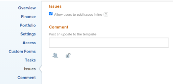

# Edit project templates {#edit-project-templates}

You can edit project templates to reflect changes in project processes and settings. After you update and save the changes on a template, the new changes are visible in new projects when the projects are created using the template. The changes you make on the template do not reflect on the project currently using that template. 

## Access requirements {#access-requirements}

You must have the following access to perform the steps in this article:

<table style="mc-table-style: url('../../../Resources/TableStyles/TableStyle-List-options-in-steps.css');margin-left: 0;margin-right: auto;" class="TableStyle-TableStyle-List-options-in-steps" cellspacing="0"> 
 <col class="TableStyle-TableStyle-List-options-in-steps-Column-Column1"> 
 <col class="TableStyle-TableStyle-List-options-in-steps-Column-Column2"> 
 <tbody> 
  <tr class="TableStyle-TableStyle-List-options-in-steps-Body-LightGray"> 
   <td class="TableStyle-TableStyle-List-options-in-steps-BodyE-Column1-LightGray" role="rowheader">Adobe Workfront plan*</td> 
   <td class="TableStyle-TableStyle-List-options-in-steps-BodyD-Column2-LightGray"> 
Any 
 </td> 
  </tr> 
  <tr class="TableStyle-TableStyle-List-options-in-steps-Body-MediumGray"> 
   <td class="TableStyle-TableStyle-List-options-in-steps-BodyE-Column1-MediumGray" role="rowheader">Adobe Workfront licenses*</td> 
   <td class="TableStyle-TableStyle-List-options-in-steps-BodyD-Column2-MediumGray"> 
Plan 
 </td> 
  </tr> 
  <tr class="TableStyle-TableStyle-List-options-in-steps-Body-LightGray"> 
   <td class="TableStyle-TableStyle-List-options-in-steps-BodyE-Column1-LightGray" role="rowheader">Access level*</td> 
   <td class="TableStyle-TableStyle-List-options-in-steps-BodyD-Column2-LightGray"> 
Edit access to Templates
 
Note: If you still don't have access, ask your Workfront administrator if they set additional restrictions in your access level. For information about access to templates, see <a href="grant-access-templates.md" class="MCXref xref">Grant access to templates</a>. For information on how a Workfront administrator can change your access level, see <a href="create-modify-access-levels.md" class="MCXref xref">Create or modify custom access levels</a>. 
 </td> 
  </tr> 
  <tr class="TableStyle-TableStyle-List-options-in-steps-Body-MediumGray"> 
   <td class="TableStyle-TableStyle-List-options-in-steps-BodyB-Column1-MediumGray" role="rowheader">Object permissions</td> 
   <td class="TableStyle-TableStyle-List-options-in-steps-BodyA-Column2-MediumGray"> 
    <ul> 
     <li> 
Contribute permissions to a template to edit it in the Template Details tab
 </li> 
     <li> 
Manage permissions to a template to edit it in the Edit Template box
 </li> 
    </ul> 
 For information about template permissions, see <a href="share-a-template.md" class="MCXref xref">Share a template overview</a>. 
 
For information on requesting additional access, see <a href="request-access.md" class="MCXref xref">Request access to objects in Adobe Workfront</a>.
 </td> 
  </tr> 
 </tbody> 
</table>

&#42;To find out what plan, license type, or access you have, contact your *`Workfront administrator`*.

## Edit a template {#edit-a-template}

1.  Go to the template you want to edit.
1.  (Conditional) To edit limited information about the template, `<MadCap:conditionalText data-mc-conditions="QuicksilverOrClassic.Quicksilver"> click  Template Details in the left panel, then go to the areas listed in the left panel to edit information for each area. </MadCap:conditionalText>`
1.  To edit information in the Details section, click the `Edit` icon , `then select from any of the areas below, or click  `Edit all` to edit information in all areas`: 

    
    
    *  Overview
    *  Custom Forms 
    
    
      Names of customs forms display only if there are custom forms attached to the object.
    
    *  Finance
    
    

   >[!TIP] {type="tip"}
   >
   >For information about all fields that display in the Details area, continue with editing all fields using the Edit Template box below. 

1.  (Conditional) To edit all information about the template, click the `More` menu  next to the name of the template, then click `Edit`.

   The `Edit Template` box opens. The sections in this box contain the same fields available in `<MadCap:conditionalText data-mc-conditions="QuicksilverOrClassic.Quicksilver"> the Template Details section</MadCap:conditionalText>`.

1.  Consider editing information in any of the following sections:

    
    
    * [Overview](#overview) 
    * [Finance](#finance) 
    * [Portfolio](#portfolio) 
    * [Settings](#settings) 
    * [Access](#access) 
    * [Custom Forms](#custom-forms) 
    * [Tasks](#tasks) 
    * [Issues](#issues) 
    * [Comment](#comment) 
    
    

### Overview {#overview}

1. Begin editing your template as described above.
1.  In the `Edit Template` box, click `Overview`.

   

1. Update the following fields: 

<table style="width: 100%;mc-table-style: url('../../../Resources/TableStyles/TableStyle-List-options-in-steps.css');" class="TableStyle-TableStyle-List-options-in-steps" cellspacing="0">
 <col class="TableStyle-TableStyle-List-options-in-steps-Column-Column1">
 <col class="TableStyle-TableStyle-List-options-in-steps-Column-Column2">
 <tbody>
  <tr class="TableStyle-TableStyle-List-options-in-steps-Body-LightGray">
   <td class="TableStyle-TableStyle-List-options-in-steps-BodyE-Column1-LightGray" role="rowheader">Name</td>
   <td class="TableStyle-TableStyle-List-options-in-steps-BodyD-Column2-LightGray">Specify a name for the template.</td>
  </tr>
  <tr class="TableStyle-TableStyle-List-options-in-steps-Body-MediumGray">
   <td class="TableStyle-TableStyle-List-options-in-steps-BodyE-Column1-MediumGray" role="rowheader">Description</td>
   <td class="TableStyle-TableStyle-List-options-in-steps-BodyD-Column2-MediumGray">Add additional information about the template.</td>
  </tr>
  <tr class="TableStyle-TableStyle-List-options-in-steps-Body-LightGray">
   <td class="TableStyle-TableStyle-List-options-in-steps-BodyE-Column1-LightGray" role="rowheader">Is Active</td>
   <td class="TableStyle-TableStyle-List-options-in-steps-BodyD-Column2-LightGray">
Select this checkbox if you want the template to be active. Other users can find this template and attach it to projects when creating projects. Deselect this checkbox if you want to deactivate templates that are no longer used. Deactivated templates cannot be attached to projects. This is enabled by default. 

Tip: You can deactivate a template from the template header by clicking the More menu , then Deactivate Template.
</td>
  </tr>
  <tr class="TableStyle-TableStyle-List-options-in-steps-Body-MediumGray">
   <td class="TableStyle-TableStyle-List-options-in-steps-BodyE-Column1-MediumGray" role="rowheader">URL</td>
   <td class="TableStyle-TableStyle-List-options-in-steps-BodyD-Column2-MediumGray">Specify a web link that relates to information about this template.</td>
  </tr>
  <tr class="TableStyle-TableStyle-List-options-in-steps-Body-LightGray">
   <td class="TableStyle-TableStyle-List-options-in-steps-BodyE-Column1-LightGray" role="rowheader">Schedule From</td>
   <td class="TableStyle-TableStyle-List-options-in-steps-BodyD-Column2-LightGray">
Specify whether the project using this template is scheduled from the Start Date, or from the Completion Date. This selection determines the planned dates of the future tasks on the project using this template. 

Select from the following: 

    <ul>
     <li>
Schedule From Start Date: The Start Date of the template is actually the Start Day. When you schedule a template from Start Date, Adobe Workfront calculates the Completion Day of the template based on the Duration of all the template tasks. The Start Day of the template becomes the Planned Start Date of the future project.
</li>
     <li>
Schedule from Completion Date: The Completion Date of the template is actually the Completion Day. When you schedule a template from Completion Date, Workfront calculates the Start Day of the template based on the Duration of all the template tasks. The Completion Day of the template becomes the Planned Completion Date of the future project. 
</li>
    </ul>
For more information about the Start and Completion Days of template tasks, see <a href="overview-of-start-completion-day-on-template.md" class="MCXref xref">Overview of Start and Completion Days in a template</a>. 

The Schedule From setting for templates is similar to that of projects. Your Workfront administrator selects the default Schedule From setting for the projects in your system. For information about setting project defaults, see <a href="set-project-preferences.md" class="MCXref xref">Configure system-wide project preferences</a>.
</td>
  </tr>
  <tr class="TableStyle-TableStyle-List-options-in-steps-Body-MediumGray">
   <td class="TableStyle-TableStyle-List-options-in-steps-BodyE-Column1-MediumGray" role="rowheader">Condition Type</td>
   <td class="TableStyle-TableStyle-List-options-in-steps-BodyD-Column2-MediumGray">
Select between the following Condition Types:

    <ul>
     <li>Manual: The project owner sets the Condition of the project on the project manually.  </li>
     <li>Progress Status: Workfront automatically sets the Condition of the future project based on the Progress Status of tasks on the Critical Path. For more information about understanding Progress Status, see <a href="task-progress-status.md" class="MCXref xref">Task Progress Status overview</a>.</li>
    </ul></td>
  </tr>
  <tr class="TableStyle-TableStyle-List-options-in-steps-Body-LightGray">
   <td class="TableStyle-TableStyle-List-options-in-steps-BodyE-Column1-LightGray" role="rowheader">Priority</td>
   <td class="TableStyle-TableStyle-List-options-in-steps-BodyD-Column2-LightGray">
This is just a visual flag for you which allows you to prioritize your future projects. Select from the following options:

    <ul>
     <li>
None
</li>
     <li>
Low
</li>
     <li>
Normal
</li>
     <li>
High
</li>
     <li>
Urgent
</li>
    </ul>

Depending on the Project Preferences selected by your Workfront administrator, the names of priorities might be different for you. For more information about editing priorities, see <a href="create-customize-priorities .md" class="MCXref xref">Create and customize priorities</a>.

</td>
  </tr>
  <tr class="TableStyle-TableStyle-List-options-in-steps-Body-MediumGray">
   <td class="TableStyle-TableStyle-List-options-in-steps-BodyE-Column1-MediumGray" role="rowheader">Template Owner</td>
   <td class="TableStyle-TableStyle-List-options-in-steps-BodyD-Column2-MediumGray">
The user who is designated as the Template Owner must be a Workfront active user. 

Consider the following about the user designated as the Template Owner: 

    <ul>
     <li>They are automatically given Manage permissions to the template. </li>
     <li>They are added to the project team and are automatically given Manage permissions to the project created from the template. </li>
     <li>They become the Project Owner, when the project is created from this template. </li>
    </ul></td>
  </tr>
  <tr class="TableStyle-TableStyle-List-options-in-steps-Body-LightGray">
   <td class="TableStyle-TableStyle-List-options-in-steps-BodyE-Column1-LightGray" role="rowheader">Template Sponsor</td>
   <td class="TableStyle-TableStyle-List-options-in-steps-BodyD-Column2-LightGray">
The user specified in this field becomes the Project Sponsor, when the template is added to the project. This user is added to the project team and is automatically given view permissions to the project. The user who is designated as the Template Sponsor must be a Workfront active user. 
</td>
  </tr>
  <tr class="TableStyle-TableStyle-List-options-in-steps-Body-MediumGray">
   <td class="TableStyle-TableStyle-List-options-in-steps-BodyE-Column1-MediumGray" role="rowheader">Resource Manager</td>
   <td class="TableStyle-TableStyle-List-options-in-steps-BodyD-Column2-MediumGray">
The specified users are automatically given manage permissions to the future projects and can assign resources to the tasks and issues of the projects. You can specify more than one Resource Manager. 
</td>
  </tr>
  <tr class="TableStyle-TableStyle-List-options-in-steps-Body-LightGray" data-mc-conditions="QuicksilverOrClassic.Quicksilver">
   <td class="TableStyle-TableStyle-List-options-in-steps-BodyE-Column1-LightGray" role="rowheader">Group</td>
   <td class="TableStyle-TableStyle-List-options-in-steps-BodyD-Column2-LightGray">
In the drop-down list, select the group that you want to be associated with projects created from the template. It can be a group of any level. 

You can make sure you are selecting the right group by hovering over it and clicking the information icon  that displays next to it. This displays a tooltip listing information about the group, such as the hierarchy of groups above it and its administrators.<MadCap:conditionalText data-mc-conditions="SnippetConditions.HIDE">
       Depending on the details configured for the group, you might also see its Business Leader and description.
     </MadCap:conditionalText>

Note: 
     <ul>
      <li>
In the Projects area on a group's page, when someone creates a project using a template that doesn't have a group selected, the system associates the currently open group with the project.

This is different from other areas where the system associates a user's Home Group with the project when the user creates the project using a template that doesn't have a group selected.
</li>
      <li>
If a user selects a template that has a group selected while creating a project—or while converting a task or issue to a project—the user can choose a different group for the project.
</li>
      <li>Though this field is available in templates only in the new Adobe Workfront experience, you can see it in lists and reports both there and in Adobe Workfront Classic. </li>
     </ul>
</td>
  </tr>
  <tr class="TableStyle-TableStyle-List-options-in-steps-Body-MediumGray">
   <td class="TableStyle-TableStyle-List-options-in-steps-BodyB-Column1-MediumGray" role="rowheader">Company</td>
   <td class="TableStyle-TableStyle-List-options-in-steps-BodyA-Column2-MediumGray">
Specify the Company that you want to associate with the template. Only active companies display in the list.
</td>
  </tr>
 </tbody>
</table>

1.  (Optional) Continue editing the following sections, depending on the information you want to modify.

   Or

   Click `Save Changes`.

### Finance {#finance}

1. Begin editing your template as described above.
1.  In the `Edit Template` box, click `Finance`.

   

1. Update the following fields: 

<table style="width: 100%;mc-table-style: url('../../../Resources/TableStyles/TableStyle-List-options-in-steps.css');" class="TableStyle-TableStyle-List-options-in-steps" cellspacing="0">
 <col class="TableStyle-TableStyle-List-options-in-steps-Column-Column1">
 <col class="TableStyle-TableStyle-List-options-in-steps-Column-Column2">
 <tbody>
  <tr class="TableStyle-TableStyle-List-options-in-steps-Body-LightGray">
   <td class="TableStyle-TableStyle-List-options-in-steps-BodyE-Column1-LightGray" role="rowheader">Performance Index Method</td>
   <td class="TableStyle-TableStyle-List-options-in-steps-BodyD-Column2-LightGray">
Specify whether the Earned Value metrics of the future project are calculated using hours or costs. For more information about the Performance Index Method, see <a href="set-pim.md" class="MCXref xref">Set the Performance Index Method (PIM)</a>. 
</td>
  </tr>
  <tr class="TableStyle-TableStyle-List-options-in-steps-Body-MediumGray">
   <td class="TableStyle-TableStyle-List-options-in-steps-BodyE-Column1-MediumGray" role="rowheader">Budget</td>
   <td class="TableStyle-TableStyle-List-options-in-steps-BodyD-Column2-MediumGray">
Specify a Budget for the projects that are created from this template.
</td>
  </tr>
  <tr class="TableStyle-TableStyle-List-options-in-steps-Body-LightGray">
   <td class="TableStyle-TableStyle-List-options-in-steps-BodyE-Column1-LightGray" role="rowheader">Fixed Cost</td>
   <td class="TableStyle-TableStyle-List-options-in-steps-BodyD-Column2-LightGray">
Specify the Fixed Cost for the projects that are created from this template. This is different than the Labor Cost which comes from the hours on the project and the Expense Cost which comes from the amount of expenses on the project. The Fixed Cost of a project is taken into account when calculating the Net Value of a project and it is part of the Budgeted Cost.
</td>
  </tr>
  <tr class="TableStyle-TableStyle-List-options-in-steps-Body-MediumGray">
   <td class="TableStyle-TableStyle-List-options-in-steps-BodyE-Column1-MediumGray" role="rowheader">Fixed Revenue</td>
   <td class="TableStyle-TableStyle-List-options-in-steps-BodyD-Column2-MediumGray">
Specify the Fixed Revenue for the projects that are created from this template.
</td>
  </tr>
  <tr class="TableStyle-TableStyle-List-options-in-steps-Body-LightGray">
   <td class="TableStyle-TableStyle-List-options-in-steps-BodyE-Column1-LightGray" role="rowheader">Template Currency</td>
   <td class="TableStyle-TableStyle-List-options-in-steps-BodyD-Column2-LightGray">
Specify the currency for the future project, if it is different than the default currency of your system. This field is not visible if you have only the default currency in the system. For more information about currency, see <a href="set-up-exchange-rates.md" class="MCXref xref">Set up exchange rates</a>.
</td>
  </tr>
  <tr class="TableStyle-TableStyle-List-options-in-steps-Body-MediumGray">
   <td class="TableStyle-TableStyle-List-options-in-steps-BodyB-Column1-MediumGray" role="rowheader">Require time to be approved for this project</td>
   <td class="TableStyle-TableStyle-List-options-in-steps-BodyA-Column2-MediumGray">
Select this option to require the Project Owner of the future project created from this template to approve time logged on the project. If you are using Billing Records and you select this option, only the approved hours on the project appear as available billable hours for the Billing Records. Approving time on the project is independent of approving timesheets. For more information about requiring time to be approved on a project, see <a href="require-time-approval-for-projects.md" class="MCXref xref">Require time to be approved for a project</a>.
</td>
  </tr>
 </tbody>
</table>

1.  (Optional) Continue editing the following sections, depending on the information you want to modify.

   Or

   Click `Save Changes`.

### Portfolio {#portfolio}

1. Begin editing your template as described above.
1.  In the `Edit Template` box, click `Portfolio`.

      

1. Update the following fields: 

<table style="width: 100%;mc-table-style: url('../../../Resources/TableStyles/TableStyle-List-options-in-steps.css');" class="TableStyle-TableStyle-List-options-in-steps" cellspacing="0">
  class="TableStyle-TableStyle-List-options-in-steps-Column-Column1" /&gt;
 <col class="TableStyle-TableStyle-List-options-in-steps-Column-Column1">
 <tbody>
  <tr class="TableStyle-TableStyle-List-options-in-steps-Body-LightGray">
   <td class="TableStyle-TableStyle-List-options-in-steps-BodyE-Column1-LightGray" role="rowheader">Portfolio</td>
   <td class="TableStyle-TableStyle-List-options-in-steps-BodyD-Column2-LightGray">
Specify a Portfolio for the projects that are created from this template. You must create a Portfolio first, before it appears in the drop-down list. 

Only active portfolios display in the list. For more information about creating portfolios, see <a href="create-portfolios.md" class="MCXref xref">Create a portfolio</a>.
</td>
  </tr>
  <tr class="TableStyle-TableStyle-List-options-in-steps-Body-MediumGray">
   <td class="TableStyle-TableStyle-List-options-in-steps-BodyE-Column1-MediumGray" role="rowheader">Program</td>
   <td class="TableStyle-TableStyle-List-options-in-steps-BodyD-Column2-MediumGray">
If you selected a Portfolio for the template, specify a Program for the future project. Some Portfolios might not have Programs. You must create a Program first, before it appears in this drop-down list. Only active programs display in the list.

For more information about creating programs, see <a href="create-program.md" class="MCXref xref">Create a program</a>.
</td>
  </tr>
  <tr class="TableStyle-TableStyle-List-options-in-steps-Body-LightGray">
   <td class="TableStyle-TableStyle-List-options-in-steps-BodyB-Column1-LightGray" role="rowheader">Planned Benefit</td>
   <td class="TableStyle-TableStyle-List-options-in-steps-BodyA-Column2-LightGray">
Specify the Planned Benefit of the projects that are created from this template. The Planned Benefit is used in the Business Case of the project and the Portfolio Optimizer. 

For more information about the Planned Benefit of a project, see <a href="project-planned-benefit.md" class="MCXref xref">Overview of project Planned Benefit</a>. The Planned Benefit of a project is taken into account when the Net Value of a project is calculated. 

For more information about using the Portfolio Optimizer, see <a href="_manage-projects-in-portfolio-optimizer.md" class="MCXref xref">Manage projects in the Portfolio Optimizer</a> 
</td>
  </tr>
 </tbody>
</table>

1.  (Optional) Continue editing the following sections, depending on the information you want to modify.

   Or

   Click `Save Changes`.

### Settings {#settings}

1. Begin editing your template as described above.
1.  In the `Edit Template` box, click `Settings`.

      

1. Update the following fields: 

<table style="width: 100%;mc-table-style: url('../../../Resources/TableStyles/TableStyle-List-options-in-steps.css');" class="TableStyle-TableStyle-List-options-in-steps" cellspacing="0">
 <col class="TableStyle-TableStyle-List-options-in-steps-Column-Column1">
 <col class="TableStyle-TableStyle-List-options-in-steps-Column-Column2">
 <tbody>
  <tr class="TableStyle-TableStyle-List-options-in-steps-Body-LightGray">
   <td class="TableStyle-TableStyle-List-options-in-steps-BodyE-Column1-LightGray" role="rowheader">Milestone Path</td>
   <td class="TableStyle-TableStyle-List-options-in-steps-BodyD-Column2-LightGray">
Select a Milestone Path for the template. Only active milestone paths display in the list. For more information about Milestone Paths, see <a href="create-milestone-path.md" class="MCXref xref">Create a milestone path</a>.
</td>
  </tr>
  <tr class="TableStyle-TableStyle-List-options-in-steps-Body-MediumGray">
   <td class="TableStyle-TableStyle-List-options-in-steps-BodyE-Column1-MediumGray" role="rowheader">Completion Mode</td>
   <td class="TableStyle-TableStyle-List-options-in-steps-BodyD-Column2-MediumGray">
Controls how the future project will be marked as Complete.  Select from the following options:

    <ul>
     <li>
Automatic: The project is marked Complete when all the tasks and issues are completed.
</li>
     <li>
Manual: You have to manually select the Complete status for the project, when all the tasks and issues are completed. 
</li>
    </ul></td>
  </tr>
  <tr class="TableStyle-TableStyle-List-options-in-steps-Body-LightGray">
   <td class="TableStyle-TableStyle-List-options-in-steps-BodyE-Column1-LightGray" role="rowheader">Summary Completion Mode</td>
   <td class="TableStyle-TableStyle-List-options-in-steps-BodyD-Column2-LightGray">
Controls how the parent tasks on the future project are marked as Complete.  Select from the following options:

    <ul>
     <li>
Automatic: The parent tasks are marked Complete and they update their percent complete automatically, as the children tasks are completed and the percent complete of the children is updated. 
</li>
     <li>
Manual: You have to manually update the percent complete and the status of the parent tasks, independently of what changes are made to the children tasks. 
</li>
    </ul></td>
  </tr>
  <tr class="TableStyle-TableStyle-List-options-in-steps-Body-MediumGray">
   <td class="TableStyle-TableStyle-List-options-in-steps-BodyE-Column1-MediumGray" role="rowheader">Update Type</td>
   <td class="TableStyle-TableStyle-List-options-in-steps-BodyD-Column2-MediumGray">
Controls when the changes you make to the timeline of the future project are saved on the project. 

    
Example: </b>">
     <b>Example: </b>
     
The following changes to the project trigger an update to the timeline of the project:

     <ul>
      <li>
update the dates of tasks
</li>
      <li>
change predecessor relationships 
</li>
      <li>
change parent-child relationships
</li>
      <li>
add or remove assignments in addition to changing the task constraint or duration type.
</li>
     </ul>
    

Select from the following options: 

    <ul>
     <li>
Automatic and On Change (Default setting): The future project timeline is updated each time a change occurs in the project or in another project that the timeline is dependent on (On Change). The project timeline is also updated each night (Automatic). This is the recommended setting for this field because it ensures that the project timeline is always up to date. When you perform an action on a task or project that triggers a timeline recalculation, all available dates are immediately displayed, allowing you to continue working. On projects with more than 100 tasks, dates that require longer recalculations display briefly as a question mark (between 1 and 5 seconds, or up to a minute for large projects). This indicates that the recalculation is not yet finished, and the dates are subject to change. 
</li>
    </ul>
    <ul>
     <li>
Change Only: The project timeline is updated each time a change occurs in the project or in another project that the timeline is dependent on. You might want to select this option if changes rarely occur in the project or in other projects that the timeline is dependent on. 
</li>
    </ul>
    <ul>
     <li>
Automatic Only: The project timeline is updated each night; it is not updated immediately after changes are made. You might want to select this option if many changes occur each day in the project or in other projects that the timeline is dependent on. However, be aware that you chose this setting, as the project will not update at the same time that the changes are made. 
</li>
    </ul>
    <ul>
     <li>
Manual Only: The project timeline is updated only when you select the option to Recalculate Timelines, as described in <a href="recalculate-project-timeline.md" class="MCXref xref">Recalculate project timelines</a>. 
</li>
    </ul>
You might want to select this option if you are making many changes to the project at one time, and you want the timeline recalculation to occur after all of the changes have been made (rather than after each individual change).
</td>
  </tr>
  <tr class="TableStyle-TableStyle-List-options-in-steps-Body-LightGray">
   <td class="TableStyle-TableStyle-List-options-in-steps-BodyE-Column1-LightGray" role="rowheader">Schedule</td>
   <td class="TableStyle-TableStyle-List-options-in-steps-BodyD-Column2-LightGray">
Select a schedule for your template. This will become the schedule of the project that is created from this template. This should be the same schedule assigned to most people that are working on the project. You must create a schedule before you can assign it to a template. For more information about creating schedules, see <a href="create-schedules.md" class="MCXref xref">Create a schedule</a>.  If you have not created custom schedules in your system, the Default Schedule is selected. 
</td>
  </tr>
  <tr class="TableStyle-TableStyle-List-options-in-steps-Body-MediumGray">
   <td class="TableStyle-TableStyle-List-options-in-steps-BodyE-Column1-MediumGray" role="rowheader">User Time Off</td>
   <td class="TableStyle-TableStyle-List-options-in-steps-BodyD-Column2-MediumGray">
Determines whether the time off of the Primary Assignee of a task adjusts the task planned dates. When you attach the template to an existing project, and the template has a different setting for this field than the project, the setting on the project remains unchanged. The default option for this setting for a new template is the same as the system-level project preference. 

For information about the project preferences at the System level, see <a href="set-project-preferences.md" class="MCXref xref">Configure system-wide project preferences</a>. 

For information about how this setting affects the task dates on a project, see <a href="edit-projects.md" class="MCXref xref">Edit projects</a>. Select from the following options: 

    <ul>
     <li>
Consider user time off in task durations: When selecting this option, the planned dates of the tasks on the project created from this template adjust according to the time off of the Primary Assignee of the task, if the time off occurs during the duration of the task. 
</li>
     <li>
Ignore user time off in task durations: When selecting this option, the planned dates of the tasks on the project created from this template remain as originally planned, even if the Primary Assignee of the task has time off during the duration of the task. 
</li>
    </ul></td>
  </tr>
  <tr class="TableStyle-TableStyle-List-options-in-steps-Body-LightGray">
   <td class="TableStyle-TableStyle-List-options-in-steps-BodyE-Column1-LightGray" role="rowheader">Resource Leveling Mode</td>
   <td class="TableStyle-TableStyle-List-options-in-steps-BodyD-Column2-LightGray">
Select from the following options: 

    <ul>
     <li>
Manual: you must manually level your resources on the project created from this template (this is the default setting)
</li>
     <li>
Automatic: Workfront levels the resources on the future project.  For more information about Resource Leveling, see <a href="level-resources-in-gantt.md" class="MCXref xref">Level Resources in the Gantt Chart </a>. 
</li>
    </ul></td>
  </tr>
  <tr class="TableStyle-TableStyle-List-options-in-steps-Body-MediumGray">
   <td class="TableStyle-TableStyle-List-options-in-steps-BodyE-Column1-MediumGray" role="rowheader">Risk</td>
   <td class="TableStyle-TableStyle-List-options-in-steps-BodyD-Column2-MediumGray">
Define the level of risk of the projects created from this template. The risk is just an indicator of how risky a project can be. You can prioritize the execution of your projects based on the level of risk. Consider selecting from the following levels of risk: 

    <ul>
     <li>
Very Low 
</li>
     <li>
Low
</li>
     <li>
Medium
</li>
     <li>
High 
</li>
     <li>
Very High
</li>
    </ul></td>
  </tr>
  <tr class="TableStyle-TableStyle-List-options-in-steps-Body-LightGray">
   <td class="TableStyle-TableStyle-List-options-in-steps-BodyE-Column1-LightGray" role="rowheader">Resource Pools</td>
   <td class="TableStyle-TableStyle-List-options-in-steps-BodyD-Column2-LightGray">
Specify the Resource Pools associated with the template. Resource Pools are collections of users that are needed at the same time for the completion of a project. For more information about Resource Pools, see <a href="work-with-resource-pools.md" class="MCXref xref">Work with Resource Pools </a>.

Note: When you edit templates in bulk, only the Resource Pools that are common to all the templates selected appear in this field. If the templates selected have no shared Resource Pools, this field will be empty. The Resource Pools you specify here will overwrite the templates' individual Resource Pools.

</td>
  </tr>
  <tr class="TableStyle-TableStyle-List-options-in-steps-Body-MediumGray">
   <td class="TableStyle-TableStyle-List-options-in-steps-BodyE-Column1-MediumGray" role="rowheader">Approval Process</td>
   <td class="TableStyle-TableStyle-List-options-in-steps-BodyD-Column2-MediumGray">
Select the approval process you want to associate with the template. Your Workfront administrator or a user with administrative access to Approval Processes must define system-level or group-level project approval processes before you can associate them with a template. For more information about creating approval processes, see <a href="create-approval-processes.md" class="MCXref xref">Create an approval process</a>.

Consider the following when adding approval processes: 

    <ul>
     <li>Only active approval processes display in the list. </li>
     <li>
System-wide and group-specific approval processes display in the list. An approval process associated with a group other than that of the template does not display in the list.

Important: If the group associated with the template changes, the group-specific approval process becomes a single-use approval process. For more information about how changes to the group of the project or changes in the approval process affect approval settings, see <a href="how-changes-affect-group-approvals.md" class="MCXref xref">How group and approval process changes affect assigned approval processes</a>. 
</li>
     <li>
If you added a single-use approval process, it displays as "&lt;Custom&gt;" in this field. For information, see <a href="associate-approval-with-work.md" class="MCXref xref">Associate a new or existing approval process with work</a>. 
</li>
     <li>
When bulk-editing templates, the following scenarios exist:

      <ul>
       <li>
When you select templates from the same group, both system-level and group-level approval processes display in this field.
</li>
       <li>
When you select templates from different groups, only system-level approval processes display in this field.
</li>
       <li>
When any of the templates has a single-use approval process attached, it is replaced by the system-level you select. 
</li>
      </ul></li>
    </ul></td>
  </tr>
  <tr class="TableStyle-TableStyle-List-options-in-steps-Body-LightGray">
   <td class="TableStyle-TableStyle-List-options-in-steps-BodyE-Column1-LightGray" role="rowheader">Filter Hour Types</td>
   <td class="TableStyle-TableStyle-List-options-in-steps-BodyD-Column2-LightGray">
Consider the following:

Select No to make all project-specific hour types available on the future project. (This is the default selection)

Or

Select Yes to make only a subset of the project-specific hour types available on the future project, then select the hour types you want to make available. (Hold the Shift key to select multiple hour types.)

If you select this option, only the hour types you select are made available to select when logging hours on the project (or on tasks and issues within the project). You must select at least one hour type; if you select this option and you do not select any hour types, all hour types are made available on the project.

The same hour type selections must be made at the individual user level in order for the user to see these hour type options on the project. 

For more information about defining hour types at the user level, see the section <a href="log-time.md#understa" class="MCXref xref">Log time</a> in <a href="log-time.md" class="MCXref xref">Log time</a>.
</td>
  </tr>
  <tr class="TableStyle-TableStyle-List-options-in-steps-Body-MediumGray">
   <td class="TableStyle-TableStyle-List-options-in-steps-BodyB-Column1-MediumGray" role="rowheader">Reminder Notification</td>
   <td class="TableStyle-TableStyle-List-options-in-steps-BodyA-Column2-MediumGray">Select the Reminder Notification that should be associated with the future project. You must configure Reminder Notifications for projects for this field to appear during editing a template.  For more information about configuring Reminder Notifications, see <a href="set-up-reminder-notifications.md" class="MCXref xref">Set up reminder notifications</a>.</td>
  </tr>
 </tbody>
</table>

1. (Optional) Continue editing the following sections, depending on the information you want to modify.  
   Or
1. Click `Save Changes`.

### Access {#access}

1. Begin editing your template as described above.
1.  In the `Edit Template` box, click `Access`.

   

   The Access you specify for your template will become the Access of users associated with the project when the template is used to create a project. 

   Specify the following `Access` information for the template:

<table style="width: 100%;mc-table-style: url('../../../Resources/TableStyles/TableStyle-List-options-in-steps.css');" class="TableStyle-TableStyle-List-options-in-steps" cellspacing="0"> 
 <col class="TableStyle-TableStyle-List-options-in-steps-Column-Column1"> 
 <col class="TableStyle-TableStyle-List-options-in-steps-Column-Column2"> 
 <tbody> 
  <tr class="TableStyle-TableStyle-List-options-in-steps-Body-LightGray"> 
   <td class="TableStyle-TableStyle-List-options-in-steps-BodyE-Column1-LightGray" role="rowheader">When someone is assigned to a task </td> 
   <td class="TableStyle-TableStyle-List-options-in-steps-BodyD-Column2-LightGray"> 
Select from View, Contribute, or Manage access to a task. The user assigned to a task is automatically granted this access to the task. 
 </td> 
  </tr> 
  <tr class="TableStyle-TableStyle-List-options-in-steps-Body-MediumGray"> 
   <td class="TableStyle-TableStyle-List-options-in-steps-BodyE-Column1-MediumGray" role="rowheader">Also grant access to the project </td> 
   <td class="TableStyle-TableStyle-List-options-in-steps-BodyD-Column2-MediumGray"> 
 Select from View, Contribute, or Manage access to the project. The user assigned to a task is automatically granted this access to the project, as well. 
 </td> 
  </tr> 
  <tr class="TableStyle-TableStyle-List-options-in-steps-Body-LightGray"> 
   <td class="TableStyle-TableStyle-List-options-in-steps-BodyE-Column1-LightGray" role="rowheader">When someone is assigned to an issue </td> 
   <td class="TableStyle-TableStyle-List-options-in-steps-BodyD-Column2-LightGray"> 
Select from View, Contribute, or Manage access to an issue. The user assigned to an issue is automatically granted this access to the issue. 
 </td> 
  </tr> 
  <tr class="TableStyle-TableStyle-List-options-in-steps-Body-MediumGray"> 
   <td class="TableStyle-TableStyle-List-options-in-steps-BodyE-Column1-MediumGray" role="rowheader">Also grant access to the project </td> 
   <td class="TableStyle-TableStyle-List-options-in-steps-BodyD-Column2-MediumGray"> 
 Select from View, Contribute, or Manage access to the project. The user assigned to an issue is automatically granted this access to the project, as well. 
 </td> 
  </tr> 
  <tr class="TableStyle-TableStyle-List-options-in-steps-Body-LightGray"> 
   <td class="TableStyle-TableStyle-List-options-in-steps-BodyE-Column1-LightGray" role="rowheader">When someone submits a request: Give them access </td> 
   <td class="TableStyle-TableStyle-List-options-in-steps-BodyD-Column2-LightGray"> 
 Select from View, Contribute, or Manage access to the request. When they submit a request to the project, they are granted this access to the request they submitted. For more information, see <a href="share-an-issue.md" class="MCXref xref">Share an issue in Adobe Workfront</a>.
 </td> 
  </tr> 
  <tr class="TableStyle-TableStyle-List-options-in-steps-Body-MediumGray"> 
   <td class="TableStyle-TableStyle-List-options-in-steps-BodyE-Column1-MediumGray" role="rowheader">People from the same company will inherit the same permissions for all requests </td> 
   <td class="TableStyle-TableStyle-List-options-in-steps-BodyD-Column2-MediumGray"> 
Select this field if you want people from the same company to have the same access to all the requests on the project, whether they submitted them or not.
 </td> 
  </tr> 
  <tr class="TableStyle-TableStyle-List-options-in-steps-Body-LightGray"> 
   <td class="TableStyle-TableStyle-List-options-in-steps-BodyB-Column1-LightGray" role="rowheader">When someone is given access to this project: Give them access to ... </td> 
   <td class="TableStyle-TableStyle-List-options-in-steps-BodyA-Column2-LightGray"> 
Select the access options that you want users to have on the project, if the project is shared with them. Select the specific options for their access, if they are designated as Viewers, Contributors, or Managers when sharing the project with them. 
 </td> 
  </tr> 
 </tbody> 
</table>

1.  (Optional) Continue editing the following sections, depending on the information you want to modify.

   Or

   Click `Save Changes`.

### Custom Forms {#custom-forms}

1. Begin editing your template as described above.
1.  In the `Edit Template` box, click `Custom Forms`.

   

1.  Select the custom form or forms that you want to associate with the template. You must build the custom forms before they are available to select in this field. 

   Only active custom forms display in the list. For more information about building custom forms, see [Create or edit a custom form](create-or-edit-a-custom-form.md). 

   You can add up to ten custom forms to a template. 

   The forms will be added to the project that is created from this template. 

1.  (Optional) Continue editing the following section, depending on the information you want to modify.

   Or

   Click `Save Changes`.

### Tasks {#tasks}

You can define the defaults that will be associated with all the new tasks when you add them to a project that is created from the template.

For information about how these settings affect creating new tasks, see [Create tasks overview](create-tasks-overview.md). 

1. Begin editing your template as described above.
1.  In the `Edit Template` box, click `Tasks`.

   

1.  In the `Task Default Approval Process` box, select the Approval Process you want to associate with all new tasks when you add them to a project created from this template. You must create an Approval Process for tasks before you can associate it with tasks. Only active approval processes display in the list. For more information about creating Approval Processes, see [Creating Approval Processes](create-approval-processes.md).
1.  In the `Task Default Custom Forms` box, select the custom form or forms that you want to associate with all new tasks when you add them to a project created from this template. You must build the custom forms before they are available to select in this field. Only active custom forms display in the list. For more information about building custom forms, see [Creating Custom Forms](create-or-edit-a-custom-form.md). You can associate up to ten custom forms with a task.
1.  (Optional) Select `Use` *`Work Effort`* `to automatically calculate task Planned Hours` if you want to enable managing task effort by using  *`Work Effort`* instead of Planned Hours in the project created from the template.
1.  (Conditional and optional) If you selected Use *`Work Effort`* to automatically calculate task Planned Hours, click the drop-down menu to update the percentage for each level of *`Work Effort`*. The following percentage values are the defaults:

   For information about using *`Work Effort`* to manage the effort on tasks on projects, see [Work Effort overview](work-effort.md).

1.  (Optional) Continue editing the following section, depending on the information you want to modify.

   Or

   Click `Save Changes`.

### Issues {#issues}

By editing issue settings, you can prevent users from adding issues inline in the future project created from the template. 

1. Begin editing your template as described above.
1.  In the `Edit Template` box, click `Issues`.

   

1.  (Optional) Deselect the `Allow users to add issues inline` option. It is enabled by default.

   When disabling this option users cannot add issues inline to the project or the tasks in the Issues section, when the project is created from the template.

   >[!TIP] {type="tip"}
   >
   >Disable this option if you want to enforce users to complete the New Issue Fields or the custom forms associated with new issues. 

   When disabling this option, users with permissions to add issues to the project created from the template can do so by using the New Issue button or a request queue associated with the project. 

   For more information about configuring issue settings on projects, see the [Issue Settings](edit-projects.md#issue) section in the article [Edit projects](edit-projects.md). 

   For information about creating issues on projects, see [Create issues](create-issues.md). 

1.  (Optional) Continue editing the following section, depending on the information you want to modify.

   Or

   Click `Save Changes`.

### Comment {#comment}

1. Begin editing your template as described above.
1.  In the `Edit Template` box, click `Comment`.

   

1.  Specify a comment that you want to display in the updates stream of the template in the available field. 

   This comment is visible for everyone with View access to the template and with access to view Notes.

1.  Click `Save Changes`.

   Your changes will be submitted for this template. 

   Now, when you use this template to create a project all these settings will transfer to the new project. 

## Edit templates in bulk {#edit-templates-in-bulk}

You can edit templates in bulk and update all their information at the same time. 

To edit templates in bulk:

1.  `<MadCap:conditionalText data-mc-conditions="QuicksilverOrClassic.Quicksilver"> Click the  Main Menu icon   in the upper-right corner of  Adobe Workfront.</MadCap:conditionalText>`
1.  `<MadCap:conditionalText data-mc-conditions="QuicksilverOrClassic.Quicksilver"> Click  Templates. </MadCap:conditionalText>`
1. Select several templates in the list.
1.  Click `Edit`.

   The `Edit Templates` dialog box opens.

   

1.   Click the sections on the left to edit all selected templates.

   For more information about editing information on templates, see the [Edit a template](#edit-a-template) section in this article.

1.  Click `Save Changes`. 

   All changes you made are now visible on all the selected templates. 

## Add tasks to a template {#add-tasks-to-a-template}

After you have created your template and have edited the template information, you can add tasks to it. 

Adding tasks to a template is similar to adding tasks to a project. 

For more information about adding tasks to a project, see [Create tasks in a project](create-tasks-in-project.md). 

When you add tasks to a template, the Duration of the template and the Start and Completion Days of the template change accordingly. For information about the Start and Completion Days of the template and of the template tasks, see [Overview of Start and Completion Days in a template](overview-of-start-completion-day-on-template.md). 

## Add additional items to a template {#add-additional-items-to-a-template}

After you have created your template and have edited the template information, you can add more items to it. The items you add will be available for the project when you are creating it from the template.

Adding the following items to a template is identical to adding them to a project:

* Documents
*  Risks

  For more information about creating risks, see the`<MadCap:conditionalText data-mc-conditions="QuicksilverOrClassic.Quicksilver">  <a href="create-edit-risks-on-projects.md#create" class="MCXref xref">Create and edit risks on projects</a></MadCap:conditionalText>` section in the article [Create and edit risks on projects](create-edit-risks-on-projects.md).

*  Approval processes

  For information about associating approval processes with work, see [Associate a new or existing approval process with work](associate-approval-with-work.md).

*  Billing Rates

  For more information about overriding billing rates for a project, see [Overview of overriding Job Role Billing Rates and calculating Revenue on a project](override-role-billing-rates-and-calculate-project-revenue.md).

*  Expenses

  For more information about adding expenses, see [Manage project expenses](manage-project-expenses.md).

*  Topic Groups and Queue Topics

  For more information about adding Topic Groups and Queue Topics to a project or template, see [Create a Request Queue](create-request-queue.md).

You can add the following items to the tasks in the template: 

* Documents
*  Expenses

  For more information about adding expenses, see [Manage project expenses](manage-project-expenses.md).

*  Approvals

  For more information about associating approvals with work, see [Associate a new or existing approval process with work](associate-approval-with-work.md).

