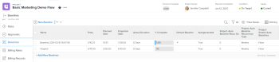

# Create project baselines

A baseline is a project snapshot that represents key pieces of information included in the initial project plan or at any given time during the life of the project.

You can use baseline to compare those pieces of information from the current plan to the original plan or any other point in time, to identify problem tasks, scope creep, and other trends over time.

## Access requirements

You must have the following access to perform the steps in this article:

<table cellspacing="0"> 
 <col> 
 <col> 
 <tbody> 
  <tr> 
   <td role="rowheader"><em>Adobe Workfront</em> plan*</td> 
   <td> 
Any
 </td> 
  </tr> 
  <tr> 
   <td role="rowheader"><em>Adobe Workfront</em> license*</td> 
   <td> 
<em>Plan</em> 
 </td> 
  </tr> 
  <tr> 
   <td role="rowheader">Access level*</td> 
   <td> 
Edit access to Projects
 
Note: If you still don't have access, ask your <em>Workfront administrator</em> if they set additional restrictions in your access level. For information about access to projects, see <a href="../../../administration-and-setup/add-users/configure-and-grant-access/grant-access-projects.md" class="MCXref xref">Grant access to projects</a>. For information on how a <em>Workfront administrator</em> can change your access level, see <a href="../../../administration-and-setup/add-users/configure-and-grant-access/create-modify-access-levels.md" class="MCXref xref">Create or modify custom access levels</a>. 
 </td> 
  </tr> 
  <tr> 
   <td role="rowheader">Object permissions</td> 
   <td> 
View permissions to the project or higher to view baselines
 
Manage permissions to the project to create baselines
 
 For information about project permissions, see <a href="../../../workfront-basics/grant-and-request-access-to-objects/share-a-project.md" class="MCXref xref">Share a project in Adobe Workfront</a>.
 
For information on requesting additional access, see <a href="../../../workfront-basics/grant-and-request-access-to-objects/request-access.md" class="MCXref xref">Request access to objects in Adobe Workfront</a>.
 </td> 
  </tr> 
 </tbody> 
</table>

&#42;To find out what plan, license type, or access you have, contact your *Workfront administrator*.

## Considerations for working with baselines

* You can capture a snapshot of the progress on a project multiple times during the lifetime of the project, creating multiple baselines. 
* You can view the information included in the baselines of a project by creating a baseline or by building a Baseline report. 
* When you create a baseline, the task information is also captured on the baseline tasks of that baseline. 
* You can view the information of the baseline tasks by building a Baseline Task report.

>[!IMPORTANT]
>
>A baseline takes a snapshot of the name, dates, and financial information of the project. The baseline does not include the values of custom fields on the project. For information about financial information included in the baseline, see [Project finances included in project baselines](../../../manage-work/projects/project-finances/project-finances-included-in-project-baselines.md).

## Create a baseline

You can create a baseline in the following ways:

* Automatically: Your *Workfront administrator* `or a *group administrator*` sets the project preference for *Workfront* to automatically create a baseline when a project becomes Current. When this setting is enabled, a baseline is created when the project status becomes Current. When this setting is not enabled, you must manually create baselines.

  For more information about configuring project preferences and setting up automatic baseline creation, see [Configure system-wide project preferences](../../../administration-and-setup/set-up-workfront/configure-system-defaults/set-project-preferences.md).

  ` `**Warning: **`` Enabling this setting automatically creates a baseline for a project every time a project's status changes to Current. The first created baseline is the default one. You must manually create all other baselines during the life of the project .

* Manually: You can create new baselines for the project as needed as the project progresses. You can then compare baselines to see how the project progressed over time.

<ol> 
 <li value="1">Navigate to a project. </li> 
 <li value="2"> <draft-comment>
   
 In the left panel, click Baselines. 

  </draft-comment>
 In the left panel, click Baselines. 
 <draft-comment>
   
Or

  </draft-comment>
Or
 <draft-comment>
   
Click Show More, then click Baselines. 

  </draft-comment>
Click Show More, then click Baselines. 
 
 <draft-comment>
    
   </draft-comment> 
 </li> 
 <li value="3">Click New Baseline.</li> 
 <li value="4">Specify the name for the baseline.</li> 
 <li value="5"> 
(Optional) If this is the first baseline, you may want to choose it as the default. 
 </li> 
 <li value="6"> 
Click Save.
 
By default, the following information displays about the baseline you created:
 
  <ul> 
   <li>Baseline name</li> 
   <li>Baseline Entry Date</li> 
   <li>Planned Start Date of the project when the baseline was created</li> 
   <li>Projected Start Date of the project when the baseline was created</li> 
   <li>Actual Duration of the project when the baseline was created</li> 
   <li>% Complete of the project when the baseline was created</li> 
   <li> 
Default Baseline indicator that shows whether a baseline is the Default baseline of the project 
 <note type="tip">
     You cannot view information from any two baselines at the same time in the same view or report. You can only view information from a given baseline and the Default baseline in the same report. You can modify which baseline you consider to be the Default baseline any time during the life of the project. 
    </note> </li> 
  </ul> </li> 
 <li value="7">(Optional) Click the drop-down arrow next to the View, then Customize View to add fields to your view and compare additional information between baselines. </li> 
</ol>

## Create a Baseline or a Baseline Task report

To view baseline information, you can also create a Baseline or Baseline Task report. This allows you to display any number of fields about the baselines or baseline tasks to compare them in one view.

>[!TIP]
>
>You must create a baseline before you can create a Baseline or Baseline Task report.

For information about creating a report, see [Create a custom report](../../../reports-and-dashboards/reports/creating-and-managing-reports/create-custom-report.md).

We recommend that you add a Project Name grouping to your Baseline or Baseline report to make it easier to read.

For information about creating a grouping, see [Create groupings](../../../reports-and-dashboards/reports/reporting-elements/create-groupings.md). 
