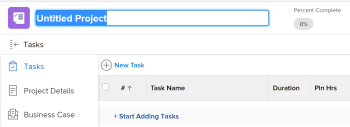

# Create a project

Projects represent a large amount of work that needs to be done in *Adobe Workfront*.

## Access requirements

You must have the following access to perform the steps in this article:

<table cellspacing="0"> 
 <col> 
 <col> 
 <tbody> 
  <tr> 
   <td role="rowheader"><em>Workfront</em>plan*</td> 
   <td> 
Any
 </td> 
  </tr> 
  <tr> 
   <td role="rowheader"><em>Workfront</em> license*</td> 
   <td> 
<em>Plan</em> 
 </td> 
  </tr> 
  <tr> 
   <td role="rowheader">Access level*</td> 
   <td> 
Edit access to Projects
 
Note: If you still don't have access, ask your <em>Workfront administrator</em> if they set additional restrictions in your access level. For information about access to projects, see <a href="../../../administration-and-setup/add-users/configure-and-grant-access/grant-access-projects.md" class="MCXref xref">Grant access to projects</a>. For information on how a <em>Workfront administrator</em> can change your access level, see <a href="../../../administration-and-setup/add-users/configure-and-grant-access/create-modify-access-levels.md" class="MCXref xref">Create or modify custom access levels</a>. 
 </td> 
  </tr> 
  <tr> 
   <td role="rowheader">Object permissions</td> 
   <td> 
When you create a project you automatically receive Manage permissions to the project 
 
 For information about project permissions, see <a href="../../../workfront-basics/grant-and-request-access-to-objects/share-a-project.md" class="MCXref xref">Share a project in Adobe Workfront</a>.
 
For information on requesting additional access, see <a href="../../../workfront-basics/grant-and-request-access-to-objects/request-access.md" class="MCXref xref">Request access to objects in Adobe Workfront</a>.
 </td> 
  </tr> 
 </tbody> 
</table>

&#42;To find out what plan, license type, or access you have, contact your *Workfront administrator*.

## New project default settings

When you create a project, *Workfront* applies a set of default settings to it. For example, the Status, Group, or Schedule Mode are preset when you create the project.

Consider the following:

* As a *Workfront administrator* `or a *group administrator*`, you can configure the default settings for a new project when configuring Project Preferences.
* *Workfront* applies the settings of the group, if there are any, before it applies those set by the *Workfront administrator*. 
* If you create a project using a template, the settings from the template take precedence over the settings established by the *Workfront* or *group administrator*.

>[!NOTE]
>
>We recommend that the default status for a new project is Planning. As you are making changes to the new project, this ensures that notifications do not trigger to the users assigned to the project.

For more information about setting up the default status and other default settings for a new project, see [Configure system-wide project preferences](../../../administration-and-setup/set-up-workfront/configure-system-defaults/set-project-preferences.md).

## Ways to create projects

You can create a project in *Workfront* by using one of the following methods:

* Create a project from scratch. This article describes how to create a project from scratch. 
* Copy an existing project.  
  For more information about copying project, see [Copy a project](../../../manage-work/projects/manage-projects/copy-project.md).

* Use a template.  
  For more information about using a template to create a new project, see [Create a project using a template](../../../manage-work/projects/create-projects/create-project-from-template.md).

* Import a project from Microsoft Project.  
  For more information about importing a project from MS Project, see [Import a project from Microsoft Project](../../../manage-work/projects/create-projects/import-project-from-ms-project.md).

* Import a project using kick-starts.

  As a *Workfront administrator*, you can import projects using a kick-start.

  For information about importing data using kick-starts in *Workfront*, see [Import data into Adobe Workfront via a Kick-Start template](../../../administration-and-setup/manage-workfront/using-kick-starts/import-data-via-kickstarts.md) .

  For information about importing projects using kick-starts, see [Kick-Starts scenario: simple project and task import preparation](../../../administration-and-setup/manage-workfront/using-kick-starts/kick-starts-scenario-simple-project-task-import-prep.md) .

* Publish an initiative from a scenario in the *Adobe Workfront Scenario Planner*. This is available only in *the new Adobe Workfront experience* and requires an additional license. For information about the *Workfront Scenario Planner*, see [The Adobe Workfront Scenario Planner overview](../../../scenario-planner/scenario-planner-overview.md). For information about creating projects from publishing initiatives, see 

  <!--
  <MadCap:conditionalText data-mc-conditions="QuicksilverOrClassic.Quicksilver">
  <a href="../../../scenario-planner/publish-scenarios-update-projects.md" class="MCXref xref">Update or create projects by publishing initiatives in the Adobe Workfront Scenario Planner</a>
  </MadCap:conditionalText>
  -->

  `<MadCap:conditionalText data-mc-conditions="QuicksilverOrClassic.Quicksilver">  <a href="../../../scenario-planner/publish-scenarios-update-projects.md" class="MCXref xref">Update or create projects by publishing initiatives in the Adobe Workfront Scenario Planner</a></MadCap:conditionalText>` .

## Create a project from scratch

<ol> 
 <li value="1"> 
Do one of the following:
 
  <ul> 
   <li> 
 <draft-comment>
      <MadCap:conditionalText data-mc-conditions="QuicksilverOrClassic.Quicksilver">
       Click the 
       Main Menu 
       , click 
       Projects, then expand 
       New Project. 
      </MadCap:conditionalText>
     </draft-comment><MadCap:conditionalText data-mc-conditions="QuicksilverOrClassic.Quicksilver">
      Click the 
      Main Menu 
      , click 
      Projects, then expand 
      New Project. 
     </MadCap:conditionalText>
 </li> 
   <li> 
 <draft-comment>
      <MadCap:conditionalText data-mc-conditions="QuicksilverOrClassic.Quicksilver">
       Go to a portfolio, then expand 
       New Project.
      </MadCap:conditionalText>
     </draft-comment><MadCap:conditionalText data-mc-conditions="QuicksilverOrClassic.Quicksilver">
      Go to a portfolio, then expand 
      New Project.
     </MadCap:conditionalText>
 <note type="tip">
     When you create a project using a template from a portfolio, the Portfolio field of the new project updates to display the portfolio you chose to create the project from. This overwrites the Portfolio field on the template, if it is specified. 
    </note> </li> 
   <li> 
 <draft-comment>
      <MadCap:conditionalText data-mc-conditions="QuicksilverOrClassic.Quicksilver">
       Go to a program, then expand 
       New Project.
      </MadCap:conditionalText>
     </draft-comment><MadCap:conditionalText data-mc-conditions="QuicksilverOrClassic.Quicksilver">
      Go to a program, then expand 
      New Project.
     </MadCap:conditionalText>
 <note type="tip">
     When you create a project using a template from a program, the Program field of the new projects updates to display the Program you chose to create the project from. The Portfolio field of the template updates to display the portfolio of the program you chose to create the project from. This overwrites the Program and Portfolio fields on the template, if they are specified. 
    </note> </li> <draft-comment>
    <li data-mc-conditions="QuicksilverOrClassic.Quicksilver"> 
If you are a <em>group administrator</em>, you can also create a project in the Projects section of a group you manage. For more information, see<a href="view-manage-projects-groups-area.md" class="MCXref xref"> View and create projects from the Groups area in the new Adobe Workfront experience</a>.
 <note type="tip">
      When you create a project using a template from a group, the group you create the project from displays in the Group field of the new project only when the Group field of the template is not specified. If the template Group field is specified, the Group field of the new project is that of the template. 
     </note> </li>
   </draft-comment>
   <li data-mc-conditions="QuicksilverOrClassic.Quicksilver"> 
If you are a <em>group administrator</em>, you can also create a project in the Projects section of a group you manage. For more information, see<a href="view-manage-projects-groups-area.md" class="MCXref xref"> View and create projects from the Groups area in the new Adobe Workfront experience</a>.
 <note type="tip">
     When you create a project using a template from a group, the group you create the project from displays in the Group field of the new project only when the Group field of the template is not specified. If the template Group field is specified, the Group field of the new project is that of the template. 
    </note> </li> 
  </ul> 
 <draft-comment>
    
   </draft-comment> 
 </li> 
 <li value="2">Click New Project if you want to create a project from scratch.</li> 
 <li value="3"> 
Enter a name for your project. Press Enter to save the name.
 
 <draft-comment>
    
   </draft-comment> 
 
The header of the project page displays a quick overview of the current health and progress of a project. The information in the project header changes as the project information is updated.
 </li> 
 <li value="4"> 
Click Start Adding Tasks.
 
Or
 
Click New Task to add tasks to the project and assign resources to them.  For more information about adding tasks to a project, see <a href="../../../manage-work/tasks/create-tasks/create-tasks-in-project.md" class="MCXref xref">Create tasks in a project</a>.
 </li> 
 <li value="5"> 
 <draft-comment>
    <MadCap:conditionalText data-mc-conditions="QuicksilverOrClassic.Quicksilver">
     Edit the project details, by clicking the
      More menu and then 
     Edit 
      next to the name of the project.
    </MadCap:conditionalText>
   </draft-comment><MadCap:conditionalText data-mc-conditions="QuicksilverOrClassic.Quicksilver">
    Edit the project details, by clicking the
     More menu and then 
    Edit 
     next to the name of the project.
   </MadCap:conditionalText>
 
The Edit Project dialog box opens. 
 
For more information about editing a project, see <a href="../../../manage-work/projects/manage-projects/edit-projects.md" class="MCXref xref">Edit projects</a>.
 </li> 
 <li value="6"> 
(Optional) After configuring the project settings and add the tasks, you can change the status of the project to Current. 
 
This indicates that the project is now ready to start and users assigned to the tasks can now start working on them. 
 
For more information about project statuses, see <a href="../../../administration-and-setup/customize-workfront/creating-custom-status-and-priority-labels/project-statuses.md" class="MCXref xref">Access the list of system project statuses</a>.
 </li> 
</ol>

