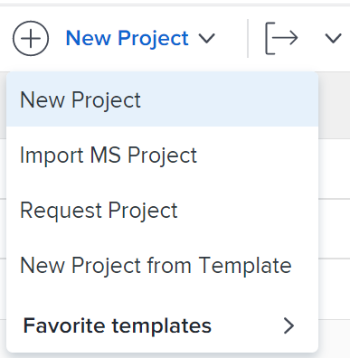

# Import a project from Microsoft Project

You can import projects from Microsoft Project into *Adobe Workfront* and manage all your projects in one application. Every time you import a project from Microsoft Project, a new project is created in *Workfront*.

>[!IMPORTANT]
>
>Not all Microsoft Project fields are transferred to *Workfront*. 
>
>For more information about the compatibility of fields between *Workfront* and Microsoft Project, see [Map Microsoft Project fields to Adobe Workfront](../../../manage-work/projects/manage-projects/map-ms-project-fields-to-workfront.md).

## Access requirements

You must have the following access to perform the steps in this article:

<table cellspacing="0"> 
 <col> 
 <col> 
 <tbody> 
  <tr> 
   <td role="rowheader"><em>Adobe Workfront</em> plan*</td> 
   <td> 
Any
 </td> 
  </tr> 
  <tr> 
   <td role="rowheader"><em>Adobe Workfront</em> license*</td> 
   <td> 
<em>Plan</em> 
 </td> 
  </tr> 
  <tr> 
   <td role="rowheader">Access level*</td> 
   <td> 
Edit access to Projects
 
Note: If you still don't have access, ask your <em>Workfront administrator</em> if they set additional restrictions in your access level. For information about access to projects, see <a href="../../../administration-and-setup/add-users/configure-and-grant-access/grant-access-projects.md" class="MCXref xref">Grant access to projects</a>. For information on how a <em>Workfront administrator</em> can change your access level, see <a href="../../../administration-and-setup/add-users/configure-and-grant-access/create-modify-access-levels.md" class="MCXref xref">Create or modify custom access levels</a>. 
 </td> 
  </tr> 
  <tr> 
   <td role="rowheader">Object permissions</td> 
   <td> 
When you create a project you automatically receive Manage permissions to the project 
 
 For information about project permissions, see <a href="../../../workfront-basics/grant-and-request-access-to-objects/share-a-project.md" class="MCXref xref">Share a project in Adobe Workfront</a>.
 
For information on requesting additional access, see <a href="../../../workfront-basics/grant-and-request-access-to-objects/request-access.md" class="MCXref xref">Request access to objects in Adobe Workfront</a>.
 </td> 
  </tr> 
 </tbody> 
</table>

&#42;To find out what plan, license type, or access you have, contact your *Workfront administrator*.

## Create a project from a MS&nbsp;Project

You can create a project from the Projects area in the

<!--
<MadCap:conditionalText data-mc-conditions="QuicksilverOrClassic.Quicksilver">
Main Menu
</MadCap:conditionalText>
-->

`<MadCap:conditionalText data-mc-conditions="QuicksilverOrClassic.Quicksilver"> Main Menu</MadCap:conditionalText>`, or from the Projects area of a portfolio or a program.

<ol> 
 <li value="1">Go to Microsoft Project and open a project that you want to import from in <em>Workfront</em>. </li> 
 <li value="2">Click File, then Save As to save the project as an .xml file. </li> 
 <li value="3">Log in to <em>Workfront</em>. </li> 
 <li value="4"> 
Do one of the following:
 
  <ul> 
   <li> 
 <draft-comment>
      <MadCap:conditionalText data-mc-conditions="QuicksilverOrClassic.Quicksilver">
       Click the 
       Main Menu
       , click 
       Projects, then expand 
       New Project. 
      </MadCap:conditionalText>
     </draft-comment><MadCap:conditionalText data-mc-conditions="QuicksilverOrClassic.Quicksilver">
      Click the 
      Main Menu
      , click 
      Projects, then expand 
      New Project. 
     </MadCap:conditionalText> 
 </li> 
   <li> 
 <draft-comment>
      <MadCap:conditionalText data-mc-conditions="QuicksilverOrClassic.Quicksilver">
       Go to a portfolio, then expand 
       New Project.
      </MadCap:conditionalText>
     </draft-comment><MadCap:conditionalText data-mc-conditions="QuicksilverOrClassic.Quicksilver">
      Go to a portfolio, then expand 
      New Project.
     </MadCap:conditionalText> 
 </li> 
   <li> 
 <draft-comment>
      <MadCap:conditionalText data-mc-conditions="QuicksilverOrClassic.Quicksilver">
       Go to a program, then expand 
       New Project.
      </MadCap:conditionalText>
     </draft-comment><MadCap:conditionalText data-mc-conditions="QuicksilverOrClassic.Quicksilver">
      Go to a program, then expand 
      New Project.
     </MadCap:conditionalText> 
 </li> <draft-comment>
    <li data-mc-conditions="QuicksilverOrClassic.Quicksilver"> 
If you are a <em>group administrator</em>, you can also create a project in the Projects section of a group you manage. For more information, see<a href="view-manage-projects-groups-area.md" class="MCXref xref"> View and create projects from the Groups area in the new Adobe Workfront experience</a>.
 </li>
   </draft-comment>
   <li data-mc-conditions="QuicksilverOrClassic.Quicksilver"> 
If you are a <em>group administrator</em>, you can also create a project in the Projects section of a group you manage. For more information, see<a href="view-manage-projects-groups-area.md" class="MCXref xref"> View and create projects from the Groups area in the new Adobe Workfront experience</a>.
 </li> 
  </ul> </li> 
 <li value="5"> 
Choose the Import MS Project option. 
 
 <draft-comment>
    
   </draft-comment> 
 </li> 
 <li value="6">Click Select File, then browse for the .xml file on your computer which you exported from Microsoft Project. </li> 
 <li value="7"> 
Import the selected file.
 
<em>Workfront</em> begins the import process and creates a new project based on the file exported from Microsoft Project. 
 
After the import process is complete, you are directed to the new project page that displays a confirmation that the import has completed successfully.
 <note type="note">
   <em>Workfront</em> has a 15-minute time limitation on file uploads. If the file upload takes longer than that, we recommend that you break out your project into smaller projects and import them separately. Once they have been imported into 
   <em>Workfront</em>, move the tasks from one project to the other project to combine them into one project. For information on moving tasks, see 
   <a href="../../../manage-work/tasks/manage-tasks/move-tasks.md" class="MCXref xref">Move tasks</a>.
  </note> </li> 
 <li value="8"> 
(Optional) Continue editing the project in <em>Workfront</em>. For information about editing projects, see <a href="../../../manage-work/projects/manage-projects/edit-projects.md" class="MCXref xref">Edit projects</a>.
 
The status of a new project created from a template corresponds with the status defined by your <em>Workfront administrator</em> in the Project Preferences area or by a <em>group administrator</em> in the Group Project Preferences area. For information about configuring project preferences, see <a href="../../../administration-and-setup/set-up-workfront/configure-system-defaults/set-project-preferences.md" class="MCXref xref">Configure system-wide project preferences</a>.
 </li> 
</ol>

