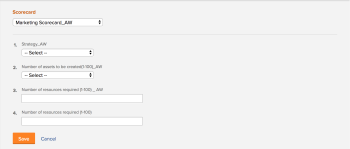

# Apply a scorecard to a project and generate an Alignment Score  {#apply-a-scorecard-to-a-project-and-generate-an-alignment-score}

You can use a scorecard to measure how well a project aligns with the previously established criteria of a portfolio. A scorecard often reflects the mission, values, and strategic goals of an organization.


For more information about scorecards and how you can create one, see [Create a scorecard](create-scorecard.md).


## Access requirements {#access-requirements}

You must have the following access to perform the steps in this article:

<table style="width: 100%;margin-left: 0;margin-right: auto;mc-table-style: url('../../../Resources/TableStyles/TableStyle-List-options-in-steps.css');" class="TableStyle-TableStyle-List-options-in-steps" cellspacing="0"> 
 <col class="TableStyle-TableStyle-List-options-in-steps-Column-Column1"> 
 <col class="TableStyle-TableStyle-List-options-in-steps-Column-Column2"> 
 <tbody> 
  <tr class="TableStyle-TableStyle-List-options-in-steps-Body-LightGray"> 
   <td class="TableStyle-TableStyle-List-options-in-steps-BodyE-Column1-LightGray" role="rowheader"><span class="mc-variable WFVariables.FullProdNameWF variable varname">Adobe Workfront</span> plan*</td> 
   <td class="TableStyle-TableStyle-List-options-in-steps-BodyD-Column2-LightGray"> <p><span class="mc-variable WFVariables.WFPlan-Business variable varname">Business</span> or higher</p> </td> 
  </tr> 
  <tr class="TableStyle-TableStyle-List-options-in-steps-Body-MediumGray"> 
   <td class="TableStyle-TableStyle-List-options-in-steps-BodyE-Column1-MediumGray" role="rowheader"><span class="mc-variable WFVariables.FullProdNameWF variable varname">Adobe Workfront</span> license*</td> 
   <td class="TableStyle-TableStyle-List-options-in-steps-BodyD-Column2-MediumGray"> <p><span class="mc-variable WFVariables.WFLicense-Plan variable varname">Plan</span> </p> </td> 
  </tr> 
  <tr class="TableStyle-TableStyle-List-options-in-steps-Body-LightGray"> 
   <td class="TableStyle-TableStyle-List-options-in-steps-BodyE-Column1-LightGray" role="rowheader">Access level configurations*</td> 
   <td class="TableStyle-TableStyle-List-options-in-steps-BodyD-Column2-LightGray"> <p>Edit access to Projects</p> <p>View or higher access to Portfolios</p> <p>Note: If you still don't have access, ask your <span class="mc-variable WFVariables.AdminWF variable varname">Workfront administrator</span> if they set additional restrictions in your access level. For information on how a <span class="mc-variable WFVariables.AdminWF variable varname">Workfront administrator</span> can modify your access level, see <a href="create-modify-access-levels.md" class="MCXref xref">Create or modify custom access levels</a>.</p> </td> 
  </tr> 
  <tr class="TableStyle-TableStyle-List-options-in-steps-Body-MediumGray"> 
   <td class="TableStyle-TableStyle-List-options-in-steps-BodyB-Column1-MediumGray" role="rowheader">Object permissions</td> 
   <td class="TableStyle-TableStyle-List-options-in-steps-BodyA-Column2-MediumGray"> <p>Manage permissions to a project</p> <p>View or higher permissions to a portfolio </p> <p>For information on requesting additional access, see <a href="request-access.md" class="MCXref xref">Request access to objects in Adobe Workfront</a>.</p> </td> 
  </tr> 
 </tbody> 
</table>

&#42;To find out what plan, license type, or access you have, contact your *`Workfront administrator`*.


## Project scorecards {#project-scorecards}


* [Scorecards overview](#understanding-scorecards) 
* [Project scorecards](#applying-a-scorecard-to-a-project) 


### Scorecards overview {#scorecards-overview}

Typically, a project manager completes the scorecard information to produce an alignment value between 0 and 100 for the project. The value produced is later used when the portfolio manager reviews the projects in the portfolio optimizer to compare them.


For more information about portfolio optimization, see the article [Portfolio Optimizer overview](portfolio-optimizer-overview.md).


### Apply a scorecard to a project {#apply-a-scorecard-to-a-project}

As user with a Plan license and Manage permissions to a project, you can attach a scorecard to the project.


For more information about project permissions, see [Share a project in Adobe Workfront](share-a-project.md).


You can add scorecards to a project as part of building the business case for the project. 


For more information about building a business case, see [Create a Business Case for a project in Adobe Workfront](create-business-case.md).


Your *`Adobe Workfront administrator`* `or *`group administrator`*` must enable the Scorecard section in the Business Case area of your projects before you can access scorecards from the Business Case. For information about setting up project preferences and enabling areas of the Business Case, see [Configure system-wide project preferences](set-project-preferences.md). 


To apply a scorecard to a project:


1.  `<MadCap:conditionalText data-mc-conditions="QuicksilverOrClassic.Quicksilver"> Go to a project to which you want to apply a scorecard.</MadCap:conditionalText>`
1. Click `Business Case``<MadCap:conditionalText data-mc-conditions="QuicksilverOrClassic.Quicksilver">  in the left panel</MadCap:conditionalText>`.

1.  Find the `Scorecard` section of the Business Case.  
   You must create a scorecard before the `Scorecard` section displays on the Business Case. 


   For information about creating a scorecard, see [Create a scorecard](create-scorecard.md).

1.  Select a scorecard from the drop-down menu.


   


1.  Specify an answer for all the questions in the scorecard.


   *`Workfront`* applies a score to each question answered and calculates an overall project score based on the individual score of every question. 


   For more information about generating the project overall alignment score, see [Generate an Alignment Score for a project](#generating-an-alignment-score-for-a-project).

1.  Click `Save`to save the scorecard and score the project.


   The scorecard is now associated with the project and the project is scored. 


## Generate an Alignment Score {#generate-an-alignment-score}


* [Generate an Alignment Score for a project](#generating-an-alignment-score-for-a-project) 
* [Generate an Alignment Score for a portfolio](#generating-an-alignment-score-for-a-portfolio) 


### Generate an Alignment Score for a project {#generate-an-alignment-score-for-a-project}

The alignment score is the value produced after completing the scorecard. 


Scorecards contain questions with answer choices that have been assigned numerical values, called alignment points. These points are used to determine how well the project aligns with your organization. The alignment points for each question contain a number between 0 and 100.


When the scorecard is completed, *`Workfront`* calculates the alignment score of the project as a percentage, using the following formula:


```
Project Alignment Score = The sum of the question points from the scorecard met at a given time/ The sum of the possible points on the scorecard
```


For more information, see [Create a scorecard](create-scorecard.md).


### Generate an Alignment Score for a portfolio {#generate-an-alignment-score-for-a-portfolio}

The alignment score of the portfolio is an average of the alignment scores of all the projects in the portfolio. 


When the scorecards of the projects are completed, *`Workfront`* uses those values to calculate the alignment score of the portfolio as a percentage, using the following formula:


Portfolio Alignment Score = The sum of the percentages of the project alignment scores/ Number of projects in the portfolio


>[!NOTE]
>
>If a project does not have a scorecard associated with it, and therefore it does not have an alignment score, it is considered to have a 0% alignment in the portfolio. The project is taken into account in the number of projects in the portfolio. 


## View the Alignment Score {#view-the-alignment-score}

You can view the alignment score of a project at the project level, or in the Portfolio Optimizer. 


* [View the Alignment Score on a project](#view%20the) 
* [View the Alignment Scores of the project and of the portfolio in the Portfolio Optimizer](#view%20the2) 


### View the Alignment Score on a project {#view-the-alignment-score-on-a-project}

You can view the alignment score of a project at the project level if you have Contribute rights to the project. 


1.  `<MadCap:conditionalText data-mc-conditions="QuicksilverOrClassic.Quicksilver"> Go to the project whose Alignment Score you want to view. </MadCap:conditionalText>` 
1. Click `Business Case` `<MadCap:conditionalText data-mc-conditions="QuicksilverOrClassic.Quicksilver"> in the left panel</MadCap:conditionalText>`.

1.  Go to the `Business Case Summary` on the right side of your screen. 


   The Alignment Score is located in the Business Case Summary, in the `Aligned` value.


   


### View the Alignment Scores of the project and of the portfolio in the Portfolio Optimizer {#view-the-alignment-scores-of-the-project-and-of-the-portfolio-in-the-portfolio-optimizer}

You can view the alignment score of a project or of a portfolio in the Portfolio Optimizer, if you have Manage access to the portfolio. 


For more information about the information displayed in the Portfolio Optimizer, see [Portfolio Optimizer overview](portfolio-optimizer-overview.md).


* [Locate the Alignment Score of the project in the Portfolio Optimizer](#locating-alognment-score-of-the-project) 
* [Locate the Alignment Score of the portfolio in the Portfolio Optimizer](#locating-alignment-score-for-portfolio)   
  


#### `Locate the Alignment Score of the project in the Portfolio Optimizer`  {#locate-the-alignment-score-of-the-project-in-the-portfolio-optimizer}


1.  `<MadCap:conditionalText data-mc-conditions="QuicksilverOrClassic.Quicksilver"> Click the  <span class="bold">Main Menu</span> icon  , then  <span class="bold">Portfolios</span>. </MadCap:conditionalText>`
1. Click the name of a Portfolio.
1.   `<MadCap:conditionalText data-mc-conditions="QuicksilverOrClassic.Quicksilver"> Click  <span class="bold">Portfolio Optimization</span> in the left panel.</MadCap:conditionalText>` 


   The Portfolio Optimizer displays. 

1.  The alignment score of a project is displayed as a percentage in the `Alignment` column of the Portfolio Optimizer. 


   This is the alignment score of the project based on the scorecard associated with the project. 


#### `Locate the Alignment Score of the portfolio in the Portfolio Optimizer`  {#locate-the-alignment-score-of-the-portfolio-in-the-portfolio-optimizer}


1. Go to the `Projects` area in the Global Navigation bar.
1. Select the `Portfolios` tab.
1. Click the name of a Portfolio.
1. Select the `Portfolio Optimization` tab.
1.  At the top of the Portfolio Optimizer find the `Aligned` value, as well as the `Alignment` gauge which indicate the alignment score of the portfolio. 


   This is the alignment score of the portfolio. 


   For more information about how the alignment score of a portfolio is generated, see [Generate an Alignment Score for a portfolio](#generating-an-alignment-score-for-a-portfolio).


## Overview of the Portfolio Optimizer Score {#overview-of-the-portfolio-optimizer-score}

There is a difference between the alignment score and the portfolio optimizer score of a project. 


The alignment score of a project is calculated based on the points obtained after completing the scorecard. This score is then used to determine the portfolio alignment score. The alignment score is displayed as a percentage. 


The alignment score of a project displays in the `Alignment` column of the Portfolio Optimizer. 


The portfolio optimizer score is a ranking automatically calculated in the Portfolio Optimizer by which projects can be prioritized. The portfolio optimizer score is displayed as an indicator icon accompanied by a number and it displays in the `Score` column of the Portfolio Optimizer. A Portfolio Optimizer score is generated only when all the sections of the Business Case are completed, except for Goals. 


For more information about creating a Business Case for a project, see [Create a Business Case for a project in Adobe Workfront](create-business-case.md).


For more information about calculating the portfolio optimizer score of a project, see [Overview of the Portfolio Optimizer Score](portfolio-optimizer-score.md).
