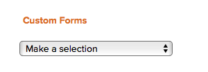
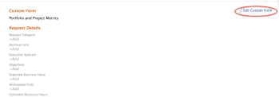

# Attach a Custom Form to a Business Case {#attach-a-custom-form-to-a-business-case}

Custom Forms are used to collect information that is not displayed in existing *`Adobe Workfront`* fields.&nbsp;

For more information about creating Custom Forms, see the article [Create or edit a custom form](create-or-edit-a-custom-form.md).

## Access requirements {#access-requirements}

You must have the following access to perform the steps in this article:

<table style="width: 100%;margin-left: 0;margin-right: auto;mc-table-style: url('../../../Resources/TableStyles/TableStyle-List-options-in-steps.css');" class="TableStyle-TableStyle-List-options-in-steps" cellspacing="0"> 
 <col class="TableStyle-TableStyle-List-options-in-steps-Column-Column1"> 
 <col class="TableStyle-TableStyle-List-options-in-steps-Column-Column2"> 
 <tbody> 
  <tr class="TableStyle-TableStyle-List-options-in-steps-Body-LightGray"> 
   <td class="TableStyle-TableStyle-List-options-in-steps-BodyE-Column1-LightGray" role="rowheader">Adobe Workfront plan*</td> 
   <td class="TableStyle-TableStyle-List-options-in-steps-BodyD-Column2-LightGray"> 
Pro or higher
 </td> 
  </tr> 
  <tr class="TableStyle-TableStyle-List-options-in-steps-Body-MediumGray"> 
   <td class="TableStyle-TableStyle-List-options-in-steps-BodyE-Column1-MediumGray" role="rowheader">Adobe Workfront license*</td> 
   <td class="TableStyle-TableStyle-List-options-in-steps-BodyD-Column2-MediumGray"> 
Plan 
 </td> 
  </tr> 
  <tr class="TableStyle-TableStyle-List-options-in-steps-Body-LightGray"> 
   <td class="TableStyle-TableStyle-List-options-in-steps-BodyE-Column1-LightGray" role="rowheader">Access level configurations*</td> 
   <td class="TableStyle-TableStyle-List-options-in-steps-BodyD-Column2-LightGray"> 
Edit access to&nbsp;Projects
 
Note: If you still don't have access, ask your Workfront administrator if they set additional restrictions in your access level. For information on how a Workfront administrator can modify your access level, see <a href="create-modify-access-levels.md" class="MCXref xref">Create or modify custom access levels</a>.
 </td> 
  </tr> 
  <tr class="TableStyle-TableStyle-List-options-in-steps-Body-MediumGray"> 
   <td class="TableStyle-TableStyle-List-options-in-steps-BodyB-Column1-MediumGray" role="rowheader">Object permissions</td> 
   <td class="TableStyle-TableStyle-List-options-in-steps-BodyA-Column2-MediumGray"> 
Manage permissions or higher to the project
 
For information on requesting additional access, see <a href="request-access.md" class="MCXref xref">Request access to objects in Adobe Workfront</a>.
 </td> 
  </tr> 
 </tbody> 
</table>

&#42;To find out what plan, license type, or access you have, contact your *`Workfront administrator`*.

## Attach Custom Forms to projects {#attach-custom-forms-to-projects}

You can attach Custom Forms to a project in the following areas:

* When editing a project, in the Project Details section.
* When editing a project, in the Edit Project box.
*  When editing multiple projects in bulk, from a list of projects.

  For information about attaching custom forms to projects while editing one or multiple projects, see the article [Edit projects](edit-projects.md).

*  `<MadCap:conditionalText data-mc-conditions="QuicksilverOrClassic.Quicksilver"> When building the Business Case of a project, in the Business Case</MadCap:conditionalText>` as described in this article.

For information about attaching custom forms to objects, see [Add a custom form to an object](add-a-custom-form-to-an-object.md). 

## Attach Custom Forms to the Business Case {#attach-custom-forms-to-the-business-case}

To add a custom from to a Business Case, your *`Workfront administrator`* needs to select this option in Setup. For more information about enabling custom forms in Setup, see the section [Configure system-wide project preferences](set-project-preferences.md) in the article [Configure system-wide project preferences](set-project-preferences.md).

To attach a custom form:

1.   `<MadCap:conditionalText data-mc-conditions="QuicksilverOrClassic.Quicksilver"> Go to the project you want to attach the form to, then click  Business Case in the left panel. </MadCap:conditionalText>`

   The Business Case displays.

1.  In the  `Custom Form` section, select the custom form you want to attach from the drop-down menu.

   

1. (Optional) Select  `Edit Custom Form`.  
   

1. (Optional) Specify information in the fields of the custom form, then click  `Save`. 

