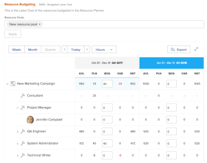

# Budget resources in the Business Case using the `Adobe Workfront` `Resource Planner`

The highlighted information on this page refers to functionality not yet generally available. It is available only in the Preview Sandbox environment.

As part of resource planning, you can use the project-level `Resource Planner` to budget the job roles necessary for completing the work in a project when you build the business case.

For more information about creating a business case, see [Create a Business Case for a project in Adobe Workfront](../../../manage-work/projects/define-a-business-case/create-business-case.md).

>[!TIP]
>
>The information you enter in the project-level  `Resource Planner` is also visible in the system-level `Resource Planner`. The reverse is also true. For information about the `Resource Planner`, see [Resource Planner overview](../../../resource-mgmt/resource-planning/get-started-resource-planner.md).

You can also budget resources in the business case using the Adobe Workfront Scenario Planner. For more information, see Budget resources in the Business Case using the Adobe Workfront Scenario Planner. 

## Access requirements

You must have the following:

<table cellspacing="0"> 
 <col> 
 <col> 
 <tbody> 
  <tr> 
   <td role="rowheader"><a href="https://www.workfront.com/plans" target="_blank">Adobe Workfront plan</a>*</td> 
   <td> 
Pro or higher
 </td> 
  </tr> 
  <tr> 
   <td role="rowheader"><a href="../../../administration-and-setup/add-users/access-levels-and-object-permissions/wf-licenses.md" class="MCXref xref">Adobe Workfront licenses overview</a>*</td> 
   <td> 
Review or higher
 
Important: You must have a Plan license to modify resource budgeting information. 
 </td> 
  </tr> 
  <tr> 
   <td role="rowheader">Access level configurations*</td> 
   <td> 
Edit access to the following: 
 
    <ul> 
     <li> 
Projects
 </li> 
     <li> 
Resource Management
 </li> 
     <li> 
Financial Data
 </li> 
    </ul> 
For information about the access needed to budget resources, also see <a href="../../../resource-mgmt/resource-planning/access-needed-to-budget-resources.md" class="MCXref xref">Access needed to budget resources</a>.
 
Note: If you still don't have access, ask your Adobe Workfront administrator if they set additional restrictions in your access level. For information on how a Workfront administrator can modify your access level, see <a href="../../../administration-and-setup/add-users/configure-and-grant-access/create-modify-access-levels.md" class="MCXref xref">Create or modify custom access levels</a>.
 </td> 
  </tr> 
  <tr> 
   <td role="rowheader">Object permissions</td> 
   <td> 
Manage permissions on the project
 
For information on requesting additional access, see <a href="../../../workfront-basics/grant-and-request-access-to-objects/request-access.md" class="MCXref xref">Request access to objects in Adobe Workfront</a>.
 </td> 
  </tr> 
 </tbody> 
</table>

&#42;To find out what plan, license type, or access you have, contact your `Workfront administrator`.

## Prerequisites

Before you begin, you must do the following:

* Meet all the prerequisites for resource planning in `Adobe Workfront`. For information, see [Resource Planner overview](../../../resource-mgmt/resource-planning/get-started-resource-planner.md).

<ul> 
 <li> 
Associate Resource Pools with the project.
 <note type="note">
   You cannot budget resources assigned to issues in the Business Case. You can budget them in the system-level 
   Resource Planner. For more information about the Resource Planner, see 
   <a href="../../../resource-mgmt/resource-planning/get-started-resource-planner.md" class="MCXref xref">Resource Planner overview</a>. 
  </note> </li> 
</ul>

* Although this is not a prerequisite, we also recommend that you indicate Planned Hours for the tasks on the project. This helps you understand the amount of work a task might need to complete which helps with the decision of much time the resources should be budgeted for to complete the task. For information about associating tasks with Planned Hours, see [Edit tasks](../../../manage-work/tasks/manage-tasks/edit-tasks.md).

## Apply Resource Pools to a project and budget resources in the Business Case

>[!IMPORTANT]
>
>You can budget your resources for a period of 15 years. If you budget resources for a project with a duration longer than 15 years the budgeting information might not be accurate.

To apply Resource Pools and budget project resources in the Business Case for a project with no Resource Pool:

<ol> 
 <li value="1">Go to the project for which you want to budget resources. </li> 
 <li value="2"> Click Business Case in the left panel. </li> 
 <li value="3"> 
 (Conditional) If your company does not have a license for the Workfront Scenario Planner, clickEdit Resource Budgeting in the Resource Budgeting section, then continue with step 5. 
 </li> (Optional and conditional) If the project information has been published from an initiative on the Scenario Planner, do one of the following: Select Resource Planner in the Choose which hours to use to calculate the Budgeted Labor Cost of the project field, then click Choose > Edit Resource Budgeting. If the Scenario Planner was selected for budgeting resources for the project, click Change > Edit Resource Budgeting. This uses the Budgeted Hours of the project to calculate the Budgeted Labor Cost for the project. This is available only in the new Adobe Workfront experience and requires an additional license. For information about the Workfront Scenario Planner, see The Adobe Workfront Scenario Planner overview. Note: We recommend that you make the decision whether to use the Resource Planner or the Scenario Planner when you begin working on a project. Frequently switching between the two during the life of the project may create inconsistencies in the way you budget your resources for the project. 
 <li value="5"> 
In the Select Resource Pool field, specify one or several Resource Pools.
 
 You must specify only Resource Pools that are populated with active users.
 <note type="tip">
   If the project is already associated with Resource Pools, the Resource Planner displays by default. To add more Resource Pools to the project, edit the project. For information about editing a project, see 
   <a href="../../../manage-work/projects/manage-projects/edit-projects.md" class="MCXref xref">Edit projects</a>. 
    
  </note> </li> 
 <li value="6"> 
Click Apply.
 
The Resource Planner is displayed, for the selected project. 
 
By default, the first 20 job roles associated with this project are listed in the Resource Budgeting section in alphabetical order.&nbsp;
 
For more information about the Resource Planner, see <a href="../../../resource-mgmt/resource-planning/get-started-resource-planner.md" class="MCXref xref">Resource Planner overview</a>.
 
  </img> 
 </li> 
 <li value="7"> 
(Optional and conditional) Expand the job roles to see the users associated with them. 
 <note type="note"> 
   
Active users are displayed under the job roles associated with them only if they meet the following criteria:
 
   <ul> 
    <li>They belong to one of the Resource Pools of the project. </li> 
    <li>They have Budgeted Hours assigned to them. </li> 
    <li>They are associated with one of the job roles of the project. </li> 
   </ul> 
  </note> 
&nbsp;
 </li> 
 <li value="8"> 
Click Today to return to today's time frame.
 </li> 
 <li value="9"> 
(Optional) Click Week, Month or Quarter to display information for the project in different time frames.
 </li> 
 <li value="10">(Optional) Click the Hours drop-down menu, and select Hours,FTE, or Cost to change how information displays in the Resource Planner. Hours display by default.</li> 
 <li value="11">(Optional) Click Export to export the Resource Planner to an Excel file. <note type="note">
    You can export data for up to 12 time periods at a time. 
  </note></li> 
 <li value="12">(Optional) Click the Full Screen icon  to display the Resource Planner in full screen mode. </li> 
 <li value="13">Update the <b>BDG</b> (Budgeted Hours) field with Hour, FTE, or Cost values for the users, roles, or the project by doing one of the following: 

   <ul>
    <li>
Manually estimate the amount of Hours, FTE, or Cost values for roles, users, or the project.

Or 
</li>
    <li>Click the Options icon for the project or the job roles and select an option to automatically budget the hours for roles, users, or the project.</li>
   </ul>
For more information about budgeting in the Project View of the Resource Planner, see <a href="../../../resource-mgmt/resource-planning/budget-resources-project-role-views-resource-planner.md" class="MCXref xref">Budget resources in the Resource Planner using the Project and Role views</a>. 
<note type="note">
    You can budget hours, FTEs, or costs for your resources for any time frame displayed in the Resource Budgeting area, independent of the timeline of the project. For example, if you want to indicate that your resources might not be available during the timeline of the project (where they are associated with Planned Hours), but they might be available during another time, you can do so by budgeting them for time frames where the Planned Hours are zero, if that is when they become available to work.
   </note>
</li> 
 <li value="14"> 
(Optional) To understand whether you can move the budgeted Hours, FTEs, or Costs to another time frame, click the Options icon, then Adjust Budgeting Dates.
 
For more information about adjusting budgeted dates, see <a href="../../../resource-mgmt/resource-planning/adjust-budgeting-dates.md" class="MCXref xref">Adjust budgeting dates in the Resource Planner</a>.
 </li> 
 <li value="15"> 
Click Save.
 
If you have Cost per Hour rates associated with your job roles, budgeting the resources in the Resource Budgeting area calculates the Budgeted Labor Cost of the project. The Budgeted Labor Cost is displayed in the Resource Budgeting area of the Business Case and in the Business Case Summary. 
 <note type="tip">
    Cost displays in the Business Case in the currency of the project.
    
  </note> 
The budgeting information specified in the Business Case is also displayed in the Resource Planner.
 </li> 
</ol>

