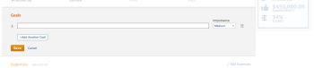

# Create Business Case goals

As part of creating a Business Case, you can create a set of goals to define the objectives of a project. Business Case goals are used to communicate to the Portfolio Manager or the Project Sponsor the purpose of completing a project.

>[!TIP]
>
>You can create strategic goals for your organization that are not connected to a project's individual Business Case. You must have access to&nbsp;*Adobe Workfront Goals* to be able to create strategic goals. You can then connect them with projects outside of their Business Cases. For information about creating goals using *Workfront Goals*, see [Adobe Workfront Goals overview](../../../workfront-goals/goal-management/wf-goals-overview.md).

Consider the following when creating Business Case goals for your projects:

* Business Case goals are project-specific. You cannot copy goals from one project to another, nor establish goals at the system level. They must be defined at the level of each project. 
* Your *Adobe Workfront administrator* `or *group administrator*` must enable the Goals section for your projects before it displays in the Business Case of your projects. For information about enabling Business Case fields for projects, see [Configure system-wide project preferences](../../../administration-and-setup/set-up-workfront/configure-system-defaults/set-project-preferences.md).

* Goals are not a mandatory section in the Business Case of a project.

  A project can receive a score to be prioritized in the Portfolio Optimizer, even if the Goals section of the Business Case is not defined.

  For more information about the Portfolio Optimizer score, see [Apply a scorecard to a project and generate an Alignment Score](../../../manage-work/projects/define-a-business-case/apply-scorecard-to-project-to-generate-alignment-score.md).

* You cannot report on Business&nbsp;Case&nbsp;goals.

## Access requirements

You must have the following access to perform the steps in this article:

<table cellspacing="0"> 
 <col> 
 </col> 
 <col> 
 </col> 
 <tbody> 
  <tr> 
   <td role="rowheader"><em>Adobe Workfront</em> plan*</td> 
   <td> 
<em>Pro</em> or higher
 </td> 
  </tr> 
  <tr> 
   <td role="rowheader"><em>Adobe Workfront</em> license*</td> 
   <td> 
<em>Plan</em> 
 </td> 
  </tr> 
  <tr> 
   <td role="rowheader">Access level configurations*</td> 
   <td> 
Edit access to&nbsp;Projects
 
Note: If you still don't have access, ask your <em>Workfront administrator</em> if they set additional restrictions in your access level. For information on how a <em>Workfront administrator</em> can modify your access level, see <a href="../../../administration-and-setup/add-users/configure-and-grant-access/create-modify-access-levels.md" class="MCXref xref">Create or modify custom access levels</a>.
 </td> 
  </tr> 
  <tr> 
   <td role="rowheader">Object permissions</td> 
   <td> 
Manage permissions or higher to the project
 
For information on requesting additional access, see <a href="../../../workfront-basics/grant-and-request-access-to-objects/request-access.md" class="MCXref xref">Request access to objects in Adobe Workfront</a>.
 </td> 
  </tr> 
 </tbody> 
</table>

&#42;To find out what plan, license type, or access you have, contact your *Workfront administrator*.

##  Add a goal to the Business Case of a project

<ol> 
 <li value="1"> <draft-comment>
   <MadCap:conditionalText data-mc-conditions="QuicksilverOrClassic.Quicksilver">
    Go to a project for which you want to define Business Case goals. 
   </MadCap:conditionalText>
  </draft-comment><MadCap:conditionalText data-mc-conditions="QuicksilverOrClassic.Quicksilver">
   Go to a project for which you want to define Business Case goals. 
  </MadCap:conditionalText> </li> 
 <li value="2"> 
 <draft-comment>
    <MadCap:conditionalText data-mc-conditions="QuicksilverOrClassic.Quicksilver">
     Click 
     Business Case in the left panel.
    </MadCap:conditionalText>
   </draft-comment><MadCap:conditionalText data-mc-conditions="QuicksilverOrClassic.Quicksilver">
    Click 
    Business Case in the left panel.
   </MadCap:conditionalText>
 
The Business Case is displayed. 
 </li> 
 <li value="3">In the Goals section, click&nbsp;Edit Goals.</li> 
 <li value="4"> 
Specify your goals.
&nbsp;In the&nbsp;Importance drop-down menu, select the level of importance:
  <ul>
   <li>Highest</li>
   <li>High</li>
   <li>Medium</li>
   <li>Low</li>
   <li>
Lowest

You cannot customize the Importance levels of goals.
</li>
  </ul></li> 
 <li value="5">(Optional) To add another goal, click&nbsp;Add Another Goal&nbsp;and repeat Step 5 and Step 6.</li> 
 <li value="6">Click&nbsp;Save.</li> 
</ol>

