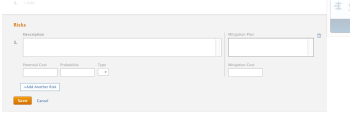

# Create and edit risks on projects

Risks are possible events or factors that prevent a project from finishing on time or within budget. Risks can be recorded as part of creating the Business Case of a project or by using the Risks tab. Risks are created only on a project. You cannot associate risks with tasks or issues.

Risks can be associated with cost, but Actual Risk Cost does not impact the Actual Cost of the Project.

>[!NOTE]
>
>This article defines the risks associated with the project as you define them in the Business Case of the project or as you add them in the Risks tab of the project. For information about the Risk field that is available when editing a project, see [Edit projects](../../../manage-work/projects/manage-projects/edit-projects.md).

## Access requirements

You must have the following access to perform the steps in this article:

<table cellspacing="0"> 
 <col> 
 <col> 
 <tbody> 
  <tr> 
   <td role="rowheader"><em>Adobe Workfront</em> plan*</td> 
   <td> 
Any
 </td> 
  </tr> 
  <tr> 
   <td role="rowheader"><em>Adobe Workfront</em> license*</td> 
   <td> 
<em>Plan</em> 
 </td> 
  </tr> 
  <tr> 
   <td role="rowheader">Access level configurations*</td> 
   <td> 
Edit access to Projects and Financial&nbsp;Data
 
Note: If you still don't have access, ask your <em>Workfront administrator</em> if they set additional restrictions in your access level. For information on how a <em>Workfront administrator</em> can change your access level, see <a href="../../../administration-and-setup/add-users/configure-and-grant-access/create-modify-access-levels.md" class="MCXref xref">Create or modify custom access levels</a>.
 </td> 
  </tr> 
  <tr> 
   <td role="rowheader">Object permissions</td> 
   <td> 
 Manage permissions that include Manage Finance on the project for which you want to create or edit risks 
 
For more information about project permissions, see the article <a href="../../../workfront-basics/grant-and-request-access-to-objects/share-a-project.md" class="MCXref xref">Share a project in Adobe Workfront</a>.
 </td> 
  </tr> 
 </tbody> 
</table>

&#42;To find out what plan, license type, or access you have, contact your *Workfront administrator*.

## Create and edit risks in the Business Case

You can create risks as part of planning the Business Case of a project. You can later edit them in the Business Case, when changes occur to their probability, mitigation plan, or cost, for example. For information about creating a Business Case, see [Create a Business Case for a project in Adobe Workfront](../../../manage-work/projects/define-a-business-case/create-business-case.md).

Your *Workfront administrator* `or *group administrator*` must enable the `Risks` section in your Business Case in the Project Preferences area before you can view it at the project level in the Business Case section. For information about setting project preferences, see [Configure system-wide project preferences](../../../administration-and-setup/set-up-workfront/configure-system-defaults/set-project-preferences.md).

Creating and editing risks in the Business Case is identical.

To create or edit a risk in the Business Case:

<ol> 
 <li value="1"> <draft-comment>
   <MadCap:conditionalText data-mc-conditions="QuicksilverOrClassic.Quicksilver">
    Go to the project for which you want to create risks. 
   </MadCap:conditionalText>
  </draft-comment><MadCap:conditionalText data-mc-conditions="QuicksilverOrClassic.Quicksilver">
   Go to the project for which you want to create risks. 
  </MadCap:conditionalText></li> 
 <li value="2"> <draft-comment>
   <MadCap:conditionalText data-mc-conditions="QuicksilverOrClassic.Quicksilver">
    Click 
    Business Case in the left panel.
   </MadCap:conditionalText>
  </draft-comment><MadCap:conditionalText data-mc-conditions="QuicksilverOrClassic.Quicksilver">
   Click 
   Business Case in the left panel.
  </MadCap:conditionalText></li> 
 <li value="3"> 
In the Risks section, click Edit Risks.
 </li> 
 <li value="4"> 
Enter or edit the following information:
 
  <ul> 
   <li>Description: describe the risk. </li> 
   <li>Potential Cost: indicate the estimated cost if the risk should occur. </li> 
   <li>Probability: indicate the probability of the risk occurring as a percentage value.  </li> 
   <li>Type: indicate what category the risk falls under.</li> 
   <li>Mitigation Plan: update the description of the plan to mitigate the risk. </li> 
   <li>Mitigation Cost: indicate the cost of the mitigation plan that you must put in place to prevent the risk from occurring.</li> 
  </ul> 
  
 </li> 
 <li value="5">(Optional) Click Add Another Risk to add additional risks.</li> 
 <li value="6">Click Save.</li> 
</ol>

## Create and edit risks in the Risks area

In addition to creating and editing risks in the Business Case, you can do so using the `Risks` 

<!--
<MadCap:conditionalText data-mc-conditions="QuicksilverOrClassic.Quicksilver">
section
</MadCap:conditionalText>
-->

`<MadCap:conditionalText data-mc-conditions="QuicksilverOrClassic.Quicksilver"> section</MadCap:conditionalText>`of a project.

* [Create risks in the Risks area](#creating-risks-in-the-risks-tab) 
* [Edit risks in the Risks area](#editing-risks-in-the-risks-tab)

### Create risks in the Risks area

<ol> 
 <li value="1">Go to the project you want to create risks for.</li> 
 <li value="2"> 
 <draft-comment>
    <MadCap:conditionalText data-mc-conditions="QuicksilverOrClassic.Quicksilver">
     Click 
     Risks in the left panel.
    </MadCap:conditionalText>
   </draft-comment><MadCap:conditionalText data-mc-conditions="QuicksilverOrClassic.Quicksilver">
    Click 
    Risks in the left panel.
   </MadCap:conditionalText>
 </li> 
 <li value="3"> 
Click Start Adding Risks and create risks by in-line editing their information.
 
Or
 
Click New Risk. The New Risk dialogue box opens.
 
  
 </li> 
 <li value="4"> 
Enter the following information:
 
  <ul> 
   <li>Description: describe the risk.</li> 
   <li>Risk Type: indicate what category the risk falls under. Your <em>Workfront administrator</em> defines the Risk Types available in your environment. For information about defining Risk Types, see the article <a href="../../../administration-and-setup/set-up-workfront/configure-system-defaults/edit-create-risk-types.md" class="MCXref xref">Edit and create risk types </a>. </li> 
   <li>Probability: indicate the probability of the risk occurring as a percentage value.</li> 
   <li>Potential Cost: indicate the estimated cost if the risk should occur.</li> 
   <li>Mitigation Cost: indicate the cost of the mitigation plan that you must put in place to prevent the risk from occurring.</li> 
   <li>Actual Cost: indicate the actual cost of the risk if the risk occurred.</li> 
   <li> 
Mitigation Plan: update the description of the plan to mitigate the risk.
 </li> 
  </ul> </li> 
 <li value="5"> 
(Conditional) Click Enter if you are creating the risk in-line. 
 
Or  
 
Click Save if you are editing the information in the New Risk dialog box.
 </li> 
 <li value="6"> 
(Optional) Select a different Status for the risk, in the Status drop-down menu, when applying the Standard view for the list of risks. 
 
By default, the Status of a risk is Identified. 
 </li> 
</ol>

### Edit risks in the Risks area

You can edit risks during the life of a project, when changes occur in their probability, potential cost, or their status, for example.

You can edit one risk at a time, or you can edit multiple risks in bulk.

To edit risks:

<ol> 
 <li value="1">Navigate to a project for which you want to edit existing risks.</li> 
 <li value="2"> <draft-comment>
   <MadCap:conditionalText data-mc-conditions="QuicksilverOrClassic.Quicksilver">
    Click 
    Risks in the left panel.
   </MadCap:conditionalText>
  </draft-comment><MadCap:conditionalText data-mc-conditions="QuicksilverOrClassic.Quicksilver">
   Click 
   Risks in the left panel.
  </MadCap:conditionalText></li> 
 <li value="3"> 
 Start in-line editing the fields for the risks you see in the list to edit one risk at a time.
 
Or 
 
Select one or several risks, then click Edit to edit multiple risks at the same time. 
 <note type="note">
    You are applying the same information to all the risks selected, when you edit multiple risks at the same time. The information associated with each risk prior to your changes is overwritten in a bulk edit. 
  </note> </li> 
 <li value="4"> 
If you have clicked Edit, the Edit Risk dialog box opens.
 
Consider editing the following fields:
 
  <ul> 
   <li>Description: edit the description of the risk.</li> 
   <li>Risk Type: indicate what category the risk falls under. </li> 
   <li>Probability: indicate the probability of the risk occurring as a percentage value.</li> 
   <li>Potential Cost: indicate the estimated cost if the risk should occur.</li> 
   <li>Mitigation Cost: indicate the cost of the mitigation plan that you must put in place to prevent the risk from occurring.</li> 
   <li>Actual Cost: indicate the actual cost of the risk if the risk occurred.</li> 
   <li> 
Mitigation Plan: update the description of the plan to mitigate the risk.
 </li> 
  </ul> </li> 
 <li value="5">Click Save Changes.</li> 
 <li value="6"> 
(Optional) Edit the Status for a risk, in the Status drop-down menu, when applying the Standard view for the list of risks.
 <note type="note">
   You cannot edit the 
   Status of risks in the 
   Edit Risk dialog box. You can do so only in an in-line edit.
  </note> </li> 
</ol>

