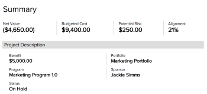

# Export the Business Case of a project in *Adobe Workfront*

You can export the Business Case to a PDF file, in case you need to print it or attach it to an email in a more condensed format.&nbsp;

## Access requirements

You must have the following:

<table cellspacing="0"> 
 <col> 
 <col> 
 <tbody> 
  <tr> 
   <td role="rowheader"><em>Adobe Workfront</em> plan*</td> 
   <td> 
Any 
 </td> 
  </tr> 
  <tr> 
   <td role="rowheader"><em>Adobe Workfront</em> license*</td> 
   <td> 
<em>Review</em> or higher
 </td> 
  </tr> 
  <tr> 
   <td role="rowheader">Access level configurations*</td> 
   <td> 
View access to Projects, Financial Data, and Resource Management
 
Note: If you still don't have access, ask your <em>Workfront administrator</em> if they set additional restrictions in your access level. For information on how a <em>Workfront administrator</em> can modify your access level, see <a href="../../../administration-and-setup/add-users/configure-and-grant-access/create-modify-access-levels.md" class="MCXref xref">Create or modify custom access levels</a>.
 </td> 
  </tr> 
  <tr> 
   <td role="rowheader">Object permissions</td> 
   <td> 
View or higher permissions on the project
 
For information on requesting additional access, see <a href="../../../workfront-basics/grant-and-request-access-to-objects/request-access.md" class="MCXref xref">Request access to objects in Adobe Workfront</a>.
 </td> 
  </tr> 
 </tbody> 
</table>

&#42;To find out what plan, license type, or access you have, contact your *Workfront administrator*.

## Export the Business Case

<ol> 
 <li value="1"> 
Go to the project that you want to export the Business Case from.
 </li> 
 <li value="2"> <draft-comment>
   
Click Business Case in the left panel. 

  </draft-comment>
Click Business Case in the left panel. 
 </li> 
 <li value="3"> 
In the upper-right Business Case Summary area, click Export.
 
   A PDF&nbsp; file is downloaded to your computer. The file contains all areas of the Business Case in an easy to read format.
 
  
 </li> 
 <li value="4">(Optional) You can attach the PDF file to an email, or print it to share it with others.&nbsp;</li> 
</ol>

