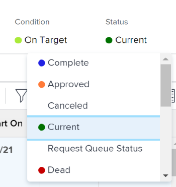

# Change the status of a project

You can manually change the status of a project.

## Access requirements

You must have the following access to perform the steps in this article:

<table cellspacing="0"> 
 <col> 
 <col> 
 <tbody> 
  <tr> 
   <td role="rowheader"><em>Adobe Workfront</em> plan*</td> 
   <td> 
Any
 </td> 
  </tr> 
  <tr> 
   <td role="rowheader"><em>Adobe Workfront</em> license*</td> 
   <td> 
<em>Plan</em> 
 </td> 
  </tr> 
  <tr> 
   <td role="rowheader">Access level configurations*</td> 
   <td> 
Edit access to Projects
 
Note: If you still don't have access, ask your <em>Workfront administrator</em> if they set additional restrictions in your access level. For information on how a <em>Workfront administrator</em> can modify your access level, see <a href="../../../administration-and-setup/add-users/configure-and-grant-access/create-modify-access-levels.md" class="MCXref xref">Create or modify custom access levels</a>.
 </td> 
  </tr> 
  <tr> 
   <td role="rowheader">Object permissions</td> 
   <td> 
Manage permissions on the project
 
For information on requesting additional access, see <a href="../../../workfront-basics/grant-and-request-access-to-objects/request-access.md" class="MCXref xref">Request access to objects in Adobe Workfront</a>.
 </td> 
  </tr> 
 </tbody> 
</table>

&#42;To find out what plan, license type, or access you have, contact your *Workfront administrator*.

## Considerations about updating to specific statuses

* `When updating a project to Complete:` Ensure that all tasks and issues are completed on the project. You cannot select the Complete status for a project, or any other status that equates Complete when there are tasks or issues that have not been completed on the project. This includes approving any task or issue that is in a Complete-Pending Approval status.
* `When updating a project from Complete to Current:` If all the tasks and issues on the project are completed, ensure that the project's Completion Mode is set to Manual. If the project's Completion&nbsp;Mode is Automatic, the status of the project remains Complete.

## Change project status

<ol> 
 <li value="1">Go to the project whose status you want to update.</li> 
 <li value="2"> 
In the project header, click the name of the status in the Status field, then select a new status.
 
 <draft-comment>
    
   </draft-comment> 
 
Or 
 
Click <draft-comment>
    <MadCap:conditionalText data-mc-conditions="QuicksilverOrClassic.Quicksilver">
     the 
     More menu 
      next to the name of the project and click 
     Edit
    </MadCap:conditionalText>
   </draft-comment><MadCap:conditionalText data-mc-conditions="QuicksilverOrClassic.Quicksilver">
    the 
    More menu 
     next to the name of the project and click 
    Edit
   </MadCap:conditionalText> and select a new status in the Status field, then click Save.
 
The project status updates to the status you selected.  
 </li> 
</ol>

