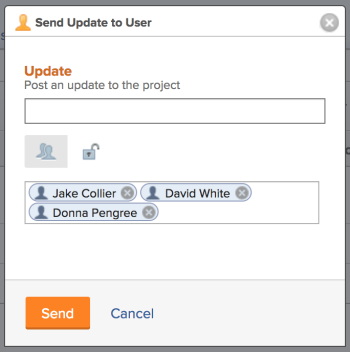

# Communicate with Project Team members

You can easily communicate with the members of your project team through `Adobe Workfront`.

All the users associated with a project form the Project&nbsp;Team.&nbsp;For information about the Project Team, see [Project Team overview](../../../manage-work/projects/planning-a-project/project-team-overview.md).

## Access requirements

You must have the following access to perform the steps in this article:

<table cellspacing="0"> 
 <col> 
 </col> 
 <col> 
 </col> 
 <tbody> 
  <tr> 
   <td role="rowheader">Adobe Workfront plan*</td> 
   <td> 
Any
 </td> 
  </tr> 
  <tr> 
   <td role="rowheader">Adobe Workfront license*</td> 
   <td> 
Request or higher
 </td> 
  </tr> 
  <tr> 
   <td role="rowheader">Access level configurations*</td> 
   <td> 
View or higher access to&nbsp;Projects
 
Note: If you still don't have access, ask your Workfront administrator if they set additional restrictions in your access level. For information on how a Workfront administrator can modify your access level, see <a href="../../../administration-and-setup/add-users/configure-and-grant-access/create-modify-access-levels.md" class="MCXref xref">Create or modify custom access levels</a>.
 </td> 
  </tr> 
  <tr> 
   <td role="rowheader">Object permissions</td> 
   <td> 
View or higher permissions to the project
 
For information on requesting additional access, see <a href="../../../workfront-basics/grant-and-request-access-to-objects/request-access.md" class="MCXref xref">Request access to objects in Adobe Workfront</a>.
 </td> 
  </tr> 
 </tbody> 
</table>

&#42;To find out what plan, license type, or access you have, contact your `Workfront administrator`.

## Send an email to a Project Team member

<ol> 
 <li value="1"> 
Go to a project whose members of the project team you want to send an email to. 
 </li> 
 <li value="2"> Click People in the left panel. You might need to click Show More first.
To update all members of the project team, click Update All in the upper-left corner of the list of project team members.

Or

To update certain members of the project team, select one or several users in the list, then click Update.  
</li> 
 <li value="3"> 
Type your update in the Post an update to this project field.
 </li> 
 <li value="4">(Optional) To make the update private, click the Lock icon. Users outside the company cannot view a private&nbsp;update.</li> 
 <li value="5"> 
Click&nbsp;Send.
 
The update and the names of the users included in it display in the Updates tab of the project.
 </li> 
</ol>

## Send updates to Project Team members and others

You can send project updates to team members and to other users that might not be part of the project team. All users must have an active `Workfront` account. The update is sent as a notification in `Workfront`.

1. Go to a project from which you want to send updates to other users.
1. (Optional and conditional) If the users you want to send updates to are not on the project team, add them to the project team.

   For information about adding users to the project team, see [Manage the Project Team](../../../manage-work/projects/planning-a-project/manage-project-team.md). 

1. Send an update to the members of the project team, as described in the

   [Send an email to a Project Team member](#sending-an-email-to-a-project-team-member) section in this article.

   The update and the names of the users included in it display in the Updates tab of the project.

&nbsp;

<!--
Go to a project whose members of the project team you want to send an email to. Click Show More, then People in the left panel. To update all members of the project team, click Update All in the upper-left corner of the list of project team members. Or To update certain members of the project team, select one or several users in the list, then click Update. Type your update in the Post an update to this project field. (Optional) To make the update private, click the Lock icon. Users outside the company cannot view a private update. (Optional) Add a user who is not part of the Project Team by typing their name in the people field, then selecting the user from the list when it displays. Click Send. The update and the names of the users included in it display in the Updates tab of the project.
-->

