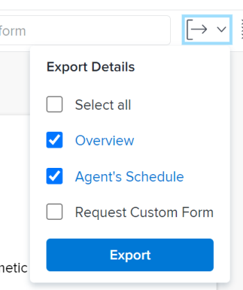
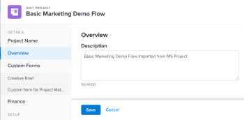
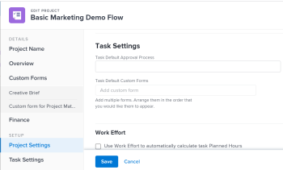

# Edit projects

You can edit a project in *Adobe Workfront* as often as needed. We recommend that you edit projects minimally after they become Current, to avoid confusion by sending out notifications about the changes to the entire project team. You should ideally edit a project when the project is in Planning status. For information about the Project Team, see [Project Team overview](../../../manage-work/projects/planning-a-project/project-team-overview.md).

## Access requirements

You must have the following access to perform the steps in this article:

<table cellspacing="0"> 
 <col> 
 <col> 
 <tbody> 
  <tr> 
   <td role="rowheader"><em>Adobe Workfront</em> plan*</td> 
   <td> 
Any
 </td> 
  </tr> 
  <tr> 
   <td role="rowheader"><em>Adobe Workfront</em> license*</td> 
   <td> 
<em>Plan</em> 
 </td> 
  </tr> 
  <tr> 
   <td role="rowheader">Access level configurations*</td> 
   <td> 
Edit access to Projects
 
Note: If you still don't have access, ask your <em>Workfront administrator</em> if they set additional restrictions in your access level. For information about access to projects, see <a href="../../../administration-and-setup/add-users/configure-and-grant-access/grant-access-projects.md" class="MCXref xref">Grant access to projects</a>. For information on how a <em>Workfront administrator</em> can change your access level, see <a href="../../../administration-and-setup/add-users/configure-and-grant-access/create-modify-access-levels.md" class="MCXref xref">Create or modify custom access levels</a>. 
 </td> 
  </tr> 
  <tr> 
   <td role="rowheader">Object permissions</td> 
   <td> 
    <ul> 
     <li> 
Contribute permissions to a project to edit it in the Project Details area 
 </li> 
     <li> 
Manage permissions to a project to edit it in the Edit Project box
 </li> 
    </ul> 
 For information about project permissions, see <a href="../../../workfront-basics/grant-and-request-access-to-objects/share-a-project.md" class="MCXref xref">Share a project in Adobe Workfront</a>.
 
For information on requesting additional access, see <a href="../../../workfront-basics/grant-and-request-access-to-objects/request-access.md" class="MCXref xref">Request access to objects in Adobe Workfront</a>.
 </td> 
  </tr> 
 </tbody> 
</table>

&#42;To find out what plan, license type, or access you have, contact your *Workfront administrator*.

## Limitations for editing projects

There are some limitations that might prevent you from editing projects.

Consider the following when editing projects:

* You cannot edit projects that are in an Approval Process, except for logging time. 
* You can attach documents or templates to a project that has a status of Complete, Dead, or is in Pending Approval only if your *Workfront administrator* or a *group administrator* enabled this functionality in the Project Preferences area. For information about setting project preferences, see [Configure system-wide project preferences](../../../administration-and-setup/set-up-workfront/configure-system-defaults/set-project-preferences.md). 

* You can only edit the following information on a project in a Dead or Complete status:

  * Modify existing expenses.
  * Add, remove, or edit custom forms.

<!--

 <draft-comment>
<h2 data-mc-conditions="QuicksilverOrClassic.Quicksilver">Edit a project </h2>
</draft-comment>
<h2 data-mc-conditions="QuicksilverOrClassic.Quicksilver">Edit a project </h2>

Editing a project allows you to modify information and settings for the project, as well as tasks and issues on the project. 

Some settings mentioned in this article might be modified from their default status for the template from which the project was created. For information about editing templates, see <a href="../../../manage-work/projects/create-and-manage-templates/edit-templates.md" class="MCXref xref">Edit project templates</a>. 

<ol>
<li value="1"> 
Click the Main Menu icon  in the upper-right corner of <em>Adobe Workfront</em>, then click Projects. 
 </li>
<li value="2"> 
(Optional) Click Projects I'm On or Projects I Own to display projects where you are the owner or projects where you are part of the project team. 
 
  
 </li>
<li value="3"> 
Click the project you want to edit to access it. 
 <note type="note">
If you are a
<em>group administrator</em>, you can see and edit your group’s projects in the Groups area as well as in the Projects area. For more information, see
<a href="../../../administration-and-setup/manage-groups/work-with-group-objects/create-and-modify-a-groups-projects.md" class="MCXref xref">Create and modify a group’s projects</a>.
 
</note> </li>
<li value="4">

(Optional) To edit limited information about a project, click Project Details in the left panel. 

  
 <note type="note">
Depending on how your
<em>Workfront administrator</em> or
<em>Group administrator</em> modified your Layout Template, the fields in the Project&nbsp;Details area might be rearranged or not display. For information, see
<a href="../../../administration-and-setup/customize-workfront/use-layout-templates/customize-details-view-layout-template.md" class="MCXref xref">Customize the Details view using a layout template</a>.
</note>

To edit information in the Details section, do the following: 

<ol>
<li value="1"> 
(Optional) Click the Collapse All icon in the upper-right corner to collapse all areas. 
 </li>
<li value="2"> 
(Optional and conditional) When an area is collapsed, click the right-pointing arrow  next to each area to expand the area you want to edit. 
 </li>
<li value="3"> 
For more information about editing information in the Project Details tab, see the following articles:

<ul>
<li> 
<a href="../../../manage-work/projects/manage-projects/understand-project-overview-area.md" class="MCXref xref">Manage information in the project Overview area</a> 
 </li>
<li> 
<a href="../../../manage-work/projects/project-finances/manage-project-finance-area.md" class="MCXref xref">Manage information in the project Finance area</a> 
 </li>
</ul> </li>
<li value="4"> 
(Optional) To attach a custom form, start typing the name of a form in the Add custom form field, then select it when it displays in the list, then click Save Changes.
 </li>
<li value="5"> 
(Optional) Click the Export icon  to export the Overview and custom forms information to a PDF file, then click Export. Select from the following:

<ul>
<li> 
Select all (displays only when there is at least one custom form attached)
 </li>
<li> 
Overview
 </li>
<li> 
The name of one or multiple custom forms
 </li>
</ul> 
The PDF file downloads to your computer. 
 
  
 
For more information, see <a href="../../../workfront-basics/work-with-custom-forms/export-custom-forms-details.md" class="MCXref xref">Export custom forms and object details in Adobe Workfront</a>.
 </li>
</ol>

For information about the fields visible in the Project Details section, continue with editing the project in the Edit Project box as described below.

 </li>
<li value="5"> 
 To edit all information about the project, click the More menu  next to the name of the project, then click Edit. 
 
Or
 
From a list of projects, select a project, then click the Edit icon  at the top of the list. 
 
The Edit Project box opens. 
 <note type="important">
You must have Manage permissions to the project in order to see the Edit option.
</note> 
All project fields are available in the Edit Project box and are grouped by the areas listed in the left panel. 
 <note type="note">
Depending on how your
<em>Workfront administrator</em> or
<em>Group administrator</em> modified your Layout Template, the areas in the left panel of the Edit Project box or any fields listed in these areas might be rearranged or not display. For information, see
<a href="../../../administration-and-setup/customize-workfront/use-layout-templates/customize-details-view-layout-template.md" class="MCXref xref">Customize the Details view using a layout template</a>.
</note> </li>
<li value="6"> 
 (Conditional) If you clicked the More menu and then Edit, consider specifying information in any of the following areas listed in the left panel:

<ul>
<li><a href="#project" class="MCXref xref">Project Name</a> </li>
<li><a href="#overview" class="MCXref xref">Overview</a> </li>
<li><a href="#custom" class="MCXref xref">Custom Forms</a> </li>
<li><a href="#finance" class="MCXref xref">Finance</a> </li>
<li><a href="#project2" class="MCXref xref">Project Settings</a> </li>
<li><a href="#task" class="MCXref xref">Task Settings</a> </li>
<li><a href="#issue" class="MCXref xref">Issue Settings</a> </li>
<li> <a href="#access2" class="MCXref xref">Access</a></li>
</ul> <note type="note">
Depending on how your
<em>Workfront administrator</em> sets up our Layout Template, the fields in the Edit Project box might be different in your environment. For information, see
<a href="../../../administration-and-setup/customize-workfront/use-layout-templates/customize-details-view-layout-template.md" class="MCXref xref">Customize the Details view using a layout template</a>.
</note> </li>
</ol>
<h3>Project Name</h3>
<ol>
<li value="1">Begin editing your project as described above.</li>
<li value="2"> 
Click Project Name in the left panel. 
 
  
 </li>
<li value="3">Update the name of the project. </li>
</ol>
<h3>Overview</h3>
<ol>
<li value="1">Begin editing your project as described above.</li>
<li value="2"> 
Click Overview in the left panel. 
 
  
 </li>
<li value="3"> 
Update the following information about the project:

<table cellspacing="0">
<col>
<col>
<tbody>
<tr>
<td role="rowheader">Description </td>
<td> 
Add additional information about the project.
 </td>
</tr>
<tr>
<td colspan="2" role="rowheader">Basic information section</td>
</tr>
<tr>
<td role="rowheader">Status </td>
<td> 
Select the status of the project. You cannot mark a project Complete before all tasks and issues complete. For information about project statuses, see <a href="../../../administration-and-setup/customize-workfront/creating-custom-status-and-priority-labels/project-statuses.md" class="MCXref xref">Access the list of system project statuses</a>
 <note type="tip">
You can update the Status in the project header.
</note> </td>
</tr>
<tr>
<td role="rowheader">Priority </td>
<td> 
 
This is just a visual flag for you which allows you to prioritize your projects.
 
Depending on the Project Preferences selected by your <em>Workfront administrator</em>, the names of priorities might be different for you. For more information about editing priorities, see <a href="../../../administration-and-setup/customize-workfront/creating-custom-status-and-priority-labels/create-customize-priorities-.md" class="MCXref xref">Create and customize priorities</a>
 
 </td>
</tr>
<tr>
<td role="rowheader">URL </td>
<td> 
Specify a web link that relates to information about this project.
 </td>
</tr>
<tr>
<td colspan="2" role="rowheader">Project condition section</td>
</tr>
<tr>
<td role="rowheader">Condition Type </td>
<td> 
Select between the following Condition Types:
<ul>
<li>Manual: The project owner sets the condition on the project manually.</li>
<li>Progress Status: <em>Workfront</em> automatically sets the condition based on the Progress Status of tasks on the Critical Path. For more information about understanding Progress Status, see <a href="../../../manage-work/tasks/task-information/task-progress-status.md" class="MCXref xref">Task Progress Status overview</a>.</li>
</ul>
Your <em>Workfront administrator</em> or a <em>group administrator</em> selects the default for how the projects' condition is calculated for your system or your group. For information about setting project defaults, see <a href="../../../administration-and-setup/set-up-workfront/configure-system-defaults/set-project-preferences.md" class="MCXref xref">Configure system-wide project preferences</a>. 

 </td>
</tr>
<tr>
<td role="rowheader">Condition </td>
<td> 
 
(Appears only after you select Manual for the Condition Type): Select a Condition to indicate how the project is going. 
 <note type="tip">
If the Condition Type is set to Manual, you can also update the Condition in the project header.
</note> 
For information how project Conditions can be set automatically or manually, see <a href="../../../manage-work/projects/manage-projects/project-condition-and-condition-type.md" class="MCXref xref">Overview of Project Condition and Condition Type</a>
 
 </td>
</tr>
<tr>
<td colspan="2" role="rowheader">Project dates section</td>
</tr>
<tr>
<td role="rowheader">Schedule Mode </td>
<td> 
Specify whether the project is scheduled from the Start Date, or from the Completion Date. This selection determines the planned dates of the tasks on the project.
<ul>
<li>Start Date: The first task of the project has the same Planned Start Date as the project by default. For information about the task Planned Start Date, see <a href="../../../manage-work/tasks/task-information/task-planned-start-date.md" class="MCXref xref">Overview of the task Planned Start Date</a>. The project timeline calculates from the Start Date and the Completion Date of the project is calculated by the system, based on the duration of all the tasks. </li>
<li>Completion Date: The last task of the project has the same Planned Completion Date as the project. The project timeline calculates from the Completion Date and the Start Date of the project is calculated by the system, by subtracting the duration of all the tasks from the Completion Date of the project. </li>
</ul>
Your <em>Workfront administrator</em> or a <em>group administrator</em> selects the default Schedule Mode setting for your system or your group. For information about setting project defaults, see <a href="../../../administration-and-setup/set-up-workfront/configure-system-defaults/set-project-preferences.md" class="MCXref xref">Configure system-wide project preferences</a>.

 </td>
</tr>
<tr>
<td role="rowheader">Planned Start Date and time </td>
<td> 
 
Specify the date when you select Schedule From Start Date.  
 
This is a read-only field when you select Schedule from Completion Date. 
 
 </td>
</tr>
<tr>
<td role="rowheader">Planned Completion Date and time </td>
<td> 
Specify the date when you select Schedule from Completion Date. 
 
This is a read-only field when you select Schedule from Start Date. 
 </td>
</tr>
<tr>
<td colspan="2" role="rowheader">Project association section</td>
</tr>
<tr>
<td role="rowheader">Portfolio</td>
<td>Indicate a Portfolio that the project belongs to. You must create a Portfolio first, before it appears in the drop-down list. Only active portfolios can be associated with a project. For more information about creating portfolios, see <a href="../../../manage-work/portfolios/create-and-manage-portfolios/create-portfolios.md" class="MCXref xref">Create a portfolio</a>.</td>
</tr>
<tr>
<td role="rowheader">Program</td>
<td> 
If you selected a Portfolio for the project, specify a Program for the project. Some Portfolios might not have Programs. You must create a Program first, before it appears in this drop-down list. Only active programs can be associated with a project. 
 
For more information about creating programs, see <a href="../../../manage-work/portfolios/create-and-manage-programs/create-program.md" class="MCXref xref">Create a program</a>.
 </td>
</tr>
<tr>
<td role="rowheader">Group</td>
<td> 
 
Specify the name of the group associated with the project. 
This is a required field. You cannot have a project which is not associated with a group. 
 
You can make sure you are selecting the right group by hovering over it and clicking the information icon  that displays next to it. This displays a tooltip listing information about the group, such as the hierarchy of groups above it and its administrators.<draft-comment>
<MadCap:conditionalText data-mc-conditions="SnippetConditions.HIDE">
Depending on the details configured for the group, you might also see its Business Leader and description.
</MadCap:conditionalText>
</draft-comment><MadCap:conditionalText data-mc-conditions="SnippetConditions.HIDE">
Depending on the details configured for the group, you might also see its Business Leader and description.
</MadCap:conditionalText>
 
  
 <note type="note">  

By default, one of the following groups is automatically associated with a project when it is created, unless you specify a different group:

<ul>
<li> 
When the project is created from the Projects area, the Home Group of the project creator is associated with the project. 
 
This is also true when the project is created from the Projects <draft-comment>
<MadCap:conditionalText data-mc-conditions="QuicksilverOrClassic.Quicksilver">
section
</MadCap:conditionalText>
</draft-comment><MadCap:conditionalText data-mc-conditions="QuicksilverOrClassic.Quicksilver">
section
</MadCap:conditionalText> in a portfolio or program.
 </li>
<li> 
When the project is created from a group’s main page in the Setup area, that group is associated with the project.
 </li>
</ul>
</note> </td>
</tr>
<tr>
<td role="rowheader">Company </td>
<td> 
Specify a company associated with the project. You must create a company before you can associate it with a project. Only active companies can be associated with a project. For information about creating companies, see <a href="../../../administration-and-setup/set-up-workfront/organizational-setup/create-and-edit-companies.md" class="MCXref xref">Create and edit companies</a>.
 </td>
</tr>
<tr>
<td colspan="2" role="rowheader">Project stakeholders section</td>
</tr>
<tr>
<td role="rowheader">Project Owner </td>
<td> 
The user specified in this field is added to the project team and is automatically given manage permissions to the project. The user who is designated as the Project Owner must be a <em>Workfront</em> active user.
 <note type="tip">
You can update the Project Owner in the project header.
 
</note> </td>
</tr>
<tr>
<td role="rowheader">Project Sponsor </td>
<td> 
The specified user is added to the project team and is automatically given view permissions to the project. The user who is designated as the Project Sponsor must be a <em>Workfront</em> active user. 
 </td>
</tr>
<tr>
<td role="rowheader">Resource Manager </td>
<td> 
The specified user is automatically given Manage permissions to the project and can assign resources to the tasks and issues on the project. The user maintains Manage permissions on the project even when they are removed from the Resource Manager field. You can specify more than one Resource Manager. 
 </td>
</tr>
</tbody>
</table> </li>
<li value="4"> 
(Optional) Continue editing the following sections, depending on the information you want to modify.
 
Or
 
Click Save.
 </li>
</ol>

<h3>Custom Forms</h3>
<ol>
<li value="1">Begin editing your project as described above.</li>
<li value="2"> 
Click Custom Forms in the left panel. 
 
  
 </li>
<li value="3"> 
Click the Add custom form box and select a form from the list to attach it to the project.
 
You must build the custom forms before they are available to select in this field. Only active custom forms appear in the list. For more information about building custom forms, see <a href="../../../administration-and-setup/customize-workfront/create-manage-custom-forms/create-or-edit-a-custom-form.md" class="MCXref xref">Create or edit a custom form</a>. You can add up to ten custom forms to a project. 
 </li>
<li value="4"> 
(Conditional) If you attached a custom form to the project, edit any fields on the form. You must specify all required fields before you can save the project. 
 <note type="note">
Depending on how your
<em>Workfront</em> administrator set the permissions for the sections in your custom form, not everyone can view or edit the same fields on a given custom form. The permissions to edit fields within a section of a custom form depend on the permissions you have on the project itself. For information about setting permissions on sections of a custom form, see
<a href="../../../administration-and-setup/customize-workfront/create-manage-custom-forms/create-or-edit-a-custom-form.md" class="MCXref xref">Create or edit a custom form</a>. For information about setting permissions on projects, see
<a href="../../../workfront-basics/grant-and-request-access-to-objects/share-a-project.md" class="MCXref xref">Share a project in Adobe Workfront</a>.
 
</note> </li>
<li value="5"> 
(Optional) Click the X icon to the right of the name of a custom form to remove it, then click Remove. 
 </li>
<li value="6"> 
(Optional) Continue editing the following sections, depending on the information you want to modify
 
Or
 
Click Save.
 </li>
</ol>

<h3>Finance</h3>
<ol>
<li value="1">Begin editing your project as described above.</li>
<li value="2"> 
Click Finance in the left panel. 
 
  
 </li>
<li value="3"> 
Update the following financial information for the project:

<table cellspacing="0">
<col>
<col>
<tbody> <draft-comment>
<tr data-mc-conditions="">
<td colspan="2" role="rowheader">Budget section</td>
</tr>
</draft-comment>
<tr data-mc-conditions="">
<td colspan="2" role="rowheader">Budget section</td>
</tr> <draft-comment>
<tr data-mc-conditions="">
<td role="rowheader">Project Currency </td>
<td> 
 
Specify the currency for the project, if it is different than the default currency of your system. You cannot change the currency of a project if there is already financial information on the project. This field is not visible if you have only the default currency in the system. 
 
For more information about currency, see <a href="../../../administration-and-setup/manage-workfront/exchange-rates/set-up-exchange-rates.md" class="MCXref xref">Set up exchange rates</a>. 
 
 </td>
</tr>
</draft-comment>
<tr data-mc-conditions="">
<td role="rowheader">Project Currency </td>
<td> 
 
Specify the currency for the project, if it is different than the default currency of your system. You cannot change the currency of a project if there is already financial information on the project. This field is not visible if you have only the default currency in the system. 
 
For more information about currency, see <a href="../../../administration-and-setup/manage-workfront/exchange-rates/set-up-exchange-rates.md" class="MCXref xref">Set up exchange rates</a>. 
 
 </td>
</tr>
<tr>
<td role="rowheader">Budget </td>
<td> 
Specify a Budget for the project. 
 </td>
</tr>
<tr>
<td colspan="2" role="rowheader">Performance metrics section</td>
</tr>
<tr>
<td role="rowheader">Performance Index Method </td>
<td> 
Specify whether the Earned Value metrics of the project are calculated using hours or costs. 
 
For more information about the Performance Index Method, see <a href="../../../manage-work/projects/project-finances/set-pim.md" class="MCXref xref">Set the Performance Index Method (PIM)</a>. 
 
Your <em>Workfront administrator</em> or a <em>group administrator</em> selects the default Performance Index Method setting for your system or your group. For information about setting project defaults, see <a href="../../../administration-and-setup/set-up-workfront/configure-system-defaults/set-project-preferences.md" class="MCXref xref">Configure system-wide project preferences</a>.
 </td>
</tr>
<tr>
<td role="rowheader">Estimate at Completion </td>
<td> 
 
Specify how Estimate at Completion (EAC) calculates. 
 
For more information about how the Estimate at Completion calculates, see <a href="../../../manage-work/projects/project-finances/calculate-eac.md" class="MCXref xref">Calculate Estimate At Completion (EAC)</a>.
 
Your <em>Workfront administrator</em> or a <em>group administrator</em> selects the default Estimate at Completion setting for your system or your group. For information about setting project defaults, see <a href="../../../administration-and-setup/set-up-workfront/configure-system-defaults/set-project-preferences.md" class="MCXref xref">Configure system-wide project preferences</a>.
 
 </td>
</tr>
<tr>
<td colspan="2" role="rowheader">Benefit section</td>
</tr>
<tr>
<td role="rowheader">Planned Benefit </td>
<td> 
Estimate what the Planned Benefit of the project is. This is used in the Business Case of the project and the Portfolio Optimizer. For more information about the Planned Benefit of a project, see <a href="../../../manage-work/projects/project-finances/project-planned-benefit.md" class="MCXref xref">Overview of project Planned Benefit</a>. The Planned Benefit of a project is taken into account when the Net Value of a project is calculated. 
 
For more information, see <a href="../../../manage-work/portfolios/portfolio-optimizer/manage-projects-in-portfolio-optimizer.md" class="MCXref xref">Manage projects in the Portfolio Optimizer</a> . 
 </td>
</tr>
<tr>
<td role="rowheader">Actual Benefit </td>
<td> 
Estimate the Actual Benefit of the project. This is a currency amount that represents the benefit that your company or department would gain after this project is complete. 
 </td>
</tr>
<tr>
<td colspan="2" role="rowheader">Revenue section</td>
</tr>
<tr>
<td role="rowheader">Fixed Revenue </td>
<td> 
Specify the Fixed Revenue for the project. 
 </td>
</tr>
<tr>
<td colspan="2" role="rowheader">Cost section</td>
</tr>
<tr>
<td role="rowheader">Fixed Cost </td>
<td> 
Specify the Fixed Cost for the project. This is different than the Labor Cost which comes from the hours on the project and the Expense Cost which comes from the amount of expenses on the project. The Fixed Cost of a project is taken into account when calculating the Net Value of a project and it is part of the Budgeted Cost. 
 </td>
</tr>
</tbody>
</table> </li>
<li value="4"> 
(Optional) Continue editing the following sections, depending on the information you want to modify.
 
Or
 
Click Save.
 </li>
</ol>
<h3>Project Settings</h3>
<ol>
<li value="1">Begin editing your project as described above.</li>
<li value="2"> 
Click Settings in the left panel. 
 
  
 </li>
<li value="3"> 
Update the following information:
 

<table cellspacing="0">
<col>
<col>
<tbody>
<tr>
<td role="rowheader">Milestone Path </td>
<td> 
Select a Milestone Path for the project. Only active milestone paths display in the list.
 
For more information about Milestone Paths, see <a href="../../../administration-and-setup/customize-workfront/configure-approval-milestone-processes/create-milestone-path.md" class="MCXref xref">Create a milestone path</a>.
 </td>
</tr>
<tr>
<td role="rowheader">Completion Mode </td>
<td> 
Controls how the project is marked as Complete. Select from the following options:
<ul>
<li>
Automatic: The project is marked Complete when all the tasks and issues are completed.
<note type="note">
The project Status is automatically changed to Complete only when the project status is Current when the tasks are completed.
</note></li>
<li>Manual: You have to manually select the Complete status for the project, when all the tasks and issues are completed.</li>
</ul>
 </td>
</tr>
<tr>
<td role="rowheader">Summary Completion Mode </td>
<td> 
Controls how the parent tasks are marked as Complete. Select from the following options:
<ul>
<li>Automatic: The parent tasks are marked Complete and they update their percent complete automatically, as the children tasks are completed and the percent complete of the children is updated. </li>
<li>Manual: You have to manually update the percent complete and the status of the parent tasks, independently of what changes are made to the children tasks.</li>
</ul>
 </td>
</tr>
<tr>
<td role="rowheader">Update Type </td>
<td> 
Controls when the changes you make to the project timeline are saved on the project or the parent tasks. For example, the following changes to the project trigger an update to the timeline of the project:
<ul>
<li>Update the dates of tasks</li>
<li>Change predecessor relationships of tasks</li>
<li>
Change parent-child relationships, adding or removing assignments in addition to changing the task constraint or duration type.

When the tasks update, their parent objects (parent tasks or the project) update at the time indicated by the Update Type. 
<note type="note">
If the parent objects do not update immediately after the change when selecting "Automatic and On Change" or "Change Only" Update Type, refresh the page
</note>
Select from the following options: 

- Automatic and On Change (Default setting): The project timeline is updated each time a change occurs in the project or in another project that the project is dependent on (On Change). The project timeline is also updated each night (Automatic).

This is the recommended setting for this field because it ensures that the project is always up to date.

When you perform an action on a task or project that triggers a timeline recalculation, all available dates are immediately displayed, allowing you to continue working. On projects with more than 100 tasks, dates that require longer recalculations display briefly as a question mark (between 1 and 5 seconds, or up to a minute for large projects). This indicates that the recalculation is not yet finished, and the dates are subject to change.

- Change Only: The project timeline is updated each time a change occurs in the project or in another project that the project is dependent on. You might want to select this option if changes rarely occur in the project or in other projects that the timeline is dependent on.

- Automatic Only: The project timeline is updated each night; the timeline is not updated immediately after changes are made.

You might want to select this option if many changes occur each day in the project or in other projects that the timeline is dependent on. However, be aware that you chose this setting, as the project will not update at the same time that the changes are made.

- Manual Only: The project timeline is updated only when you select the option to Recalculate Timeline. For more information about manually recalculating the project timeline, see <a href="../../../manage-work/projects/manage-projects/recalculate-project-timeline.md" class="MCXref xref">Recalculate project timelines</a>. 

You might want to select this option if you are making many changes to the project at one time, and you want the timeline recalculation to occur after all of the changes have been made (rather than after each individual change).
</li>
</ul>
 </td>
</tr>
<tr>
<td role="rowheader">Schedule </td>
<td> 
Select a schedule for your project. This should be the same schedule assigned to most people that are working on the project. You must create a schedule before you can assign it to a project or a user. If you have not created custom schedules in your system, the Default Schedule is selected.
 
For more information about creating schedules, see <a href="../../../administration-and-setup/set-up-workfront/configure-timesheets-schedules/create-schedules.md" class="MCXref xref">Create a schedule</a>. 
 </td>
</tr>
<tr>
<td role="rowheader">User Time Off </td>
<td> 
Determines whether the time off of the Primary Assignee of a task adjusts the task planned dates on the project. 

Your <em>Workfront administrator</em> or a <em>group administrator</em> selects the default for this setting for your system or your group. For information about setting project defaults, see <a href="../../../administration-and-setup/set-up-workfront/configure-system-defaults/set-project-preferences.md" class="MCXref xref">Configure system-wide project preferences</a>. 

Select from the following options: - Consider user time off in task durations: When selecting this option, the planned dates of the tasks adjust according to the time off of the Primary Assignee of the task, if the time off occurs during the duration of the task. 

For example, if a task with a constraint of As Soon As Possible is scheduled to start on June 1 and complete on June 3, and the Primary Assignee has June 2 marked for Time-off, when this selection is enabled the task planned dates are June 1 to June 4. Depending on the Task&nbsp;Constraint, the following scenarios exist: 

<ul>
<li>For task constraints that relate to planning from a start date (As Soon As Possible, Earliest Available Time, Start No Earlier Than, Start No Later Than, Must Start On) the Planned Start Date does not change but the Planned Completion Date changes.</li>
<li>For task constraints that relate to planning from a completion date (As Late As Possible, Latest Available Time,&nbsp;Finish No Earlier Than, Finish No Later Than, Must&nbsp;Finish On), the Planned Completion Date does not change, but the Planned Start&nbsp;Date changes.</li>
<li>For tasks with a constraint of Fixed&nbsp;Dates, neither the Planned Start nor Completion Date changes. </li>
</ul><note type="important">
The Duration of the task does not change when you select this setting. Only the planned dates change, depending on the Task Constraint. For information about task constraint, see
<a href="../../../manage-work/tasks/task-constraints/task-constraint-overview.md" class="MCXref xref">Task Constraint overview</a>.
</note>
- Ignore user time off in task durations: When selecting this option, the planned dates of the tasks on the project remain as originally planned, even if the Primary Assignee of the task has time off during the duration of the task. 

Consider the following when selecting options for this setting:

<ul>
<li>
The default option for this setting for a new project is the same as the system-level project preference. 

For information about the project preferences at the System level, see <a href="../../../administration-and-setup/set-up-workfront/configure-system-defaults/set-project-preferences.md" class="MCXref xref">Configure system-wide project preferences</a>. 
</li>
<li>When you attach a template to an existing project, the setting on the project is updated to match the one of the template. </li>
<li>
<em>Workfront</em> decides which planned task dates to adjust according to the Task Constraint value of the task. Depending on what that is, either the Planned Start or the Planned Completion Date, or both could be affected, or might even remain the same. For example, if a task has a Constraint of Fixed Dates, the dates do not adjust when the Primary Assignee has time off, even when Consider user time off in task durations is selected. 
</li>
</ul></td>
</tr>
<tr>
<td role="rowheader">Resource Leveling Mode </td>
<td> 
 
Select from the following options:
 
- Manual: you must manually level your resources (this is the default setting)
 
- Automatic: <em>Workfront</em> levels your resources.
 
For more information about Resource Leveling, see <a href="../../../manage-work/gantt-chart/use-the-gantt-chart/level-resources-in-gantt.md" class="MCXref xref">Level Resources in the Gantt Chart </a>.
 
 </td>
</tr>
<tr>
<td role="rowheader">Risk </td>
<td> 
 
Define the level of risk of your project. The risk is just an indicator of how risky a project can be. You can prioritize the execution of your projects based on the level of risk.
 
 
Consider selecting from the following levels of risk:
 
- Very Low
 
- Low
 
- Medium
 
- High
 
- Very High
 
The levels of risks you indicate here cannot be customized.
 <note type="note">
These are not related to the potential Risks that could occur during the life of a project and which you should record in the Risks tab of the project, or in the Business Case. For information about potential project Risks, see
<a href="../../../administration-and-setup/set-up-workfront/configure-system-defaults/edit-create-risk-types.md" class="MCXref xref">Edit and create risk types </a>.
</note> 
 
 </td>
</tr>
<tr>
<td role="rowheader">Resource Pools </td>
<td> 
 
Specify the Resource Pools associated with the project. Resource Pools are collections of users that are needed at the same time for the completion of a project and allow for project budgeting in the <em>Resource Planner</em>. For more information about Resource Pools, see <a href="../../../resource-mgmt/resource-planning/resource-pools/work-with-resource-pools.md" class="MCXref xref"> Resource pools overview in Adobe Workfront</a>. 
 <note type="note">
When you edit projects in bulk, only the Resource Pools that are common to all the projects selected appear in this field. If the projects selected have no shared Resource Pools, this field will be empty. The Resource Pools you specify here will overwrite the projects' individual Resource Pools.
</note> 
 </td>
</tr>
<tr>
<td role="rowheader"> Allow company-level billing rates to override project-level billing rates</td>
<td>Select this option to allow company-level billing rates to override historical job role rates unless those rates are marked as billed. Enabling this option overrides historical job role rates unless they are marked as billed.  For more information, see <a href="../../../manage-work/projects/project-finances/override-project-level-with-company-level-billing-rates.md" class="MCXref xref">Override Project-Level Billing Rates with Company-Level Billing Rates</a>.</td>
</tr>
<tr>
<td role="rowheader">Require time to be approved for this project</td>
<td> 
 Select this option to require the Project Owner to approve time logged on the project. If you are using Billing Records and you select this option, only the approved hours on the project appear as available billable hours for the Billing Records. Approving time on the project is independent of approving timesheets. 
 
For more information about requiring time to be approved on a project, see <a href="../../../manage-work/projects/manage-projects/require-time-approval-for-projects.md" class="MCXref xref">Require time to be approved for a project</a>.
 </td>
</tr>
<tr>
<td role="rowheader">Filter Hour Types and Hour Types</td>
<td> 
 
Consider the following:

<ul>
<li> 
Select No to make all project-specific hour types available on the project. (This is the default selection)
 
Or
 </li>
<li>Select Yes to make only a subset of the project-specific hour types available on the project, then select the hour types you want to make available. (Hold the Shift key to select multiple hour types.)</li>
</ul> 
If you select this option, only the hour types you select are made available to select when logging hours on the project (or on tasks and issues within the project). You must select at least one hour type; if you select this option and you do not select any hour types, all hour types are made available on the project.
 
The same hour type selections must be made at the individual user level in order for the user to see these hour type options on the project. For more information about defining hour types at the user level, see <a href="../../../timesheets/create-and-manage-timesheets/log-time.md" class="MCXref xref">Log time</a>. 
 
 </td>
</tr> <draft-comment>
<tr data-mc-conditions="">
<td role="rowheader">Reminder Notification </td>
<td> 
 
Select the Reminder Notification that should be associated with the project. You must configure Reminder Notifications for projects for this field to appear during editing a project. For more information about configuring Reminder Notifications, see <a href="../../../administration-and-setup/manage-workfront/emails/set-up-reminder-notifications.md"><a href="../../../administration-and-setup/manage-workfront/emails/set-up-reminder-notifications.md" class="MCXref xref">Set up reminder notifications</a> .</a>
 
 </td>
</tr>
</draft-comment>
<tr data-mc-conditions="">
<td role="rowheader">Reminder Notification </td>
<td> 
 
Select the Reminder Notification that should be associated with the project. You must configure Reminder Notifications for projects for this field to appear during editing a project. For more information about configuring Reminder Notifications, see <a href="../../../administration-and-setup/manage-workfront/emails/set-up-reminder-notifications.md"><a href="../../../administration-and-setup/manage-workfront/emails/set-up-reminder-notifications.md" class="MCXref xref">Set up reminder notifications</a> .</a>
 
 </td>
</tr> <draft-comment>
<tr data-mc-conditions="">
<td role="rowheader">Approval Process</td>
<td> 
Select the approval process you want to associate with the project. Your <em>Workfront administrator</em> must define system-level Approval Processes before you can associate them with projects. A user with administrative access to Approval processes can also create group-specific approval processes. For more information about creating approval processes, see <a href="../../../administration-and-setup/customize-workfront/configure-approval-milestone-processes/create-approval-processes.md" class="MCXref xref">Create an approval process for work items</a>.
 
Consider the following when adding approval processes: 

<ul>
<li>Only active approval processes display in the list. </li>
<li> 
System-wide and group-specific approval processes display in the list. An approval process associated with a group other than that of the project does not display in the list.
 <note type="important">
If the group associated with the project changes, the group-specific approval process becomes a single-use approval process. For more information about how changes to the group of the project or changes in the approval process affect approval settings, see
<a href="../../../administration-and-setup/customize-workfront/configure-approval-milestone-processes/how-changes-affect-group-approvals.md" class="MCXref xref">How group and approval process changes affect assigned approval processes</a>.
</note> </li>
<li> 
When bulk-editing projects, the following scenarios exist:

<ul>
<li> 
When you select projects from the same group, both system-level and group-level approval processes display in this field.
 </li>
<li> 
When you select projects from different groups, only system-level approval processes display in this field.
 </li>
<li> 
When any of the projects have a single-use approval process attached, it is replaced by the system-level or group-level approval process you select. 
 </li>
</ul> </li>
</ul> </td>
</tr>
</draft-comment>
<tr data-mc-conditions="">
<td role="rowheader">Approval Process</td>
<td> 
Select the approval process you want to associate with the project. Your <em>Workfront administrator</em> must define system-level Approval Processes before you can associate them with projects. A user with administrative access to Approval processes can also create group-specific approval processes. For more information about creating approval processes, see <a href="../../../administration-and-setup/customize-workfront/configure-approval-milestone-processes/create-approval-processes.md" class="MCXref xref">Create an approval process for work items</a>.
 
Consider the following when adding approval processes: 

<ul>
<li>Only active approval processes display in the list. </li>
<li> 
System-wide and group-specific approval processes display in the list. An approval process associated with a group other than that of the project does not display in the list.
 <note type="important">
If the group associated with the project changes, the group-specific approval process becomes a single-use approval process. For more information about how changes to the group of the project or changes in the approval process affect approval settings, see
<a href="../../../administration-and-setup/customize-workfront/configure-approval-milestone-processes/how-changes-affect-group-approvals.md" class="MCXref xref">How group and approval process changes affect assigned approval processes</a>.
</note> </li>
<li> 
When bulk-editing projects, the following scenarios exist:

<ul>
<li> 
When you select projects from the same group, both system-level and group-level approval processes display in this field.
 </li>
<li> 
When you select projects from different groups, only system-level approval processes display in this field.
 </li>
<li> 
When any of the projects have a single-use approval process attached, it is replaced by the system-level or group-level approval process you select. 
 </li>
</ul> </li>
</ul> </td>
</tr>
<tr>
</tr>
</tbody>
</table> 
 </li>
<li value="4"> 
(Optional) Continue editing the following sections, depending on the information you want to modify. 
 
Or
 
Click Save.
 </li>
</ol>

<h3>Task Settings</h3>

You can define the defaults that will be associated with all the new tasks when you add them to the project.

For information about how these settings affect creating new tasks, see the section <a href="../../../manage-work/tasks/create-tasks/create-tasks-overview.md#understa" class="MCXref xref">Task defaults when adding tasks to a project</a> in the article <a href="../../../manage-work/tasks/create-tasks/create-tasks-overview.md" class="MCXref xref">Create tasks overview</a>. 

<ol>
<li value="1">Begin editing your project as described above.</li>
<li value="2"> 
Click Task Settings in the left panel. 
 
  
 </li>
<li value="3"> 
In the Task Default Approval Process box, select the task Approval Process you want to associate with all new tasks when you add them to the project. 
 
Your <em>Workfront administrator</em> (or a user with administrative access to Approval processes) must create a system-level approval process for a task before you can associate it with a project. Only active approval processes display in the list. For information about creating Approval Processes, see <a href="../../../administration-and-setup/customize-workfront/configure-approval-milestone-processes/create-approval-processes.md" class="MCXref xref">Create an approval process for work items</a>. For information about how changes to the group of the project or changes in the approval process affect approval settings, see <a href="../../../administration-and-setup/customize-workfront/configure-approval-milestone-processes/how-changes-affect-group-approvals.md" class="MCXref xref">How group and approval process changes affect assigned approval processes</a>.
 
When bulk-editing projects, the following scenarios exist:

<ul>
<li> 
When you select multiple projects from the same group, both system-level and group-specific task approval processes display in this field.
 </li>
<li> 
When you select multiple projects from different groups, only system-level task approval processes display in this field.
 </li>
</ul> </li>
<li value="4"> 
In the Task Default Custom Forms box, select the custom form or forms that you want to associate with all new tasks when you add them to the project. You must build the custom forms before they are available to select in this field. Only active custom forms display in the list. For more information about building custom forms, see <a href="../../../administration-and-setup/customize-workfront/create-manage-custom-forms/create-or-edit-a-custom-form.md" class="MCXref xref">Create or edit a custom form</a>. You can associate up to ten custom forms with a task.
 </li>
<li value="5"> 
(Optional) Select <b>Use <em>Work Effort</em> to automatically calculate task Planned Hours</b> if you want to enable managing task effort by using <em>Work Effort</em> instead of Planned Hours.
 
  
 </li>
<li value="6"> 
(Conditional and optional) If you selected Use <em>Work Effort</em> to automatically calculate task Planned Hours, click the drop-down menu for each level of effort and select a percentage for each level. The following percentage values are defaults:

<table cellspacing="0">
<col>
<col>
<tbody>
<tr>
<td role="rowheader">Small</td>
<td>25%</td>
</tr>
<tr>
<td role="rowheader">Medium</td>
<td>50%</td>
</tr>
<tr>
<td role="rowheader">Large</td>
<td>75%</td>
</tr>
</tbody>
</table> <note type="tip">
When the project Update Type is set to Automatic and you select this setting, the Planned Hours of the tasks update according to the task Duration and the <em>Work Effort</em> percentage, if they are set to zero. For more information about using <em>Work Effort</em> to plan effort for a task, see
<a href="../../../manage-work/tasks/task-information/work-effort.md" class="MCXref xref">Work Effort overview</a>.
</note> </li>
<li value="7"> 
(Optional) Continue editing the following sections, depending on the information you want to modify.
 
Or
 
Click Save.
 </li>
</ol>

<h3> </h3>

<h3>Issue Settings</h3>
<ol>
<li value="1"> 
Begin editing your project as described above.
 </li>
<li value="2"> 
Click Issue Settings in the left panel.
 
  
 </li>
<li value="3"> 
(Optional) Deselect the Allow users to add issues inline option. It is selected by default. 
 
When deselecting this option users cannot add issues inline to the project or the tasks in the Issues section.
 <note type="tip">
Deselect this option if you want to enforce users to complete the New Issue Fields or the custom forms associated with new issues. Enabling users to enter issues inline allows them to bypass the New Issue fields and custom forms when creating issues. For information about setting fields and custom forms for new issues, see
<a href="../../../manage-work/requests/create-and-manage-request-queues/create-request-queue.md" class="MCXref xref">Create a Request Queue</a>.
</note> 
When deselecting this option, users with permissions to add issues to the project or the tasks can do so in the following ways: 

<ul>
<li> 
Click New Issue at the top of the list of issues in the Issues section of the project or of the tasks. 
 </li>
<li> 
When the project is configured as a request queue, they can enter a new request in the Requests area. 
 </li>
</ul> <note type="note">
When editing projects in bulk this setting is enabled if at least one project has it enabled and it is disabled if all selected projects have it disabled.
</note> </li>
<li value="4"> 
(Optional) Continue editing the following sections, depending on the information you want to modify.
 
Or
 
Click Save.
 </li>
</ol>

<h3>Access</h3>
<ol>
<li value="1">Begin editing your project as described above.</li>
<li value="2"> 
Click Access in the left panel. 
 
  
 </li>
<li value="3">Specify the following Access information for the project: 
<table cellspacing="0">
<col>
<col>
<tbody> <draft-comment>
<tr data-mc-conditions="">
<td role="rowheader">When someone is assigned to a task</td>
<td>
Select from View, Contribute, or Manage access to a task. The user assigned to a task is automatically granted this access to the task.
</td>
</tr>
</draft-comment>
<tr data-mc-conditions="">
<td role="rowheader">When someone is assigned to a task</td>
<td>
Select from View, Contribute, or Manage access to a task. The user assigned to a task is automatically granted this access to the task.
</td>
</tr> <draft-comment>
<tr data-mc-conditions="">
<td role="rowheader">Also grant access to the project</td>
<td>
Select from View, Contribute, or Manage access to the project. The user assigned to a task is automatically granted this access to the project, as well. 
</td>
</tr>
</draft-comment>
<tr data-mc-conditions="">
<td role="rowheader">Also grant access to the project</td>
<td>
Select from View, Contribute, or Manage access to the project. The user assigned to a task is automatically granted this access to the project, as well. 
</td>
</tr> <draft-comment>
<tr data-mc-conditions="">
<td role="rowheader">When someone is assigned to an issue</td>
<td>
Select from View, Contribute, or Manage access to an issue. The user assigned to an issue is automatically granted this access to the issue. For more information, see <a href="../../../workfront-basics/grant-and-request-access-to-objects/share-an-issue.md" class="MCXref xref">Share an issue in Adobe Workfront</a>. 
</td>
</tr>
</draft-comment>
<tr data-mc-conditions="">
<td role="rowheader">When someone is assigned to an issue</td>
<td>
Select from View, Contribute, or Manage access to an issue. The user assigned to an issue is automatically granted this access to the issue. For more information, see <a href="../../../workfront-basics/grant-and-request-access-to-objects/share-an-issue.md" class="MCXref xref">Share an issue in Adobe Workfront</a>. 
</td>
</tr> <draft-comment>
<tr data-mc-conditions="">
<td role="rowheader">Also grant access to the project</td>
<td>
Select from View, Contribute, or Manage access to the project. The user assigned to an issue is automatically granted this access to the project, as well. 
</td>
</tr>
</draft-comment>
<tr data-mc-conditions="">
<td role="rowheader">Also grant access to the project</td>
<td>
Select from View, Contribute, or Manage access to the project. The user assigned to an issue is automatically granted this access to the project, as well. 
</td>
</tr> <draft-comment>
<tr data-mc-conditions="">
<td role="rowheader">When someone submits a request: Give them access</td>
<td>
Select from View, Contribute, or Manage access to the request. When the project is also a request queue and a user submits a request to the project, they are granted this access to the request they submitted. For information about setting up a project as a request queue, see <a href="../../../manage-work/requests/create-and-manage-request-queues/create-request-queue.md" class="MCXref xref">Create a Request Queue</a>. 
</td>
</tr>
</draft-comment>
<tr data-mc-conditions="">
<td role="rowheader">When someone submits a request: Give them access</td>
<td>
Select from View, Contribute, or Manage access to the request. When the project is also a request queue and a user submits a request to the project, they are granted this access to the request they submitted. For information about setting up a project as a request queue, see <a href="../../../manage-work/requests/create-and-manage-request-queues/create-request-queue.md" class="MCXref xref">Create a Request Queue</a>. 
</td>
</tr> <draft-comment>
<tr data-mc-conditions="">
<td role="rowheader">People from the same company will inherit the same permissions for all requests</td>
<td>
Select this field if you want people from the same company to have the same access to all the requests on the project, whether they submitted them or not. 
</td>
</tr>
</draft-comment>
<tr data-mc-conditions="">
<td role="rowheader">People from the same company will inherit the same permissions for all requests</td>
<td>
Select this field if you want people from the same company to have the same access to all the requests on the project, whether they submitted them or not. 
</td>
</tr>
<tr>
<td role="rowheader">When someone is given access to this project: Give them access to ...</td>
<td>
Select the access options that you want users to have on the project, if the project is shared with them. Select the specific options for their access if they are designated as Viewers, Contributors, or Managers when sharing the project with them. 
<note type="note">
The
Delete access in the
Manage permission level determines whether users can&nbsp;delete the project itself. Users with
Manage access to the project can delete tasks and issues within the project regardless of whether this option is selected, if they have
Manage permissions to the tasks and issues.&nbsp;
</note></td>
</tr>
</tbody>
</table></li>
<li value="4"> 
Click Save.
 </li>
</ol>

-->

## Edit a project

Editing a project allows you to modify information and settings for the project, as well as tasks and issues on the project.

Some settings mentioned in this article might be modified from their default status for the template from which the project was created. For information about editing templates, see [Edit project templates](../../../manage-work/projects/create-and-manage-templates/edit-templates.md).

<ol> 
 <li value="1"> 
Click the Main Menu icon  in the upper-right corner of <em>Adobe Workfront</em>, then click Projects. 
 </li> 
 <li value="2"> 
(Optional) Click Projects I'm On or Projects I Own to display projects where you are the owner or projects where you are part of the project team. 
 
  
 </li> 
 <li value="3"> 
Click the project you want to edit to access it. 
 <note type="note">
   If you are a 
   <em>group administrator</em>, you can see and edit your group’s projects in the Groups area as well as in the Projects area. For more information, see 
   <a href="../../../administration-and-setup/manage-groups/work-with-group-objects/create-and-modify-a-groups-projects.md" class="MCXref xref">Create and modify a group’s projects</a>. 
    
  </note> </li> 
 <li value="4"> 
  
 
   
(Optional) To edit limited information about a project, click Project Details in the left panel. 
 
   
  
 <note type="note">
    Depending on how your 
    <em>Workfront administrator</em> or 
    <em>Group administrator</em> modified your Layout Template, the fields in the Project&nbsp;Details area might be rearranged or not display. For information, see 
    <a href="../../../administration-and-setup/customize-workfront/use-layout-templates/customize-details-view-layout-template.md" class="MCXref xref">Customize the Details view using a layout template</a>. 
   </note> 
   
To edit information in the Details section, do the following: 
 
   <ol> 
    <li value="1"> 
(Optional) Click the Collapse All icon in the upper-right corner to collapse all areas. 
 </li> 
    <li value="2"> 
(Optional and conditional) When an area is collapsed, click the right-pointing arrow  next to each area to expand the area you want to edit. 
 </li> 
    <li value="3"> 
For more information about editing information in the Project Details tab, see the following articles:
 
     <ul> 
      <li> 
<a href="../../../manage-work/projects/manage-projects/understand-project-overview-area.md" class="MCXref xref">Manage information in the project Overview area</a> 
 </li> 
      <li> 
<a href="../../../manage-work/projects/project-finances/manage-project-finance-area.md" class="MCXref xref">Manage information in the project Finance area</a> 
 </li> 
     </ul> </li> 
    <li value="4"> 
(Optional) To attach a custom form, start typing the name of a form in the Add custom form field, then select it when it displays in the list, then click Save Changes.
 </li> 
    <li value="5"> 
(Optional) Click the Export icon  to export the Overview and custom forms information to a PDF file, then click Export. Select from the following:
 
     <ul> 
      <li> 
Select all (displays only when there is at least one custom form attached)
 </li> 
      <li> 
Overview
 </li> 
      <li> 
The name of one or multiple custom forms
 </li> 
     </ul> 
The PDF file downloads to your computer. 
 
  
 
For more information, see <a href="../../../workfront-basics/work-with-custom-forms/export-custom-forms-details.md" class="MCXref xref">Export custom forms and object details in Adobe Workfront</a>.
 </li> 
   </ol> 
   
For information about the fields visible in the Project Details section, continue with editing the project in the Edit Project box as described below.
 
  
 </li> 
 <li value="5"> 
 To edit all information about the project, click the More menu  next to the name of the project, then click Edit. 
 
Or
 
From a list of projects, select a project, then click the Edit icon  at the top of the list. 
 
The Edit Project box opens. 
 <note type="important">
   You must have Manage permissions to the project in order to see the Edit option.
  </note> 
All project fields are available in the Edit Project box and are grouped by the areas listed in the left panel. 
 <note type="note">
   Depending on how your 
   <em>Workfront administrator</em> or 
   <em>Group administrator</em> modified your Layout Template, the areas in the left panel of the Edit Project box or any fields listed in these areas might be rearranged or not display. For information, see 
   <a href="../../../administration-and-setup/customize-workfront/use-layout-templates/customize-details-view-layout-template.md" class="MCXref xref">Customize the Details view using a layout template</a>.
  </note> </li> 
 <li value="6"> 
 (Conditional) If you clicked the More menu and then Edit, consider specifying information in any of the following areas listed in the left panel:
 
  <ul> 
   <li><a href="#project" class="MCXref xref">Project Name</a> </li> 
   <li><a href="#overview" class="MCXref xref">Overview</a> </li> 
   <li><a href="#custom" class="MCXref xref">Custom Forms</a> </li> 
   <li><a href="#finance" class="MCXref xref">Finance</a> </li> 
   <li><a href="#project2" class="MCXref xref">Project Settings</a> </li> 
   <li><a href="#task" class="MCXref xref">Task Settings</a> </li> 
   <li><a href="#issue" class="MCXref xref">Issue Settings</a> </li> 
   <li> <a href="#access2" class="MCXref xref">Access</a></li> 
  </ul> <note type="note">
   Depending on how your 
   <em>Workfront administrator</em> sets up our Layout Template, the fields in the Edit Project box might be different in your environment. For information, see 
   <a href="../../../administration-and-setup/customize-workfront/use-layout-templates/customize-details-view-layout-template.md" class="MCXref xref">Customize the Details view using a layout template</a>.
  </note> </li> 
</ol>

### Project Name

<ol> 
 <li value="1">Begin editing your project as described above.</li> 
 <li value="2"> 
Click Project Name in the left panel. 
 
  
 </li> 
 <li value="3">Update the name of the project. </li> 
</ol>

### Overview

<ol> 
 <li value="1">Begin editing your project as described above.</li> 
 <li value="2"> 
Click Overview in the left panel. 
 
  
 </li> 
 <li value="3"> 
Update the following information about the project:
 
  <table cellspacing="0"> 
   <col> 
   <col> 
   <tbody> 
    <tr> 
     <td role="rowheader">Description </td> 
     <td> 
Add additional information about the project.
 </td> 
    </tr> 
    <tr> 
     <td colspan="2" role="rowheader">Basic information section</td> 
    </tr> 
    <tr> 
     <td role="rowheader">Status </td> 
     <td> 
Select the status of the project. You cannot mark a project Complete before all tasks and issues complete. For information about project statuses, see <a href="../../../administration-and-setup/customize-workfront/creating-custom-status-and-priority-labels/project-statuses.md" class="MCXref xref">Access the list of system project statuses</a>
 <note type="tip">
       You can update the Status in the project header. 
      </note> </td> 
    </tr> 
    <tr> 
     <td role="rowheader">Priority </td> 
     <td> 
 
This is just a visual flag for you which allows you to prioritize your projects.
 
Depending on the Project Preferences selected by your <em>Workfront administrator</em>, the names of priorities might be different for you. For more information about editing priorities, see <a href="../../../administration-and-setup/customize-workfront/creating-custom-status-and-priority-labels/create-customize-priorities-.md" class="MCXref xref">Create and customize priorities</a>
 
 </td> 
    </tr> 
    <tr> 
     <td role="rowheader">URL </td> 
     <td> 
Specify a web link that relates to information about this project.
 </td> 
    </tr> 
    <tr> 
     <td colspan="2" role="rowheader">Project condition section</td> 
    </tr> 
    <tr> 
     <td role="rowheader">Condition Type </td> 
     <td> 
Select between the following Condition Types: 
       <ul> 
        <li>Manual: The project owner sets the condition on the project manually.</li> 
        <li>Progress Status: <em>Workfront</em> automatically sets the condition based on the Progress Status of tasks on the Critical Path. For more information about understanding Progress Status, see <a href="../../../manage-work/tasks/task-information/task-progress-status.md" class="MCXref xref">Task Progress Status overview</a>.</li> 
       </ul>
Your <em>Workfront administrator</em> or a <em>group administrator</em> selects the default for how the projects' condition is calculated for your system or your group. For information about setting project defaults, see <a href="../../../administration-and-setup/set-up-workfront/configure-system-defaults/set-project-preferences.md" class="MCXref xref">Configure system-wide project preferences</a>. 

 </td> 
    </tr> 
    <tr> 
     <td role="rowheader">Condition </td> 
     <td> 
 
(Appears only after you select Manual for the Condition Type): Select a Condition to indicate how the project is going. 
 <note type="tip">
        If the Condition Type is set to Manual, you can also update the Condition in the project header.
       </note> 
For information how project Conditions can be set automatically or manually, see <a href="../../../manage-work/projects/manage-projects/project-condition-and-condition-type.md" class="MCXref xref">Overview of Project Condition and Condition Type</a>
 
 </td> 
    </tr> 
    <tr> 
     <td colspan="2" role="rowheader">Project dates section</td> 
    </tr> 
    <tr> 
     <td role="rowheader">Schedule Mode </td> 
     <td> 
Specify whether the project is scheduled from the Start Date, or from the Completion Date. This selection determines the planned dates of the tasks on the project. 
       <ul> 
        <li>Start Date: The first task of the project has the same Planned Start Date as the project by default. For information about the task Planned Start Date, see <a href="../../../manage-work/tasks/task-information/task-planned-start-date.md" class="MCXref xref">Overview of the task Planned Start Date</a>. The project timeline calculates from the Start Date and the Completion Date of the project is calculated by the system, based on the duration of all the tasks. </li> 
        <li>Completion Date: The last task of the project has the same Planned Completion Date as the project. The project timeline calculates from the Completion Date and the Start Date of the project is calculated by the system, by subtracting the duration of all the tasks from the Completion Date of the project. </li> 
       </ul>
Your <em>Workfront administrator</em> or a <em>group administrator</em> selects the default Schedule Mode setting for your system or your group. For information about setting project defaults, see <a href="../../../administration-and-setup/set-up-workfront/configure-system-defaults/set-project-preferences.md" class="MCXref xref">Configure system-wide project preferences</a>.

 </td> 
    </tr> 
    <tr> 
     <td role="rowheader">Planned Start Date and time </td> 
     <td> 
 
Specify the date when you select Schedule From Start Date.  
 
This is a read-only field when you select Schedule from Completion Date. 
 
 </td> 
    </tr> 
    <tr> 
     <td role="rowheader">Planned Completion Date and time </td> 
     <td> 
Specify the date when you select Schedule from Completion Date. 
 
This is a read-only field when you select Schedule from Start Date. 
 </td> 
    </tr> 
    <tr> 
     <td colspan="2" role="rowheader">Project association section</td> 
    </tr> 
    <tr> 
     <td role="rowheader">Portfolio</td> 
     <td>Indicate a Portfolio that the project belongs to. You must create a Portfolio first, before it appears in the drop-down list. Only active portfolios can be associated with a project. For more information about creating portfolios, see <a href="../../../manage-work/portfolios/create-and-manage-portfolios/create-portfolios.md" class="MCXref xref">Create a portfolio</a>.</td> 
    </tr> 
    <tr> 
     <td role="rowheader">Program</td> 
     <td> 
If you selected a Portfolio for the project, specify a Program for the project. Some Portfolios might not have Programs. You must create a Program first, before it appears in this drop-down list. Only active programs can be associated with a project. 
 
For more information about creating programs, see <a href="../../../manage-work/portfolios/create-and-manage-programs/create-program.md" class="MCXref xref">Create a program</a>.
 </td> 
    </tr> 
    <tr> 
     <td role="rowheader">Group</td> 
     <td> 
 
Specify the name of the group associated with the project. 
This is a required field. You cannot have a project which is not associated with a group. 
 
You can make sure you are selecting the right group by hovering over it and clicking the information icon  that displays next to it. This displays a tooltip listing information about the group, such as the hierarchy of groups above it and its administrators.<MadCap:conditionalText data-mc-conditions="SnippetConditions.HIDE">
         Depending on the details configured for the group, you might also see its Business Leader and description. 
       </MadCap:conditionalText>
 
  
 <note type="note">  
       
By default, one of the following groups is automatically associated with a project when it is created, unless you specify a different group:
 
       <ul> 
        <li> 
When the project is created from the Projects area, the Home Group of the project creator is associated with the project. 
 
This is also true when the project is created from the Projects <MadCap:conditionalText data-mc-conditions="QuicksilverOrClassic.Quicksilver">
            section 
          </MadCap:conditionalText> in a portfolio or program.
 </li> 
        <li> 
When the project is created from a group’s main page in the Setup area, that group is associated with the project.
 </li> 
       </ul> 
      </note> </td> 
    </tr> 
    <tr> 
     <td role="rowheader">Company </td> 
     <td> 
Specify a company associated with the project. You must create a company before you can associate it with a project. Only active companies can be associated with a project. For information about creating companies, see <a href="../../../administration-and-setup/set-up-workfront/organizational-setup/create-and-edit-companies.md" class="MCXref xref">Create and edit companies</a>.
 </td> 
    </tr> 
    <tr> 
     <td colspan="2" role="rowheader">Project stakeholders section</td> 
    </tr> 
    <tr> 
     <td role="rowheader">Project Owner </td> 
     <td> 
The user specified in this field is added to the project team and is automatically given manage permissions to the project. The user who is designated as the Project Owner must be a <em>Workfront</em> active user.
 <note type="tip">
       You can update the Project Owner in the project header. 
        
      </note> </td> 
    </tr> 
    <tr> 
     <td role="rowheader">Project Sponsor </td> 
     <td> 
The specified user is added to the project team and is automatically given view permissions to the project. The user who is designated as the Project Sponsor must be a <em>Workfront</em> active user. 
 </td> 
    </tr> 
    <tr> 
     <td role="rowheader">Resource Manager </td> 
     <td> 
The specified user is automatically given Manage permissions to the project and can assign resources to the tasks and issues on the project. The user maintains Manage permissions on the project even when they are removed from the Resource Manager field. You can specify more than one Resource Manager. 
 </td> 
    </tr> 
   </tbody> 
  </table> </li> 
 <li value="4"> 
(Optional) Continue editing the following sections, depending on the information you want to modify.
 
Or
 
Click Save.
 </li> 
</ol>

### Custom Forms

<ol> 
 <li value="1">Begin editing your project as described above.</li> 
 <li value="2"> 
Click Custom Forms in the left panel. 
 
  
 </li> 
 <li value="3"> 
Click the Add custom form box and select a form from the list to attach it to the project.
 
You must build the custom forms before they are available to select in this field. Only active custom forms appear in the list. For more information about building custom forms, see <a href="../../../administration-and-setup/customize-workfront/create-manage-custom-forms/create-or-edit-a-custom-form.md" class="MCXref xref">Create or edit a custom form</a>. You can add up to ten custom forms to a project. 
 </li> 
 <li value="4"> 
(Conditional) If you attached a custom form to the project, edit any fields on the form. You must specify all required fields before you can save the project. 
 <note type="note">
   Depending on how your 
   <em>Workfront</em> administrator set the permissions for the sections in your custom form, not everyone can view or edit the same fields on a given custom form. The permissions to edit fields within a section of a custom form depend on the permissions you have on the project itself. For information about setting permissions on sections of a custom form, see 
   <a href="../../../administration-and-setup/customize-workfront/create-manage-custom-forms/create-or-edit-a-custom-form.md" class="MCXref xref">Create or edit a custom form</a>. For information about setting permissions on projects, see 
   <a href="../../../workfront-basics/grant-and-request-access-to-objects/share-a-project.md" class="MCXref xref">Share a project in Adobe Workfront</a>.
    
  </note> </li> 
 <li value="5"> 
(Optional) Click the X icon to the right of the name of a custom form to remove it, then click Remove. 
 </li> 
 <li value="6"> 
(Optional) Continue editing the following sections, depending on the information you want to modify
 
Or
 
Click Save.
 </li> 
</ol>

### Finance

<ol> 
 <li value="1">Begin editing your project as described above.</li> 
 <li value="2"> 
Click Finance in the left panel. 
 
  
 </li> 
 <li value="3"> 
Update the following financial information for the project:
 
  <table cellspacing="0"> 
   <col> 
   <col> 
   <tbody> 
    <tr data-mc-conditions=""> 
     <td colspan="2" role="rowheader">Budget section</td> 
    </tr> 
    <tr data-mc-conditions=""> 
     <td role="rowheader">Project Currency </td> 
     <td> 
 
Specify the currency for the project, if it is different than the default currency of your system. You cannot change the currency of a project if there is already financial information on the project. This field is not visible if you have only the default currency in the system. 
 
For more information about currency, see <a href="../../../administration-and-setup/manage-workfront/exchange-rates/set-up-exchange-rates.md" class="MCXref xref">Set up exchange rates</a>. 
 
 </td> 
    </tr> 
    <tr> 
     <td role="rowheader">Budget </td> 
     <td> 
Specify a Budget for the project. 
 </td> 
    </tr> 
    <tr> 
     <td colspan="2" role="rowheader">Performance metrics section</td> 
    </tr> 
    <tr> 
     <td role="rowheader">Performance Index Method </td> 
     <td> 
Specify whether the Earned Value metrics of the project are calculated using hours or costs. 
 
For more information about the Performance Index Method, see <a href="../../../manage-work/projects/project-finances/set-pim.md" class="MCXref xref">Set the Performance Index Method (PIM)</a>. 
 
Your <em>Workfront administrator</em> or a <em>group administrator</em> selects the default Performance Index Method setting for your system or your group. For information about setting project defaults, see <a href="../../../administration-and-setup/set-up-workfront/configure-system-defaults/set-project-preferences.md" class="MCXref xref">Configure system-wide project preferences</a>.
 </td> 
    </tr> 
    <tr> 
     <td role="rowheader">Estimate at Completion </td> 
     <td> 
 
Specify how Estimate at Completion (EAC) calculates. 
 
For more information about how the Estimate at Completion calculates, see <a href="../../../manage-work/projects/project-finances/calculate-eac.md" class="MCXref xref">Calculate Estimate At Completion (EAC)</a>.
 
Your <em>Workfront administrator</em> or a <em>group administrator</em> selects the default Estimate at Completion setting for your system or your group. For information about setting project defaults, see <a href="../../../administration-and-setup/set-up-workfront/configure-system-defaults/set-project-preferences.md" class="MCXref xref">Configure system-wide project preferences</a>.
 
 </td> 
    </tr> 
    <tr> 
     <td colspan="2" role="rowheader">Benefit section</td> 
    </tr> 
    <tr> 
     <td role="rowheader">Planned Benefit </td> 
     <td> 
Estimate what the Planned Benefit of the project is. This is used in the Business Case of the project and the Portfolio Optimizer. For more information about the Planned Benefit of a project, see <a href="../../../manage-work/projects/project-finances/project-planned-benefit.md" class="MCXref xref">Overview of project Planned Benefit</a>. The Planned Benefit of a project is taken into account when the Net Value of a project is calculated. 
 
For more information, see <a href="../../../manage-work/portfolios/portfolio-optimizer/manage-projects-in-portfolio-optimizer.md" class="MCXref xref">Manage projects in the Portfolio Optimizer</a> . 
 </td> 
    </tr> 
    <tr> 
     <td role="rowheader">Actual Benefit </td> 
     <td> 
Estimate the Actual Benefit of the project. This is a currency amount that represents the benefit that your company or department would gain after this project is complete. 
 </td> 
    </tr> 
    <tr> 
     <td colspan="2" role="rowheader">Revenue section</td> 
    </tr> 
    <tr> 
     <td role="rowheader">Fixed Revenue </td> 
     <td> 
Specify the Fixed Revenue for the project. 
 </td> 
    </tr> 
    <tr> 
     <td colspan="2" role="rowheader">Cost section</td> 
    </tr> 
    <tr> 
     <td role="rowheader">Fixed Cost </td> 
     <td> 
Specify the Fixed Cost for the project. This is different than the Labor Cost which comes from the hours on the project and the Expense Cost which comes from the amount of expenses on the project. The Fixed Cost of a project is taken into account when calculating the Net Value of a project and it is part of the Budgeted Cost. 
 </td> 
    </tr> 
   </tbody> 
  </table> </li> 
 <li value="4"> 
(Optional) Continue editing the following sections, depending on the information you want to modify.
 
Or
 
Click Save.
 </li> 
</ol>

### Project Settings

<ol> 
 <li value="1">Begin editing your project as described above.</li> 
 <li value="2"> 
Click Settings in the left panel. 
 
  
 </li> 
 <li value="3"> 
Update the following information:
 
 
   <table cellspacing="0"> 
    <col> 
    <col> 
    <tbody> 
     <tr> 
      <td role="rowheader">Milestone Path </td> 
      <td> 
Select a Milestone Path for the project. Only active milestone paths display in the list.
 
For more information about Milestone Paths, see <a href="../../../administration-and-setup/customize-workfront/configure-approval-milestone-processes/create-milestone-path.md" class="MCXref xref">Create a milestone path</a>.
 </td> 
     </tr> 
     <tr> 
      <td role="rowheader">Completion Mode </td> 
      <td> 
Controls how the project is marked as Complete. Select from the following options: 
        <ul> 
         <li>
Automatic: The project is marked Complete when all the tasks and issues are completed.
<note type="note">
           The project Status is automatically changed to Complete only when the project status is Current when the tasks are completed. 
          </note></li> 
         <li>Manual: You have to manually select the Complete status for the project, when all the tasks and issues are completed.</li> 
        </ul>
 </td> 
     </tr> 
     <tr> 
      <td role="rowheader">Summary Completion Mode </td> 
      <td> 
Controls how the parent tasks are marked as Complete. Select from the following options: 
        <ul> 
         <li>Automatic: The parent tasks are marked Complete and they update their percent complete automatically, as the children tasks are completed and the percent complete of the children is updated. </li> 
         <li>Manual: You have to manually update the percent complete and the status of the parent tasks, independently of what changes are made to the children tasks.</li> 
        </ul>
 </td> 
     </tr> 
     <tr> 
      <td role="rowheader">Update Type </td> 
      <td> 
Controls when the changes you make to the project timeline are saved on the project or the parent tasks. For example, the following changes to the project trigger an update to the timeline of the project: 
        <ul> 
         <li>Update the dates of tasks</li> 
         <li>Change predecessor relationships of tasks</li> 
         <li>
Change parent-child relationships, adding or removing assignments in addition to changing the task constraint or duration type.

When the tasks update, their parent objects (parent tasks or the project) update at the time indicated by the Update Type. 
<note type="note">
           If the parent objects do not update immediately after the change when selecting "Automatic and On Change" or "Change Only" Update Type, refresh the page
          </note>
Select from the following options: 

- Automatic and On Change (Default setting): The project timeline is updated each time a change occurs in the project or in another project that the project is dependent on (On Change). The project timeline is also updated each night (Automatic).

This is the recommended setting for this field because it ensures that the project is always up to date.

When you perform an action on a task or project that triggers a timeline recalculation, all available dates are immediately displayed, allowing you to continue working. On projects with more than 100 tasks, dates that require longer recalculations display briefly as a question mark (between 1 and 5 seconds, or up to a minute for large projects). This indicates that the recalculation is not yet finished, and the dates are subject to change.

- Change Only: The project timeline is updated each time a change occurs in the project or in another project that the project is dependent on. You might want to select this option if changes rarely occur in the project or in other projects that the timeline is dependent on.

- Automatic Only: The project timeline is updated each night; the timeline is not updated immediately after changes are made.

You might want to select this option if many changes occur each day in the project or in other projects that the timeline is dependent on. However, be aware that you chose this setting, as the project will not update at the same time that the changes are made.

- Manual Only: The project timeline is updated only when you select the option to Recalculate Timeline. For more information about manually recalculating the project timeline, see <a href="../../../manage-work/projects/manage-projects/recalculate-project-timeline.md" class="MCXref xref">Recalculate project timelines</a>. 

You might want to select this option if you are making many changes to the project at one time, and you want the timeline recalculation to occur after all of the changes have been made (rather than after each individual change).
</li> 
        </ul>
 </td> 
     </tr> 
     <tr> 
      <td role="rowheader">Schedule </td> 
      <td> 
Select a schedule for your project. This should be the same schedule assigned to most people that are working on the project. You must create a schedule before you can assign it to a project or a user. If you have not created custom schedules in your system, the Default Schedule is selected.
 
For more information about creating schedules, see <a href="../../../administration-and-setup/set-up-workfront/configure-timesheets-schedules/create-schedules.md" class="MCXref xref">Create a schedule</a>. 
 </td> 
     </tr> 
     <tr> 
      <td role="rowheader">User Time Off </td> 
      <td> 
Determines whether the time off of the Primary Assignee of a task adjusts the task planned dates on the project. 

Your <em>Workfront administrator</em> or a <em>group administrator</em> selects the default for this setting for your system or your group. For information about setting project defaults, see <a href="../../../administration-and-setup/set-up-workfront/configure-system-defaults/set-project-preferences.md" class="MCXref xref">Configure system-wide project preferences</a>. 

Select from the following options: - Consider user time off in task durations: When selecting this option, the planned dates of the tasks adjust according to the time off of the Primary Assignee of the task, if the time off occurs during the duration of the task. 

For example, if a task with a constraint of As Soon As Possible is scheduled to start on June 1 and complete on June 3, and the Primary Assignee has June 2 marked for Time-off, when this selection is enabled the task planned dates are June 1 to June 4. Depending on the Task&nbsp;Constraint, the following scenarios exist: 
 
       <ul> 
        <li>For task constraints that relate to planning from a start date (As Soon As Possible, Earliest Available Time, Start No Earlier Than, Start No Later Than, Must Start On) the Planned Start Date does not change but the Planned Completion Date changes.</li> 
        <li>For task constraints that relate to planning from a completion date (As Late As Possible, Latest Available Time,&nbsp;Finish No Earlier Than, Finish No Later Than, Must&nbsp;Finish On), the Planned Completion Date does not change, but the Planned Start&nbsp;Date changes.</li> 
        <li>For tasks with a constraint of Fixed&nbsp;Dates, neither the Planned Start nor Completion Date changes. </li> 
       </ul><note type="important">
        The Duration of the task does not change when you select this setting. Only the planned dates change, depending on the Task Constraint. For information about task constraint, see 
        <a href="../../../manage-work/tasks/task-constraints/task-constraint-overview.md" class="MCXref xref">Task Constraint overview</a>. 
       </note>
- Ignore user time off in task durations: When selecting this option, the planned dates of the tasks on the project remain as originally planned, even if the Primary Assignee of the task has time off during the duration of the task. 

Consider the following when selecting options for this setting:
 
       <ul> 
        <li>
The default option for this setting for a new project is the same as the system-level project preference. 

For information about the project preferences at the System level, see <a href="../../../administration-and-setup/set-up-workfront/configure-system-defaults/set-project-preferences.md" class="MCXref xref">Configure system-wide project preferences</a>. 
</li> 
        <li>When you attach a template to an existing project, the setting on the project is updated to match the one of the template. </li> 
        <li>
<em>Workfront</em> decides which planned task dates to adjust according to the Task Constraint value of the task. Depending on what that is, either the Planned Start or the Planned Completion Date, or both could be affected, or might even remain the same. For example, if a task has a Constraint of Fixed Dates, the dates do not adjust when the Primary Assignee has time off, even when Consider user time off in task durations is selected. 
</li> 
       </ul></td> 
     </tr> 
     <tr> 
      <td role="rowheader">Resource Leveling Mode </td> 
      <td> 
 
Select from the following options:
 
- Manual: you must manually level your resources (this is the default setting)
 
- Automatic: <em>Workfront</em> levels your resources.
 
For more information about Resource Leveling, see <a href="../../../manage-work/gantt-chart/use-the-gantt-chart/level-resources-in-gantt.md" class="MCXref xref">Level Resources in the Gantt Chart </a>.
 
 </td> 
     </tr> 
     <tr> 
      <td role="rowheader">Risk </td> 
      <td> 
 
Define the level of risk of your project. The risk is just an indicator of how risky a project can be. You can prioritize the execution of your projects based on the level of risk.
 
 
Consider selecting from the following levels of risk:
 
- Very Low
 
- Low
 
- Medium
 
- High
 
- Very High
 
The levels of risks you indicate here cannot be customized.
 <note type="note">
          These are not related to the potential Risks that could occur during the life of a project and which you should record in the Risks tab of the project, or in the Business Case. For information about potential project Risks, see 
          <a href="../../../administration-and-setup/set-up-workfront/configure-system-defaults/edit-create-risk-types.md" class="MCXref xref">Edit and create risk types </a>. 
         </note> 
 
 </td> 
     </tr> 
     <tr> 
      <td role="rowheader">Resource Pools </td> 
      <td> 
 
Specify the Resource Pools associated with the project. Resource Pools are collections of users that are needed at the same time for the completion of a project and allow for project budgeting in the <em>Resource Planner</em>. For more information about Resource Pools, see <a href="../../../resource-mgmt/resource-planning/resource-pools/work-with-resource-pools.md" class="MCXref xref"> Resource pools overview in Adobe Workfront</a>. 
 <note type="note">
         When you edit projects in bulk, only the Resource Pools that are common to all the projects selected appear in this field. If the projects selected have no shared Resource Pools, this field will be empty. The Resource Pools you specify here will overwrite the projects' individual Resource Pools.
        </note> 
 </td> 
     </tr> 
     <tr> 
      <td role="rowheader"> Allow company-level billing rates to override project-level billing rates</td> 
      <td>Select this option to allow company-level billing rates to override historical job role rates unless those rates are marked as billed. Enabling this option overrides historical job role rates unless they are marked as billed.  For more information, see <a href="../../../manage-work/projects/project-finances/override-project-level-with-company-level-billing-rates.md" class="MCXref xref">Override Project-Level Billing Rates with Company-Level Billing Rates</a>.</td> 
     </tr> 
     <tr> 
      <td role="rowheader">Require time to be approved for this project</td> 
      <td> 
 Select this option to require the Project Owner to approve time logged on the project. If you are using Billing Records and you select this option, only the approved hours on the project appear as available billable hours for the Billing Records. Approving time on the project is independent of approving timesheets. 
 
For more information about requiring time to be approved on a project, see <a href="../../../manage-work/projects/manage-projects/require-time-approval-for-projects.md" class="MCXref xref">Require time to be approved for a project</a>.
 </td> 
     </tr> 
     <tr> 
      <td role="rowheader">Filter Hour Types and Hour Types</td> 
      <td> 
 
Consider the following:
 
        <ul> 
         <li> 
Select No to make all project-specific hour types available on the project. (This is the default selection)
 
Or
 </li> 
         <li>Select Yes to make only a subset of the project-specific hour types available on the project, then select the hour types you want to make available. (Hold the Shift key to select multiple hour types.)</li> 
        </ul> 
If you select this option, only the hour types you select are made available to select when logging hours on the project (or on tasks and issues within the project). You must select at least one hour type; if you select this option and you do not select any hour types, all hour types are made available on the project.
 
The same hour type selections must be made at the individual user level in order for the user to see these hour type options on the project. For more information about defining hour types at the user level, see <a href="../../../timesheets/create-and-manage-timesheets/log-time.md" class="MCXref xref">Log time</a>. 
 
 </td> 
     </tr> 
     <tr data-mc-conditions=""> 
      <td role="rowheader">Reminder Notification </td> 
      <td> 
 
Select the Reminder Notification that should be associated with the project. You must configure Reminder Notifications for projects for this field to appear during editing a project. For more information about configuring Reminder Notifications, see <a href="../../../administration-and-setup/manage-workfront/emails/set-up-reminder-notifications.md"><a href="../../../administration-and-setup/manage-workfront/emails/set-up-reminder-notifications.md" class="MCXref xref">Set up reminder notifications</a> .</a>
 
 </td> 
     </tr> 
     <tr data-mc-conditions=""> 
      <td role="rowheader">Approval Process</td> 
      <td> 
Select the approval process you want to associate with the project. Your <em>Workfront administrator</em> must define system-level Approval Processes before you can associate them with projects. A user with administrative access to Approval processes can also create group-specific approval processes. For more information about creating approval processes, see <a href="../../../administration-and-setup/customize-workfront/configure-approval-milestone-processes/create-approval-processes.md" class="MCXref xref">Create an approval process for work items</a>.
 
Consider the following when adding approval processes: 
 
       <ul> 
        <li>Only active approval processes display in the list. </li> 
        <li> 
System-wide and group-specific approval processes display in the list. An approval process associated with a group other than that of the project does not display in the list.
 <note type="important">
          If the group associated with the project changes, the group-specific approval process becomes a single-use approval process. For more information about how changes to the group of the project or changes in the approval process affect approval settings, see 
          <a href="../../../administration-and-setup/customize-workfront/configure-approval-milestone-processes/how-changes-affect-group-approvals.md" class="MCXref xref">How group and approval process changes affect assigned approval processes</a>. 
         </note> </li> 
        <li> 
When bulk-editing projects, the following scenarios exist:
 
         <ul> 
          <li> 
When you select projects from the same group, both system-level and group-level approval processes display in this field.
 </li> 
          <li> 
When you select projects from different groups, only system-level approval processes display in this field.
 </li> 
          <li> 
When any of the projects have a single-use approval process attached, it is replaced by the system-level or group-level approval process you select. 
 </li> 
         </ul> </li> 
       </ul> </td> 
     </tr> 
     <tr> 
     </tr> 
    </tbody> 
   </table> 
 </li> 
 <li value="4"> 
(Optional) Continue editing the following sections, depending on the information you want to modify. 
 
Or
 
Click Save.
 </li> 
</ol>

### Task Settings

You can define the defaults that will be associated with all the new tasks when you add them to the project.

For information about how these settings affect creating new tasks, see the section [Task defaults when adding tasks to a project](../../../manage-work/tasks/create-tasks/create-tasks-overview.md#understa) in the article [Create tasks overview](../../../manage-work/tasks/create-tasks/create-tasks-overview.md).

<ol> 
 <li value="1">Begin editing your project as described above.</li> 
 <li value="2"> 
Click Task Settings in the left panel. 
 
  
 </li> 
 <li value="3"> 
In the Task Default Approval Process box, select the task Approval Process you want to associate with all new tasks when you add them to the project. 
 
Your <em>Workfront administrator</em> (or a user with administrative access to Approval processes) must create a system-level approval process for a task before you can associate it with a project. Only active approval processes display in the list. For information about creating Approval Processes, see <a href="../../../administration-and-setup/customize-workfront/configure-approval-milestone-processes/create-approval-processes.md" class="MCXref xref">Create an approval process for work items</a>. For information about how changes to the group of the project or changes in the approval process affect approval settings, see <a href="../../../administration-and-setup/customize-workfront/configure-approval-milestone-processes/how-changes-affect-group-approvals.md" class="MCXref xref">How group and approval process changes affect assigned approval processes</a>.
 
When bulk-editing projects, the following scenarios exist:
 
  <ul> 
   <li> 
When you select multiple projects from the same group, both system-level and group-specific task approval processes display in this field.
 </li> 
   <li> 
When you select multiple projects from different groups, only system-level task approval processes display in this field.
 </li> 
  </ul> </li> 
 <li value="4"> 
In the Task Default Custom Forms box, select the custom form or forms that you want to associate with all new tasks when you add them to the project. You must build the custom forms before they are available to select in this field. Only active custom forms display in the list. For more information about building custom forms, see <a href="../../../administration-and-setup/customize-workfront/create-manage-custom-forms/create-or-edit-a-custom-form.md" class="MCXref xref">Create or edit a custom form</a>. You can associate up to ten custom forms with a task.
 </li> 
 <li value="5"> 
(Optional) Select <b>Use <em>Work Effort</em> to automatically calculate task Planned Hours</b> if you want to enable managing task effort by using <em>Work Effort</em> instead of Planned Hours.
 
  
 </li> 
 <li value="6"> 
(Conditional and optional) If you selected Use <em>Work Effort</em> to automatically calculate task Planned Hours, click the drop-down menu for each level of effort and select a percentage for each level. The following percentage values are defaults:
 
  <table cellspacing="0"> 
   <col> 
   <col> 
   <tbody> 
    <tr> 
     <td role="rowheader">Small</td> 
     <td>25%</td> 
    </tr> 
    <tr> 
     <td role="rowheader">Medium</td> 
     <td>50%</td> 
    </tr> 
    <tr> 
     <td role="rowheader">Large</td> 
     <td>75%</td> 
    </tr> 
   </tbody> 
  </table> <note type="tip">
   When the project Update Type is set to Automatic and you select this setting, the Planned Hours of the tasks update according to the task Duration and the <em>Work Effort</em> percentage, if they are set to zero. For more information about using <em>Work Effort</em> to plan effort for a task, see 
   <a href="../../../manage-work/tasks/task-information/work-effort.md" class="MCXref xref">Work Effort overview</a>.
  </note> </li> 
 <li value="7"> 
(Optional) Continue editing the following sections, depending on the information you want to modify.
 
Or
 
Click Save.
 </li> 
</ol>

###

### Issue Settings

<ol> 
 <li value="1"> 
Begin editing your project as described above.
 </li> 
 <li value="2"> 
Click Issue Settings in the left panel.
 
  
 </li> 
 <li value="3"> 
(Optional) Deselect the Allow users to add issues inline option. It is selected by default. 
 
When deselecting this option users cannot add issues inline to the project or the tasks in the Issues section.
 <note type="tip">
   Deselect this option if you want to enforce users to complete the New Issue Fields or the custom forms associated with new issues. Enabling users to enter issues inline allows them to bypass the New Issue fields and custom forms when creating issues. For information about setting fields and custom forms for new issues, see 
   <a href="../../../manage-work/requests/create-and-manage-request-queues/create-request-queue.md" class="MCXref xref">Create a Request Queue</a>. 
  </note> 
When deselecting this option, users with permissions to add issues to the project or the tasks can do so in the following ways: 
 
  <ul> 
   <li> 
Click New Issue at the top of the list of issues in the Issues section of the project or of the tasks. 
 </li> 
   <li> 
When the project is configured as a request queue, they can enter a new request in the Requests area. 
 </li> 
  </ul> <note type="note">
   When editing projects in bulk this setting is enabled if at least one project has it enabled and it is disabled if all selected projects have it disabled.
  </note> </li> 
 <li value="4"> 
(Optional) Continue editing the following sections, depending on the information you want to modify.
 
Or
 
Click Save.
 </li> 
</ol>

### Access

<ol> 
 <li value="1">Begin editing your project as described above.</li> 
 <li value="2"> 
Click Access in the left panel. 
 
  
 </li> 
 <li value="3">Specify the following Access information for the project:  
  <table cellspacing="0"> 
   <col> 
   <col> 
   <tbody> 
    <tr data-mc-conditions=""> 
     <td role="rowheader">When someone is assigned to a task</td> 
     <td>
Select from View, Contribute, or Manage access to a task. The user assigned to a task is automatically granted this access to the task.
</td> 
    </tr> 
    <tr data-mc-conditions=""> 
     <td role="rowheader">Also grant access to the project</td> 
     <td>
Select from View, Contribute, or Manage access to the project. The user assigned to a task is automatically granted this access to the project, as well. 
</td> 
    </tr> 
    <tr data-mc-conditions=""> 
     <td role="rowheader">When someone is assigned to an issue</td> 
     <td>
Select from View, Contribute, or Manage access to an issue. The user assigned to an issue is automatically granted this access to the issue. For more information, see <a href="../../../workfront-basics/grant-and-request-access-to-objects/share-an-issue.md" class="MCXref xref">Share an issue in Adobe Workfront</a>. 
</td> 
    </tr> 
    <tr data-mc-conditions=""> 
     <td role="rowheader">Also grant access to the project</td> 
     <td>
Select from View, Contribute, or Manage access to the project. The user assigned to an issue is automatically granted this access to the project, as well. 
</td> 
    </tr> 
    <tr data-mc-conditions=""> 
     <td role="rowheader">When someone submits a request: Give them access</td> 
     <td>
Select from View, Contribute, or Manage access to the request. When the project is also a request queue and a user submits a request to the project, they are granted this access to the request they submitted. For information about setting up a project as a request queue, see <a href="../../../manage-work/requests/create-and-manage-request-queues/create-request-queue.md" class="MCXref xref">Create a Request Queue</a>. 
</td> 
    </tr> 
    <tr data-mc-conditions=""> 
     <td role="rowheader">People from the same company will inherit the same permissions for all requests</td> 
     <td>
Select this field if you want people from the same company to have the same access to all the requests on the project, whether they submitted them or not. 
</td> 
    </tr> 
    <tr> 
     <td role="rowheader">When someone is given access to this project: Give them access to ...</td> 
     <td>
Select the access options that you want users to have on the project, if the project is shared with them. Select the specific options for their access if they are designated as Viewers, Contributors, or Managers when sharing the project with them. 
<note type="note">
        The 
       Delete access in the 
       Manage permission level determines whether users can&nbsp;delete the project itself. Users with 
       Manage access to the project can delete tasks and issues within the project regardless of whether this option is selected, if they have 
       Manage permissions to the tasks and issues.&nbsp;
      </note></td> 
    </tr> 
   </tbody> 
  </table></li> 
 <li value="4"> 
Click Save.
 </li> 
</ol>

<!--

<h2>Edit a project in the project header (limited)</h2>

You can edit a limited amount of information in the project header. 

  

You can edit the following fields in the project header:

<ul>
<li>Project name</li>
<li>Project&nbsp;Owner</li>
<li> 
Planned Completion Date and time 
 <note type="note">
You can edit this field only when the project is scheduled from Completion Date. When the project is scheduled from Start Date,
<em>Workfront</em> calculates the Planned Completion&nbsp;Date and time based on the duration oft he tasks.
 
</note> </li>
<li> 
Condition
 <note type="note">
You can edit this field only when the Condition&nbsp;Type of the project is Manual. When the Condition Type is set to Progress Status,
<em>Workfront</em> calculates the condition based on the progress of the tasks. For information, see
<a href="../../../manage-work/projects/manage-projects/project-condition-and-condition-type.md" class="MCXref xref">Overview of Project Condition and Condition Type</a>.
 
</note> </li>
<li>Status</li>
<li>Make approval decisions if you are set as the approver in a current approval process</li>
</ul>

-->

## Edit a project in the project header (limited)

You can edit a limited amount of information in the project header.

You can edit the following fields in the project header:

<ul> 
 <li>Project name</li> 
 <li>Project&nbsp;Owner</li> 
 <li> 
Planned Completion Date and time 
 <note type="note">
   You can edit this field only when the project is scheduled from Completion Date. When the project is scheduled from Start Date, 
   <em>Workfront</em> calculates the Planned Completion&nbsp;Date and time based on the duration oft he tasks. 
    
  </note> </li> 
 <li> 
Condition
 <note type="note">
   You can edit this field only when the Condition&nbsp;Type of the project is Manual. When the Condition Type is set to Progress Status, 
   <em>Workfront</em> calculates the condition based on the progress of the tasks. For information, see 
   <a href="../../../manage-work/projects/manage-projects/project-condition-and-condition-type.md" class="MCXref xref">Overview of Project Condition and Condition Type</a>. 
    
  </note> </li> 
 <li>Status</li> 
 <li>Make approval decisions if you are set as the approver in a current approval process</li> 
</ul>

##

## Edit projects in bulk

You can edit projects in bulk and update all their information at the same time.

To edit projects in bulk:

<ol> 
 <li value="1"> Click the Main Menu icon  in the upper-right corner of <em>Adobe Workfront</em>.</li> 
 <li value="2"> <draft-comment>
   <MadCap:conditionalText data-mc-conditions="QuicksilverOrClassic.Quicksilver">
     Click 
    Projects. 
   </MadCap:conditionalText>
  </draft-comment><MadCap:conditionalText data-mc-conditions="QuicksilverOrClassic.Quicksilver">
    Click 
   Projects. 
  </MadCap:conditionalText> </li> 
 <li value="3">Select several projects in the list.</li> 
 <li value="4"> 
Click Edit. 
 
The Edit Projects dialog box opens.
 <draft-comment>
   
  

  </draft-comment>
  
 </li> 
 <li value="5"> 
 Specify the information on all selected projects in the following sections: 
 
  <ul> 
   <li> 
Overview
 <draft-comment>
     
For information, see the <a href="#overview" class="MCXref xref">Overview</a> section in this article.

    </draft-comment>
For information, see the <a href="#overview" class="MCXref xref">Overview</a> section in this article.
 </li> 
   <li> 
Finance 
 <draft-comment>
     
For information, see the <a href="#finance" class="MCXref xref">Finance</a> section in this article.

    </draft-comment>
For information, see the <a href="#finance" class="MCXref xref">Finance</a> section in this article.
 </li> 
   <li> 
Portfolio
 <draft-comment>
     
For information, see the "Project association" section in the <a href="#overview" class="MCXref xref">Overview</a> section in this article.

    </draft-comment>
For information, see the "Project association" section in the <a href="#overview" class="MCXref xref">Overview</a> section in this article.
 </li> 
   <li> 
Settings
 <draft-comment>
     
For information, see the <a href="#project2" class="MCXref xref">Project Settings</a> section in this article.

    </draft-comment>
For information, see the <a href="#project2" class="MCXref xref">Project Settings</a> section in this article.
 </li> 
   <li> 
Access
 <draft-comment>
     
For information, see the <a href="#access2" class="MCXref xref">Access</a> section in this article.

    </draft-comment>
For information, see the <a href="#access2" class="MCXref xref">Access</a> section in this article.
 </li> 
   <li> 
Custom Forms
 
For information, continue with step 7 below. 
 </li> 
   <li> 
Tasks
 <draft-comment>
     
For information, see the <a href="#task" class="MCXref xref">Task Settings</a> section in this article.

    </draft-comment>
For information, see the <a href="#task" class="MCXref xref">Task Settings</a> section in this article.
 </li> <draft-comment>
    <li data-mc-conditions="QuicksilverOrClassic.Quicksilver"> 
Issues 
 
For information, see the <a href="#issue" class="MCXref xref">Issue Settings</a> section in this article.
 </li>
   </draft-comment>
   <li data-mc-conditions="QuicksilverOrClassic.Quicksilver"> 
Issues 
 
For information, see the <a href="#issue" class="MCXref xref">Issue Settings</a> section in this article.
 </li> 
   <li> 
Comment
 
For information, continue with step 9 below. 
 </li> 
  </ul> <note type="note">
   The information you are changing on all the projects selected will override the existing information on individual projects, except for the 
   Resource Manager field. Adding a new resource manager in bulk edit will add that manager to all the selected projects. If other resource managers are associated with the selected projects, they will remain on the projects in addition to the one added through bulk edit. 
  </note> </li> 
 <li value="6"> 
(Optional) In the Settings area, select any of the following options: 
 
  <ul> 
   <li>Recalculate Costs and Revenues: Select this option to recalculate Costs and Revenues on all projects selected.</li> 
   <li>Recalculate Timelines: Select this option to recalculate the Timelines of all projects selected.</li> 
   <li>Recalculate Scorecards: Select this option to recalculate the Scorecard values for all projects selected. </li> 
  </ul> 
  
 </li> 
 <li value="7"> 
Click Custom Forms to edit the custom forms attached to all the projects selected. 
 
If the projects selected do not have any common custom forms, no forms are listed in this section. 
 
You can edit only the fields on the forms that are attached to all projects selected and which you have permissions to edit. 
 </li> 
 <li value="8"> 
(Optional) In the Custom Forms section, select the Recalculate Custom Expressions option to ensure that all Calculated Custom Fields that are on the Custom Forms attached to the projects selected are up to date. 
 <note type="important">
   We recommend not to select more than 500 projects at a time when you recalculate custom expressions. 
  </note> </li> 
 <li value="9"> 
(Optional) Click Comment, then select the Post an update to each project box and specify a comment that you want to display in the updates stream of the project in the available field and do one of the following:
 
  <ul> 
   <li> 
Click the People icon  to tag a user who will be notified about your comment.
 </li> 
   <li> 
Click the Lock icon  to restrict your comment only to people within your company. 
 </li> 
  </ul> 
This comment is visible for everyone with View access to the project and with access to view Notes.
 </li> 
 <li value="10"> 
Click Save Changes. 
 
All changes you made are now visible on all the selected projects. 
 </li> 
</ol>

