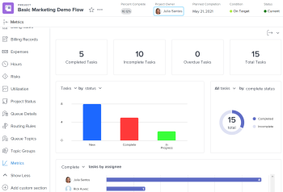
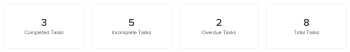
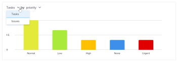
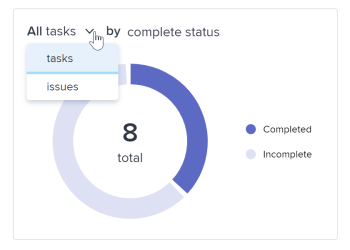
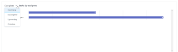
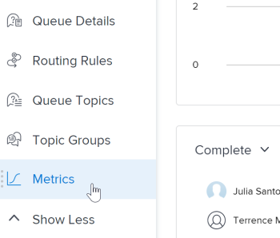

# Overview of project metrics {#overview-of-project-metrics}

>[!NOTE]
>
>To access the *`Metrics`* area from the left panel of a project, you must:
>
>
>
>* Be enrolled in *`the new Adobe Workfront experience`*.  
>  To learn how an *`Adobe Workfront administrator`* or *`group administrator`* can enroll you in *`the new Adobe Workfront experience`*, see [Enroll users in the new Adobe Workfront experience](enroll-users-new-workfront-experience.md).
>
>* Have View access to a project.  
>  To learn how to request access to an object, see [Request access to objects in Adobe Workfront](request-access.md).
>
>* Have the Left panel option *`Metrics`* enabled in the Projects area of your Layout template.  
>  To learn how a *`Workfront administrator`* or *`group administrator`* can customize the left panel with a Layout Template, see [Customize the left panel using a layout template](customize-left-panel.md).  
>
>
>

Project metrics give you a visualization of what is happening in a project, allowing you quickly assess the needs and status of a project.

   

In the *`Metrics`* area, you can see the overall health of a project, as well as:

* Where work is active or stalled
* Who has open work items assigned to them
* Details on tasks or issues that are overdue or close to the Planned Completion Date  

You can also drill in to each chart to look more closely at tasks or issues in a specific category.

To learn more about looking at these tasks or issues, see [View Metrics details](#view).

>[!TIP] {type="tip"}
>
>To see metrics at a higher level for a group of projects within a program, portfolio, etc., navigate to the *`Enhanced analytics`* area.  
>To learn more about *`Enhanced analytics`*, see [Enhanced analytics overview](enhanced-analytics-overview.md).

## Project KPIs {#project-kpis}

Key performance indicators (KPIs) display at the top of the *`Metrics`* area.

These KPIs are broken down into the following categories:

>[!TIP] {type="tip"}
>
>To display a list of work items for a specific KPI, click that KPI. In that list, you can click a specific work item to view more details in a new tab.  
>  
>For more information, see [View Metrics details](#view).  

## Task or issue bar chart {#task-or-issue-bar-chart}

In the bar chart that appears below the project KPIs, you can look at the status or priority of work items in the project. The task view is selected by default.

When status is selected in this chart, you can view all statuses of tasks or issues in a project. Each status is grouped into a bar in the chart. All default system statuses and custom statuses display in this chart.

When priority is selected in this chart, you can view all priorities of tasks or issues in a project.

>[!TIP] {type="tip"}
>
>To display a list of work items with a specific status or priority, click a bar in the chart. In that list, you can click a specific work item to view more details in a new tab.  
>  
>For more information, see [View Metrics details](#view).

## Donut chart {#donut-chart}

The donut chart located below the project KPIs allows you to look at the ratio of completed work items vs. incomplete work items in a project.

In the drop-down menu above the chart, you can select:

>[!TIP] {type="tip"}
>
>To display a list of work items that are completed or incomplete, click that section in the donut chart. In that list, you can click a specific work item to view more details in a new tab.  
>  
>For more information, see [View Metrics details](#view).  

## Assignee bar chart {#assignee-bar-chart}

The assignee bar chart shows you the number of tasks assigned to each person in the project. This number varies based on the category you select from the drop-down menu.

You can choose to look at task assignments for a project in the following categories:

>[!TIP] {type="tip"}
>
>To display a list of work items in the selected category that are assigned to a specific user, click the bar next to the user's name in the chart. In that list, you can click a specific work item to view more details in a new tab.  
>  
>For more information, see [View Metrics details](#view).

## View *`Metrics`* details {#view-metrics-details}

You can interact with the charts in the *`Metrics`* area to look at different aspects of a chart or look more closely at the tasks and issues within a chart.

1.  Go to the project you want to see metrics for.
1. In the left panel, click `Show More` to display more sections, then click ` *`Metrics`*`.  
   The charts in the *`Metrics`* area display information for tasks by default.  
   

1. (Conditional) If a drop-down arrow displays on a chart, click the `Drop-down arrow` icon  on the chart and select the option you want from the menu.  
   For information on the options that appear in the menus on each chart, see the relevant section above.

1.  (Optional) To look more closely at tasks or issues for any metric on the page, do the following:

    
    
    1.  Click the element—such as tasks assigned to a specific user, issues with a high priority, or all overdue tasks—that you want to see details for.
    
    
       A list of tasks or issues displays.
    
    
           
    

    
    1.  Use the arrows at the bottom of the list to locate the task or issue you want to look at.
    
    
       Or
    
    
       Select a specific number to display tasks or issues on a specific page.
    
    
           
    

    
    1.  Select a task or issue to view more details.
    
    
       The task or issue opens in a new tab.
    
    
    

1.  (Optional) To export the project metrics dashboard to a .png file, click the `Export` icon , then select `Export as PNG` from the drop-down menu.

   >[!TIP] {type="tip"}
   >
   >When you export the dashboard, the exported file includes only what currently displays in your viewport. To include certain things in the exported file, you may need to scroll up or down on the page or adjust your browser's zoom settings.

