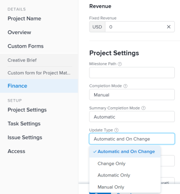

# Select the project Update Type  {#select-the-project-update-type}

By selecting an Update Type for a project, you can control how frequently the changes you make to the timeline of the project are saved on the parent tasks or the project.

When the project timeline is updated, it is recalculated based on changes made to the project, its tasks, or changes made to another project that the timeline is dependent on.

For example, the following changes to the tasks on the project trigger an update to the timeline &nbsp;of the project:

* Update the dates of tasks
* Change predecessor relationships of tasks
* Change parent-child relationships, adding or removing assignments in addition to changing the task constraint or duration type.

## Access requirements {#access-requirements}

You must have the following access to perform the steps in this article:

<table style="width: 100%;margin-left: 0;margin-right: auto;mc-table-style: url('../../../Resources/TableStyles/TableStyle-List-options-in-steps.css');" class="TableStyle-TableStyle-List-options-in-steps" cellspacing="0"> 
 <col class="TableStyle-TableStyle-List-options-in-steps-Column-Column1"> 
 <col class="TableStyle-TableStyle-List-options-in-steps-Column-Column2"> 
 <tbody> 
  <tr class="TableStyle-TableStyle-List-options-in-steps-Body-LightGray"> 
   <td class="TableStyle-TableStyle-List-options-in-steps-BodyE-Column1-LightGray" role="rowheader">Adobe Workfront plan*</td> 
   <td class="TableStyle-TableStyle-List-options-in-steps-BodyD-Column2-LightGray"> 
Any 
 </td> 
  </tr> 
  <tr class="TableStyle-TableStyle-List-options-in-steps-Body-MediumGray"> 
   <td class="TableStyle-TableStyle-List-options-in-steps-BodyE-Column1-MediumGray" role="rowheader">Adobe Workfront license*</td> 
   <td class="TableStyle-TableStyle-List-options-in-steps-BodyD-Column2-MediumGray"> 
Plan 
 </td> 
  </tr> 
  <tr class="TableStyle-TableStyle-List-options-in-steps-Body-LightGray"> 
   <td class="TableStyle-TableStyle-List-options-in-steps-BodyE-Column1-LightGray" role="rowheader">Access level configurations*</td> 
   <td class="TableStyle-TableStyle-List-options-in-steps-BodyD-Column2-LightGray"> 
Edit access to Projects
 
Note: If you still don't have access, ask your Workfront administrator if they set additional restrictions in your access level. For information on how a Workfront administrator can modify your access level, see <a href="create-modify-access-levels.md" class="MCXref xref">Create or modify custom access levels</a>.
 </td> 
  </tr> 
  <tr class="TableStyle-TableStyle-List-options-in-steps-Body-MediumGray"> 
   <td class="TableStyle-TableStyle-List-options-in-steps-BodyB-Column1-MediumGray" role="rowheader">Object permissions</td> 
   <td class="TableStyle-TableStyle-List-options-in-steps-BodyA-Column2-MediumGray"> 
Manage permissions to a project
 
For information on requesting additional access, see <a href="request-access.md" class="MCXref xref">Request access to objects in Adobe Workfront</a>.
 </td> 
  </tr> 
 </tbody> 
</table>

&#42;To find out what plan, license type, or access you have, contact your *`Workfront administrator`*.

## Update a project's Update&nbsp;Type {#update-a-projects-update-type}

When the tasks update, their parent objects (parent tasks or the project) update at the time indicated by the Update Type.&nbsp; To specify an Update Type for your project:

1. Go to the project whose Update Type you want to specify.
1.  `<MadCap:conditionalText data-mc-conditions="QuicksilverOrClassic.Quicksilver"> Click the  More menu   next to the name of the project, then click Edit.</MadCap:conditionalText>` 
1.  Click `<MadCap:conditionalText data-mc-conditions="QuicksilverOrClassic.Quicksilver"> Project </MadCap:conditionalText>` `Settings`.  

   

1.  In the `Update Type` field, select whether you want *`Workfront`* to calculate the timeline of the project automatically daily, when there is a change, or if you want the project manager to calculate it manually. 

   >[!IMPORTANT] {type="important"}
   >
   >If the timeline of a project is longer than 15 years, *`Workfront`* does not calculate the timeline automatically or on change. The Update Type of a project longer than 15 years is always Manual. 

   Select from the following options:&nbsp;

    
    
    *  `Automatic and On Change:`&nbsp;This is the default setting. The project timeline is updated each time a change occurs&nbsp;in the project or in another project that the timeline is dependent on. The project timeline is also updated each night.&nbsp;   
      This is the recommended setting as it ensures that the project timeline is always up to date.
    
    
      When you update a task or the project and trigger a timeline recalculation, all available dates are immediately displayed, allowing you to continue working. On projects with more than 100 tasks, dates that require longer calculations are dimmed. 
    
    
          
    

    
    
      This indicates that the recalculation is not yet finished, and the dates are subject to change. 
    
    * `Change Only:`&nbsp;The project timeline is updated each time a change occurs in the project or in another project that the timeline is dependent on; scheduled updates do not occur.   
      You might want to select this option if you are concerned about system performance and if&nbsp;changes rarely occur in the project or in other projects that the timeline is dependent on.
    
    *  `Automatic Only:`&nbsp;The project timeline is updated each night; it is not updated immediately after changes are made.  
      You might want to select this option if you are concerned about system performance and if many changes occur each day in the project or in other projects that the timeline is dependent on.
    
    
      >[!NOTE]
      >
      >A project does not automatically recalculate each night if it is in Planning status. It only recalculates on change.
    
    
    
    * `Manual Only:` The project timeline is updated only when you select the option to `Recalculate Timelines`, as described in the section "Manual Recalculation" in&nbsp;the article [Recalculate project timelines](recalculate-project-timeline.md).  
      You might want to select this option if you are making many changes to the project at one time, and you want the timeline recalculation to occur after all of the changes have been made (rather than after each individual change).
    
    
    

1.  Click `Save`.

