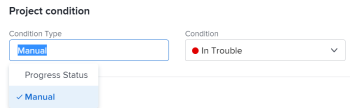

# Set the Condition Type of a project

As a project manager, you can determine how the&nbsp;Condition of a project is calculated by updating the Condition&nbsp;Type of the project. The project Condition is a visual representation of how the project is progressing.

## Access requirements

You must have the following access to perform the steps in this article:

<table cellspacing="0"> 
 <col> 
 <col> 
 <tbody> 
  <tr> 
   <td role="rowheader"><em>Adobe Workfront</em> plan*</td> 
   <td> 
Any
 </td> 
  </tr> 
  <tr> 
   <td role="rowheader"><em>Adobe Workfront</em> license*</td> 
   <td> 
<em>Plan</em> 
 </td> 
  </tr> 
  <tr> 
   <td role="rowheader">Access level configurations*</td> 
   <td> 
Edit access to Projects
 
Note: If you still don't have access, ask your <em>Workfront administrator</em> if they set additional restrictions in your access level. For information about access to projects, see <a href="../../../administration-and-setup/add-users/configure-and-grant-access/grant-access-projects.md" class="MCXref xref">Grant access to projects</a>. For information on how a <em>Workfront administrator</em> can change your access level, see <a href="../../../administration-and-setup/add-users/configure-and-grant-access/create-modify-access-levels.md" class="MCXref xref">Create or modify custom access levels</a>. 
 </td> 
  </tr> 
  <tr> 
   <td role="rowheader">Object permissions</td> 
   <td> 
    <ul> 
     <li> 
Contribute permissions to a project to edit the Condition&nbsp;Type in the Project Details area 
 </li> 
     <li> 
Manage permissions to a project to edit the Condition&nbsp;Type in the Edit Project box
 </li> 
    </ul> 
 For information about project permissions, see <a href="../../../workfront-basics/grant-and-request-access-to-objects/share-a-project.md" class="MCXref xref">Share a project in Adobe Workfront</a>.
 
For information on requesting additional access, see <a href="../../../workfront-basics/grant-and-request-access-to-objects/request-access.md" class="MCXref xref">Request access to objects in Adobe Workfront</a>.
 </td> 
  </tr> 
 </tbody> 
</table>

&#42;To find out what plan, license type, or access you have, contact your *Workfront administrator*.

## Set the Condition Type for a project

<ol> 
 <li value="1">Go to the project for which you want to update the Condition Type. </li> 
 <li value="2"> <draft-comment>
   
Do one of the following:&nbsp;

  </draft-comment>
Do one of the following:&nbsp;
 
  <ul> 
   <li> <draft-comment>
     
 <draft-comment>
       <MadCap:conditionalText data-mc-conditions="QuicksilverOrClassic.Quicksilver">
        Click the 
        More menu 
         to the right of the project name, then click 
        Edit. 
       </MadCap:conditionalText>
      </draft-comment><MadCap:conditionalText data-mc-conditions="QuicksilverOrClassic.Quicksilver">
       Click the 
       More menu 
        to the right of the project name, then click 
       Edit. 
      </MadCap:conditionalText> 

    </draft-comment>
 <MadCap:conditionalText data-mc-conditions="QuicksilverOrClassic.Quicksilver">
      Click the 
      More menu 
       to the right of the project name, then click 
      Edit. 
     </MadCap:conditionalText> 
 </li> 
   <li> <draft-comment>
     
Click Project&nbsp;Details in the left panel. 

    </draft-comment>
Click Project&nbsp;Details in the left panel. 
 </li> 
  </ul> 
   
 <draft-comment>
   
  

  </draft-comment>
  
 </li> 
 <li value="3">In the Condition Type field, choose one of the following: 
  <ul>
   <li>
Manual: The project owner sets the Condition on the project manually.
<draft-comment>
     
In this case, the project owner can update the Condition of the project in the project header, or the Project Details section. 

    </draft-comment>
In this case, the project owner can update the Condition of the project in the project header, or the Project Details section. 
</li>
   <li>
Progress Status: <em>Workfront</em> sets the Condition based on the Progress Status of the project. For information about how the Progress Status is calculated, see <a href="../../../manage-work/projects/planning-a-project/project-progress-status.md" class="MCXref xref">Project Progress Status overview</a>. 
</li>
  </ul></li> 
 <li value="4"> <draft-comment>
   
Click&nbsp;Save when you modify the&nbsp;Condition&nbsp;Type in the Edit Project box.

  </draft-comment>
Click&nbsp;Save when you modify the&nbsp;Condition&nbsp;Type in the Edit Project box.
 
Click&nbsp;Save Changes <draft-comment>
    <MadCap:conditionalText data-mc-conditions="QuicksilverOrClassic.Quicksilver">
     when you modify the Condition&nbsp;Type in the Project Details section
    </MadCap:conditionalText>
   </draft-comment><MadCap:conditionalText data-mc-conditions="QuicksilverOrClassic.Quicksilver">
    when you modify the Condition&nbsp;Type in the Project Details section
   </MadCap:conditionalText>.
 </li> 
</ol>

&nbsp;
