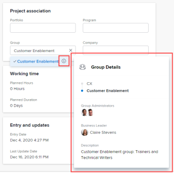

# Manage information in the project Overview area {#manage-information-in-the-project-overview-area}

You can view or edit the information of a project by accessing the Overview area of the Project Details `<MadCap:conditionalText data-mc-conditions="QuicksilverOrClassic.Quicksilver"> section</MadCap:conditionalText>`. There is a limited number of fields that you can view or edit in this area. For information about editing all information for a project see [Edit projects](edit-projects.md).

## Access requirements {#access-requirements}

You must have the following access to perform the steps in this article: 

<table style="width: 100%;margin-left: 0;margin-right: auto;mc-table-style: url('../../../Resources/TableStyles/TableStyle-List-options-in-steps.css');" class="TableStyle-TableStyle-List-options-in-steps" cellspacing="0"> 
 <col class="TableStyle-TableStyle-List-options-in-steps-Column-Column1"> 
 <col class="TableStyle-TableStyle-List-options-in-steps-Column-Column2"> 
 <tbody> 
  <tr class="TableStyle-TableStyle-List-options-in-steps-Body-LightGray"> 
   <td class="TableStyle-TableStyle-List-options-in-steps-BodyE-Column1-LightGray" role="rowheader">Adobe Workfront plan*</td> 
   <td class="TableStyle-TableStyle-List-options-in-steps-BodyD-Column2-LightGray"> 
Any
 </td> 
  </tr> 
  <tr class="TableStyle-TableStyle-List-options-in-steps-Body-MediumGray"> 
   <td class="TableStyle-TableStyle-List-options-in-steps-BodyE-Column1-MediumGray" role="rowheader"> 
Adobe Workfront license*
 </td> 
   <td class="TableStyle-TableStyle-List-options-in-steps-BodyD-Column2-MediumGray"> 
Review or higher
 </td> 
  </tr> 
  <tr class="TableStyle-TableStyle-List-options-in-steps-Body-LightGray"> 
   <td class="TableStyle-TableStyle-List-options-in-steps-BodyE-Column1-LightGray" role="rowheader">Access level configurations*</td> 
   <td class="TableStyle-TableStyle-List-options-in-steps-BodyD-Column2-LightGray"> 
View access to Projects or higher
 
Note: If you still don't have access, ask your Workfront administrator if they set additional restrictions in your access level. For information on how a Workfront administrator can change your access level, see <a href="create-modify-access-levels.md" class="MCXref xref">Create or modify custom access levels</a>.
 </td> 
  </tr> 
  <tr class="TableStyle-TableStyle-List-options-in-steps-Body-MediumGray"> 
   <td class="TableStyle-TableStyle-List-options-in-steps-BodyB-Column1-MediumGray" role="rowheader">Object permissions</td> 
   <td class="TableStyle-TableStyle-List-options-in-steps-BodyA-Column2-MediumGray"> 
View permissions to the project or higher
 
For information on requesting additional access, see <a href="request-access.md" class="MCXref xref">Request access to objects in Adobe Workfront</a>.
 </td> 
  </tr> 
 </tbody> 
</table>

&#42;To find out what plan, license type, or access you have, contact your *`Workfront administrator`*.

## Access the Overview `<MadCap:conditionalText data-mc-conditions="QuicksilverOrClassic.Quicksilver"> section</MadCap:conditionalText>` {#access-the-overview-section}

1. Go to the project whose Overview `<MadCap:conditionalText data-mc-conditions="QuicksilverOrClassic.Quicksilver"> section </MadCap:conditionalText>`you want to view.
1.   `<MadCap:conditionalText data-mc-conditions="QuicksilverOrClassic.Quicksilver"> Click  Project&nbsp;Details in the left panel.</MadCap:conditionalText>` 
1.  
   The `Overview` section should display first as part of the Project&nbsp;Details and should be expanded by default 

   Or

   Click the `Edit` icon  in the upper-right corner of the Details section, ` then click  `Overview``. This opens the Overview area for editing. 

   >[!NOTE]
   >
   >Depending on how your *`Workfront administrator`* configured your Layout Template, the Overview section might not be listed first, in which case it is collapsed. For information, see [Customize the Details view using a layout template](customize-details-view-layout-template.md). 

1.  (Conditional) If there is a specific field that needs to be updated on a project but is not displayed `<MadCap:conditionalText data-mc-conditions="QuicksilverOrClassic.Quicksilver"> in this section</MadCap:conditionalText>`, click &nbsp;`<MadCap:conditionalText data-mc-conditions="QuicksilverOrClassic.Quicksilver"> the  More menu  next to the project name, then  Edit</MadCap:conditionalText>` to view more project fields.

   For more information about editing projects, see [Edit projects](edit-projects.md).

1.   `<MadCap:conditionalText data-mc-conditions="QuicksilverOrClassic.Quicksilver"> Edit or review the fields in the table below that display in the  Overview section.   To edit any field that is available for editing, click the field or click  +Add to add information to an empty field.</MadCap:conditionalText>`

   >[!NOTE]
   >
   >`<MadCap:conditionalText data-mc-conditions="QuicksilverOrClassic.Quicksilver"> Depending on how your  Workfront administrator configured your Layout Template, all fields might not display.</MadCap:conditionalText>` For information, see [Customize the Details view using a layout template](customize-details-view-layout-template.md).

<table style="width: 100%;mc-table-style: url('../../../Resources/TableStyles/TableStyle-List-options-in-steps.css');" class="TableStyle-TableStyle-List-options-in-steps" cellspacing="0" data-mc-conditions="QuicksilverOrClassic.Quicksilver"> 
 <col class="TableStyle-TableStyle-List-options-in-steps-Column-Column1"> 
 <col class="TableStyle-TableStyle-List-options-in-steps-Column-Column2"> 
 <tbody> 
  <tr class="TableStyle-TableStyle-List-options-in-steps-Body-LightGray"> 
   <td class="TableStyle-TableStyle-List-options-in-steps-BodyE-Column1-LightGray" role="rowheader">Description</td> 
   <td class="TableStyle-TableStyle-List-options-in-steps-BodyD-Column2-LightGray">Describe the purpose of this project. </td> 
  </tr> 
  <tr class="TableStyle-TableStyle-List-options-in-steps-Body-MediumGray"> 
   <td class="TableStyle-TableStyle-List-options-in-steps-BodyE-Column1-MediumGray" role="rowheader">URL</td> 
   <td class="TableStyle-TableStyle-List-options-in-steps-BodyD-Column2-MediumGray">Insert any URL in this field. It can be a Workfront URL or any other. </td> 
  </tr> 
  <tr class="TableStyle-TableStyle-List-options-in-steps-Body-LightGray"> 
   <td class="TableStyle-TableStyle-List-options-in-steps-BodyE-Column1-LightGray" role="rowheader">Priority</td> 
   <td class="TableStyle-TableStyle-List-options-in-steps-BodyD-Column2-LightGray">Serves as the designated&nbsp;priority or importance of the project.</td> 
  </tr> 
  <tr class="TableStyle-TableStyle-List-options-in-steps-Body-MediumGray"> 
   <td class="TableStyle-TableStyle-List-options-in-steps-BodyE-Column1-MediumGray" role="rowheader">Status</td> 
   <td class="TableStyle-TableStyle-List-options-in-steps-BodyD-Column2-MediumGray"> 
The project&nbsp;Status. 
 
Tip: You cannot complete a project unless all tasks and issues have also completed. If the Completion&nbsp;Mode of the Project is set to Automatic, you cannot manually complete a project. 
 </td> 
  </tr> 
  <tr class="TableStyle-TableStyle-List-options-in-steps-Body-LightGray"> 
   <td class="TableStyle-TableStyle-List-options-in-steps-BodyE-Column1-LightGray" role="rowheader">Condition&nbsp;Type</td> 
   <td class="TableStyle-TableStyle-List-options-in-steps-BodyD-Column2-LightGray">Determines if the manager sets the Condition&nbsp;of the project or if Workfront does.&nbsp;For information about Project&nbsp;Condition, see the article <a href="project-condition-and-condition-type.md" class="MCXref xref">Overview of Project Condition and Condition Type</a>.</td> 
  </tr> 
  <tr class="TableStyle-TableStyle-List-options-in-steps-Body-MediumGray"> 
   <td class="TableStyle-TableStyle-List-options-in-steps-BodyE-Column1-MediumGray" role="rowheader">Schedule Mode</td> 
   <td class="TableStyle-TableStyle-List-options-in-steps-BodyD-Column2-MediumGray">Sets how the project is scheduled.&nbsp;For example, whether the project is scheduled from Start Date or from the Completion Date.&nbsp;</td> 
  </tr> 
  <tr class="TableStyle-TableStyle-List-options-in-steps-Body-LightGray"> 
   <td class="TableStyle-TableStyle-List-options-in-steps-BodyE-Column1-LightGray" role="rowheader">Planned Start Date and Time</td> 
   <td class="TableStyle-TableStyle-List-options-in-steps-BodyD-Column2-LightGray"> When the project is planned to start. This is manually set by the project manager when the project is scheduled from Start&nbsp;Date. Workfront automatically sets this date when the project is scheduled from&nbsp;Completion&nbsp;Date, based on the duration of the tasks in the project.</td> 
  </tr> 
  <tr class="TableStyle-TableStyle-List-options-in-steps-Body-MediumGray"> 
   <td class="TableStyle-TableStyle-List-options-in-steps-BodyE-Column1-MediumGray" role="rowheader">Planned Completion Date and Time</td> 
   <td class="TableStyle-TableStyle-List-options-in-steps-BodyD-Column2-MediumGray"> When the project is planned to complete. This is manually set by the project manager when the project is scheduled from Completion Date. Workfront automatically sets this date when the project is scheduled from&nbsp;Start Date, based on the duration of the tasks in the project. </td> 
  </tr> 
  <tr class="TableStyle-TableStyle-List-options-in-steps-Body-LightGray"> 
   <td class="TableStyle-TableStyle-List-options-in-steps-BodyE-Column1-LightGray" role="rowheader">Portfolio</td> 
   <td class="TableStyle-TableStyle-List-options-in-steps-BodyD-Column2-LightGray">The portfolio associated with the project. You must create the portfolio before you can add it to a project. </td> 
  </tr> 
  <tr class="TableStyle-TableStyle-List-options-in-steps-Body-MediumGray"> 
   <td class="TableStyle-TableStyle-List-options-in-steps-BodyE-Column1-MediumGray" role="rowheader">Program</td> 
   <td class="TableStyle-TableStyle-List-options-in-steps-BodyD-Column2-MediumGray">The program associated with the portfolio of the project. You must create the program before you can add it to a project. </td> 
  </tr> 
  <tr class="TableStyle-TableStyle-List-options-in-steps-Body-LightGray"> 
   <td class="TableStyle-TableStyle-List-options-in-steps-BodyE-Column1-LightGray" role="rowheader">Group</td> 
   <td class="TableStyle-TableStyle-List-options-in-steps-BodyD-Column2-LightGray"> 
The Group associated with the project.
 
You can make sure you are selecting the right group by hovering over it and clicking the information icon  that displays next to it. This displays a tooltip listing information about the group, such as the hierarchy of groups above it and its administrators.<MadCap:conditionalText data-mc-conditions="SnippetConditions.HIDE">
       Depending on the details configured for the group, you might also see its Business Leader and description.
     </MadCap:conditionalText>
 
  
 
Note:  
By default, one of the following groups is automatically associated with a project when it is created, unless you specify a different group: 
 
     <ul> 
      <li> 
When the project is created from the Projects area, project creator’s Home Group is associated with the project. 
 </li> 
      <li> 
When the project is created from a group’s main page in the Setup area, that group is automatically associated with the project. 
 </li> 
     </ul> 
 </td> 
  </tr> 
  <tr class="TableStyle-TableStyle-List-options-in-steps-Body-MediumGray"> 
   <td class="TableStyle-TableStyle-List-options-in-steps-BodyE-Column1-MediumGray" role="rowheader">Company</td> 
   <td class="TableStyle-TableStyle-List-options-in-steps-BodyD-Column2-MediumGray">The Company associated with the project. </td> 
  </tr> 
  <tr class="TableStyle-TableStyle-List-options-in-steps-Body-LightGray"> 
   <td class="TableStyle-TableStyle-List-options-in-steps-BodyE-Column1-LightGray" role="rowheader">Project Owner </td> 
   <td class="TableStyle-TableStyle-List-options-in-steps-BodyD-Column2-LightGray">This is the owner of the project. </td> 
  </tr> 
  <tr class="TableStyle-TableStyle-List-options-in-steps-Body-MediumGray"> 
   <td class="TableStyle-TableStyle-List-options-in-steps-BodyE-Column1-MediumGray" role="rowheader">Project Sponsor</td> 
   <td class="TableStyle-TableStyle-List-options-in-steps-BodyD-Column2-MediumGray"> 
This is the primary stakeholder for the project. This is usually an executive overseeing and championing the project, or it is the person with budgetary responsibility.
 </td> 
  </tr> 
  <tr class="TableStyle-TableStyle-List-options-in-steps-Body-LightGray"> 
   <td class="TableStyle-TableStyle-List-options-in-steps-BodyB-Column1-LightGray" role="rowheader">Resource Manager</td> 
   <td class="TableStyle-TableStyle-List-options-in-steps-BodyA-Column2-LightGray"> 
This is the person who can manage user resources in the project. 
 
For information about Resource Managers, see the article <a href="designate-resource-managers-for-projects-and-templates.md" class="MCXref xref">Designate Resource Managers for a project or template </a>.
 </td> 
  </tr> 
 </tbody> 
</table>

1.  Review the following fields in the Overview section.&nbsp;You cannot edit the following fields: 

1.  If your company has purchased an additional license for the *`Adobe Workfront Scenario Planner`*, and the project has information published from a linked initiative, review the following initiative information in the *`Scenario Planner`* area:

<table style="margin-left: 0;margin-right: auto;mc-table-style: url('../../../Resources/TableStyles/TableStyle-List-options-in-steps.css');" class="TableStyle-TableStyle-List-options-in-steps" cellspacing="0"> 
 <col style="width: 273px;" class="TableStyle-TableStyle-List-options-in-steps-Column-Column1"> 
 <col style="width: 873px;" class="TableStyle-TableStyle-List-options-in-steps-Column-Column2"> 
 <tbody> 
  <tr class="TableStyle-TableStyle-List-options-in-steps-Body-LightGray"> 
   <td class="TableStyle-TableStyle-List-options-in-steps-BodyE-Column1-LightGray" role="rowheader">Initiative Duration* </td> 
   <td class="TableStyle-TableStyle-List-options-in-steps-BodyD-Column2-LightGray">The duration of the corresponding initiative when the project is linked to an initiative. This field is not editable.  </td> 
  </tr> 
  <tr class="TableStyle-TableStyle-List-options-in-steps-Body-MediumGray"> 
   <td class="TableStyle-TableStyle-List-options-in-steps-BodyE-Column1-MediumGray" role="rowheader">Last Published Date* </td> 
   <td class="TableStyle-TableStyle-List-options-in-steps-BodyD-Column2-MediumGray">The date when the project was last published from a corresponding initiative. </td> 
  </tr> 
  <tr class="TableStyle-TableStyle-List-options-in-steps-Body-LightGray"> 
   <td class="TableStyle-TableStyle-List-options-in-steps-BodyE-Column1-LightGray" role="rowheader">Initiative Start Date* </td> 
   <td class="TableStyle-TableStyle-List-options-in-steps-BodyD-Column2-LightGray">The first day of the start month of the initiative, when the project is linked to an initiative.  </td> 
  </tr> 
  <tr class="TableStyle-TableStyle-List-options-in-steps-Body-MediumGray"> 
   <td class="TableStyle-TableStyle-List-options-in-steps-BodyE-Column1-MediumGray" role="rowheader">Initiative End Date* </td> 
   <td class="TableStyle-TableStyle-List-options-in-steps-BodyD-Column2-MediumGray">The last day of the end month of the initiative, when the project is linked to an initiative.&nbsp;  </td> 
  </tr> 
  <tr class="TableStyle-TableStyle-List-options-in-steps-Body-LightGray"> 
   <td class="TableStyle-TableStyle-List-options-in-steps-BodyB-Column1-LightGray" role="rowheader">Initiative Job&nbsp;Roles in FTEs and Hours* </td> 
   <td class="TableStyle-TableStyle-List-options-in-steps-BodyA-Column2-LightGray"> 
Information about the associated job roles and their time allocations for the initiative.&nbsp;This includes:
 
    <ul> 
     <li>Job&nbsp;Role name</li> 
     <li>Number of FTEs</li> 
     <li> 
Number of Hours for all&nbsp;FTEs
 
You can estimate the amount of job roles needed for your plan or initiative using hours or FTEs.&nbsp;
 
For more information, see <a href="create-and-edit-plans.md" class="MCXref xref">Create and edit plans in the Adobe Workfront Scenario Planner</a>. 
 </li> 
    </ul> 
Tip: If the number of job role is different for each month in the initiative, this field displays the maximum amount of roles needed for the initiative. For example, if you need 1 Consultant for January and 2 for February, the column displays 2FTE and the corresponding amount of hours for 2 FTEs for all months.  
 </td> 
  </tr> 
 </tbody> 
</table>

   `For information about linking projects with initiatives, see` [Update or create projects by publishing initiatives in the Adobe Workfront Scenario Planner](publish-scenarios-update-projects.md). 

1.  `<MadCap:conditionalText data-mc-conditions="QuicksilverOrClassic.Quicksilver"> Click  Save Changes.</MadCap:conditionalText>` 

