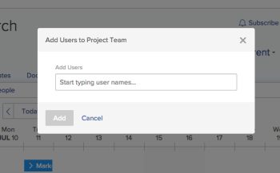

# Manage the Project Team {#manage-the-project-team}

The Project&nbsp;Team consists of users who are associated with the project. They display `<MadCap:conditionalText data-mc-conditions="QuicksilverOrClassic.Quicksilver">  in the People section</MadCap:conditionalText>` of the project. 

## Access requirements {#access-requirements}

You must have the following access to perform the steps in this article:

<table style="width: 100%;margin-left: 0;margin-right: auto;mc-table-style: url('../../../Resources/TableStyles/TableStyle-List-options-in-steps.css');" class="TableStyle-TableStyle-List-options-in-steps" cellspacing="0"> 
 <col class="TableStyle-TableStyle-List-options-in-steps-Column-Column1"> 
 <col class="TableStyle-TableStyle-List-options-in-steps-Column-Column2"> 
 <tbody> 
  <tr class="TableStyle-TableStyle-List-options-in-steps-Body-LightGray"> 
   <td class="TableStyle-TableStyle-List-options-in-steps-BodyE-Column1-LightGray" role="rowheader">Adobe Workfront plan*</td> 
   <td class="TableStyle-TableStyle-List-options-in-steps-BodyD-Column2-LightGray"> 
Any
 </td> 
  </tr> 
  <tr class="TableStyle-TableStyle-List-options-in-steps-Body-MediumGray"> 
   <td class="TableStyle-TableStyle-List-options-in-steps-BodyE-Column1-MediumGray" role="rowheader">Adobe Workfront license*</td> 
   <td class="TableStyle-TableStyle-List-options-in-steps-BodyD-Column2-MediumGray"> 
Plan 
 </td> 
  </tr> 
  <tr class="TableStyle-TableStyle-List-options-in-steps-Body-LightGray"> 
   <td class="TableStyle-TableStyle-List-options-in-steps-BodyE-Column1-LightGray" role="rowheader">&nbsp;</td> 
   <td class="TableStyle-TableStyle-List-options-in-steps-BodyD-Column2-LightGray">&nbsp;</td> 
  </tr> 
  <tr class="TableStyle-TableStyle-List-options-in-steps-Body-MediumGray"> 
   <td class="TableStyle-TableStyle-List-options-in-steps-BodyE-Column1-MediumGray" role="rowheader">Access level configurations*</td> 
   <td class="TableStyle-TableStyle-List-options-in-steps-BodyD-Column2-MediumGray"> 
Edit access to Projects
 
View or higher access to Users
 
Note: If you still don't have access, ask your Workfront administrator if they set additional restrictions in your access level. For information on how a Workfront administrator can modify your access level, see <a href="create-modify-access-levels.md" class="MCXref xref">Create or modify custom access levels</a>.
 </td> 
  </tr> 
  <tr class="TableStyle-TableStyle-List-options-in-steps-Body-LightGray"> 
   <td class="TableStyle-TableStyle-List-options-in-steps-BodyB-Column1-LightGray" role="rowheader">Object permissions</td> 
   <td class="TableStyle-TableStyle-List-options-in-steps-BodyA-Column2-LightGray"> 
View or higher permissions to the project
 
For information on requesting additional access, see <a href="request-access.md" class="MCXref xref">Request access to objects in Adobe Workfront</a>.
 </td> 
  </tr> 
 </tbody> 
</table>

&#42;To find out what plan, license type, or access you have, contact your *`Workfront administrator`*.

## Add users to a Project Team {#add-users-to-a-project-team}

When you add users to the project team, they gain permissions on the project and the tasks, issues, and documents of the project. For more information, see the article [Project Team overview](project-team-overview.md).

You can add users to the project team in the following ways: 

* [Automatically add users to a Project Team](#automatically-adding-users-to-a-project-team) 
* [Manually add users to a Project Team](#manually-adding-users-to-a-project-team) 

### Automatically add users to a Project Team {#automatically-add-users-to-a-project-team}

The users that fulfill the following roles on the project are automatically added to the project team and appear `<MadCap:conditionalText data-mc-conditions="QuicksilverOrClassic.Quicksilver">  in the People section</MadCap:conditionalText>` when the project is created:

* The creator of the project
* The project owner
* The project sponsor

Users are also automatically added to the project team when they are assigned to the following roles:

* Users assigned to tasks on the project
* Users assigned to issues on the project

### Manually add users to a Project Team {#manually-add-users-to-a-project-team}

You can manually add users to a project team by using the Team Scheduling tab. 

>[!IMPORTANT] {type="important"}
>
>You can add to the Project Team only users that belong to the Group associated with the project.

1.  Go to the project where you want to add users to the project team, then click `Scheduling` in the left panel. The Scheduling section might be located under `Show More`.
1.  Click `Add Users`. 

   The Add Users to Project Team dialog box displays.

      

1.  In the `Add Users` box, begin typing the name of the user you want to add to the project team, then click the name when it appears in the drop-down list.

   Repeat this step to add multiple users to the project team.

1.  Click `Add`.

   The users are now available in the project scheduling area.

For more information about using the project scheduling area, see the article [Get started with Resource Scheduling](get-started-resource-scheduling.md). 

## Remove users from a Project Team {#remove-users-from-a-project-team}

When you remove users from their roles on the project, they remain part of the project team. 

If you remove a user from the project team and the user is assigned to tasks or issues in the project, the user is unassigned from the tasks, and issues and the tasks and issues are returned to the Unassigned area in the scheduling timeline.

For more information about removing users from the project team, see the article [Remove users from projects](remove-users-from-projects.md).
