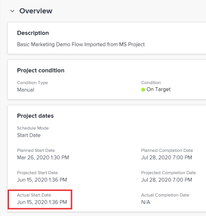

# Overview of the project Actual Start Date  {#overview-of-the-project-actual-start-date}

Projects, tasks, and issues have an Actual Start Date in  *`Adobe Workfront`*. For tasks, and issues, this is the date when they have been marked as In Progress. For projects, this is the date when the first task on the project is marked as In Progress or has been completed. 

## Access requirements {#access-requirements}

You must have the following access to perform the steps in this article:

<table style="width: 100%;margin-left: 0;margin-right: auto;mc-table-style: url('../../../Resources/TableStyles/TableStyle-List-options-in-steps.css');" class="TableStyle-TableStyle-List-options-in-steps" cellspacing="0"> 
 <col class="TableStyle-TableStyle-List-options-in-steps-Column-Column1"> 
 <col class="TableStyle-TableStyle-List-options-in-steps-Column-Column2"> 
 <tbody> 
  <tr class="TableStyle-TableStyle-List-options-in-steps-Body-LightGray"> 
   <td class="TableStyle-TableStyle-List-options-in-steps-BodyE-Column1-LightGray" role="rowheader">Adobe Workfront plan*</td> 
   <td class="TableStyle-TableStyle-List-options-in-steps-BodyD-Column2-LightGray"> 
Any
 </td> 
  </tr> 
  <tr class="TableStyle-TableStyle-List-options-in-steps-Body-MediumGray"> 
   <td class="TableStyle-TableStyle-List-options-in-steps-BodyE-Column1-MediumGray" role="rowheader">Adobe Workfront license*</td> 
   <td class="TableStyle-TableStyle-List-options-in-steps-BodyD-Column2-MediumGray"> 
Review or higher
 </td> 
  </tr> 
  <tr class="TableStyle-TableStyle-List-options-in-steps-Body-LightGray"> 
   <td class="TableStyle-TableStyle-List-options-in-steps-BodyE-Column1-LightGray" role="rowheader">Access level configurations*</td> 
   <td class="TableStyle-TableStyle-List-options-in-steps-BodyD-Column2-LightGray"> 
View or higher access to Projects
 
Note: If you still don't have access, ask your Workfront administrator if they set additional restrictions in your access level. For information on how a Workfront administrator can modify your access level, see <a href="create-modify-access-levels.md" class="MCXref xref">Create or modify custom access levels</a>.
 </td> 
  </tr> 
  <tr class="TableStyle-TableStyle-List-options-in-steps-Body-MediumGray"> 
   <td class="TableStyle-TableStyle-List-options-in-steps-BodyB-Column1-MediumGray" role="rowheader">Object permissions</td> 
   <td class="TableStyle-TableStyle-List-options-in-steps-BodyA-Column2-MediumGray"> 
View or higher permissions to a project
 
For information on requesting additional access, see <a href="request-access.md" class="MCXref xref">Request access to objects in Adobe Workfront</a>.
 </td> 
  </tr> 
 </tbody> 
</table>

&#42;To find out what plan, license type, or access you have, contact your *`Workfront administrator`*.

## Considerations about Actual Start Dates in  *`Workfront`* {#considerations-about-actual-start-dates-in-workfront}

* The Actual Start Date is located `<MadCap:conditionalText data-mc-conditions="QuicksilverOrClassic.Quicksilver"> in the Details section</MadCap:conditionalText>` of projects, tasks, and issues.&nbsp;
* The Actual&nbsp;Start Date of a project, task, or issue is not populated when these items are created. 
* The Actual&nbsp;Start&nbsp;Date is populated when work actually starts on the project, task, or issue. 
*  The Actual&nbsp;Start Date does not display on the Project Details tab if the work on the project has not started yet. 

  The Actual Start&nbsp;Date displays blank on the Task and&nbsp;Issue Details tabs if the work has not yet started on them. 

* You can manually modify the Actual&nbsp;Start&nbsp;Date of a task or an issue, but you cannot modify the Actual&nbsp;Start&nbsp;Date of a project. 

## Considerations about Actual Start&nbsp;Dates for projects {#considerations-about-actual-start-dates-for-projects}

* *`Workfront`* automatically sets the Actual&nbsp;Date of a project when any of the following occur:
    
    
    * A task assignee changes the status of a task from *New* to any other status that does not equate *New*.
    
    * A task assignee changes the Percent Complete of a task.
    
    
      >[!IMPORTANT] {type="important"}
      >
      >The Project&nbsp;Actual Start&nbsp;Date does not populate when the project is marked as Current.&nbsp;Actual work must start on the tasks of the project before the Actual&nbsp;Start&nbsp;Date of the project populates. 
    
    
      In these cases, the Actual Start Date of the project is set to the date and time when these actions occurred for the earliest task on the project. This indicates that the project actually started on this date and time. 
    
    
    

## Locate the Actual Start&nbsp;Date of a project {#locate-the-actual-start-date-of-a-project}

You can locate the Actual&nbsp;Start&nbsp;Date of a project in the following areas:

*  `<MadCap:conditionalText data-mc-conditions="QuicksilverOrClassic.Quicksilver"> In the Details section</MadCap:conditionalText>` of a Project.
*  In a project report or view, when you add the Actual&nbsp;Start&nbsp;Date for the object Project in the report.

  For information about creating reports, see the article [Create a custom report](create-custom-report.md).

To locate the Actual Start&nbsp;Date `<MadCap:conditionalText data-mc-conditions="QuicksilverOrClassic.Quicksilver"> in the Details section</MadCap:conditionalText>` of the project: 

1.  Click the `Main Menu` icon  in the upper-right corner of *`Workfront`*, then click `Projects`. 
1. Click the project you want to view the Actual Start Date for.
1.  Click  `Project Details` in the left panel, then go to the `Overview` section. 

   The Actual Start Date displays along other project dates .

   

&nbsp;
