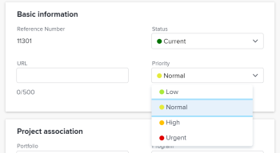

# Understand and update project priorities {#understand-and-update-project-priorities}

There are several ways to use priorities for projects and they do not communicate with one another. We recommend that you select one of the priorities for projects that matches your needs and refer to it when you categorize the importance of your projects.&nbsp;

## Access requirements {#access-requirements}

You must have the following access to perform the steps in this article:

<table style="width: 100%;margin-left: 0;margin-right: auto;mc-table-style: url('../../../Resources/TableStyles/TableStyle-List-options-in-steps.css');" class="TableStyle-TableStyle-List-options-in-steps" cellspacing="0"> 
 <col class="TableStyle-TableStyle-List-options-in-steps-Column-Column1"> 
 <col class="TableStyle-TableStyle-List-options-in-steps-Column-Column2"> 
 <tbody> 
  <tr class="TableStyle-TableStyle-List-options-in-steps-Body-LightGray"> 
   <td class="TableStyle-TableStyle-List-options-in-steps-BodyE-Column1-LightGray" role="rowheader">Adobe Workfront plan*</td> 
   <td class="TableStyle-TableStyle-List-options-in-steps-BodyD-Column2-LightGray"> 
Any
 </td> 
  </tr> 
  <tr class="TableStyle-TableStyle-List-options-in-steps-Body-MediumGray"> 
   <td class="TableStyle-TableStyle-List-options-in-steps-BodyE-Column1-MediumGray" role="rowheader">Adobe Workfront license*</td> 
   <td class="TableStyle-TableStyle-List-options-in-steps-BodyD-Column2-MediumGray"> 
Plan 
 </td> 
  </tr> 
  <tr class="TableStyle-TableStyle-List-options-in-steps-Body-LightGray"> 
   <td class="TableStyle-TableStyle-List-options-in-steps-BodyE-Column1-LightGray" role="rowheader">Access level configurations*</td> 
   <td class="TableStyle-TableStyle-List-options-in-steps-BodyD-Column2-LightGray"> 
Edit access to&nbsp;Projects
 
Note: If you still don't have access, ask your Workfront administrator if they set additional restrictions in your access level. For information on how a Workfront administrator can modify your access level, see <a href="create-modify-access-levels.md" class="MCXref xref">Create or modify custom access levels</a>.
 </td> 
  </tr> 
  <tr class="TableStyle-TableStyle-List-options-in-steps-Body-MediumGray"> 
   <td class="TableStyle-TableStyle-List-options-in-steps-BodyB-Column1-MediumGray" role="rowheader">Object permissions</td> 
   <td class="TableStyle-TableStyle-List-options-in-steps-BodyA-Column2-MediumGray"> 
Manage permissions to the project
 
For information on requesting additional access, see <a href="request-access.md" class="MCXref xref">Request access to objects in Adobe Workfront</a>.
 </td> 
  </tr> 
 </tbody> 
</table>

&#42;To find out what plan, license type, or access you have, contact your *`Workfront administrator`*.

## Types of project priority in  *`Adobe Workfront`* {#types-of-project-priority-in-adobe-workfront}

The following are types of priorities you can use to rank projects in *`Adobe Workfront`*:

*  `The Project Priority field`: You can manually assign a Priority to a project.

  For more information about the Project Priority field, see the section [Considerations about project Priority](#consider) in this article.

*  `The priority of a project in the Portfolio Optimizer`, if the project is associated with a portfolio:&nbsp;

  For more information about the priority of a project in the Portfolio Optimizer, see in the article [Prioritize projects in the Portfolio Optimizer](prioritize-projects-in-portfolio-optimizer.md).

*  `The priority of a project in the Resource Planner`: You can manually prioritize projects in the Resource Planner, to indicate which projects should receive resources first.&nbsp;

  For more information about prioritizing projects in the Resource Planner, see the "Project Planning Priority" section in the article [Resource Planner navigation overview](resource-planner-navigation.md).

##  

## Considerations about project Priority {#considerations-about-project-priority}

You can associate a Priority with projects in *`Workfront`*. Tasks and issues also have Priorities.&nbsp;Indicating a priority for the project communicates to everyone in the system how important that project is. 

Consider the following when selecting a Priority for your projects: 

*  Your *`Workfront administrator`* defines the Priorities available in *`Workfront`*. After they establish them, they are available for you to associate with projects in the Priority field.&nbsp;

  For more information about creating Priorities in *`Workfront`*, see the article [Create and customize priorities](create-customize-priorities .md).

*  When you update the Priority field of a project, this Priority does not transfer to the Portfolio Optimizer or the Resource Planner.&nbsp;
*  The Priority value of a project is used primarily for reporting purposes.

  For example, you can search for all projects that have the priority value of Urgent when you use this field in a project filter.&nbsp;

*  You can update the Priority of projects in the following areas of *`Workfront`*:

    
    
    * In the `Edit Project` dialog box.
    * In the `Project Details` tab of a project.
    * In a project list or report.
    
    

## Update the project Priority field {#update-the-project-priority-field}

1. Go to the project whose Priority you want to update.
1.  `<MadCap:conditionalText data-mc-conditions="QuicksilverOrClassic.Quicksilver"> Click  Project Details in the left panel.</MadCap:conditionalText>`
1.  Click the `Edit` icon  in the upper-right corner of the Project Details area, then click  `Overview`. 

1.  In the `Priority` field, select from the following options:

    
    
    * None
    * Low
    *  Normal
    
    
      This is the default priority. 
    
    * High
    * Urgent
    
    
   

1.   `<MadCap:conditionalText data-mc-conditions="QuicksilverOrClassic.Quicksilver"> Click  Save&nbsp;Changes. </MadCap:conditionalText>`

   You must communicate with other users and have an understanding what each level of priority means for the project.  

