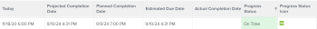
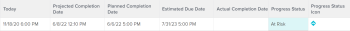
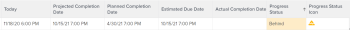
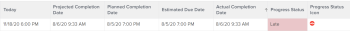
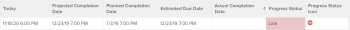

# Project Progress Status overview {#project-progress-status-overview}

*`Adobe Workfront`* determines the Progress Status of a project by looking at the progression of the project across its timeline. You can configure *`Workfront`* to determine the Condition of a project based on the value of the Progress Status of the tasks. For more information about configuring the Condition of the project, see the article [Overview of Project Condition and Condition Type](project-condition-and-condition-type.md). 

The following are the Progress Statuses of projects in  *`Workfront`*: 

<table style="width: 100%;mc-table-style: url('../../../Resources/TableStyles/TableStyle-List-options-in-steps.css');" class="TableStyle-TableStyle-List-options-in-steps" cellspacing="0"> 
 <col class="TableStyle-TableStyle-List-options-in-steps-Column-Column1"> 
 <col class="TableStyle-TableStyle-List-options-in-steps-Column-Column2"> 
 <tbody> 
  <tr class="TableStyle-TableStyle-List-options-in-steps-Body-LightGray"> 
   <td style="font-weight: bold;" class="TableStyle-TableStyle-List-options-in-steps-BodyE-Column1-LightGray" role="rowheader">On&nbsp;Time</td> 
   <td class="TableStyle-TableStyle-List-options-in-steps-BodyD-Column2-LightGray"> 
If both Projected and Estimated Completion Dates are earlier than or equal to the project’s Planned Completion Date, the Progress Status of the project is On Time.
 
  
 </td> 
  </tr> 
  <tr class="TableStyle-TableStyle-List-options-in-steps-Body-MediumGray"> 
   <td style="font-weight: bold;" class="TableStyle-TableStyle-List-options-in-steps-BodyE-Column1-MediumGray" role="rowheader">At Risk</td> 
   <td class="TableStyle-TableStyle-List-options-in-steps-BodyD-Column2-MediumGray"> 
When both the Estimated and Projected Completion&nbsp;Dates are in the future but later than the Planned Completion Date of the project and the Estimated Completion Date is later than the Projected Completion Date, the project Progress Status is At Risk. 
 
  
 </td> 
  </tr> 
  <tr class="TableStyle-TableStyle-List-options-in-steps-Body-LightGray"> 
   <td style="font-weight: bold;" class="TableStyle-TableStyle-List-options-in-steps-BodyE-Column1-LightGray" role="rowheader">Behind</td> 
   <td class="TableStyle-TableStyle-List-options-in-steps-BodyD-Column2-LightGray"> 
When both the Estimated and Projected Completion Dates are in the future but later than the Planned Completion Date of the project, but the Estimated Completion Date is not later than Projected Completion Date, the project Progress Status is Behind.
 
  
 </td> 
  </tr> 
  <tr class="TableStyle-TableStyle-List-options-in-steps-Body-MediumGray"> 
   <td style="font-weight: bold;" class="TableStyle-TableStyle-List-options-in-steps-BodyB-Column1-MediumGray" role="rowheader">Late</td> 
   <td class="TableStyle-TableStyle-List-options-in-steps-BodyA-Column2-MediumGray"> 
    <ul> 
     <li> 
If the project is complete and the Actual Completion Date is later than the Planned Completion Date, the project's Progress Status is Late. 
 
  
 </li> 
     <li> 
If the project is not complete and the Planned Completion Date of the project is in the past, then the project Progress Status is Late. 
 
  
 </li> 
    </ul> </td> 
  </tr> 
 </tbody> 
</table>

Consider the following: 

* The Projected Completion Date of the project is driven by the task on the Critical Path with the latest Projected Completion Date.
* The Estimated Completion Date of the project is driven by the task on the Critical Path with the latest Estimated Completion Date.

For information about the project&nbsp;Critical&nbsp;Path, see [Overview of the project Critical Path](critical-path.md).

For information about Projected Completion Dates, see [Overview of the Projected Completion Date for projects, tasks, and issues](project-projected-completion-date.md). 
